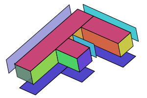

Title: WebGL - 三次元正投影
Description: WebGLで三次元図形を正投影で表示すること。

この記事はWebGLシリーズの一つである。最初の記事は[WebGLの基本で始まった](webgl-fundamentals.html)。
そして、前回の記事は[行列の数学](webgl-2d-matrices.html)について。まだ読んでいなかったら先に読んで下さい。

前回の記事は行列数学をどういうふうに使うかということについてだった。
移動、回転、拡大縮小、ピクセル空間からクリップ空間に投影することも,
一つの行列と魔法のような行列数学で出来ることを紹介した。
三次元はそこから一歩先に進む。

前回の二次元サンプルで二次元頂点(x, y)を3x3行列に掛けた。三次元の為に三次元頂点(x, y, z)を
4x4行列に掛ける必要がある。

前回のサンプルを三次元に更新しよう！また「F」の図形を使うけど今回は三次元の「F」を使う。

まず頂点シェーダーを三次元に更新しなければいけない。
これは前のシェーダーである。

```
<script id="2d-vertex-shader" type="x-shader/x-vertex">
attribute vec2 a_position;

uniform mat3 u_matrix;

void main() {
  // positionを行列に掛ける。
  gl_Position = vec4((u_matrix * vec3(a_position, 1)).xy, 0, 1);
}
</script>
```

これは新しいシェーダーである。

```
<script id="3d-vertex-shader" type="x-shader/x-vertex">
attribute vec4 a_position;

*uniform mat4 u_matrix;

void main() {
  // positionを行列に掛ける。
*  gl_Position = u_matrix * a_position;
}
</script>
```

もっと単純化された！

そして、三次元データを与えなければいけない。

```
  ...

    // 属性にどうやってpositionBuffer（ARRAY_BUFFER)からデータを取りか。
*    var size = 3;          // 呼び出すごとに3つの数値
    var type = gl.FLOAT;   // データは32ビットの数値
    var normalize = false; // データをnormalizeしない
    var stride = 0;        // シェーダーを呼び出すごとに進む距離
                           // 0 = size * sizeof(type)
    var offset = 0;        // バッファーの頭から取り始める
    gl.vertexAttribPointer(
        positionAttributeLocation, size, type, normalize, stride, offset)

  ...

// バッファーに’F’の形の頂点を入れる。
function setGeometry(gl) {
  gl.bufferData(
      gl.ARRAY_BUFFER,
      new Float32Array([
            // 左縦列
*            0,   0,  0,
*           30,   0,  0,
*            0, 150,  0,
*            0, 150,  0,
*           30,   0,  0,
*           30, 150,  0,

           // 上の横棒
*           30,   0,  0,
*          100,   0,  0,
*           30,  30,  0,
*           30,  30,  0,
*          100,   0,  0,
*          100,  30,  0,

           // 下の横棒
*           30,  60,  0,
*           67,  60,  0,
*           30,  90,  0,
*           30,  90,  0,
*           67,  60,  0,
*           67,  90,  0]),
      gl.STATIC_DRAW);
}
```

次に、行列関数を二次元から三次元に更新しよう。

これは二次元（更新する前の形）`m3.translation`、と`m3.rotation`、と`m3.scaling`の関数である。

```
var m3 = {
  translation: function translation(tx, ty) {
    return [
      1, 0, 0,
      0, 1, 0,
      tx, ty, 1
    ];
  },

  rotation: function rotation(angleInRadians) {
    var c = Math.cos(angleInRadians);
    var s = Math.sin(angleInRadians);
    return [
      c,-s, 0,
      s, c, 0,
      0, 0, 1
    ];
  },

  scaling: function scaling(sx, sy) {
    return [
      sx, 0, 0,
      0, sy, 0,
      0, 0, 1
    ];
  },
};
```

そして、これは三次元に更新されたバージョンである。

```
var m4 = {
  translation: function(tx, ty, tz) {
    return [
       1,  0,  0,  0,
       0,  1,  0,  0,
       0,  0,  1,  0,
       tx, ty, tz, 1,
    ];
  },

  xRotation: function(angleInRadians) {
    var c = Math.cos(angleInRadians);
    var s = Math.sin(angleInRadians);

    return [
      1, 0, 0, 0,
      0, c, s, 0,
      0, -s, c, 0,
      0, 0, 0, 1,
    ];
  },

  yRotation: function(angleInRadians) {
    var c = Math.cos(angleInRadians);
    var s = Math.sin(angleInRadians);

    return [
      c, 0, -s, 0,
      0, 1, 0, 0,
      s, 0, c, 0,
      0, 0, 0, 1,
    ];
  },

  zRotation: function(angleInRadians) {
    var c = Math.cos(angleInRadians);
    var s = Math.sin(angleInRadians);

    return [
       c, s, 0, 0,
      -s, c, 0, 0,
       0, 0, 1, 0,
       0, 0, 0, 1,
    ];
  },

  scaling: function(sx, sy, sz) {
    return [
      sx, 0,  0,  0,
      0, sy,  0,  0,
      0,  0, sz,  0,
      0,  0,  0,  1,
    ];
  },
};
```

三つの回転関数があることに気付いただろう。二次元なら一つしか要らなかった。それはZ軸で回転
するようだった。三次元ならX軸でとY軸でも回転出来るようにしたい。見たら前の回転関数に似てるだろう。
前と同じように計算式を単純化したら同じように簡単になる。

Z軸で回転

<div class="webgl_center">
<div>newX = x *  c + y * s;</div>
<div>newY = x * -s + y * c;</div>
</div>

Y軸で回転

<div class="webgl_center">
<div>newX = x *  c + z * s;</div>
<div>newZ = x * -s + z * c;</div>
</div>

X軸で回転

<div class="webgl_center">
<div>newY = y *  c + z * s;</div>
<div>newZ = y * -s + z * c;</div>
</div>

その三つの回転方法はこのように回転する。

<iframe class="external_diagram" src="../resources/axis-diagram.html" style="width: 540px; height: 240px;"></iframe>

前と同じように単純な関数も作ろう。

```
  translate: function(m, tx, ty, tz) {
    return m4.multiply(m, m4.translation(tx, ty, tz));
  },

  xRotate: function(m, angleInRadians) {
    return m4.multiply(m, m4.xRotation(angleInRadians));
  },

  yRotate: function(m, angleInRadians) {
    return m4.multiply(m, m4.yRotation(angleInRadians));
  },

  zRotate: function(m, angleInRadians) {
    return m4.multiply(m, m4.zRotation(angleInRadians));
  },

  scale: function(m, sx, sy, sz) {
    return m4.multiply(m, m4.scaling(sx, sy, sz));
  },
```

投影関数も更新しなきゃ。これは前の関数。

```
  projection: function (width, height) {
    // Note: Y軸で０は上の方にするためYを弾く行列
    return [
      2 / width, 0, 0,
      0, -2 / height, 0,
      -1, 1, 1
    ];
  },
}
```

これはピクセル空間からクリップ空間の変換である。三次元のため、初めからこうにしてみよう。

```
  projection: function(width, height, depth) {
    // Note: Y軸で０は上の方にするためYを弾く行列
    return [
       2 / width, 0, 0, 0,
       0, -2 / height, 0, 0,
       0, 0, 2 / depth, 0,
      -1, 1, 0, 1,
    ];
  },
```

XとYをピクセル空間からクリップ空間に変換するのが必要なのと同じように、Zにも変換が必要である。
Zもピクセル単位で計算する。`width`のような値を`depth`に与えるとピクセル空間の横は０〜`width`ピクセルで、縦は0〜`height`ピクセルで、でも奥行きは`-depth / 2`〜`+depth / 2`である。

最後に行列計算の所も更新が必要である。

```
  // 行列を計算する。
*  var matrix = m4.projection(gl.canvas.clientWidth, gl.canvas.clientHeight, 400);
*  matrix = m4.translate(matrix, translation[0], translation[1], translation[2]);
*  matrix = m4.xRotate(matrix, rotation[0]);
*  matrix = m4.yRotate(matrix, rotation[1]);
*  matrix = m4.zRotate(matrix, rotation[2]);
*  matrix = m4.scale(matrix, scale[0], scale[1], scale[2]);

  // 行列を設定する。
*  gl.uniformMatrix4fv(matrixLocation, false, matrix);
```

さあ、出来たサンプルはこれである。

{{{example url="../webgl-3d-step1.html" }}}

第一の問題は「F」の図形が平らで三次元にあまり見えないことである。
それを立体にしよう。今の「F」の図形は2つの三角形で出来ている三つの四角形で作られている。
立体にする為16枚の四角形が必要である。前面に三つ、裏面に三つ、左面に一つ、右面に四つ、
上面2つ、下面に三つ四角形が必要である。



これは全て表示するには多すぎる。四角形16枚、四角形ごとに2つの三角形、三角形ごとに3つの頂点は96頂点になる。
全部を見たければソースを見て下さい。

超点数が増えたので。。。

```
    // Draw the geometry.
    var primitiveType = gl.TRIANGLES;
    var offset = 0;
*    var count = 16 * 6;
    gl.drawArrays(primitiveType, offset, count);
```

これはこのサンプルである。

{{{example url="../webgl-3d-step2.html" }}}

スライダを操作しても三次元になっているかどうか分かり辛いだろう。
四角形ごとに別色をつかってみよう！その為に頂点シェーダーに属性を追加して、
バリイングで頂点シェーダーからピクセルシェーダーに渡す。

これは新しい頂点シェーダーである。

```
<script id="3d-vertex-shader" type="x-shader/x-vertex">
attribute vec4 a_position;
+attribute vec4 a_color;

uniform mat4 u_matrix;

+varying vec4 v_color;

void main() {
  // positionを行列に掛ける。
  gl_Position = u_matrix * a_position;

+  // 色をピクセルシェーダーに渡す。
+  v_color = a_color;
}
</script>
```

その色はピクセルシェーダーで使わなければいけない。

```
<script id="3d-vertex-shader" type="x-shader/x-fragment">
precision mediump float;

+// 頂点シェーダーに渡された色。
+varying vec4 v_color;

void main() {
*   gl_FragColor = v_color;
}
</script>
```

色の属性位置を調べて、他のバッファーを作成して、バッファーに頂点色を入れることが必要である。

```
  ...
  var colorLocation = gl.getAttribLocation(program, "a_color");

  ...
  // 色のバッファーの作成。
  var colorBuffer = gl.createBuffer();
  gl.bindBuffer(gl.ARRAY_BUFFER, colorBuffer);
  // バッファーに色を入れる。
  setColors(gl);


  ...
// バッファーに「F」の色を入れる。

function setColors(gl) {
  gl.bufferData(
      gl.ARRAY_BUFFER,
      new Uint8Array([
        // 前面の左縦列
        200,  70, 120,
        200,  70, 120,
        200,  70, 120,
        200,  70, 120,
        200,  70, 120,
        200,  70, 120,

         // 前面の上の横棒
        200,  70, 120,
        200,  70, 120,
        ...
        ...
      gl.STATIC_DRAW);
}
```

図形を描画する時、色の属性をどういうふうに色のバァッファーからデータ取得するかの設定をする。

```
// 色の属性オンにする。
gl.enableVertexAttribArray(colorLocation);

// 色バッファーをARRAY_BUFFERに結び付ける。
gl.bindBuffer(gl.ARRAY_BUFFER, colorBuffer);

// 属性にどうやってcolorBuffer（ARRAY_BUFFER)からデータを取りか。
*var size = 3;                  // 呼び出すごとに3つの数値
var type = gl.UNSIGNED_BYTE;   // データは8ビット符号なし整数
var normalize = false;         // データをnormalizeする（０〜２５５から０−１に）
var stride = 0;                // シェーダーを呼び出すごとに進む距離
                               // 0 = size * sizeof(type)
var offset = 0;                // バッファーの頭から取り始める
gl.vertexAttribPointer(
    colorLocation, size, type, normalize, stride, offset)

```

これになった。

{{{example url="../webgl-3d-step3.html" }}}

このメチャクチャな絵は何だ？実は「F」の図形の三角形は定義された順番に描画される。
場合によるその順番で前面の三角形が書かれた後裏面の三角形が描画される。

WebGLで三角形は前向きと裏向きのコンセプトがある。前向き三角形はその三角形の頂点が
時計回りになっている三角形である。裏向き三角形はその三角形の頂点が反時計回りになっている三角形である。


WebGLで前向きか裏向きの三角形しか描画しない機能がある。このようにその機能をオンに出来る。

```
  gl.enable(gl.CULL_FACE);
```

`drawScene`の関数に入れる。その機能のデフォルトは裏向きの三角形を描画しないことである。

Note that as far as WebGL is concerned, whether or not a triangle is
considered to be going clockwise or counter clockwise depends on the
vertices of that triangle in clip space.  In other words, WebGL figures out
whether a triangle is front or back AFTER you've applied math to the
vertices in the vertex shader.  That means for example a clockwise
triangle that is scaled in X by -1 becomes a counter clockwise triangle or
a clockwise triangle rotated 180 degrees becomes a couter clockwise
triangle.  Because we had CULL_FACE disabled we can see both
clockwise(front) and counter clockwise(back) triangles.  Now that we've
turned it on, any time a front facing triangle flips around either because
of scaling or rotation or for whatever reason, WebGL won't draw it.
That's a good thing since as your turn something around in 3D you
generally want whichever triangles are facing you to be considered front
facing.

With CULL_FACE turned on this is what we get

{{{example url="../webgl-3d-step4.html" }}}

Hey!  Where did all the triangles go?  It turns out, many of them are
facing the wrong way.  Rotate it and you'll see them appear when you look
at the other side.  Fortunately it's easy to fix.  We just look at which
ones are backward and exchange 2 of their vertices.  For example if one
backward triangle is

```
           1,   2,   3,
          40,  50,  60,
         700, 800, 900,
```

we just flip the last 2 vertices to make it forward.

```
           1,   2,   3,
         700, 800, 900,
          40,  50,  60,
```

Going through and fixing all the backward triangles gets us to this

{{{example url="../webgl-3d-step5.html" }}}

That's closer but there's still one more problem.  Even with all the
triangles facing in the correct direction and with the back facing ones
being culled we still have places where triangles that should be in the back
are being drawn over triangles that should be in front.

Enter the DEPTH BUFFER.

A depth buffer, sometimes called a Z-Buffer, is a rectangle of *depth*
pixels, one depth pixel for each color pixel used to make the image.  As
WebGL draws each color pixel it can also draw a depth pixel.  It does this
based on the values we return from the vertex shader for Z.  Just like we
had to convert to clip space for X and Y, Z is also in clip space or (-1
to +1).  That value is then converted into a depth space value (0 to +1).
Before WebGL draws a color pixel it will check the corresponding depth
pixel.  If the depth value for the pixel it's about to draw is greater
than the value of the corresponding depth pixel then WebGL does not draw
the new color pixel.  Otherwise it draws both the new color pixel with the
color from your fragment shader AND it draws the depth pixel with the new
depth value.  This means, pixels that are behind other pixels won't get
drawn.

We can turn on this feature nearly as simply as we turned on culling with

```
  gl.enable(gl.DEPTH_TEST);
```

We also need to clear the depth buffer back to 1.0 before we start drawing.

```
  // Draw the scene.
  function drawScene() {
    ...

    // Clear the canvas AND the depth buffer.
    gl.clear(gl.COLOR_BUFFER_BIT | gl.DEPTH_BUFFER_BIT);

    ...
```

And now we get

{{{example url="../webgl-3d-step6.html" }}}

which is 3D!

One minor thing. In most 3d math libraries there is no `projection` function to
do our conversions from clip space to pixel space. Rather there's usually a function
called `ortho` or `orthographic` that looks like this

    var m4 = {
      orthographic: function(left, right, bottom, top, near, far) {
        return [
          2 / (right - left), 0, 0, 0,
          0, 2 / (top - bottom), 0, 0,
          0, 0, 2 / (near - far), 0,

          (left + right) / (left - right),
          (bottom + top) / (bottom - top),
          (near + far) / (near - far),
          1,
        ];
      }

Unlike our simplified `projection` function above which only had width, height, and depth
parameters this more common othrographic projection function we can pass in left, right,
bottom, top, near, and far which gives as more flexability. To use it the same as
our original projection function we'd call it with

    var left = 0;
    var right = gl.canvas.clientWidth;
    var bottom = gl.canvas.clientHeight;
    var top = 0;
    var near = -400;
    var far = 400;
    m4.orthographic(left, right, bottom, top, near, far);

In the next post I'll go over [how to make it have perspective](webgl-3d-perspective.html).

<div class="webgl_bottombar">
<h3>Why is the attribute vec4 but gl.vertexAttribPointer size 3</h3>
<p>
For those of you who are detail oriented you might have noticed we defined our 2 attributes as
</p>
<pre class="prettyprint showlinemods">
attribute vec4 a_position;
attribute vec4 a_color;
</pre>
<p>both of which are 'vec4' but when we tell WebGL how to take data out of our buffers we used</p>
<pre class="prettyprint showlinemods">
// Tell the attribute how to get data out of positionBuffer (ARRAY_BUFFER)
var size = 3;          // 3 components per iteration
var type = gl.FLOAT;   // the data is 32bit floats
var normalize = false; // don't normalize the data
var stride = 0;        // 0 = move forward size * sizeof(type) each
                       // iteration to get the next position
var offset = 0;        // start at the beginning of the buffer
gl.vertexAttribPointer(
    positionAttributeLocation, size, type, normalize, stride, offset);

...
// Tell the attribute how to get data out of colorBuffer (ARRAY_BUFFER)
var size = 3;          // 3 components per iteration
var type = gl.UNSIGNED_BYTE;   // the data is 8bit unsigned bytes
var normalize = true;  // convert from 0-255 to 0.0-1.0
var stride = 0;        // 0 = move forward size * sizeof(type) each
                       // iteration to get the next color
var offset = 0;        // start at the beginning of the buffer
gl.vertexAttribPointer(
    colorAttributeLocation, size, type, normalize, stride, offset);
</pre>
<p>
That '3' in each of those says only to pull 3 values out of the buffer per attribute
per iteration of the vertex shader.
This works because in the vertex shader WebGL provides defaults for those
values you don't supply.  The defaults are 0, 0, 0, 1 where x = 0, y = 0, z = 0
and w = 1.  This is why in our old 2D vertex shader we had to explicitly
supply the 1.  We were passing in x and y and we needed a 1 for z but
because the default for z is 0 we had to explicitly supply a 1.  For 3D
though, even though we don't supply a 'w' it defaults to 1 which is what
we need for the matrix math to work.
</p>
</div>


