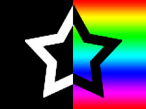

Title: WebGL Using 2 or More Textures
Description: How to use 2 or more textures in WebGL
TOC: Using 2 or More Textures


This article is a continuation of [WebGL Image
Processing](webgl-image-processing.html).  If you haven't read that I
suggest [you start there](webgl-image-processing.html).

Now might be a good time to answer the question, "How do I use 2 or more
textures?"

It's pretty simple.  Let's [go back a few lessons to our first shader that
draws a single image](webgl-image-processing.html) and update it for 2
images.

The first thing we need to do is change our code so we can load 2 images.
This is not really a WebGL thing, it's a HTML5 JavaScript thing, but we
might as well tackle it.  Images are loaded asynchronously which can take
a little getting used to.

There are basically 2 ways we could handle it.  We could try to structure
our code so that it runs with no textures and as the textures are loaded
the program updates.  We'll save that method for a later article.

In this case we'll wait for all the images to load before we draw
anything.

First let's change the code that loads an image into a function.  It's
pretty straightforward.  It creates a new `Image` object, sets the URL to
load, and sets a callback to be called when the image finishes loading.

```
function loadImage(url, callback) {
  var image = new Image();
  image.src = url;
  image.onload = callback;
  return image;
}
```

Now let's make a function that loads an array of URLs and generates an
array of images.  First we set `imagesToLoad` to the number of images
we're going to load.  Then we make the callback we pass to `loadImage`
decrement `imagesToLoad`.  When `imagesToLoad` goes to 0 all the images
have been loaded and we pass the array of images to a callback.

```
function loadImages(urls, callback) {
  var images = [];
  var imagesToLoad = urls.length;

  // Called each time an image finished loading.
  var onImageLoad = function() {
    --imagesToLoad;
    // If all the images are loaded call the callback.
    if (imagesToLoad == 0) {
      callback(images);
    }
  };

  for (var ii = 0; ii < imagesToLoad; ++ii) {
    var image = loadImage(urls[ii], onImageLoad);
    images.push(image);
  }
}
```

Now we call loadImages like this

```
function main() {
  loadImages([
    "resources/leaves.jpg",
    "resources/star.jpg",
  ], render);
}
```

Next we change the shader to use 2 textures.  In this case we'll multiply
1 texture by the other.

```
<script id="fragment-shader-2d" type="x-shader/x-fragment">
precision mediump float;

// our textures
uniform sampler2D u_image0;
uniform sampler2D u_image1;

// the texCoords passed in from the vertex shader.
varying vec2 v_texCoord;

void main() {
   vec4 color0 = texture2D(u_image0, v_texCoord);
   vec4 color1 = texture2D(u_image1, v_texCoord);
   gl_FragColor = color0 * color1;
}
</script>
```

We need to create 2 WebGL texture objects.

```
  // create 2 textures
  var textures = [];
  for (var ii = 0; ii < 2; ++ii) {
    var texture = gl.createTexture();
    gl.bindTexture(gl.TEXTURE_2D, texture);

    // Set the parameters so we can render any size image.
    gl.texParameteri(gl.TEXTURE_2D, gl.TEXTURE_WRAP_S, gl.CLAMP_TO_EDGE);
    gl.texParameteri(gl.TEXTURE_2D, gl.TEXTURE_WRAP_T, gl.CLAMP_TO_EDGE);
    gl.texParameteri(gl.TEXTURE_2D, gl.TEXTURE_MIN_FILTER, gl.NEAREST);
    gl.texParameteri(gl.TEXTURE_2D, gl.TEXTURE_MAG_FILTER, gl.NEAREST);

    // Upload the image into the texture.
    gl.texImage2D(gl.TEXTURE_2D, 0, gl.RGBA, gl.RGBA, gl.UNSIGNED_BYTE, images[ii]);

    // add the texture to the array of textures.
    textures.push(texture);
  }
```

WebGL has something called "texture units". You can think of it as an array of references
to textures. You tell the shader which texture unit to use for each sampler.

```
  // lookup the sampler locations.
  var u_image0Location = gl.getUniformLocation(program, "u_image0");
  var u_image1Location = gl.getUniformLocation(program, "u_image1");

  ...

  // set which texture units to render with.
  gl.uniform1i(u_image0Location, 0);  // texture unit 0
  gl.uniform1i(u_image1Location, 1);  // texture unit 1
```

Then we have to bind a texture to each of those texture units.

```
  // Set each texture unit to use a particular texture.
  gl.activeTexture(gl.TEXTURE0);
  gl.bindTexture(gl.TEXTURE_2D, textures[0]);
  gl.activeTexture(gl.TEXTURE1);
  gl.bindTexture(gl.TEXTURE_2D, textures[1]);
```

The 2 images we're loading look like this

<style>.glocal-center { text-align: center; } .glocal-center-content { margin-left: auto; margin-right: auto; }</style>
<div class="glocal-center"><table class="glocal-center-content"><tr><td> </td></tr></table></div>

And here's the result if we multiply them together using WebGL.

{{{example url="../webgl-2-textures.html" }}}

Some things I should go over.

The simple way to think of texture units is something like this: All of
the texture functions work on the "active texture unit".  The "active
texture unit" is just a global variable that's the index of the texture
unit you want to work with.  Each texture unit has 2 targets.  The
TEXTURE_2D target and the TEXTURE_CUBE_MAP target.  Every texture function
works with the specified target on the current active texture unit.  If
you were to implement WebGL in JavaScript it would look something like
this

```
var getContext = function() {
  var textureUnits = [
    { TEXTURE_2D: ??, TEXTURE_CUBE_MAP: ?? },
    { TEXTURE_2D: ??, TEXTURE_CUBE_MAP: ?? },
    { TEXTURE_2D: ??, TEXTURE_CUBE_MAP: ?? },
    { TEXTURE_2D: ??, TEXTURE_CUBE_MAP: ?? },
    { TEXTURE_2D: ??, TEXTURE_CUBE_MAP: ?? },
    ...
  ];
  var activeTextureUnit = 0;

  var activeTexture = function(unit) {
    // convert the unit enum to an index.
    var index = unit - gl.TEXTURE0;
    // Set the active texture unit
    activeTextureUnit = index;
  };

  var bindTexture = function(target, texture) {
    // Set the texture for the target of the active texture unit.
    textureUnits[activeTextureUnit][target] = texture;
  };

  var texImage2D = function(target, ... args ...) {
    // Call texImage2D on the current texture on the active texture unit
    var texture = textureUnits[activeTextureUnit][target];
    texture.image2D(...args...);
  };

  // return the WebGL API
  return {
    activeTexture: activeTexture,
    bindTexture: bindTexture,
    texImage2D: texImage2D,
  }
};
```

The shaders take indices into the texture units. Hopefully that makes these 2 lines clearer.

```
  gl.uniform1i(u_image0Location, 0);  // texture unit 0
  gl.uniform1i(u_image1Location, 1);  // texture unit 1
```

One thing to be aware of, when setting the uniforms you use indices for the texture units
but when calling gl.activeTexture you have to pass in special constants gl.TEXTURE0, gl.TEXTURE1 etc.
Fortunately the constants are consecutive so instead of this

```
  gl.activeTexture(gl.TEXTURE0);
  gl.bindTexture(gl.TEXTURE_2D, textures[0]);
  gl.activeTexture(gl.TEXTURE1);
  gl.bindTexture(gl.TEXTURE_2D, textures[1]);
```

We could have done this

```
  gl.activeTexture(gl.TEXTURE0 + 0);
  gl.bindTexture(gl.TEXTURE_2D, textures[0]);
  gl.activeTexture(gl.TEXTURE0 + 1);
  gl.bindTexture(gl.TEXTURE_2D, textures[1]);
```

or this

```
  for (var ii = 0; ii < 2; ++ii) {
    gl.activeTexture(gl.TEXTURE0 + ii);
    gl.bindTexture(gl.TEXTURE_2D, textures[ii]);
  }
```

Hopefully this small step helps explain how to use multiple textures in a single draw call in WebGL


