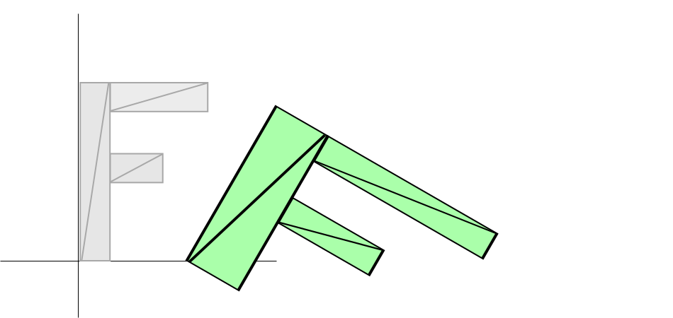
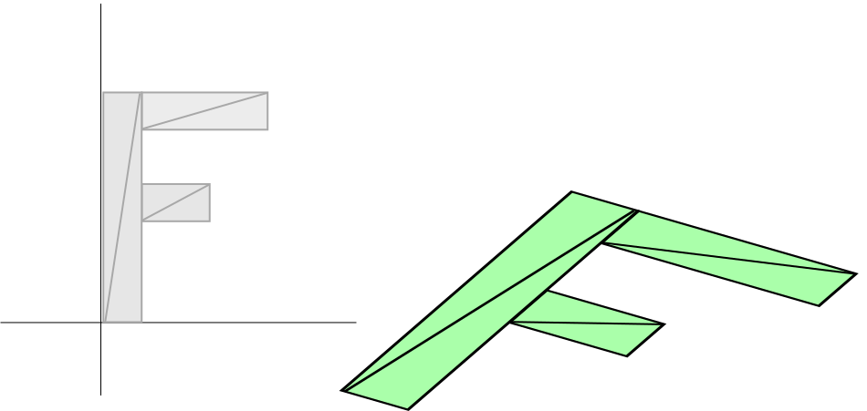

Title: WebGL 2D Matrices
Description: How matrix math works explained in simple easy to follow directions.
TOC: 2D Matrices


This post is a continuation of a series of posts about WebGL.  The first
[started with fundamentals](webgl-fundamentals.html) and the previous was
[about scaling 2D geometry](webgl-2d-scale.html).

<div class="webgl_bottombar">
<h3>Math vs Programming vs WebGL</h3>
<p>
Before we get started, if you have previously studied linear algebra or in general
have experience working with matrices then
<a href="webgl-matrix-vs-math.html"><b>please read this article before
continuing below.</b></a>.
</p>
<p>
If you have little to no experience with matrices then feel free
to skip the link above for now and continue reading.
</p>
</div>

In the last 3 posts we went over how to [translate
geometry](webgl-2d-translation.html), [rotate
geometry](webgl-2d-rotation.html), and [scale
geometry](webgl-2d-scale.html).  Translation, rotation and scale are each
considered a type of 'transformation'.  Each of these transformations
required changes to the shader and each of the 3 transformations was order
dependent.  In [our previous example](webgl-2d-scale.html) we scaled, then
rotated, then translated.  If we applied those in a different order we'd
get a different result.

For example here is a scale of 2, 1, rotation of 30 degrees, and
translation of 100, 0.



And here is a translation of 100,0, rotation of 30 degrees and scale of 2, 1



The results are completely different.  Even worse, if we needed the second
example we'd have to write a different shader that applied the
translation, rotation, and scale in our new desired order.

Well, some people way smarter than me figured out that you can do all the
same stuff with matrix math.  For 2D we use a 3x3 matrix.  A 3x3 matrix is
like a grid with 9 boxes:

<link href="resources/webgl-2d-matrices.css" rel="stylesheet">
<div class="glocal-center"><table class="glocal-center-content glocal-mat"><tr><td>1.0</td><td>2.0</td><td>3.0</td></tr><tr><td>4.0</td><td>5.0</td><td>6.0</td></tr><tr><td>7.0</td><td>8.0</td><td>9.0</td></tr></table></div>

To do the math we multiply the position down the columns of the matrix and
add up the results.  Our positions only have 2 values, x and y, but to do
this math we need 3 values so we'll use 1 for the third value.

In this case our result would be

<div class="glocal-center"><table class="glocal-center-content">
<col/><col/><col class="glocal-b"/><col/><col class="glocal-sp"/><col/><col class="glocal-b"/><col/><col class="glocal-sp"/><col/><col class="glocal-b"/>
<tr><td class="glocal-right">newX&nbsp;=&nbsp;</td><td>x&nbsp;*&nbsp;</td><td class="glocal-border">1.0</td><td class="glocal-left">&nbsp;+</td><td class="glocal-right">newY&nbsp;=&nbsp;</td><td>x&nbsp;*&nbsp;</td><td class="glocal-border">2.0</td><td class="glocal-left">&nbsp;+</td><td class="glocal-right">extra&nbsp;=&nbsp;</td><td>x&nbsp;*&nbsp;</td><td class="glocal-border">3.0</td><td>&nbsp;+</td></tr>
<tr><td></td><td>y&nbsp;*&nbsp;</td><td class="glocal-border">4.0</td><td class="glocal-left">&nbsp;+</td><td></td><td>y&nbsp;*&nbsp;</td><td class="glocal-border">5.0</td><td class="glocal-left">&nbsp;+&nbsp;</td><td></td><td>y&nbsp;*&nbsp;</td><td class="glocal-border">6.0</td><td>&nbsp;+</td></tr>
<tr><td></td><td>1&nbsp;*&nbsp;</td><td>7.0</td><td>&nbsp;</td><td></td><td>1&nbsp;*&nbsp;</td><td>8.0</td><td>&nbsp;&nbsp;</td><td></td><td>1&nbsp;*&nbsp;</td><td>9.0</td><td>&nbsp;</td></tr></table></div>

You're probably looking at that and thinking "WHAT'S THE POINT?" Well,
let's assume we have a translation.  We'll call the amount we want to
translate by tx and ty.  Let's make a matrix like this

<div class="glocal-center"><table class="glocal-center-content glocal-mat"><tr><td>1.0</td><td>0.0</td><td>0.0</td></tr><tr><td>0.0</td><td>1.0</td><td>0.0</td></tr><tr><td>tx</td><td>ty</td><td>1.0</td></tr></table></div>

And now check it out

<div class="glocal-center"><table class="glocal-center-content">
<col/><col/><col/><col class="glocal-b"/><col/><col class="glocal-sp"/><col/><col/><col class="glocal-b"/><col/><col class="glocal-sp"/><col/><col/><col class="glocal-b"/>
<tr><td>newX&nbsp;=&nbsp;</td><td>x</td><td>&nbsp;*&nbsp;</td><td class="glocal-border">1.0</td><td class="glocal-left">&nbsp;+</td><td class="glocal-right">newY&nbsp;=&nbsp;</td><td>x</td><td>&nbsp;*&nbsp;</td><td class="glocal-border">0.0</td><td class="glocal-left">&nbsp;+</td><td class="glocal-right">extra&nbsp;=&nbsp;</td><td>x</td><td>&nbsp;*&nbsp;</td><td class="glocal-border">0.0</td><td>&nbsp;+</td></tr><tr><td></td><td>y</td><td>&nbsp;*&nbsp;</td><td class="glocal-border">0.0</td><td class="glocal-left">&nbsp;+</td><td></td><td>y</td><td>&nbsp;*&nbsp;</td><td class="glocal-border">1.0</td><td class="glocal-left">&nbsp;+&nbsp;</td><td></td><td>y</td><td>&nbsp;*&nbsp;</td><td class="glocal-border">0.0</td><td>&nbsp;+</td></tr>
<tr><td></td><td>1</td><td>&nbsp;*&nbsp;</td><td>tx</td><td>&nbsp;</td><td></td><td>1</td><td>&nbsp;*&nbsp;</td><td>ty</td><td>&nbsp;&nbsp;</td><td></td><td>1</td><td>&nbsp;*&nbsp;</td><td>1.0</td><td>&nbsp;</td></tr></table></div>

If you remember your algebra, we can delete any place that multiplies by
zero.  Multiplying by 1 effectively does nothing so let's simplify to see
what's happening

<div class="glocal-center"><table class="glocal-center-content">
<col/><col/><col/><col class="glocal-b"/><col/><col class="glocal-sp"/><col/><col/><col class="glocal-b"/><col/><col class="glocal-sp"/><col/><col/><col class="glocal-b"/>
<tr><td>newX&nbsp;=&nbsp;</td><td>x</td><td class="glocal-blk">&nbsp;*&nbsp;</td><td class="glocal-blk glocal-border">1.0</td><td class="glocal-left">&nbsp;+</td><td class="glocal-right">newY&nbsp;=&nbsp;</td><td class="glocal-blk">x</td><td class="glocal-blk">&nbsp;*&nbsp;</td><td class="glocal-blk glocal-border">0.0</td><td class="glocal-blk glocal-left">&nbsp;+</td><td class="glocal-right">extra&nbsp;=&nbsp;</td><td class="glocal-blk">x</td><td class="glocal-blk">&nbsp;*&nbsp;</td><td class="glocal-blk glocal-border">0.0</td><td class="glocal-blk">&nbsp;+</td></tr>
<tr><td></td><td class="glocal-blk">y</td><td class="glocal-blk">&nbsp;*&nbsp;</td><td class="glocal-blk glocal-border">0.0</td><td class="glocal-blk glocal-left">&nbsp;+</td><td></td><td>y</td><td class="glocal-blk">&nbsp;*&nbsp;</td><td class="glocal-blk glocal-border">1.0</td><td class="glocal-left">&nbsp;+&nbsp;</td><td></td><td class="glocal-blk">y</td><td class="glocal-blk">&nbsp;*&nbsp;</td><td class="glocal-blk glocal-border">0.0</td><td class="glocal-blk">&nbsp;+</td></tr>
<tr><td></td><td class="glocal-blk">1</td><td class="glocal-blk">&nbsp;*&nbsp;</td><td>tx</td><td>&nbsp;</td><td></td><td class="glocal-blk">1</td><td class="glocal-blk">&nbsp;*&nbsp;</td><td>ty</td><td>&nbsp;&nbsp;</td><td></td><td>1</td><td class="glocal-blk">&nbsp;*&nbsp;</td><td class="glocal-blk">1.0</td><td>&nbsp;</td></tr></table></div>

or more succinctly

<div class="webgl_center"><pre class="webgl_math">
newX = x + tx;
newY = y + ty;
</pre></div>

And extra we don't really care about.  That looks surprisingly like [the
translation code from our translation example](webgl-2d-translation.html).

Similarly let's do rotation.  Like we pointed out in the rotation post we
just need the sine and cosine of the angle at which we want to rotate, so

<div class="webgl_center"><pre class="webgl_math">
s = Math.sin(angleToRotateInRadians);
c = Math.cos(angleToRotateInRadians);
</pre></div>

And we build a matrix like this

<div class="glocal-center"><table class="glocal-center-content glocal-mat"><tr><td>c</td><td>-s</td><td>0.0</td></tr><tr><td>s</td><td>c</td><td>0.0</td></tr><tr><td>0.0</td><td>0.0</td><td>1.0</td></tr></table></div>

Applying the matrix we get this

<div class="glocal-center"><table class="glocal-center-content">
<col/><col/><col/><col class="glocal-b"/><col/><col class="glocal-sp"/><col/><col/><col class="glocal-b"/><col/><col class="glocal-sp"/><col/><col/><col class="glocal-b"/>
<tr><td>newX&nbsp;=&nbsp;</td><td>x</td><td>&nbsp;*&nbsp;</td><td class="glocal-border">c</td><td class="glocal-left">&nbsp;+</td><td class="glocal-right">newY&nbsp;=&nbsp;</td><td>x</td><td>&nbsp;*&nbsp;</td><td class="glocal-border">-s</td><td class="glocal-left">&nbsp;+</td><td class="glocal-right">extra&nbsp;=&nbsp;</td><td>x</td><td>&nbsp;*&nbsp;</td><td class="glocal-border">0.0</td><td>&nbsp;+</td></tr>
<tr><td></td><td>y</td><td>&nbsp;*&nbsp;</td><td class="glocal-border">s</td><td class="glocal-left">&nbsp;+</td><td></td><td>y</td><td>&nbsp;*&nbsp;</td><td class="glocal-border">c</td><td class="glocal-left">&nbsp;+&nbsp;</td><td></td><td>y</td><td>&nbsp;*&nbsp;</td><td class="glocal-border">0.0</td><td>&nbsp;+</td></tr>
<tr><td></td><td>1</td><td>&nbsp;*&nbsp;</td><td>0.0</td><td>&nbsp;</td><td></td><td>1</td><td>&nbsp;*&nbsp;</td><td>0.0</td><td>&nbsp;&nbsp;</td><td></td><td>1</td><td>&nbsp;*&nbsp;</td><td>1.0</td><td>&nbsp;</td></tr></table></div>

Blacking out all multiply by 0s and 1s we get

<div class="glocal-center"><table class="glocal-center-content">
<col/><col/><col/><col class="glocal-b"/><col/><col class="glocal-sp"/><col/><col/><col class="glocal-b"/><col/><col class="glocal-sp"/><col/><col/><col class="glocal-b"/>
<tr><td>newX&nbsp;=&nbsp;</td><td>x</td><td>&nbsp;*&nbsp;</td><td class="glocal-border">c</td><td class="glocal-left">&nbsp;+</td><td class="glocal-right">newY&nbsp;=&nbsp;</td><td>x</td><td>&nbsp;*&nbsp;</td><td class="glocal-border">-s</td><td class="glocal-left">&nbsp;+</td><td class="glocal-right">extra&nbsp;=&nbsp;</td><td class="glocal-blk">x</td><td class="glocal-blk">&nbsp;*&nbsp;</td><td class="glocal-blk glocal-border">0.0</td><td class="glocal-blk">&nbsp;+</td></tr>
<tr><td></td><td>y</td><td>&nbsp;*&nbsp;</td><td class="glocal-border">s</td><td class="glocal-left glocal-blk">&nbsp;+</td><td></td><td>y</td><td>&nbsp;*&nbsp;</td><td class="glocal-border">c</td><td class="glocal-left glocal-blk">&nbsp;+&nbsp;</td><td></td><td class="glocal-blk">y</td><td class="glocal-blk">&nbsp;*&nbsp;</td><td class="glocal-blk glocal-border">0.0</td><td class="glocal-blk">&nbsp;+</td></tr>
<tr><td></td><td class="glocal-blk">1</td><td class="glocal-blk">&nbsp;*&nbsp;</td><td class="glocal-blk">0.0</td><td>&nbsp;</td><td></td><td class="glocal-blk">1</td><td class="glocal-blk">&nbsp;*&nbsp;</td><td class="glocal-blk">0.0</td><td>&nbsp;&nbsp;</td><td></td><td>1</td><td class="glocal-blk">&nbsp;*&nbsp;</td><td class="glocal-blk">1.0</td><td>&nbsp;</td></tr></table></div>

And simplifying we get

<pre class="webgl_center">
newX = x *  c + y * s;
newY = x * -s + y * c;
</pre>

Which is exactly what we had in our [rotation
sample](webgl-2d-rotation.html).

And lastly scale. We'll call our 2 scale factors sx and sy

And we build a matrix like this

<div class="glocal-center"><table class="glocal-center-content glocal-mat"><tr><td>sx</td><td>0.0</td><td>0.0</td></tr><tr><td>0.0</td><td>sy</td><td>0.0</td></tr><tr><td>0.0</td><td>0.0</td><td>1.0</td></tr></table></div>

Applying the matrix we get this

<div class="glocal-center"><table class="glocal-center-content">
<col/><col/><col/><col class="glocal-b"/><col/><col class="glocal-sp"/><col/><col/><col class="glocal-b"/><col/><col class="glocal-sp"/><col/><col/><col class="glocal-b"/>
<tr><td>newX&nbsp;=&nbsp;</td><td>x</td><td>&nbsp;*&nbsp;</td><td class="glocal-border">sx</td><td class="glocal-left">&nbsp;+</td><td class="glocal-right">newY&nbsp;=&nbsp;</td><td>x</td><td>&nbsp;*&nbsp;</td><td class="glocal-border">0.0</td><td class="glocal-left">&nbsp;+</td><td class="glocal-right">extra&nbsp;=&nbsp;</td><td>x</td><td>&nbsp;*&nbsp;</td><td class="glocal-border">0.0</td><td>&nbsp;+</td></tr>
<tr><td></td><td>y</td><td>&nbsp;*&nbsp;</td><td class="glocal-border">0.0</td><td class="glocal-left">&nbsp;+</td><td></td><td>y</td><td>&nbsp;*&nbsp;</td><td class="glocal-border">sy</td><td class="glocal-left">&nbsp;+&nbsp;</td><td></td><td>y</td><td>&nbsp;*&nbsp;</td><td class="glocal-border">0.0</td><td>&nbsp;+</td></tr>
<tr><td></td><td>1</td><td>&nbsp;*&nbsp;</td><td>0.0</td><td>&nbsp;</td><td></td><td>1</td><td>&nbsp;*&nbsp;</td><td>0.0</td><td>&nbsp;&nbsp;</td><td></td><td>1</td><td>&nbsp;*&nbsp;</td><td>1.0</td><td>&nbsp;</td></tr></table></div>

which is really

<div class="glocal-center"><table class="glocal-center-content">
<col/><col/><col/><col class="glocal-b"/><col/><col class="glocal-sp"/><col/><col/><col class="glocal-b"/><col/><col class="glocal-sp"/><col/><col/><col class="glocal-b"/>
<tr><td>newX&nbsp;=&nbsp;</td><td>x</td><td>&nbsp;*&nbsp;</td><td class="glocal-border">sx</td><td class="glocal-left glocal-blk">&nbsp;+</td><td class="glocal-right">newY&nbsp;=&nbsp;</td><td class="glocal-blk">x</td><td class="glocal-blk">&nbsp;*&nbsp;</td><td class="glocal-blk glocal-border">0.0</td><td class="glocal-left glocal-blk">&nbsp;+</td><td class="glocal-right">extra&nbsp;=&nbsp;</td><td class="glocal-blk">x</td><td class="glocal-blk">&nbsp;*&nbsp;</td><td class="glocal-blk glocal-border">0.0</td><td class="glocal-blk">&nbsp;+</td></tr>
<tr><td></td><td class="glocal-blk">y</td><td class="glocal-blk">&nbsp;*&nbsp;</td><td class="glocal-blk glocal-border">0.0</td><td class="glocal-left glocal-blk">&nbsp;+</td><td></td><td>y</td><td>&nbsp;*&nbsp;</td><td class="glocal-border">sy</td><td class="glocal-left glocal-blk">&nbsp;+&nbsp;</td><td></td><td class="glocal-blk">y</td><td class="glocal-blk">&nbsp;*&nbsp;</td><td class="glocal-blk glocal-border">0.0</td><td class="glocal-blk">&nbsp;+</td></tr>
<tr><td></td><td class="glocal-blk">1</td><td class="glocal-blk">&nbsp;*&nbsp;</td><td class="glocal-blk">0.0</td><td>&nbsp;</td><td></td><td class="glocal-blk">1</td><td class="glocal-blk">&nbsp;*&nbsp;</td><td class="glocal-blk">0.0</td><td>&nbsp;&nbsp;</td><td></td><td>1</td><td class="glocal-blk">&nbsp;*&nbsp;</td><td class="glocal-blk">1.0</td><td>&nbsp;</td></tr></table></div>

which simplified is

<pre class="webgl_center">
newX = x * sx;
newY = y * sy;
</pre>

Which is the same as our [scaling sample](webgl-2d-scale.html).

Now I'm sure you might still be thinking "So what?  What's the point?".
That seems like a lot of work just to do the same thing we were already
doing.

This is where the magic comes in.  It turns out we can multiply matrices
together and apply all the transformations at once.  Let's assume we have
a function, `m3.multiply`, that takes two matrices, multiplies them and
returns the result.

```js
var m3 = {
  multiply: function(a, b) {
    var a00 = a[0 * 3 + 0];
    var a01 = a[0 * 3 + 1];
    var a02 = a[0 * 3 + 2];
    var a10 = a[1 * 3 + 0];
    var a11 = a[1 * 3 + 1];
    var a12 = a[1 * 3 + 2];
    var a20 = a[2 * 3 + 0];
    var a21 = a[2 * 3 + 1];
    var a22 = a[2 * 3 + 2];
    var b00 = b[0 * 3 + 0];
    var b01 = b[0 * 3 + 1];
    var b02 = b[0 * 3 + 2];
    var b10 = b[1 * 3 + 0];
    var b11 = b[1 * 3 + 1];
    var b12 = b[1 * 3 + 2];
    var b20 = b[2 * 3 + 0];
    var b21 = b[2 * 3 + 1];
    var b22 = b[2 * 3 + 2];

    return [
      b00 * a00 + b01 * a10 + b02 * a20,
      b00 * a01 + b01 * a11 + b02 * a21,
      b00 * a02 + b01 * a12 + b02 * a22,
      b10 * a00 + b11 * a10 + b12 * a20,
      b10 * a01 + b11 * a11 + b12 * a21,
      b10 * a02 + b11 * a12 + b12 * a22,
      b20 * a00 + b21 * a10 + b22 * a20,
      b20 * a01 + b21 * a11 + b22 * a21,
      b20 * a02 + b21 * a12 + b22 * a22,
    ];
  }
}
```

To make things clearer let's make functions to build matrices for
translation, rotation and scale.

```js
var m3 = {
  translation: function(tx, ty) {
    return [
      1, 0, 0,
      0, 1, 0,
      tx, ty, 1,
    ];
  },

  rotation: function(angleInRadians) {
    var c = Math.cos(angleInRadians);
    var s = Math.sin(angleInRadians);
    return [
      c,-s, 0,
      s, c, 0,
      0, 0, 1,
    ];
  },

  scaling: function(sx, sy) {
    return [
      sx, 0, 0,
      0, sy, 0,
      0, 0, 1,
    ];
  },
};
```

Now let's change our shader. The old shader looked like this

```html
<script id="vertex-shader-2d" type="x-shader/x-vertex">
attribute vec2 a_position;

uniform vec2 u_resolution;
uniform vec2 u_translation;
uniform vec2 u_rotation;
uniform vec2 u_scale;

void main() {
  // Scale the position
  vec2 scaledPosition = a_position * u_scale;

  // Rotate the position
  vec2 rotatedPosition = vec2(
     scaledPosition.x * u_rotation.y + scaledPosition.y * u_rotation.x,
     scaledPosition.y * u_rotation.y - scaledPosition.x * u_rotation.x);

  // Add in the translation.
  vec2 position = rotatedPosition + u_translation;
  ...
```

Our new shader will be much simpler.

```html
<script id="vertex-shader-2d" type="x-shader/x-vertex">
attribute vec2 a_position;

uniform vec2 u_resolution;
uniform mat3 u_matrix;

void main() {
  // Multiply the position by the matrix.
  vec2 position = (u_matrix * vec3(a_position, 1)).xy;
  ...
```

And here's how we use it

```js
// Draw the scene.
function drawScene() {

  ,,,

  // Compute the matrices
  var translationMatrix = m3.translation(translation[0], translation[1]);
  var rotationMatrix = m3.rotation(angleInRadians);
  var scaleMatrix = m3.scaling(scale[0], scale[1]);

  // Multiply the matrices.
  var matrix = m3.multiply(translationMatrix, rotationMatrix);
  matrix = m3.multiply(matrix, scaleMatrix);

  // Set the matrix.
  gl.uniformMatrix3fv(matrixLocation, false, matrix);

  // Draw the rectangle.
  gl.drawArrays(gl.TRIANGLES, 0, 18);
}
```

Here's a sample using our new code.  The sliders are the same,
translation, rotation and scale.  But the way they get used in the shader
is much simpler.

{{{example url="../webgl-2d-geometry-matrix-transform.html" }}}

Still, you might be asking, so what?  That doesn't seem like much of a
benefit.  But, now if we want to change the order we don't have to write a
new shader.  We can just change the math.

```js
...
// Multiply the matrices.
var matrix = m3.multiply(scaleMatrix, rotationMatrix);
matrix = m3.multiply(matrix, translationMatrix);
...
```

Here's that version.

{{{example url="../webgl-2d-geometry-matrix-transform-trs.html" }}}

Being able to apply matrices like this is especially important for
hierarchical animation like arms on a body, moons on a planet around a
sun, or branches on a tree.  For a simple example of hierarchical
animation lets draw draw our 'F' 5 times but each time lets start with the
matrix from the previous 'F'.

```js
// Draw the scene.
function drawScene() {
  // Clear the canvas.
  gl.clear(gl.COLOR_BUFFER_BIT);

  // Compute the matrices
  var translationMatrix = m3.translation(translation[0], translation[1]);
  var rotationMatrix = m3.rotation(angleInRadians);
  var scaleMatrix = m3.scaling(scale[0], scale[1]);

  // Starting Matrix.
  var matrix = m3.identity();

  for (var i = 0; i < 5; ++i) {
    // Multiply the matrices.
    matrix = m3.multiply(matrix, translationMatrix);
    matrix = m3.multiply(matrix, rotationMatrix);
    matrix = m3.multiply(matrix, scaleMatrix);

    // Set the matrix.
    gl.uniformMatrix3fv(matrixLocation, false, matrix);

    // Draw the geometry.
    gl.drawArrays(gl.TRIANGLES, 0, 18);
  }
}
```

To do this we introduced the function, `m3.identity`, that makes an
identity matrix.  An identity matrix is a matrix that effectively
represents 1.0 so that if you multiply by the identity nothing happens.
Just like

<div class="webgl_center">X * 1 = X</div>

so too

<div class="webgl_center">matrixX * identity = matrixX</div>

Here's the code to make an identity matrix.

```js
var m3 = {
  identity: function() {
    return [
      1, 0, 0,
      0, 1, 0,
      0, 0, 1,
    ];
  },

  ...
```

Here's the 5 Fs.

{{{example url="../webgl-2d-geometry-matrix-transform-hierarchical.html" }}}

Let's see one more example.  In every sample so far our 'F' rotates around
its top left corner (well except for the example were we reversed the order above).
This is because the math we are using always rotates around the origin and
the top left corner of our 'F' is at the origin, (0, 0).

But now, because we can do matrix math and we can choose the order that
transforms are applied we can move the origin.

```js
// make a matrix that will move the origin of the 'F' to its center.
var moveOriginMatrix = m3.translation(-50, -75);
...

// Multiply the matrices.
var matrix = m3.multiply(translationMatrix, rotationMatrix);
matrix = m3.multiply(matrix, scaleMatrix);
matrix = m3.multiply(matrix, moveOriginMatrix);
```

Here's that sample. Notice the F rotates and scales around the center.

{{{example url="../webgl-2d-geometry-matrix-transform-center-f.html" }}}

Using that technique you can rotate or scale from any point.  Now you know
how Photoshop or Flash let you move the rotation point.

Let's go even more crazy.  If you go back to the first article on [WebGL
fundamentals](webgl-fundamentals.html) you might remember we have code in
the shader to convert from pixels to clip space that looks like this.

```js
...
// convert the rectangle from pixels to 0.0 to 1.0
vec2 zeroToOne = position / u_resolution;

// convert from 0->1 to 0->2
vec2 zeroToTwo = zeroToOne * 2.0;

// convert from 0->2 to -1->+1 (clip space)
vec2 clipSpace = zeroToTwo - 1.0;

gl_Position = vec4(clipSpace * vec2(1, -1), 0, 1);
```

If you look at each of those steps in turn, the first step, "convert from
pixels to 0.0 to 1.0", is really a scale operation.  The second is also a
scale operation.  The next is a translation and the very last scales Y by
-1.  We can actually do that all in the matrix we pass into the shader.
We could make 2 scale matrices, one to scale by 1.0/resolution, another to
scale by 2.0, a 3rd to translate by -1.0,-1.0 and a 4th to scale Y by -1
then multiply them all together but instead, because the math is simple,
we'll just make a function that makes a 'projection' matrix for a given
resolution directly.

```js
var m3 = {
  projection: function(width, height) {
    // Note: This matrix flips the Y axis so that 0 is at the top.
    return [
      2 / width, 0, 0,
      0, -2 / height, 0,
      -1, 1, 1
    ];
  },

  ...
```

Now we can simplify the shader even more.  Here's the entire new vertex
shader.

```html
<script id="vertex-shader-2d" type="x-shader/x-vertex">
attribute vec2 a_position;

uniform mat3 u_matrix;

void main() {
  // Multiply the position by the matrix.
  gl_Position = vec4((u_matrix * vec3(a_position, 1)).xy, 0, 1);
}
</script>
```

And in JavaScript we need to multiply by the projection matrix

```js
// Draw the scene.
function drawScene() {
  ...

  // Compute the matrices
  var projectionMatrix = m3.projection(
      gl.canvas.clientWidth, gl.canvas.clientHeight);

  ...

  // Multiply the matrices.
  var matrix = m3.multiply(projectionMatrix, translationMatrix);
  matrix = m3.multiply(matrix, rotationMatrix);
  matrix = m3.multiply(matrix, scaleMatrix);

  ...
}
```

We also removed the code that set the resolution.  With this last step
we've gone from a rather complicated shader with 6-7 steps to a very
simple shader with only 1 step all due to the magic of matrix math.

{{{example url="../webgl-2d-geometry-matrix-transform-with-projection.html" }}}

Before we move on let's simplify a little bit. While it's common to generate
various matrices and separately multiply them together it's also common to just
multiply them as we go. Effectively we could functions like this

```js
var m3 = {

  ...

  translate: function(m, tx, ty) {
    return m3.multiply(m, m3.translation(tx, ty));
  },

  rotate: function(m, angleInRadians) {
    return m3.multiply(m, m3.rotation(angleInRadians));
  },

  scale: function(m, sx, sy) {
    return m3.multiply(m, m3.scaling(sx, sy));
  },

  ...

};
```

This would let us change 7 lines of matrix code above to just 4 lines like this

```js
// Compute the matrix
var matrix = m3.projection(gl.canvas.clientWidth, gl.canvas.clientHeight);
matrix = m3.translate(matrix, translation[0], translation[1]);
matrix = m3.rotate(matrix, angleInRadians);
matrix = m3.scale(matrix, scale[0], scale[1]);
```

And here's that

{{{example url="../webgl-2d-geometry-matrix-transform-simpler-functions.html" }}}

One last thing, we saw above order matters. In the first example we had

    translation * rotation * scale

and in the second we had

    scale * rotation * translation

And we saw how they are different.

The are 2 ways to look at matrices. Given the expression

    projectionMat * translationMat * rotationMat * scaleMat * position

The first way which many people find natural is to start on the right and work
to the left

First we multiply the position by the scale matrix to get a scaled position

    scaledPosition = scaleMat * position

Then we multiply the scaledPosition by the rotation matrix to get a rotatedScaledPosition

    rotatedScaledPosition = rotationMat * scaledPosition

Then we multiply the rotatedScaledPosition by the translation matrix to get a
translatedRotatedScaledPosition

    translatedRotatedScaledPosition = translationMat * rotatedScaledPosition

And finally we multiply that by the projection matrix to get clip space positions

    clipspacePosition = projectionMatrix * translatedRotatedScaledPosition

The 2nd way to look at matrices is reading from left to right. In that case
each matrix changes the *space* represented by the canvas. The canvas starts
with representing clip space (-1 to +1) in each direction. Each matrix applied
from left to right changes the space represented by the canvas.

Step 1:  no matrix (or the identity matrix)

> {{{diagram url="resources/matrix-space-change.html?stage=0" caption="clip space" }}}
>
> The white area is the canvas. Blue is outside the canvas. We're in clip space.
> Positions passed in need to be in clip space

Step 2:  `matrix = m3.projection(gl.canvas.clientWidth, gl.canvas.clientHeight);`

> {{{diagram url="resources/matrix-space-change.html?stage=1" caption="from clip space to pixel space" }}}
>
> We're now in pixel space. X = 0 to 400, Y = 0 to 300 with 0,0 at the top left.
> Positions passed using this matrix in need to be in pixel space. The flash you see
> is when the space flips from positive Y = up to positive Y = down.

Step 3:  `matrix = m3.translate(matrix, tx, ty);`

> {{{diagram url="resources/matrix-space-change.html?stage=2" caption="move origin to tx, ty" }}}
>
> The origin has now been moved to tx, ty (150, 100). The space has moved.

Step 4:  `matrix = m3.rotate(matrix, rotationInRadians);`

> {{{diagram url="resources/matrix-space-change.html?stage=3" caption="rotate 33 degrees" }}}
>
> The space has been rotated around tx, ty

Step 5:  `matrix = m3.scale(matrix, sx, sy);`

> {{{diagram url="resources/matrix-space-change.html?stage=4" caption="scale the space" }}}
>
> The previously rotated space with its center at tx, ty has been scaled 2 in x, 1.5 in y

In the shader we then do `gl_Position = matrix * position;`. The `position` values are effectively in this final space.

Use which ever way you feel is easier to understand.

I hope these posts have helped demystify matrix math. If you want
to stick with 2D I'd suggest checking out [recreating canvas 2d's
drawImage function](webgl-2d-drawimage.html) and following that
into [recreating canvas 2d's matrix stack](webgl-2d-matrix-stack.html).

Otherwise next [we'll move on to 3D](webgl-3d-orthographic.html).
In 3D the matrix math follows the same principles and usage.
I started with 2D to hopefully keep it simple to understand.

Also, if you really want to become an expert
in matrix math [check out this amazing videos](https://www.youtube.com/watch?v=kjBOesZCoqc&list=PLZHQObOWTQDPD3MizzM2xVFitgF8hE_ab).

<div class="webgl_bottombar">
<h3>What are <code>clientWidth</code> and <code>clientHeight</code>?</h3>
<p>Up until this point whenever I referred to the canvas's dimensions I used <code>canvas.width</code> and <code>canvas.height</code>
but above when I called <code>m3.projection</code> I instead used <code>canvas.clientWidth</code> and <code>canvas.clientHeight</code>. Why?</p>
<p>Projection matrices are concerned with how to take clip space (-1 to +1 in each dimension) and convert it back
to pixels. But, in the browser, there are 2 types of pixels we are dealing with. One is the number of pixels in
the canvas itself. So for example a canvas defined like this.</p>
<pre class="prettyprint">
  &lt;canvas width="400" height="300"&gt;&lt;/canvas&gt;
</pre>
<p>or one defined like this</p>
<pre class="prettyprint">
  var canvas = document.createElement("canvas");
  canvas.width = 400;
  canvas.height = 300;
</pre>
<p>both contain an image 400 pixels wide by 300 pixels tall. But, that size is separate from what size
the browser actually displays that 400x300 pixel canvas. CSS defines what size the canvas is displayed.
For example if we made a canvas like this.</p>
<pre class="prettyprint">
  &lt;style&gt;
    canvas {
      width: 100vw;
      height: 100vh;
    }
  &lt;/style&gt;
  ...
  &lt;canvas width="400" height="300">&lt;/canvas&gt;
</pre>
<p>The canvas will be displayed whatever size its container is. That's likely not 400x300.</p>
<p>Here are two examples that set the canvas's CSS display size to 100% so the canvas is stretched
out to fill the page. The first one uses <code>canvas.width</code> and <code>canvas.height</code>. Open it in a new
window and resize the window. Notice how the 'F' doesn't have the correct aspect. It gets
distorted.</p>
{{{example url="../webgl-canvas-width-height.html" width="500" height="150" }}}
<p>In this second example we use <code>canvas.clientWidth</code> and <code>canvas.clientHeight</code>. <code>canvas.clientWidth</code> and <code>canvas.clientHeight</code> report
the size the canvas is actually being displayed by the browser so in this case, even though the canvas still only has 400x300 pixels
since we're defining our aspect ratio based on the size the canvas is being displayed the <code>F</code> always looks correct.</p>
{{{example url="../webgl-canvas-clientwidth-clientheight.html" width="500" height="150" }}}
<p>Most apps that allow their canvases to be resized try to make the <code>canvas.width</code> and <code>canvas.height</code> match
the <code>canvas.clientWidth</code> and <code>canvas.clientHeight</code> because they want there to be
one pixel in the canvas for each pixel displayed by the browser. But, as we've seen above, that's not
the only option. That means, in almost all cases, it's more technically correct to compute a
projection matrix's aspect ratio using <code>canvas.clientHeight</code> and <code>canvas.clientWidth</code>.
</p>
</div>

