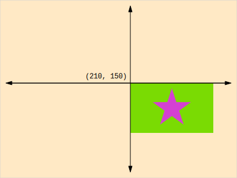

Title: WebGL Implementing A Matrix Stack
Description: How to implement canvas 2d's translate/rotate/scale functions in WebGL

This article is a continuation of [WebGL 2D DrawImage](webgl-2d-drawimage.html). If you haven't read that I suggest [you start there](webgl-2d-drawimage.html).

In that last article we implemented the WebGL equivilent of Canvas 2D's `drawImage` function
including its ability to specify both the source rectangle and the destination rectangle.

What we haven't done yet is let us rotate and/or scale it from any arbitrary point. We could do that
by adding more arguments, at a minimum we'd to specify a center point, a rotation and an x and y scale.
Fortunately there's a more generic and useful way. The way the Canvas 2D API does that is with a matrix stack.
The matrix stack functions of the Canvas 2D API are `save`, `restore`, `translate`, `rotate`, and `scale`.

A matrix stack is pretty simple to implement. We make a stack of matrices. We make functions to
multiply the top matrix of the stack using by either a translation, rotation, or scale matrix
[using the functions we created eariler](webgl-2d-matrices.html).

Here's the implementation

First the constructor and the `save` and `restore` functions

```
function MatrixStack() {
  this.stack = [];

  // since the stack is empty this will put an initial matrix in it
  this.restore();
}

// Pops the top of the stack restoring the previously saved matrix
MatrixStack.prototype.restore = function() {
  this.stack.pop();
  // Never let the stack be totally empty
  if (this.stack.length < 1) {
    this.stack[0] = makeIdentity();
  }
};

// Pushes a copy of the current matrix on the stack
MatrixStack.prototype.save = function() {
  this.stack.push(this.getCurrentMatrix());
};
```

We also need functions for getting and setting the top matrix

```
// Gets a copy of the current matrix (top of the stack)
MatrixStack.prototype.getCurrentMatrix = function() {
  return this.stack[this.stack.length - 1].slice();
};

// Lets us set the current matrix
MatrixStack.prototype.setCurrentMatrix = function(m) {
  return this.stack[this.stack.length - 1] = m;
};

```

Finally we need to implement `translate`, `rotate`, and `scale` using our
previous matrix functions.

```
// Translates the current matrix
MatrixStack.prototype.translate = function(x, y, z) {
  var t = makeTranslation(x, y, z);
  var m = this.getCurrentMatrix();
  this.setCurrentMatrix(matrixMultiply(t, m));
};

// Rotates the current matrix around Z
MatrixStack.prototype.rotateZ = function(angleInRadians) {
  var t = makeZRotation(angleInRadians);
  var m = this.getCurrentMatrix();
  this.setCurrentMatrix(matrixMultiply(t, m));
};

// Scales the current matrix
MatrixStack.prototype.scale = function(x, y, z) {
  var t = makeScale(x, y, z);
  var m = this.getCurrentMatrix();
  this.setCurrentMatrix(matrixMultiply(t, m));
};
```

Note we're using the 3d matrix math functions. We could just use `0` for `z` on translation and `1`
for `z` on scale but I find that I'm so used to using the 2d functions from Canvas 2d
that I often forget to specify `z` an then the code breaks so let's make `z` optional

```
// Translates the current matrix
MatrixStack.prototype.translate = function(x, y, z) {
+  if (z === undefined) {
+    z = 0;
+  }
  var t = makeTranslation(x, y, z);
  var m = this.getCurrentMatrix();
  this.setCurrentMatrix(matrixMultiply(t, m));
};

...

// Scales the current matrix
MatrixStack.prototype.scale = function(x, y, z) {
+  if (z === undefined) {
+    z = 1;
+  }
  var t = makeScale(x, y, z);
  var m = this.getCurrentMatrix();
  this.setCurrentMatrix(matrixMultiply(t, m));
};
```

Using our [`drawImage` from the previous lesson](webgl-2d-drawimage.html) we had these lines

```
// multiply them all togehter
var matrix = matrixMultiply(scaleMatrix, translationMatrix);
matrix = matrixMultiply(matrix, projectionMatrix);
```

We just need to create a matrix stack

```
var matrixStack = new MatrixStack();
```

and multiply in the top matrix from our stack in

```
// multiply them all togehter
var matrix = matrixMultiply(scaleMatrix, translationMatrix);
+matrix = matrixMultiply(matrix, matrixStage.getCurrentMatrix());
matrix = matrixMultiply(matrix, projectionMatrix);
```

And now we can use it the same way we'd use it with the Canvas 2D API.

If you're not aware of how to use the matrix stack you can think of it as
moving and orientating the origin. So for example by default in a 2D canvas the origin (0,0)
is at the top left corner.

For example if we move the origin to the center of the canvas then drawing an image at 0,0
will draw it starting at the center of the canvas

Let's take [our previous example](webgl-2d-drawimage.html) and just draw a single image

```
var textureInfo = loadImageAndCreateTextureInfo('resources/star.jpg');

function draw(time) {
  gl.clear(gl.COLOR_BUFFER_BIT);

  matrixStack.save();
  matrixStack.translate(gl.canvas.width / 2, gl.canvas.height / 2);
  matrixStack.rotateZ(time);

  drawImage(
    textureInfo.texture,
    textureInfo.width,
    textureInfo.height,
    0, 0);

  matrixStack.restore();
}
```

And here it is.

{{{example url="../webgl-2d-matrixstack-01.html" }}}

you can see even though we're passing `0, 0` to `drawImage` since we use
`matrixStack.translate` to move the origin to the center of the canvas
the image is drawn and rotates around that center.

Let's move the center of rotation to center of the image

```
matrixStack.translate(gl.canvas.width / 2, gl.canvas.height / 2);
matrixStack.rotateZ(time);
+matrixStack.translate(textureInfo.width / -2, textureInfo.height / -2);
```

And now it rotates around the center of the image in the center of the canvas

{{{example url="../webgl-2d-matrixstack-02.html" }}}

Let's draw the same image at each corner rotating on different corners

```
matrixStack.translate(gl.canvas.width / 2, gl.canvas.height / 2);
matrixStack.rotateZ(time);

+matrixStack.save();
+{
+  matrixStack.translate(textureInfo.width / -2, textureInfo.height / -2);
+
+  drawImage(
+    textureInfo.texture,
+    textureInfo.width,
+    textureInfo.height,
+    0, 0);
+
+}
+matrixStack.restore();
+
+matrixStack.save();
+{
+  // We're at the center of the center image so go to the top/left corner
+  matrixStack.translate(textureInfo.width / -2, textureInfo.height / -2);
+  matrixStack.rotateZ(Math.sin(time * 2.2));
+  matrixStack.scale(0.2, 0.2);
+  // Now we want the bottom/right corner of the image we're about to draw
+  matrixStack.translate(-textureInfo.width, -textureInfo.height);
+
+  drawImage(
+    textureInfo.texture,
+    textureInfo.width,
+    textureInfo.height,
+    0, 0);
+
+}
+matrixStack.restore();
+
+matrixStack.save();
+{
+  // We're at the center of the center image so go to the top/right corner
+  matrixStack.translate(textureInfo.width / 2, textureInfo.height / -2);
+  matrixStack.rotateZ(Math.sin(time * 2.3));
+  matrixStack.scale(0.2, 0.2);
+  // Now we want the bottom/right corner of the image we're about to draw
+  matrixStack.translate(0, -textureInfo.height);
+
+  drawImage(
+    textureInfo.texture,
+    textureInfo.width,
+    textureInfo.height,
+    0, 0);
+
+}
+matrixStack.restore();
+
+matrixStack.save();
+{
+  // We're at the center of the center image so go to the bottom/left corner
+  matrixStack.translate(textureInfo.width / -2, textureInfo.height / 2);
+  matrixStack.rotateZ(Math.sin(time * 2.4));
+  matrixStack.scale(0.2, 0.2);
+  // Now we want the top/right corner of the image we're about to draw
+  matrixStack.translate(-textureInfo.width, 0);
+
+  drawImage(
+    textureInfo.texture,
+    textureInfo.width,
+    textureInfo.height,
+    0, 0);
+
+}
+matrixStack.restore();
+
+matrixStack.save();
+{
+  // We're at the center of the center image so go to the bottom/right corner
+  matrixStack.translate(textureInfo.width / 2, textureInfo.height / 2);
+  matrixStack.rotateZ(Math.sin(time * 2.5));
+  matrixStack.scale(0.2, 0.2);
+  // Now we want the top/left corner of the image we're about to draw
+  matrixStack.translate(0, 0);  // 0,0 means this line is not really doing anything
+
+  drawImage(
+    textureInfo.texture,
+    textureInfo.width,
+    textureInfo.height,
+    0, 0);
+
+}
+matrixStack.restore();
```

If you think of the various matrix stack functions, `translate`, `rotateZ`, and `scale`
as moving the origin then the way I think of setting the center of rotation is
*where would I have to move the origin so that when I call drawImage a certain part
of the image is **at** the previous origin?*

In other words let's say on a 400x300 canvas I call `matrixStack.translate(220, 150)`.
At that point origin relative to calling drawImage is here. If we call `drawImage`
this is where the image will be drawn.



Lets say we want the center of rotation to be the bottom right. In that case
we where would be have to move the origin so that when we call `drawImage`
the point we want to be the center of rotation is at the current origin?
For the bottom right of the texture that would be `-textureWidth, -textureHeight`.


Whatever we did before that on the matrix stack it doesn't matter. We did a bunch
of stuff to move or scale or rotate the origin but just before we call
`drawImage`, wherever the origin happens to be at the moment is irrelavent.
It's the new origin so we just have to decide where to move that origin
relative where the texture will be drawn if drawn at that origin.

You might notice a matrix stack is very similar to a [scene graph that we
covered before](webgl-scene-graph.html). A scene graph had a tree of nodes
and as we walked the tree we multiplied each node by its parent's node.
A matrix stack is effectively antoher version that same process.


