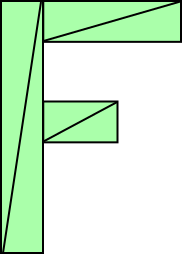

Title: WebGL 2D Translation

Before we move on to 3D let's stick with 2D for a little while longer. Bear with me please. This article might seem exceedingly obvious to some but I'll build up to a point in a few articles.

This article is a continuation of a series starting with <a href="webgl-fundamentals.html">WebGL Fundamentals</a>. If you haven't read them I suggest you read at least the first one then come back here.

Translation is some fancy math name that basically means "to move" something. I suppose moving a sentence from English to Japanese fits as well but in this case we're talking about moving geometry. Using the sample code we ended up with in <a href="webgl-fundamentals.html">the first post</a> you could easily translate our rectangle just by changing the values passed to setRectangle right? Here's a sample based on our <a href="webgl-fundamentals.html">previous sample</a>.
<!--more-->
<pre class="prettyprint showlinemods">
  // First lets make some variables 
  // to hold the translation of the rectangle
  var translation = [0, 0];

  // then let's make a function to
  // re-draw everything. We can call this
  // function after we update the translation.

  // Draw a the scene.
  function drawScene() {
    // Clear the canvas.
    gl.clear(gl.COLOR_BUFFER_BIT);

    // Setup a rectangle
    setRectangle(gl, translation[0], translation[1], width, height);

    // Draw the rectangle.
    gl.drawArrays(gl.TRIANGLES, 0, 6);
  }
</pre>

In the example below I've attached a couple of sliders that will update translation[0] and translation[1] and call drawScene anytime they change. Drag the sliders to translate the rectangle.

<iframe class="webgl_example" src="../webgl-2d-rectangle-translate.html" width="400" height="300"></iframe>
<a class="webgl_center" href="../webgl-2d-rectangle-translate.html" target="_blank">click here to open in a separate window</a>

So far so good. But now imagine we wanted to do the same thing with a more complicated shape.

Let's say we wanted to draw an 'F' that consists of 6 triangles like this.

Well, following are current code we'd have to change setRectangle to something more like this.

<pre class="prettyprint showlinemods">
// Fill the buffer with the values that define a letter 'F'.
function setGeometry(gl, x, y) {
  var width = 100;
  var height = 150;
  var thickness = 30;
  gl.bufferData(
      gl.ARRAY_BUFFER,
      new Float32Array([
          // left column
          x, y,
          x + thickness, y,
          x, y + height,
          x, y + height,
          x + thickness, y,
          x + thickness, y + height,

          // top rung
          x + thickness, y,
          x + width, y,
          x + thickness, y + thickness,
          x + thickness, y + thickness,
          x + width, y,
          x + width, y + thickness,

          // middle rung
          x + thickness, y + thickness * 2,
          x + width * 2 / 3, y + thickness * 2,
          x + thickness, y + thickness * 3,
          x + thickness, y + thickness * 3,
          x + width * 2 / 3, y + thickness * 2,
          x + width * 2 / 3, y + thickness * 3]),
      gl.STATIC_DRAW);
}
</pre>

You can hopefully see that's not going to scale well. If we want to draw some very complex geometry with hundreds or thousands of lines we'd have to write some pretty complex code. On top of that, every time we draw JavaScript has to update all the points.

There's a simpler way. Just upload the geometry and do the translation in the shader.

Here's the new shader

<pre class="prettyprint showlinemods">
&lt;script id="2d-vertex-shader" type="x-shader/x-vertex"&gt;
attribute vec2 a_position;

uniform vec2 u_resolution;
uniform vec2 u_translation;

void main() {
   // Add in the translation.
   vec2 position = a_position + u_translation;

   // convert the rectangle from pixels to 0.0 to 1.0
   vec2 zeroToOne = position / u_resolution;
   ...
</pre>

and we'll restructure the code a little. For one we only need to set the geometry once. 

<pre class="prettyprint showlinemods">
// Fill the buffer with the values that define a letter 'F'.
function setGeometry(gl) {
  gl.bufferData(
      gl.ARRAY_BUFFER,
      new Float32Array([
          // left column
          0, 0,
          30, 0,
          0, 150,
          0, 150,
          30, 0,
          30, 150,

          // top rung
          30, 0,
          100, 0,
          30, 30,
          30, 30,
          100, 0,
          100, 30,

          // middle rung
          30, 60,
          67, 60,
          30, 90,
          30, 90,
          67, 60,
          67, 90]),
      gl.STATIC_DRAW);
}
</pre>

Then we just need to update <code>u_translation</code> before we draw with the translation that we desire.

<pre class="prettyprint showlinemods">
  ...
  var translationLocation = gl.getUniformLocation(
             program, "u_translation");
  ...
  // Set Geometry.
  setGeometry(gl);
  ..
  // Draw scene.
  function drawScene() {
    // Clear the canvas.
    gl.clear(gl.COLOR_BUFFER_BIT);

    // Set the translation.
    gl.uniform2fv(translationLocation, translation);

    // Draw the rectangle.
    gl.drawArrays(gl.TRIANGLES, 0, 18);
  }
</pre>

Notice <code>setGeometry</code> is called only once. It is no longer inside drawScene.

And here's that example. Again, Drag the sliders to update the translation.

<iframe class="webgl_example" src="../webgl-2d-geometry-translate-better.html" width="400" height="300"></iframe>
<a class="webgl_center" href="../webgl-2d-geometry-translate-better.html" target="_blank">click here to open in a separate window</a>

Now when we draw WebGL is doing practically everything. All we are doing is setting a translation and asking it to draw. Even if our geometry had tens of thousands of points the main code would stay the same.

If you want you can compare <a href="../webgl-2d-geometry-translate.html" target="_blank">the version that uses the complex JavaScript above to update all the points</a>.

I hope this example was not too obvious. In the <a href="webgl-2d-rotation.html">next article we'll move on to rotation</a>.

