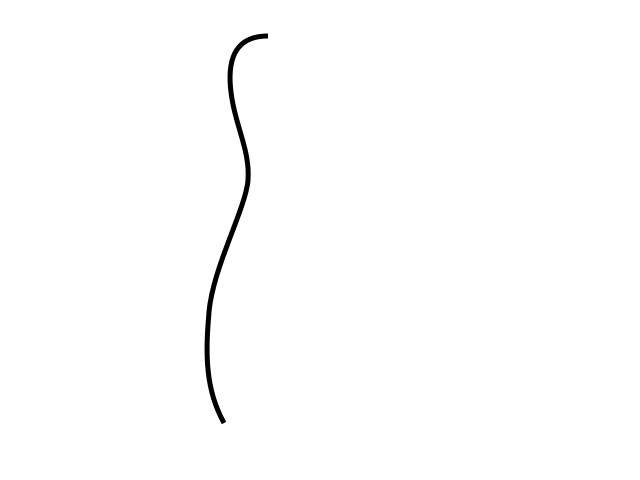
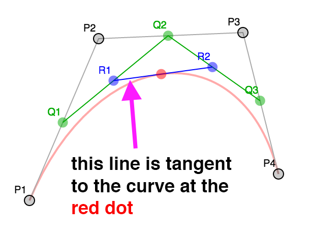
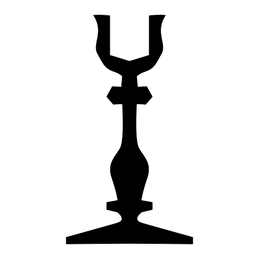
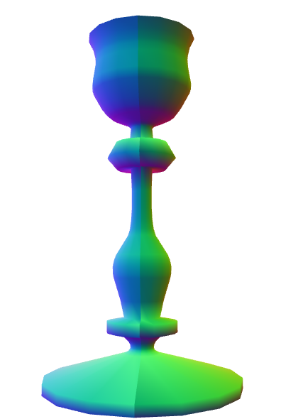

Title: WebGL 3D Geometry - Lathe
Description: How to lathe a bezier curve.
TOC: Geometry - Lathe

This is probably a kind of obscure topic but I found it interesting so I'm writing it up.
It is not something I recommend you actually do. Rather, I think working through
the topic will help illustrate some things about making 3d models for WebGL.

Someone asked how to make a bowling pin shape in WebGL. The *smart* answer is
"Use a 3D modeling package like [Blender](https://blender.org),
[Maya](https://www.autodesk.com/products/maya/overview),
[3D Studio Max](https://www.autodesk.com/products/3ds-max/overview),
[Cinema 4D](https://www.maxon.net/en/products/cinema-4d/overview/), etc.
Use it to model a bowling pin, export, read the dat.
([The OBJ format is relatively simple](https://en.wikipedia.org/wiki/Wavefront_.obj_file)).

But, that got me thinking, what if they wanted to make a modeling package?

There's a few ideas. One is to make a cylinder and try to pinch it in
the right places using sin waves applied in certain places. The problem
with that idea you wouldn't get a smooth top. A standard cylinder
is generated as a series of equally spaced rings but you'd need more
rings where things are more curvy.

In a modeling package you'd make a bowling pin by making a 2d silhouette or rather
a curved line that matches the edge of a 2d silhouette. You'd then
lathe that into a 3d shape. By *lathe* I mean you'd spin it around
some axis and generate points as you do. This lets you easily make
any round objects like a bowl, a glass, a baseball bat, bottles,
light bulbs, etc.

So, how do we do that? Well first we need some way to make a curve.
Then we'd need to compute points on that curve. We'd then rotate
those points around some axis using [matrix math](webgl-2d-matrices.html)
and build triangles from those points.

The most common kind of curve in computer graphics seems to be
a bezier curve. If you've ever edited a curve in
[Adobe Illustrator](https://www.adobe.com/products/illustrator.html) or
[Inkscape](https://inkscape.org/en/) or
[Affinity Designer](https://affinity.serif.com/en-us/designer/)
or similar programs that's a bezier curve.

A bezier curve or rather a cubic bezier curve is formed by 4 points.
2 points are the end points. 2 points are the "control points".

Here's 4 points

{{{diagram url="resources/bezier-curve-diagram.html?maxDepth=0" }}}

We pick a number between 0 and 1 (called `t`) where 0 = the beginning
and 1 = the end. We then compute the corresponding `t` point
between each pair of points. `P1 P2`, `P2 P3`, `P3 P4`.

{{{diagram url="resources/bezier-curve-diagram.html?maxDepth=1" }}}

In other words if `t = .25` then we compute a point 25% of the way
going from `P1` to `P2`, another 25% of the way going from `P2` to `P3`
and one more 25% of the way going from `P3` to `P4`.

You can drag the slider to adjust `t` and you can also move points
`P1`, `P2`, `P3`, and `P4`.

We do the same for the resulting points. Compute `t` points between `Q1 Q2`
and `Q2 Q3`.

{{{diagram url="resources/bezier-curve-diagram.html?maxDepth=2" }}}

Finally we do the same for those 2 points and compute the `t` point between
`R1 R2`.

{{{diagram url="resources/bezier-curve-diagram.html?maxDepth=3" }}}

The positions of that red point make a curve.

{{{diagram url="resources/bezier-curve-diagram.html?maxDepth=4" }}}

So this is a cubic bezier curve.

Note that while the interpolation between points above and
the process of making 3 points from 4, then 2 from 3, and finally 1
point from 2 works that's not the normal way. Instead someone plugged
in all the math and simplified it to a formula like this

<pre class="webgl_math">
invT = (1 - t)
P = P1 * invT^3 +
    P2 * 3 * t * invT^2 +
    P3 * 3 * invT * t^2 +
    P4 * t^3
</pre>

Where `P1`, `P2`, `P3`, `P4` are the points like the examples above and `P`
is the red dot.

In a 2D vector art program like Adobe Illustrator
when you make a longer curve it's actually made from many small 4 point
curves like this. By default most apps lock the control points
around a shared start/end point and make sure they are always
opposite relative to the shared point.

See this example, move `P3` or `P5` and the code will move the other.

{{{diagram url="resources/bezier-curve-edit.html" }}}

Notice the curve made by `P1,P2,P3,P4` is a separate curve from
the one made by `P4,P5,P6,P7`. It's just when `P3` and `P5` are on exact
opposite sides of `P4` together they look like one continuous curve.
Most apps will then usually give you the option to stop locking them
together so you can get a sharp corner. Un-check the lock checkbox
then drag `P3` or `P5` and it will become even more clear they are
separate curves.

Next up we need a way to generate points on a curve.
Using the formula above we can generate a point for
a given `t` value like this.

    function getPointOnBezierCurve(points, offset, t) {
      const invT = (1 - t);
      return v2.add(v2.mult(points[offset + 0], invT * invT * invT),
                    v2.mult(points[offset + 1], 3 * t * invT * invT),
                    v2.mult(points[offset + 2], 3 * invT * t * t),
                    v2.mult(points[offset + 3], t * t  *t));
    }

And we can generate a set of points for the curve like this

    function getPointsOnBezierCurve(points, offset, numPoints) {
      const cpoints = [];
      for (let i = 0; i < numPoints; ++i) {
        const t = i / (numPoints - 1);
        cpoints.push(getPointOnBezierCurve(points, offset, t));
      }
      return cpoints;
    }

Note: `v2.mult` and `v2.add` are small JavaScript functions I included
to help do math with points.

{{{diagram url="resources/bezier-curve-diagram.html?maxDepth=0&showCurve=true&showPoints=true" }}}

In the diagram above you can choose a number of points. If the curve is sharp
you'd want more points. If the curve is nearly a straight line though you'd
probably want less points. One solution
is to check how curvy a curve is. If it's too curvy then split it into
2 curves.

The splitting part turns out to be easy. If we look at the various
levels of interpolation again, the points `P1`, `Q1`, `R1`, RED make one
curve and the points RED, `R2`, `Q3`, `P4` make the other for any value of t.
In other words we can split the curve anywhere and get 2 curves
that match the original.

{{{diagram url="resources/bezier-curve-diagram.html?maxDepth=4&show2Curves=true" }}}

The second part is deciding if a curve needs to be split or not. Looking
around the net I found [this function](https://seant23.wordpress.com/2010/11/12/offset-bezier-curves/)
that for a given curve decides how flat it is.

    function flatness(points, offset) {
      const p1 = points[offset + 0];
      const p2 = points[offset + 1];
      const p3 = points[offset + 2];
      const p4 = points[offset + 3];

      let ux = 3 * p2[0] - 2 * p1[0] - p4[0]; ux *= ux;
      let uy = 3 * p2[1] - 2 * p1[1] - p4[1]; uy *= uy;
      let vx = 3 * p3[0] - 2 * p4[0] - p1[0]; vx *= vx;
      let vy = 3 * p3[1] - 2 * p4[1] - p1[1]; vy *= vy;

      if(ux < vx) {
        ux = vx;
      }

      if(uy < vy) {
        uy = vy;
      }

      return ux + uy;
    }

We can use that in our function that gets points for a curve.
First we'll check if the curve is too curvy. If so we'll subdivide,
if not we'll add the points in.

    function getPointsOnBezierCurveWithSplitting(points, offset, tolerance, newPoints) {
      const outPoints = newPoints || [];
      if (flatness(points, offset) < tolerance) {

        // just add the end points of this curve
        outPoints.push(points[offset + 0]);
        outPoints.push(points[offset + 3]);

      } else {

        // subdivide
        const t = .5;
        const p1 = points[offset + 0];
        const p2 = points[offset + 1];
        const p3 = points[offset + 2];
        const p4 = points[offset + 3];

        const q1 = v2.lerp(p1, p2, t);
        const q2 = v2.lerp(p2, p3, t);
        const q3 = v2.lerp(p3, p4, t);

        const r1 = v2.lerp(q1, q2, t);
        const r2 = v2.lerp(q2, q3, t);

        const red = v2.lerp(r1, r2, t);

        // do 1st half
        getPointsOnBezierCurveWithSplitting([p1, q1, r1, red], 0, tolerance, outPoints);
        // do 2nd half
        getPointsOnBezierCurveWithSplitting([red, r2, q3, p4], 0, tolerance, outPoints);

      }
      return outPoints;
    }

{{{diagram url="resources/bezier-curve-diagram.html?maxDepth=0&showCurve=true&showTolerance=true" }}}

This algorithm does a good job of making sure we have enough points but
it doesn't do such a great job of getting rid of unneeded points.

For that we turn to the [Ramer Douglas Peucker algorithm](https://en.wikipedia.org/wiki/Ramer%E2%80%93Douglas%E2%80%93Peucker_algorithm)
I found on the net.

In that algorithm we take a list of points.
We find the furthest point from the line formed by the 2 end points.
Then we check if that point is further away from the line than some distance.
If it's less than than that distance we just keep the 2 end points and discard the rest
Otherwise we run the algorithm again, once with the points from the start to the furthest
point and again from the furthest point to the end point.

    function simplifyPoints(points, start, end, epsilon, newPoints) {
      const outPoints = newPoints || [];

      // find the most distance point from the endpoints
      const s = points[start];
      const e = points[end - 1];
      let maxDistSq = 0;
      let maxNdx = 1;
      for (let i = start + 1; i < end - 1; ++i) {
        const distSq = v2.distanceToSegmentSq(points[i], s, e);
        if (distSq > maxDistSq) {
          maxDistSq = distSq;
          maxNdx = i;
        }
      }

      // if that point is too far
      if (Math.sqrt(maxDistSq) > epsilon) {

        // split
        simplifyPoints(points, start, maxNdx + 1, epsilon, outPoints);
        simplifyPoints(points, maxNdx, end, epsilon, outPoints);

      } else {

        // add the 2 end points
        outPoints.push(s, e);
      }

      return outPoints;
    }

`v2.distanceToSegmentSq` is a function that computes the distance squared from a point
to a line segment. We use the distance squared because it's faster to compute than
the actual distance. Since we only care which point is furthest the distance squared
will work just as well as the actual distance.

Here's that in action. Adjust the distance to see more points added or removed.

{{{diagram url="resources/bezier-curve-diagram.html?maxDepth=0&showCurve=true&showDistance=true" }}}

Back to our bowling pin. We could try to extend the code above into a full editor.
It would need to be able to add and remove points, lock and unlock control points.
It would need undo, etc... But there's an easier way. We can just use any of the
major editors mentioned above. [I used this online editor](https://svg-edit.github.io/svgedit/).

Here's the svg silhouette of a bowling pin I made.

It's made from 4 bezier curves. The data for that path looks like this

    <path fill="none" stroke-width="5" d="
       m44,434
       c18,-33 19,-66 15,-111
       c-4,-45 -37,-104 -39,-132
       c-2,-28 11,-51 16,-81
       c5,-30 3,-63 -36,-63
    "/>

[Interpreting that data](https://developer.mozilla.org/en/docs/Web/SVG/Tutorial/Paths) we get these points.

            ___
    44, 371,   |
    62, 338,   | 1st curve
    63, 305,___|__
    59, 260,___|  |
    55, 215,      | 2nd curve
    22, 156,______|__
    20, 128,______|  |
    18, 100,         | 3rd curve
    31,  77,_________|__
    36,  47,_________|  |
    41,  17,            | 4th curve
    39, -16,            |
     0, -16,____________|

Now that we have the data for the curves we need to compute some points
on them.

    // gets points across all segments
    function getPointsOnBezierCurves(points, tolerance) {
      const newPoints = [];
      const numSegments = (points.length - 1) / 3;
      for (let i = 0; i < numSegments; ++i) {
        const offset = i * 3;
        getPointsOnBezierCurveWithSplitting(points, offset, tolerance, newPoints);
      }
      return newPoints;
    }

We'd call `simplifyPoints` on the result.

Now we need to spin them around. We decide how many divisions to make, for each division
you use the [matrix math](webgl-2d-matrices.html) to rotate the points around the Y axis.
Once we've made all the points we connect them with triangles using indices.

    // rotates around Y axis.
    function lathePoints(points,
                         startAngle,   // angle to start at (ie 0)
                         endAngle,     // angle to end at (ie Math.PI * 2)
                         numDivisions, // how many quads to make around
                         capStart,     // true to cap the start
                         capEnd) {     // true to cap the end
      const positions = [];
      const texcoords = [];
      const indices = [];

      const vOffset = capStart ? 1 : 0;
      const pointsPerColumn = points.length + vOffset + (capEnd ? 1 : 0);
      const quadsDown = pointsPerColumn - 1;

      // generate points
      for (let division = 0; division <= numDivisions; ++division) {
        const u = division / numDivisions;
        const angle = lerp(startAngle, endAngle, u) % (Math.PI * 2);
        const mat = m4.yRotation(angle);
        if (capStart) {
          // add point on Y axis at start
          positions.push(0, points[0][1], 0);
          texcoords.push(u, 0);
        }
        points.forEach((p, ndx) => {
          const tp = m4.transformPoint(mat, [...p, 0]);
          positions.push(tp[0], tp[1], tp[2]);
          const v = (ndx + vOffset) / quadsDown;
          texcoords.push(u, v);
        });
        if (capEnd) {
          // add point on Y axis at end
          positions.push(0, points[points.length - 1][1], 0);
          texcoords.push(u, 1);
        }
      }

      // generate indices
      for (let division = 0; division < numDivisions; ++division) {
        const column1Offset = division * pointsPerColumn;
        const column2Offset = column1Offset + pointsPerColumn;
        for (let quad = 0; quad < quadsDown; ++quad) {
          indices.push(column1Offset + quad, column2Offset + quad, column1Offset + quad + 1);
          indices.push(column1Offset + quad + 1, column2Offset + quad, column2Offset + quad + 1);
        }
      }

      return {
        position: positions,
        texcoord: texcoords,
        indices: indices,
      };
    }

The code above generates positions and texcoords, it then generates indices to make triangles
out of those. The `capStart` and `capEnd` specify whether or not generate cap points. Imagine
we're making a can. These options would specify whether or not to close the ends.

Using our [simplified code](webgl-less-code-more-fun.html) we can generate WebGL buffers with
this data like this

    const tolerance = 0.15;
    const distance = .4;
    const divisions = 16;
    const startAngle = 0;
    const endAngle = Math.PI * 2;
    const capStart = true;
    const capEnd = true;

    const tempPoints = getPointsOnBezierCurves(curvePoints, tolerance);
    const points = simplifyPoints(tempPoints, 0, tempPoints.length, distance);
    const arrays = lathePoints(points, startAngle, endAngle, divisions, capStart, capEnd);
    const extents = getExtents(arrays.position);
    if (!bufferInfo) {
      bufferInfo = webglUtils.createBufferInfoFromArrays(gl, arrays);

Here's an example

{{{example url="../webgl-3d-lathe-step-01.html" }}}

Play with the sliders to see how they effect the result.

There's an issue though. Turn on triangles and you'll see the texture is not evenly
applied. This is because we based the `v` texture coordinate on the index of the
points on the line. If they were evenly spaced that might work. They're not though
so we need to do something else.

We can walk the points and compute the total length of the curve and each point's
distance on that curve. We can then divide by the length and get a better value
for `v`.

    // rotates around Y access.
    function lathePoints(points,
                         startAngle,   // angle to start at (ie 0)
                         endAngle,     // angle to end at (ie Math.PI * 2)
                         numDivisions, // how many quads to make around
                         capStart,     // true to cap the top
                         capEnd) {     // true to cap the bottom
      const positions = [];
      const texcoords = [];
      const indices = [];

      const vOffset = capStart ? 1 : 0;
      const pointsPerColumn = points.length + vOffset + (capEnd ? 1 : 0);
      const quadsDown = pointsPerColumn - 1;

    +  // generate v coordinates
    +  let vcoords = [];
    +
    +  // first compute the length of the points
    +  let length = 0;
    +  for (let i = 0; i < points.length - 1; ++i) {
    +    vcoords.push(length);
    +    length += v2.distance(points[i], points[i + 1]);
    +  }
    +  vcoords.push(length);  // the last point
    +
    +  // now divide each by the total length;
    +  vcoords = vcoords.map(v => v / length);

      // generate points
      for (let division = 0; division <= numDivisions; ++division) {
        const u = division / numDivisions;
        const angle = lerp(startAngle, endAngle, u) % (Math.PI * 2);
        const mat = m4.yRotation(angle);
        if (capStart) {
          // add point on Y axis at start
          positions.push(0, points[0][1], 0);
          texcoords.push(u, 0);
        }
        points.forEach((p, ndx) => {
          const tp = m4.transformPoint(mat, [...p, 0]);
          positions.push(tp[0], tp[1], tp[2]);
    *      texcoords.push(u, vcoords[ndx]);
        });
        if (capEnd) {
          // add point on Y axis at end
          positions.push(0, points[points.length - 1][1], 0);
          texcoords.push(u, 1);
        }
      }

      // generate indices
      for (let division = 0; division < numDivisions; ++division) {
        const column1Offset = division * pointsPerColumn;
        const column2Offset = column1Offset + pointsPerColumn;
        for (let quad = 0; quad < quadsDown; ++quad) {
          indices.push(column1Offset + quad, column1Offset + quad + 1, column2Offset + quad);
          indices.push(column1Offset + quad + 1, column2Offset + quad + 1, column2Offset + quad);
        }
      }

      return {
        position: positions,
        texcoord: texcoords,
        indices: indices,
      };
    }

And here's the result

{{{example url="../webgl-3d-lathe-step-02.html" }}}

Those texture coordinates are still not perfect. We haven't decided what to do for the caps.
This is yet another reason why you should just use a modeling program. We could come up with
different ideas about how to compute uv coordinates for the caps but they'd probably not be
all that useful. If you [google for UV map a barrel](https://www.google.com/search?q=uv+map+a+barrel)
you'll see that getting perfect UV coordinates is not so much a math problem as a data entry problem
and you need nice tools to enter that data.

There's still one other thing we should do and that's add normals.

We could compute a normal for each point on the curve. In fact if you go back to the examples
on this page you can see the line formed by `R1` and `R2` are a line tangent to the curve.

A normal is perpendicular to the tangent so it would be easy to use the tangents
to generate normals.

But, lets imagine we wanted to make a candle holder with a silhouette like this

There are many smooth areas but also many hard corners. How do we decide which normals
to use? Worse, when we want a sharp edge we need extra vertices. Because vertices
have both a position and a normal if we need a different normal for something at the
same position then we need a different vertex. This is why if we're making a cube
we actually need at least 24 vertices. Even though a cube only has 8 corners each
face of the cube needs different normals at those corners.

When generating a cube it's easy to just generate the correct normals but for a
more complex shape there's no easy way to decide.

All modeling programs have various options to generate normals. A common way is for every
single vertex they average the normals of all the polygons that share that vertex. Except, they
let the user choose some maximum angle. If the angle between one polygon shared by
a vertex is greater than that maximum angle then they generate a new vertex.

Let's do that.

    function generateNormals(arrays, maxAngle) {
      const positions = arrays.position;
      const texcoords = arrays.texcoord;

      // first compute the normal of each face
      let getNextIndex = makeIndiceIterator(arrays);
      const numFaceVerts = getNextIndex.numElements;
      const numVerts = arrays.position.length;
      const numFaces = numFaceVerts / 3;
      const faceNormals = [];

      // Compute the normal for every face.
      // While doing that, create a new vertex for every face vertex
      for (let i = 0; i < numFaces; ++i) {
        const n1 = getNextIndex() * 3;
        const n2 = getNextIndex() * 3;
        const n3 = getNextIndex() * 3;

        const v1 = positions.slice(n1, n1 + 3);
        const v2 = positions.slice(n2, n2 + 3);
        const v3 = positions.slice(n3, n3 + 3);

        faceNormals.push(m4.normalize(m4.cross(m4.subtractVectors(v1, v2), m4.subtractVectors(v3, v2))));
      }

      let tempVerts = {};
      let tempVertNdx = 0;

      // this assumes vertex positions are an exact match

      function getVertIndex(x, y, z) {

        const vertId = x + "," + y + "," + z;
        const ndx = tempVerts[vertId];
        if (ndx !== undefined) {
          return ndx;
        }
        const newNdx = tempVertNdx++;
        tempVerts[vertId] = newNdx;
        return newNdx;
      }

      // We need to figure out the shared vertices.
      // It's not as simple as looking at the faces (triangles)
      // because for example if we have a standard cylinder
      //
      //
      //      3-4
      //     /   \
      //    2     5   Looking down a cylinder starting at S
      //    |     |   and going around to E, E and S are not
      //    1     6   the same vertex in the data we have
      //     \   /    as they don't share UV coords.
      //      S/E
      //
      // the vertices at the start and end do not share vertices
      // since they have different UVs but if you don't consider
      // them to share vertices they will get the wrong normals

      const vertIndices = [];
      for (let i = 0; i < numVerts; ++i) {
        const offset = i * 3;
        const vert = positions.slice(offset, offset + 3);
        vertIndices.push(getVertIndex(vert));
      }

      // go through every vertex and record which faces it's on
      const vertFaces = [];
      getNextIndex.reset();
      for (let i = 0; i < numFaces; ++i) {
        for (let j = 0; j < 3; ++j) {
          const ndx = getNextIndex();
          const sharedNdx = vertIndices[ndx];
          let faces = vertFaces[sharedNdx];
          if (!faces) {
            faces = [];
            vertFaces[sharedNdx] = faces;
          }
          faces.push(i);
        }
      }

      // now go through every face and compute the normals for each
      // vertex of the face. Only include faces that aren't more than
      // maxAngle different. Add the result to arrays of newPositions,
      // newTexcoords and newNormals, discarding any vertices that
      // are the same.
      tempVerts = {};
      tempVertNdx = 0;
      const newPositions = [];
      const newTexcoords = [];
      const newNormals = [];

      function getNewVertIndex(x, y, z, nx, ny, nz, u, v) {
        const vertId =
            x + "," + y + "," + z + "," +
            nx + "," + ny + "," + nz + "," +
            u + "," + v;

        const ndx = tempVerts[vertId];
        if (ndx !== undefined) {
          return ndx;
        }
        const newNdx = tempVertNdx++;
        tempVerts[vertId] = newNdx;
        newPositions.push(x, y, z);
        newNormals.push(nx, ny, nz);
        newTexcoords.push(u, v);
        return newNdx;
      }

      const newVertIndices = [];
      getNextIndex.reset();
      const maxAngleCos = Math.cos(maxAngle);
      // for each face
      for (let i = 0; i < numFaces; ++i) {
        // get the normal for this face
        const thisFaceNormal = faceNormals[i];
        // for each vertex on the face
        for (let j = 0; j < 3; ++j) {
          const ndx = getNextIndex();
          const sharedNdx = vertIndices[ndx];
          const faces = vertFaces[sharedNdx];
          const norm = [0, 0, 0];
          faces.forEach(faceNdx => {
            // is this face facing the same way
            const otherFaceNormal = faceNormals[faceNdx];
            const dot = m4.dot(thisFaceNormal, otherFaceNormal);
            if (dot > maxAngleCos) {
              m4.addVectors(norm, otherFaceNormal, norm);
            }
          });
          m4.normalize(norm, norm);
          const poffset = ndx * 3;
          const toffset = ndx * 2;
          newVertIndices.push(getNewVertIndex(
              positions[poffset + 0], positions[poffset + 1], positions[poffset + 2],
              norm[0], norm[1], norm[2],
              texcoords[toffset + 0], texcoords[toffset + 1]));
        }
      }

      return {
        position: newPositions,
        texcoord: newTexcoords,
        normal: newNormals,
        indices: newVertIndices,
      };

    }

    function makeIndexedIndicesFn(arrays) {
      const indices = arrays.indices;
      let ndx = 0;
      const fn = function() {
        return indices[ndx++];
      };
      fn.reset = function() {
        ndx = 0;
      };
      fn.numElements = indices.length;
      return fn;
    }

    function makeUnindexedIndicesFn(arrays) {
      let ndx = 0;
      const fn = function() {
        return ndx++;
      };
      fn.reset = function() {
        ndx = 0;
      }
      fn.numElements = arrays.positions.length / 3;
      return fn;
    }

    function makeIndiceIterator(arrays) {
      return arrays.indices
          ? makeIndexedIndicesFn(arrays)
          : makeUnindexedIndicesFn(arrays);
    }

In the code above first we generate normals for each face (each triangle) from the original points.
We then generate a set of vertex indices to find points that are the same. That's because as we rotated
the points the first point and the last point should match up but they have different UV coordinates
so they are not the same point. To compute the vertex normals we need them to be considered the same
point.

Once that's done, for each vertex, we make a list of all the faces it's used by.

Finally we average the normals of all the faces each vertex uses excluding ones that are
more than `maxAngle` different and generate a new set of vertices.

Here's the result

{{{example url="../webgl-3d-lathe-step-03.html"}}}

Notice we get sharp edges where we want them. Make the `maxAngle` bigger and you'll see those edges
get smoothed out when the neighboring faces start getting included in the normal calculations.
Also try adjusting the `divisions` to something like 5 or 6 then adjust the `maxAngle` until the
edges around are hard but the parts you want smooth are still smooth. You can also set the `mode`
to `lit` to see what the object would look like with lighting, the reason we needed normals.

## So, what did we learn?

We learned if you want to make 3D data **USE A 3D MODELING PACKAGE!!!** 😝

To do anything really useful you'd likely need a real [UV editor](https://www.google.com/search?q=uv+editor).
Dealing with the caps as well is something a 3D editor would help with. Instead of using
a limited set of options when lathing you'd use other features of the editor
to add caps and generate easier UVs for the caps. 3d editors also support [extruding faces](https://www.google.com/search?q=extruding+model)
and [extruding along a path](https://www.google.com/search?q=extruding+along+a+path) which if you take
a look it should be pretty obvious how they work based on the lathe example above.

## References

I wanted to mention I couldn't have done this without [this awesome page about bezier curves](https://pomax.github.io/bezierinfo/).

<h3>What's this modulo operator doing here?</h3>

If you look closely at the <code>lathePoints</code> function you'll see this modulo
when computing the angle.

<pre class="prettyprint showlinemods">
for (let division = 0; division <= numDivisions; ++division) {
  const u = division / numDivisions;
*  const angle = lerp(startAngle, endAngle, u) % (Math.PI * 2);
</pre>

Why is that there?

When we rotate the points all the way around a circle we really want the first
and last points to match. <code>Math.sin(0)</code> and <code>Math.sin(Math.PI * 2)</code>
should match but floating point math on a computer is not perfect and while they are close enough
in general they are not actually 100% equal.

That matters when we try to compute normals. We want to know all the faces a vertex
uses. We compute that by comparing vertices. If 2 vertices are equal we assume they are the
same vertex. Unfortunately, because <code>Math.sin(0)</code> and <code>Math.sin(Math.PI * 2)</code>
are not equal they will not be considered the same vertex. That means when computing the normals
they won't take into consideration all the faces and their normals will come out wrong.

Here's the result when that happens

As you can see there is a seam where the vertices are not considered shared
because they are not a 100% match

My first thought was that I should change my solution so that when I check for matching
vertices I check if they are within some distance. If they are then they're the same vertex.
Something like this.
<pre class="prettyprint">
const epsilon = 0.0001;
const tempVerts = [];
function getVertIndex(position) {
  if (tempVerts.length) {
    // find the closest existing vertex
    let closestNdx = 0;
    let closestDistSq = v2.distanceSq(position, tempVerts[0]);
    for (let i = 1; i < tempVerts.length; ++i) {
      let distSq = v2.distanceSq(position, tempVerts[i]);
      if (distSq < closestDistSq) {
        closestDistSq = distSq;
        closestNdx = i;
      }
    }
    // was the closest vertex close enough?
    if (closestDistSq < epsilon) {
      // yes, so just return that vertex's index.
      return closestNdx;
    }
  }
  // no match, add the vertex as a new vertex and return its index.
  tempVerts.push(position);
  return tempVerts.length - 1;
}
</pre>

It worked! It got rid of the seam. Unfortunately it took several seconds to run and
made the interface unusable. This is because it's a O^2 solution. If you slide the sliders
for the most vertices, low distance, high divisions, in the example above you can generate ~114000 vertices.
For an O^2 that's around 12 billion iterations that have to happen!

I searched the net for a easy solution. I didn't find one. I thought about putting all the points
in an <a href="https://en.wikipedia.org/wiki/Octree">octree</a> to make finding matching points
faster but that seemed like a way too much for this article.

It was then I realized if the only issue is the end points maybe I could add a modulo
to the math so that the points were actually the same. The original code was like this

<pre class="prettyprint">
  const angle = lerp(startAngle, endAngle, u);
</pre>
And the new code like this
<pre class="prettyprint">
  const angle = lerp(startAngle, endAngle, u) % (Math.PI * 2);
</pre>

Because of the modulo the <code>angle</code> when <code>endAngle</code> is <code>Math.PI * 2</code> becomes 0
and so it's the same as the start. The seam went away. Problem solved!

Still, even with the change if you set <code>distance</code> to 0.001
and <code>divisions</code> to 60 it takes nearly a second on my machine to recompute the mesh. While
there might be ways to optimize that I think the point is realizing that generating complex
meshes is a generally slow operation. This just one example of why a 3d game can run at 60fps
but a 3d modeling package often chugs at very slow frame rates.

<h3>Is matrix math is overkill here?</h3>

When we lathe the points there is this code to rotate with.

<pre class="prettyprint">
const mat = m4.yRotation(angle);
...
points.forEach((p, ndx) => {
  const tp = m4.transformPoint(mat, [...p, 0]);
  ...
</pre>

Transforming an arbitrary 3d point by a 4x4 matrix requires 16 multiplies, 12 adds, and 3 divides.
We could simplify by just using <a href="webgl-2d-rotation.html">unit circle style rotation math</a>.

<pre class="prettyprint">
const s = Math.sin(angle);
const c = Math.cos(angle);
...
points.forEach((p, ndx) => {
  const x = p[0];
  const y = p[1];
  const z = p[2];
  const tp = [
    x * c - z * s,
    y,
    x * s + z * c,
  ];
  ...
</pre>

That's only 4 multiplies and 2 adds and no function call which is probably at least 6x faster.

Is that optimization worth it? Well, for this particular example I don't think we're doing enough
for it to matter. My thinking was that you might want to let the user decide which axis
to spin around. Using a matrix would make that easy to let the user pass an axis in
and use something like

<pre class="prettyprint">
   const mat = m4.axisRotation(userSuppliedAxis, angle);
</pre>

Which way is best is really up to you and your needs. I think I'd choose flexible first
and only later optimize if something was too slow for whatever I was doing.

