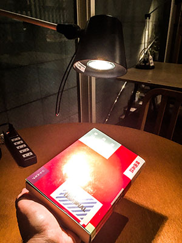

Title: WebGL 3D - Point Lighting
Description: How to implement point lighting in WebGL
TOC: Point Lighting


This article is a continuation of [WebGL 3D Directional
Lighting](webgl-3d-lighting-directional.html).  If you haven't read that I
suggest [you start there](webgl-3d-lighting-directional.html).

In the last article we covered directional lighting where the light is
coming universally from the same direction.  We set that direction before
rendering.

What if instead of setting the direction for the light we picked a point
in 3d space for the light and computed the direction from any spot on the
surface of our model in our shader?  That would give us a point light.

{{{diagram url="resources/point-lighting.html" width="500" height="400" className="noborder" }}}

If you rotate the surface above you'll see how each point on the surface
has a different *surface to light* vector.  Getting the dot product of the
surface normal and each individual surface to light vector gives us a
different value at each point on the surface.

So, let's do that.

First we need the light position

    uniform vec3 u_lightWorldPosition;

And we need a way to compute the world position of the surface.  For that
we can multiply our positions by the world matrix so ...

    uniform mat4 u_world;

    ...

    // compute the world position of the surface
    vec3 surfaceWorldPosition = (u_world * a_position).xyz;

And we can compute a vector from the surface to the light which is similar
to the direction we had before expect this time we're computing it for
every position on the surface to a point.

    v_surfaceToLight = u_lightWorldPosition - surfaceWorldPosition;

Here's all that in context

    attribute vec4 a_position;
    attribute vec3 a_normal;

    +uniform vec3 u_lightWorldPosition;

    +uniform mat4 u_world;
    uniform mat4 u_worldViewProjection;
    uniform mat4 u_worldInverseTranspose;

    varying vec3 v_normal;

    +varying vec3 v_surfaceToLight;

    void main() {
      // Multiply the position by the matrix.
      gl_Position = u_worldViewProjection * a_position;

      // orient the normals and pass to the fragment shader
      v_normal = mat3(u_worldInverseTranspose) * a_normal;

    +  // compute the world position of the surface
    +  vec3 surfaceWorldPosition = (u_world * a_position).xyz;
    +
    +  // compute the vector of the surface to the light
    +  // and pass it to the fragment shader
    +  v_surfaceToLight = u_lightWorldPosition - surfaceWorldPosition;
    }

Now in the fragment shader we need to normalize the surface to light
vector since it's a not a unit vector.  Note that we could normalize in
the vertex shader but because it's a `varying` it will be linearly
interpolated between our positions and so would not be a complete unit
vector

    precision mediump float;

    // Passed in from the vertex shader.
    varying vec3 v_normal;
    +varying vec3 v_surfaceToLight;

    -uniform vec3 u_reverseLightDirection;
    uniform vec4 u_color;

    void main() {
      // because v_normal is a varying it's interpolated
      // so it will not be a unit vector. Normalizing it
      // will make it a unit vector again
      vec3 normal = normalize(v_normal);

      vec3 surfaceToLightDirection = normalize(v_surfaceToLight);

    -  float light = dot(normal, u_reverseLightDirection);
    +  float light = dot(normal, surfaceToLightDirection);

      gl_FragColor = u_color;

      // Lets multiply just the color portion (not the alpha)
      // by the light
      gl_FragColor.rgb *= light;
    }


Then we need to lookup the locations of `u_world` and `u_lightWorldPosition`

```
-  var reverseLightDirectionLocation =
-      gl.getUniformLocation(program, "u_reverseLightDirection");
+  var lightWorldPositionLocation =
+      gl.getUniformLocation(program, "u_lightWorldPosition");
+  var worldLocation =
+      gl.getUniformLocation(program, "u_world");
```

and set them

```
  // Set the matrices
+  gl.uniformMatrix4fv(
+      worldLocation, false,
+      worldMatrix);
  gl.uniformMatrix4fv(
      worldViewProjectionLocation, false,
      worldViewProjectionMatrix);

  ...

-  // set the light direction.
-  gl.uniform3fv(reverseLightDirectionLocation, m4.normalize([0.5, 0.7, 1]));
+  // set the light position
+  gl.uniform3fv(lightWorldPositionLocation, [20, 30, 50]);
```

And here it is

{{{example url="../webgl-3d-lighting-point.html" }}}

Now that we have a point we can add something called specular
highlighting.

If you look at on object in the real world, if it's remotely shiny then if
it happens to reflect the light directly at you it's almost like a mirror



We can simulate that effect by computing if the light reflects into our
eyes.  Again the *dot-product* comes to the rescue.

What do we need to check?  Well let's think about it.  Light reflects at
the same angle it hits a surface so if the direction of the surface to the
light is the exact reflection of the surface to the eye then it's at the
perfect angle to reflect

{{{diagram url="resources/surface-reflection.html" width="500" height="400" className="noborder" }}}

If we know the direction from the surface of our model to the light (which
we do since we just did that).  And if we know the direction from the
surface to view/eye/camera, which we can compute, then we can add those 2
vectors and normalize them to get the `halfVector` which is the vector
that sits half way between them.  If the halfVector and the surface normal
match then it's the perfect angle to reflect the light into the
view/eye/camera.  And how can we tell when they match?  Take the *dot
product* just like we did before.  1 = they match, same direction, 0 =
they're perpendicular, -1 = they're opposite.

{{{diagram url="resources/specular-lighting.html" width="500" height="400" className="noborder" }}}

So first thing is we need to pass in the view/camera/eye position, compute the surface to view vector
and pass it to the fragment shader.

    attribute vec4 a_position;
    attribute vec3 a_normal;

    uniform vec3 u_lightWorldPosition;
    +uniform vec3 u_viewWorldPosition;

    uniform mat4 u_world;
    uniform mat4 u_worldViewProjection;
    uniform mat4 u_worldInverseTranspose;

    varying vec3 v_normal;

    varying vec3 v_surfaceToLight;
    +varying vec3 v_surfaceToView;

    void main() {
      // Multiply the position by the matrix.
      gl_Position = u_worldViewProjection * a_position;

      // orient the normals and pass to the fragment shader
      v_normal = mat3(u_worldInverseTranspose) * a_normal;

      // compute the world position of the surface
      vec3 surfaceWorldPosition = (u_world * a_position).xyz;

      // compute the vector of the surface to the light
      // and pass it to the fragment shader
      v_surfaceToLight = u_lightWorldPosition - surfaceWorldPosition;

    +  // compute the vector of the surface to the view/camera
    +  // and pass it to the fragment shader
    +  v_surfaceToView = u_viewWorldPosition - surfaceWorldPosition;
    }

Next in the fragment shader we need to compute the `halfVector` between
the surface to view and surface to light vectors.  Then we can take the
dot product the `halfVector` and the normal to find out if the light is
reflecting into the view.

    // Passed in from the vertex shader.
    varying vec3 v_normal;
    varying vec3 v_surfaceToLight;
    +varying vec3 v_surfaceToView;

    uniform vec4 u_color;

    void main() {
      // because v_normal is a varying it's interpolated
      // so it will not be a unit vector. Normalizing it
      // will make it a unit vector again
      vec3 normal = normalize(v_normal);

    +  vec3 surfaceToLightDirection = normalize(v_surfaceToLight);
    +  vec3 surfaceToViewDirection = normalize(v_surfaceToView);
    +  vec3 halfVector = normalize(surfaceToLightDirection + surfaceToViewDirection);

      float light = dot(normal, surfaceToLightDirection);
    +  float specular = dot(normal, halfVector);

      gl_FragColor = u_color;

      // Lets multiply just the color portion (not the alpha)
      // by the light
      gl_FragColor.rgb *= light;

    +  // Just add in the specular
    +  gl_FragColor.rgb += specular;
    }

Finally we have to look up `u_viewWorldPosition` and set it

    var lightWorldPositionLocation =
        gl.getUniformLocation(program, "u_lightWorldPosition");
    +var viewWorldPositionLocation =
    +    gl.getUniformLocation(program, "u_viewWorldPosition");

    ...

    // Compute the camera's matrix
    var camera = [100, 150, 200];
    var target = [0, 35, 0];
    var up = [0, 1, 0];
    var cameraMatrix = makeLookAt(camera, target, up);

    +// set the camera/view position
    +gl.uniform3fv(viewWorldPositionLocation, camera);


And here's that

{{{example url="../webgl-3d-lighting-point-specular.html" }}}

**DANG THAT'S BRIGHT!**

We can fix the brightness by raising the dot-product result to a power.
This will scrunch up the specular highlight from a linear falloff to an
exponential falloff.

{{{diagram url="resources/power-graph.html" width="300" height="300" className="noborder" }}}

The closer the red line is to the top of the graph the brighter our
specular addition will be.  By raising the power it scrunches the range
where it goes bright to the right.

Let's call that `shininess` and add it to our shader.

    uniform vec4 u_color;
    +uniform float u_shininess;

    ...

    -  float specular = dot(normal, halfVector);
    +  float specular = 0.0;
    +  if (light > 0.0) {
    +    specular = pow(dot(normal, halfVector), u_shininess);
    +  }

The dot product can go negative.  Taking a negative number to a power is
undefined in WebGL which would be bad.  So, if the dot product would possibly be
negative then we just leave specular at 0.0.

Of course we need to look up the location and set it

    +var shininessLocation = gl.getUniformLocation(program, "u_shininess");

    ...

    // set the shininess
    gl.uniform1f(shininessLocation, shininess);

And here's that

{{{example url="../webgl-3d-lighting-point-specular-power.html" }}}

The final thing I want to go over in this article is light colors.

Up to this point we've been using `light` to multiply the color we're
passing in for the F.  We could provide a light color as well if wanted
colored lights

    uniform vec4 u_color;
    uniform float u_shininess;
    +uniform vec3 u_lightColor;
    +uniform vec3 u_specularColor;

    ...

      // Lets multiply just the color portion (not the alpha)
      // by the light
    *  gl_FragColor.rgb *= light * u_lightColor;

      // Just add in the specular
    *  gl_FragColor.rgb += specular * u_specularColor;
    }

and of course

    +  var lightColorLocation =
    +      gl.getUniformLocation(program, "u_lightColor");
    +  var specularColorLocation =
    +      gl.getUniformLocation(program, "u_specularColor");

and

    // set the light color
    +  gl.uniform3fv(lightColorLocation, m4.normalize([1, 0.6, 0.6]));  // red light
    // set the specular color
    +  gl.uniform3fv(specularColorLocation, m4.normalize([1, 0.6, 0.6]));  // red light

{{{example url="../webgl-3d-lighting-point-color.html" }}}

Coming up next, [spot lighting](webgl-3d-lighting-spot.html).

<div class="webgl_bottombar">
<h3>Why is <code>pow(negative, power)</code> undefined?</h3>
<p>What does this mean?</p>
<div class="webgl_center"><pre class="glocal-center-content">pow(5, 2)</pre></div>
<p>Well you can look at it as</p>
<div class="webgl_center"><pre class="glocal-center-content">5 * 5 = 25</pre></div>
<p>What about</p>
<div class="webgl_center"><pre class="glocal-center-content">pow(5, 3)</pre></div>
<p>Well you can look at that as</p>
<div class="webgl_center"><pre class="glocal-center-content">5 * 5 * 5 = 125</pre></div>
<p>Ok, how about</p>
<div class="webgl_center"><pre class="glocal-center-content">pow(-5, 2)</pre></div>
<p>Well that could be</p>
<div class="webgl_center"><pre class="glocal-center-content">-5 * -5 = 25</pre></div>
<p>And</p>
<div class="webgl_center"><pre class="glocal-center-content">pow(-5, 3)</pre></div>
<p>Well you can look at as</p>
<div class="webgl_center"><pre class="glocal-center-content">-5 * -5 * -5 = -125</pre></div>
<p>As you know multiplying a negative by a negative makes a positive. Multiplying by a negative
again makes it negative.</p>
<p>Well then what does this mean?</p>
<div class="webgl_center"><pre class="glocal-center-content">pow(-5, 2.5)</pre></div>
<p>How do you decide which is the result of that positive or negative? That's
the land of <a href="https://betterexplained.com/articles/a-visual-intuitive-guide-to-imaginary-numbers/">imaginary numbers</a>.</p>
</div>

