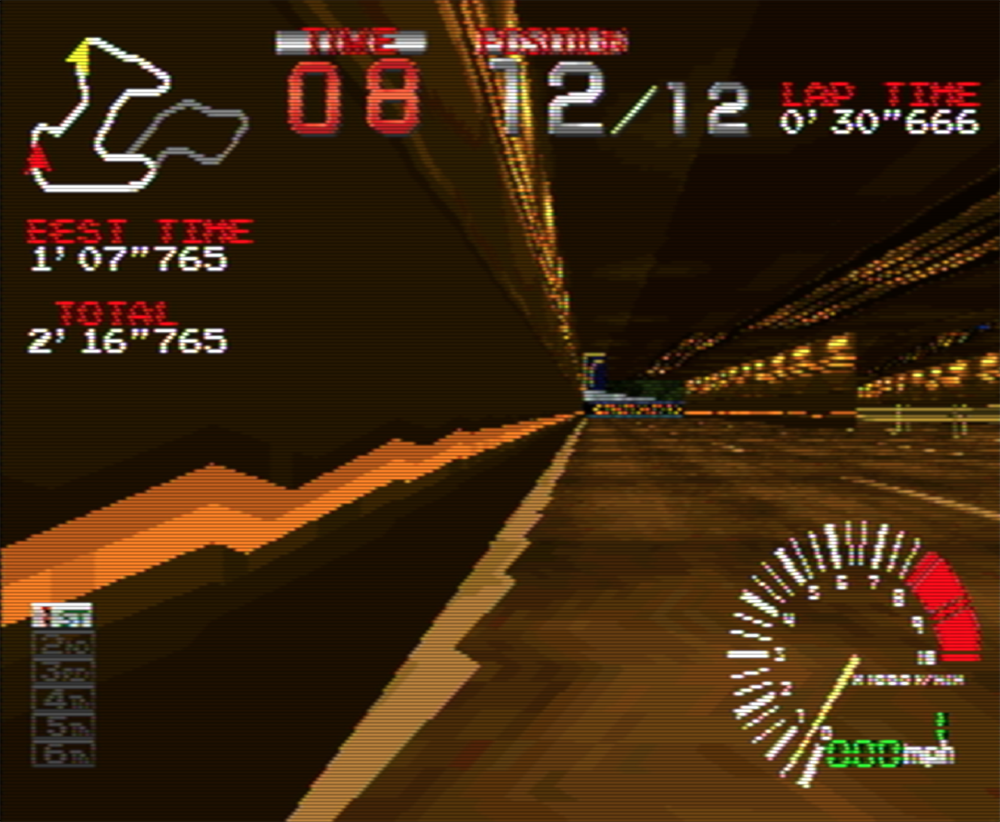
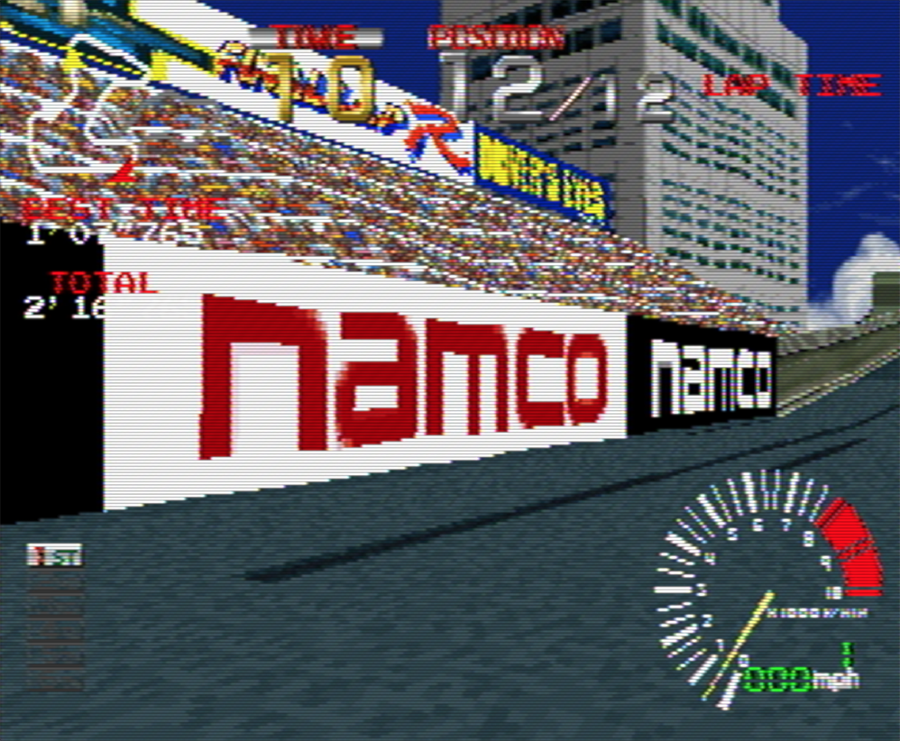

Title: WebGL 3D Perspective Correct Texture Mapping
Description: What's special about W
TOC: Perspective Correct Texture Mapping


This post is a continuation of a series of posts about WebGL.  The first
[started with fundamentals](webgl-fundamentals.html). This article
covers perspective correct texture mapping. To understand it you 
probably need to read up on [perspective projection](webgl-3d-perspective.html) and maybe [texturing](webgl-3d-textures.html)
as well. You also need to know about [varyings and what they do](webgl-how-it-works.html) but I'll cover them briefly here.

So in the "[how it works](webgl-how-it-works.html)" article
we covered how varyings work. A vertex shader can declare a
varying and set it to some value. Once the vertex shader has been called
3 times WebGL will draw a triangle. While it's drawing that triangle
for every pixel it will call our fragment shader and ask it what
color to make that pixel. Between the 3 vertices of the triangle
it will pass us our varyings interpolated between the 3 values.

{{{diagram url="resources/fragment-shader-anim.html" width="600" height="400" caption="v_color is interpolated between v0, v1 and v2" }}}

Going back to our [first article](webgl-fundamentals.html) we drew a triangle in
clip space, no math. We just passed in some clip space coordinates
to a simple vertex shader that looked like this

      // an attribute will receive data from a buffer
      attribute vec4 a_position;

      // all shaders have a main function
      void main() {

        // gl_Position is a special variable a vertex shader
        // is responsible for setting
        gl_Position = a_position;
      }

We had a simple fragment shader that draws a constant color

      // fragment shaders don't have a default precision so we need
      // to pick one. mediump is a good default
      precision mediump float;

      void main() {
        // gl_FragColor is a special variable a fragment shader
        // is responsible for setting
        gl_FragColor = vec4(1, 0, 0.5, 1); // return reddish-purple
      }

So let's make that draw 2 rectangles in clip space. We'll pass it this
data with `X`, `Y`, `Z`, and `W` for each vertex.

    var positions = [
      -.8, -.8, 0, 1,  // 1st rect 1st triangle
       .8, -.8, 0, 1,
      -.8, -.2, 0, 1,
      -.8, -.2, 0, 1,  // 1st rect 2nd triangle
       .8, -.8, 0, 1,
       .8, -.2, 0, 1,

      -.8,  .2, 0, 1,  // 2nd rect 1st triangle
       .8,  .2, 0, 1,
      -.8,  .8, 0, 1,
      -.8,  .8, 0, 1,  // 2nd rect 2nd triangle
       .8,  .2, 0, 1,
       .8,  .8, 0, 1,
    ];

Here's that

{{{example url="../webgl-clipspace-rectangles.html" }}}

Let's add a single varying float. We'll pass that directly
from the vertex shader to the fragment shader.

      attribute vec4 a_position;
    +  attribute float a_brightness;

    +  varying float v_brightness;

      void main() {
        gl_Position = a_position;

    +    // just pass the brightness on to the fragment shader
    +    v_brightness = a_brightness;
      }

In the fragment shader we'll use that varying to set the color

      precision mediump float;

    +  // passed in from the vertex shader and interpolated
    +  varying float v_brightness;  

      void main() {
    *    gl_FragColor = vec4(v_brightness, 0, 0, 1);  // reds
      }

We need to supply data for that varying so we'll make a buffer and
put in some data. One value per vertex. We'll set all the brightness
values for vertices on the left to 0 and those on the right to 1.

```
  // Create a buffer and put 12 brightness values in it
  var brightnessBuffer = gl.createBuffer();

  // Bind it to ARRAY_BUFFER (think of it as ARRAY_BUFFER = brightnessBuffer)
  gl.bindBuffer(gl.ARRAY_BUFFER, brightnessBuffer);

  var brightness = [
    0,  // 1st rect 1st triangle
    1, 
    0, 
    0,  // 1st rect 2nd triangle
    1, 
    1, 

    0,  // 2nd rect 1st triangle
    1, 
    0, 
    0,  // 2nd rect 2nd triangle
    1, 
    1, 
  ];
  
  gl.bufferData(gl.ARRAY_BUFFER, new Float32Array(brightness), gl.STATIC_DRAW);
```

We also need to look up the location of the `a_brightness` attribute 
at init time

```
  // look up where the vertex data needs to go.
  var positionAttributeLocation = gl.getAttribLocation(program, "a_position");
+  var brightnessAttributeLocation = gl.getAttribLocation(program, "a_brightness");  
```

and setup that attribute at render time

```
  // Turn on the attribute
  gl.enableVertexAttribArray(brightnessAttributeLocation);

  // Bind the position buffer.
  gl.bindBuffer(gl.ARRAY_BUFFER, brightnessBuffer);

  // Tell the attribute how to get data out of brightnessBuffer (ARRAY_BUFFER)
  var size = 1;          // 1 component per iteration
  var type = gl.FLOAT;   // the data is 32bit floats
  var normalize = false; // don't normalize the data
  var stride = 0;        // 0 = move forward size * sizeof(type) each iteration to get the next position
  var offset = 0;        // start at the beginning of the buffer
  gl.vertexAttribPointer(
      brightnessAttributeLocation, size, type, normalize, stride, offset);
```

And now when we render we get two rectangles that are black on the left
when `brightness` is 0 and red on the right when `brightness` is 1 and
for the area in between `brightness` is interpolated or (varied) as it
goes across the triangles.

{{{example url="../webgl-clipspace-rectangles-with-varying.html" }}}

So then, from the [perspective article](webgl-3d-perspective.html) we know that WebGL takes whatever value we put in `gl_Position` and it divides it by
`gl_Position.w`.

In the vertices above we supplied `1` for `W` but since we know WebGL
will divide by `W` then we should be able do something like this
and get the same result.

```
  var mult = 20;
  var positions = [
      -.8,  .8, 0, 1,  // 1st rect 1st triangle
       .8,  .8, 0, 1,
      -.8,  .2, 0, 1,
      -.8,  .2, 0, 1,  // 1st rect 2nd triangle
       .8,  .8, 0, 1,
       .8,  .2, 0, 1,

      -.8       , -.2       , 0,    1,  // 2nd rect 1st triangle
       .8 * mult, -.2 * mult, 0, mult,
      -.8       , -.8       , 0,    1,
      -.8       , -.8       , 0,    1,  // 2nd rect 2nd triangle
       .8 * mult, -.2 * mult, 0, mult,
       .8 * mult, -.8 * mult, 0, mult,
  ];
```

Above you can see that for every point on the right in the second
rectangle we are multiplying `X` and `Y` by `mult` but, we are also
setting `W` to `mult`. Since WebGL will divide by `W` we should get
the exact same result right?

Well here's that

{{{example url="../webgl-clipspace-rectangles-with-varying-non-1-w.html" }}}

Note the 2 rectangles are drawn in the same place they were before. This
proves `X * MULT / MULT(W)` is still just `X` and same for `Y`. But, the
colors are different. What's going on?

It turns out WebGL uses `W` to implement perspective correct
texture mapping or rather to do perspective correct interpolation
of varyings.

In fact to make it easier to see let's hack the fragment shader to this

    gl_FragColor = vec4(fract(v_brightness * 10.), 0, 0, 1);  // reds

multiplying `v_brightness` by 10 will make the value go from 0 to 10. `fract` will
just keep the fractional part so it will go 0 to 1, 0 to 1, 0 to 1, 10 times

{{{example url="../webgl-clipspace-rectangles-with-varying-non-1-w-repeat.html" }}}

Now it should be easy to see the perspective.

A linear interpolation from one value to another would be this
formula

     result = (1 - t) * a + t * b

Where `t` is a value from 0 to 1 representing some position between `a` and `b`. 0 at `a` and 1 at `b`.

For varyings though WebGL uses this formula

     result = (1 - t) * a / aW + t * b / bW
              -----------------------------
                 (1 - t) / aW + t / bW

Where `aW` is the `W` that was set on `gl_Position.w` when the varying was
as set to `a` and `bW` is the `W` that was set on `gl_Position.w` when the
varying was set to `b`.

Why is that important? Well here's a simple textured cube like we ended up with in the [article on textures](webgl-3d-textures.html). I've adjusted
the UV coordinates to go from 0 to 1 on each side and it's using a 4x4 pixel texture.

{{{example url="../webgl-perspective-correct-cube.html" }}}

Now let's take that example and change the vertex shader so that
we divide by `W` ourselves. We just need to add 1 line.

```
attribute vec4 a_position;
attribute vec2 a_texcoord;

uniform mat4 u_matrix;

varying vec2 v_texcoord;

void main() {
  // Multiply the position by the matrix.
  gl_Position = u_matrix * a_position;

+  // Manually divide by W.
+  gl_Position /= gl_Position.w;

  // Pass the texcoord to the fragment shader.
  v_texcoord = a_texcoord;
}
```

Dividing by `W` means `gl_Position.w` will end up being 1. 
`X`, `Y`, and `Z` will come out just like they would if we let
WebGL do the division for us. Well here are the results.

{{{example url="../webgl-non-perspective-correct-cube.html" }}}

We still get a 3D cube but the textures are getting warped. This 
is because by not passing `W` as it was before WebGL is not able to do
perspective correct texture mapping. Or more correctly, WebGL is not
able to do perspective correct interpolation of varyings.

If you recall `W` was our `Z` value from our [perspective matrix](webgl-3d-perspective.html).
With `W` just being `1` WebGL just ends up doing a linear interpolation.
In fact if you take the equation above

     result = (1 - t) * a / aW + t * b / bW
              -----------------------------
                 (1 - t) / aW + t / bW

And change all the `W`s to 1s we get

     result = (1 - t) * a / 1 + t * b / 1
              ---------------------------
                 (1 - t) / 1 + t / 1

Dividing by 1 does nothing so we can simplify to this
                 
     result = (1 - t) * a + t * b
              -------------------
                 (1 - t) + t

`(1 - t) + t` is the same as `1`. For example
if `t` was `.7` we'd get `(1 - .7) + .7` which is `.3 + .7` which is `1`. In other words we can remove the bottom so we're left with

     result = (1 - t) * a + t * b

Which the same as the linear interpolation equation above.

Hopefully it's now clear why WebGL uses a 4x4 matrix and 
4 value vectors with `X`, `Y`, `Z`, and `W`. `X` and `Y` divided by `W` get a clipspace coordinate. `Z` divided by `W` also get a clipspace coordinate in Z and `W` is still used during interopation of varyings and
provides the ability to do perspective correct texture mapping.

<div class="webgl_bottombar">
<h3>Mid 1990s Game Consoles</h3>
<p>
As a little piece of trivia the PlayStation 1 and some of the other 
game consoles from the same era didn't do perspective correct texture mapping. Looking at the results above you can now see why
they looked the way they did.
</p>
<div class="webgl_center"></div>
<p></p>
<div class="webgl_center"></div>
</div>
