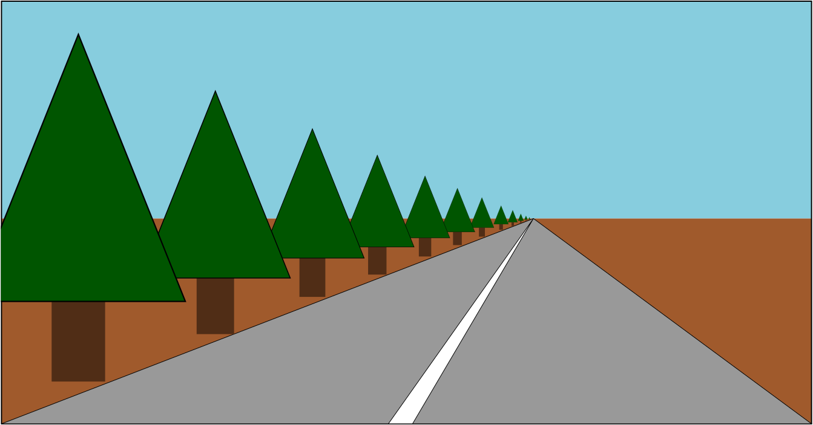
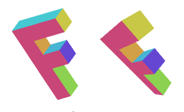
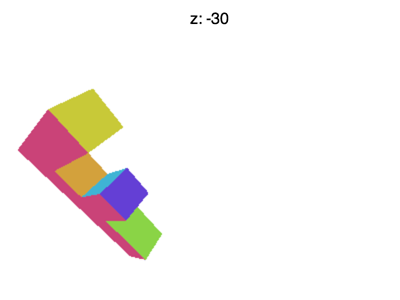
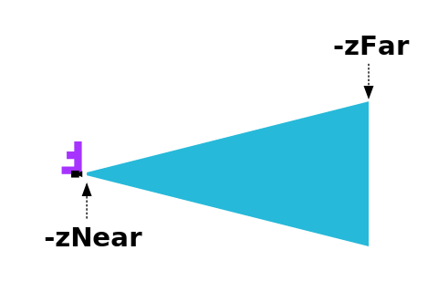
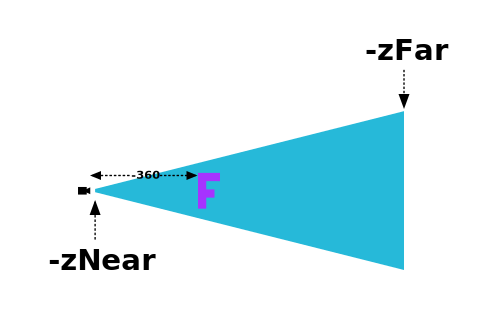

Title: WebGL 3D Perspective
Description: How to display perspective in 3D in WebGL
TOC: 3D Perspective


This post is a continuation of a series of posts about WebGL.
The first [started with fundamentals](webgl-fundamentals.html) and
the previous was about [3D Basics](webgl-3d-orthographic.html).
If you haven't read those please view them first.

In the last post we went over how to do 3D but that 3D didn't have any
perspective.  It was using what's called an "orthographic" view which has
its uses but it's generally not what people want when they say "3D".

Instead we need to add perspective. Just what is perspective?
It's basically the feature that things that are further away appear
smaller.



Looking at the example above we see that things further away
are drawn smaller. Given our current sample one easy way to
make it so that things that are further away appear smaller
would be to divide the clip space X and Y by Z.

Think of it this way: If you have a line from (10, 15) to (20,15)
it's 10 units long. In our current sample it would be drawn 10 pixels
long. But if we divide by Z then for example if Z is 1

<pre class="webgl_center">
10 / 1 = 10
20 / 1 = 20
abs(10-20) = 10
</pre>

it would be 10 pixels long, If Z is 2 it would be

<pre class="webgl_center">
10 / 2 = 5
20 / 2 = 10
abs(5 - 10) = 5
</pre>

5 pixels long.  At Z = 3 it would be

<pre class="webgl_center">
10 / 3 = 3.333
20 / 3 = 6.666
abs(3.333 - 6.666) = 3.333
</pre>

You can see that as Z increases, as it gets further away, we'll end up
drawing it smaller.  If we divide in clip space we might get better
results because Z will be a smaller number (-1 to +1).  If we add a
fudgeFactor to multiply Z before we divide we can adjust how much smaller
things get for a given distance.

Let's try it.  First let's change the vertex shader to divide by Z after
we've multiplied it by our "fudgeFactor".

```
<script id="vertex-shader-3d" type="x-shader/x-vertex">
...
+uniform float u_fudgeFactor;
...
void main() {
  // Multiply the position by the matrix.
  vec4 position = u_matrix * a_position;

+  // Adjust the z to divide by
+  float zToDivideBy = 1.0 + position.z * u_fudgeFactor;

*  // Divide x and y by z.
*  gl_Position = vec4(position.xy / zToDivideBy, position.zw);
}
</script>
```

Note, because Z in clip space goes from -1 to +1 I added 1 to get
`zToDivideBy` to go from 0 to +2 * fudgeFactor

We also need to update the code to let us set the fudgeFactor.

```
  ...
  var fudgeLocation = gl.getUniformLocation(program, "u_fudgeFactor");

  ...
  var fudgeFactor = 1;
  ...
  function drawScene() {
    ...
    // Set the fudgeFactor
    gl.uniform1f(fudgeLocation, fudgeFactor);

    // Draw the geometry.
    var primitiveType = gl.TRIANGLES;
    var offset = 0;
    var count = 16 * 6;
    gl.drawArrays(primitiveType, offset, count);
```

And here's the result.

{{{example url="../webgl-3d-perspective.html" }}}

If it's not clear drag the "fudgeFactor" slider from 1.0 to 0.0 to see
what things used to look like before we added our divide by Z code.


<div class="webgl_center">orthographic vs perspective</div>

It turns out WebGL takes the x,y,z,w value we assign to `gl_Position` in
our vertex shader and divides it by w automatically.

We can prove this very easily by changing the shader and instead of doing
the division ourselves, put `zToDivideBy` in `gl_Position.w`.

```
<script id="vertex-shader-2d" type="x-shader/x-vertex">
...
uniform float u_fudgeFactor;
...
void main() {
  // Multiply the position by the matrix.
  vec4 position = u_matrix * a_position;

  // Adjust the z to divide by
  float zToDivideBy = 1.0 + position.z * u_fudgeFactor;

  // Divide x, y and z by zToDivideBy
*  gl_Position = vec4(position.xyz, zToDivideBy);

  // Pass the color to the fragment shader.
  v_color = a_color;
}
</script>
```

and see how it's exactly the same.

{{{example url="../webgl-3d-perspective-w.html" }}}

Why is the fact that WebGL automatically divides by W useful?  Because
now, using more matrix magic, we can just use yet another matrix to copy z
to w.

A Matrix like this

<div class="webgl_math_center"><pre class="webgl_math">
1, 0, 0, 0,
0, 1, 0, 0,
0, 0, 1, 1,
0, 0, 0, 0,
</pre></div>

will copy z to w. You can look at each of those columns as

<div class="webgl_math_center"><pre class="webgl_math">
x_out = x_in * 1 +
        y_in * 0 +
        z_in * 0 +
        w_in * 0 ;

y_out = x_in * 0 +
        y_in * 1 +
        z_in * 0 +
        w_in * 0 ;

z_out = x_in * 0 +
        y_in * 0 +
        z_in * 1 +
        w_in * 0 ;

w_out = x_in * 0 +
        y_in * 0 +
        z_in * 1 +
        w_in * 0 ;
</pre></div>

which when simplified is

<div class="webgl_math_center"><pre class="webgl_math">
x_out = x_in;
y_out = y_in;
z_out = z_in;
w_out = z_in;
</pre></div>

We can add the plus 1 we had before with this matrix since we know `w_in` is always 1.0.

<div class="webgl_math_center"><pre class="webgl_math">
1, 0, 0, 0,
0, 1, 0, 0,
0, 0, 1, 1,
0, 0, 0, 1,
</pre></div>

that will change the W calculation to

<div class="webgl_math_center"><pre class="webgl_math">
w_out = x_in * 0 +
        y_in * 0 +
        z_in * 1 +
        w_in * 1 ;
</pre></div>

and since we know `w_in` = 1.0 then that's really

<div class="webgl_math_center"><pre class="webgl_math">
w_out = z_in + 1;
</pre></div>

Finally we can work our fudgeFactor back in if the matrix is this

<div class="webgl_math_center"><pre class="webgl_math">
1, 0, 0, 0,
0, 1, 0, 0,
0, 0, 1, fudgeFactor,
0, 0, 0, 1,
</pre></div>

which means

<div class="webgl_math_center"><pre class="webgl_math">
w_out = x_in * 0 +
        y_in * 0 +
        z_in * fudgeFactor +
        w_in * 1 ;
</pre></div>

and simplified that's

<div class="webgl_math_center"><pre class="webgl_math">
w_out = z_in * fudgeFactor + 1;
</pre></div>

So, let's modify the program again to just use matrices.

First let's put the vertex shader back. It's simple again

```
<script id="vertex-shader-2d" type="x-shader/x-vertex">
uniform mat4 u_matrix;

void main() {
  // Multiply the position by the matrix.
  gl_Position = u_matrix * a_position;
  ...
}
</script>
```

Next let's make a function to make our Z &rarr; W matrix.

```
function makeZToWMatrix(fudgeFactor) {
  return [
    1, 0, 0, 0,
    0, 1, 0, 0,
    0, 0, 1, fudgeFactor,
    0, 0, 0, 1,
  ];
}
```

and we'll change the code to use it.

```
    ...
    // Compute the matrices
*    var matrix = makeZToWMatrix(fudgeFactor);
*    matrix = m4.multiply(matrix, m4.projection(gl.canvas.clientWidth, gl.canvas.clientHeight, 400));
    matrix = m4.translate(matrix, translation[0], translation[1], translation[2]);
    matrix = m4.xRotate(matrix, rotation[0]);
    matrix = m4.yRotate(matrix, rotation[1]);
    matrix = m4.zRotate(matrix, rotation[2]);
    matrix = m4.scale(matrix, scale[0], scale[1], scale[2]);

    ...
```

and note, again, it's exactly the same.

{{{example url="../webgl-3d-perspective-w-matrix.html" }}}

All that was basically just to show you that dividing by Z gives us
perspective and that WebGL conveniently does this divide by Z for us.

But there are still some problems.  For example if you set Z to around
-100 you'll see something like the animation below



What's going on?  Why is the F disappearing early?  Just like WebGL clips
X and Y or +1 to -1 it also clips Z.  What we're seeing here is where Z <
-1. If we have a point [0,0,0.75,1.75] (W is 1.75, a result of Z+1 with a fudgeFactor
of 1), then when Z is divided by W (0.75/1.75), the final Z becomes smaller (o.43),
so for positive values of Z (in clip space) those points can move further
away from the camera without getting clipped. Now let's look at the point
[0,0,-0.75,0.25] (W is 0.25, a result of Z+1 with fudgeFactor of 1). If we divide
Z by W (-0.75/0.25) we get a number outside of clipspace (-3). If we had not
applied perspective, -0.75 wouldn't have been clipped, but after perspective it
changed to -3. This explains why the F gets clipped so early when it moves towards
the screen.

I could go into detail about the math to fix it but [you can derive
it](https://stackoverflow.com/a/28301213/128511) the same way we did 2D
projection.  We need to take Z, add some amount and scale some amount and
we can make any range we want get remapped to the -1 to +1.

The cool thing is all of these steps can be done in 1 matrix.  Even
better, rather than a `fudgeFactor` we'll decide on a `fieldOfView` and
compute the right values to make that happen.

Here's a function to build the matrix.

```
var m4 = {
  perspective: function(fieldOfViewInRadians, aspect, near, far) {
    var f = Math.tan(Math.PI * 0.5 - 0.5 * fieldOfViewInRadians);
    var rangeInv = 1.0 / (near - far);

    return [
      f / aspect, 0, 0, 0,
      0, f, 0, 0,
      0, 0, (near + far) * rangeInv, -1,
      0, 0, near * far * rangeInv * 2, 0
    ];
  },

  ...
```

This matrix will do all our conversions for us.  It will adjust the units
so they are in clip space, it will do the math so that we can choose a
field of view by angle and it will let us choose our Z-clipping space.  It
assumes there's an *eye* or *camera* at the origin (0, 0, 0) and given a
`zNear` and a `fieldOfView` it computes what it would take so that stuff
at `zNear` ends up at `Z = -1` and stuff at `zNear` that is half of
`fieldOfView` above or below the center ends up with `Y = -1` and `Y = 1`
respectively.  It computes what to use for X by just multiplying by the
`aspect` passed in.  We'd normally set this to the `width / height` of the
display area.  Finally, it figures out how much to scale things in Z so
that stuff at zFar ends up at `Z = 1`.

Here's a diagram of the matrix in action.

{{{example url="../frustum-diagram.html" width="400" height="600" }}}

That shape that looks like a 4 sided cone the cubes are spinning in is
called a "frustum".  The matrix takes the space inside the frustum and
converts that to clip space.  `zNear` defines where things will get
clipped in the front and `zFar` defines where things get clipped in the
back.  Set `zNear` to 23 and you'll see the front of the spinning cubes
get clipped.  Set `zFar` to 24 and you'll see the back of the cubes get
clipped.

There's just one problem left.  This matrix assumes there's a viewer at 0,0,0
and it assumes it's looking in the negative Z direction and that positive Y is
up.  Our matrices up to this point have done things in a different way.

To make it appear we need to move it inside the frustum.
We can do that by moving our F. We were drawing at (45, 150, 0). Let's move it to (-150, 0, -360)
and let's set the rotation to something that makes it appear right side up.

Now, to use it we just need to replace our old call to `m4.projection`
with a call to `m4.perspective`

```
var aspect = gl.canvas.clientWidth / gl.canvas.clientHeight;
var zNear = 1;
var zFar = 2000;
var matrix = m4.perspective(fieldOfViewRadians, aspect, zNear, zFar);
matrix = m4.translate(matrix, translation[0], translation[1], translation[2]);
matrix = m4.xRotate(matrix, rotation[0]);
matrix = m4.yRotate(matrix, rotation[1]);
matrix = m4.zRotate(matrix, rotation[2]);
matrix = m4.scale(matrix, scale[0], scale[1], scale[2]);
```

And here it is.

{{{example url="../webgl-3d-perspective-matrix.html" }}}

We're back to just a matrix multiply and we're getting both a field of
view and we're able to choose our Z space.  We're not done but this
article is getting too long.  Next up, [cameras](webgl-3d-camera.html).

<div class="webgl_bottombar">
<h3>Why did we move the F so far in Z (-360)?</h3>
<p>

In the other samples we had the F at (45, 150, 0) but in the last sample
it's been moved to (-150, 0, -360).  Why did it need to be moved so far
away?

</p>
<p>

The reason is up until this last sample our <code>m4.projection</code> function
has made a projection from pixels to clip space.  That means the area we
were displaying represented 400x300 pixels.  Using 'pixels' really doesn't
make sense in 3D. 

</p>
<p>

In other words if we tried to draw with the F at 0,0,0 and not rotated we'd get this

</p>

<div class="webgl_center"></div>

<p>
The F has its top left front corner at the origin. The projection
looks toward negative Z but our F is built in positive Z. The projection has
positive Y up but our F is built with positive Z down.
</p>

<p>
Our new projection only sees what's in the blue frustum. With -zNear = 1 and with a field of view of 60 degrees
then at Z = -1 the frustum is only 1.154 units tall and 1.154 * aspect units wide. At Z = -2000 (-zFar) its 2309 units tall.
Since our F is 150 units big and the view can only see 1.154
units when something is at <code>-zNear</code> we need to move it pretty far away from the origin to
see all of it.
</p>


<p>
Moving it -360 units in Z moves in inside the frustum. We also rotated it to be right side up.
</p>

<div class="webgl_center"><div>not to scale</div></div>

</div>


