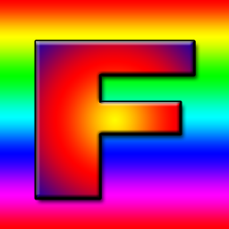
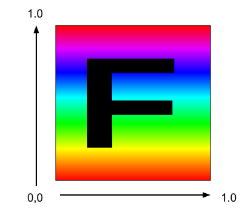
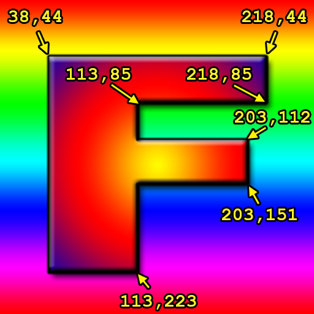
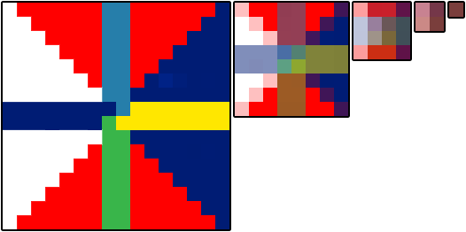
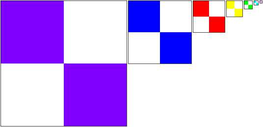

Title: WebGL Textures
Description: How textures work in WebGL
TOC: Textures

This post is a continuation of a series of posts about WebGL.
The first [started with fundamentals](webgl-fundamentals.html)
and the previous was about [animation](webgl-animation.html).

How do we apply textures in WebGL?  You could probably derive how by
reading [the articles on image processing](webgl-image-processing.html)
but it will probably be easier to understand if we go over it in more
detail.

The first thing we need to do is adjust our shaders to use textures.  Here
are the changes to the vertex shader.  We need to pass in texture
coordinates.  In this case we just pass them straight through to the
fragment shader.

    attribute vec4 a_position;
    *attribute vec2 a_texcoord;

    uniform mat4 u_matrix;

    *varying vec2 v_texcoord;

    void main() {
      // Multiply the position by the matrix.
      gl_Position = u_matrix * a_position;

    *  // Pass the texcoord to the fragment shader.
    *  v_texcoord = a_texcoord;
    }

In the fragment shader we declare a uniform sampler2D which lets us
reference a texture.  We use the texture coordinates passed from the
vertex shader and we call `texture2D` to look up a color from that
texture.

    precision mediump float;

    // Passed in from the vertex shader.
    *varying vec2 v_texcoord;

    *// The texture.
    *uniform sampler2D u_texture;

    void main() {
    *   gl_FragColor = texture2D(u_texture, v_texcoord);
    }

We need to setup the texture coordinates

    // look up where the vertex data needs to go.
    var positionLocation = gl.getAttribLocation(program, "a_position");
    *var texcoordLocation = gl.getAttribLocation(program, "a_texcoords");

    ...

    *// Create a buffer for texcoords.
    var buffer = gl.createBuffer();
    gl.bindBuffer(gl.ARRAY_BUFFER, buffer);
    *gl.enableVertexAttribArray(texcoordLocation);
    *
    *// We'll supply texcoords as floats.
    *gl.vertexAttribPointer(texcoordLocation, 2, gl.FLOAT, false, 0, 0);
    *
    *// Set Texcoords.
    *setTexcoords(gl);

And you can see the coordinates we're using which are mapping the entire
texture to each quad on our 'F'.

    *// Fill the buffer with texture coordinates for the F.
    *function setTexcoords(gl) {
    *  gl.bufferData(
    *      gl.ARRAY_BUFFER,
    *      new Float32Array([
    *        // left column front
    *        0, 0,
    *        0, 1,
    *        1, 0,
    *        0, 1,
    *        1, 1,
    *        1, 0,
    *
    *        // top rung front
    *        0, 0,
    *        0, 1,
    *        1, 0,
    *        0, 1,
    *        1, 1,
    *        1, 0,
    * ...
    *       ]),
    *       gl.STATIC_DRAW);

We also need a texture.  We could make one from scratch but in this case
let's load an image since that's probably the most common way.

Here's the image we're going to use

What an exciting image!  Actually an image with an 'F' on it has a clear
direction so it's easy to tell if it's turned or flipped etc when we use
it as a texture.

The thing about loading an image is it happens asynchronously.  We request
the image to be loaded but it takes a while for the browser to download
it.  There are generally 2 solutions to this.  We could make the code wait
until the texture has downloaded and only then start drawing.  The other
solution is to make up some texture to use until the image is downloaded.
That way we can start rendering immediately.  Then, once the image has
been downloaded we copy the image to the texture.  We'll use that method
below.

    *// Create a texture.
    *var texture = gl.createTexture();
    *gl.bindTexture(gl.TEXTURE_2D, texture);
    *
    *// Fill the texture with a 1x1 blue pixel.
    *gl.texImage2D(gl.TEXTURE_2D, 0, gl.RGBA, 1, 1, 0, gl.RGBA, gl.UNSIGNED_BYTE,
    *              new Uint8Array([0, 0, 255, 255]));
    *
    *// Asynchronously load an image
    *var image = new Image();
    *image.src = "resources/f-texture.png";
    *image.addEventListener('load', function() {
    *  // Now that the image has loaded make copy it to the texture.
    *  gl.bindTexture(gl.TEXTURE_2D, texture);
    *  gl.texImage2D(gl.TEXTURE_2D, 0, gl.RGBA, gl.RGBA,gl.UNSIGNED_BYTE, image);
    *  gl.generateMipmap(gl.TEXTURE_2D);
    *});

And here it is

{{{example url="../webgl-3d-textures.html" }}}

What if we wanted to just use a part of the texture across the front of the 'F'? Textures are referenced
with "texture coordinates" and texture coordinates go from 0.0 to 1.0 from left to
right across the texture and 0.0 to 1.0 from the first pixel on the first line to the last pixel on the last line.
Notice I didn't stay top or bottom. Top and bottom make no sense in texture space
because until you draw something and orient it there is no top and bottom. What matters is you
supply texture data to WebGL. The start of that data starts at texture coordinate 0,0
and the end of that data is at 1,1

I loaded the texture into photoshop and looked up the various coordinates in pixels.

To convert from pixel coordinates to texture coordinates we can just use

    texcoordX = pixelCoordX / (width  - 1)
    texcoordY = pixelCoordY / (height - 1)

Here are the texture coordinates for the front.

    // left column front
     38 / 255,  44 / 255,
     38 / 255, 223 / 255,
    113 / 255,  44 / 255,
     38 / 255, 223 / 255,
    113 / 255, 223 / 255,
    113 / 255,  44 / 255,

    // top rung front
    113 / 255, 44 / 255,
    113 / 255, 85 / 255,
    218 / 255, 44 / 255,
    113 / 255, 85 / 255,
    218 / 255, 85 / 255,
    218 / 255, 44 / 255,

    // middle rung front
    113 / 255, 112 / 255,
    113 / 255, 151 / 255,
    203 / 255, 112 / 255,
    113 / 255, 151 / 255,
    203 / 255, 151 / 255,
    203 / 255, 112 / 255,

I also used similar texture coordinates for the back. And here it is.

{{{example url="../webgl-3d-textures-texture-coords-mapped.html" }}}

Not a very exciting display but hopefully it demonstrates how to use
texture coordinates.  If you're making geometry in code (cubes, spheres,
etc) it's usually pretty easy to compute whatever texture coordinates you
want.  On the other hand if you're getting 3d models from 3d modeling
software like Blender, Maya, 3D Studio Max, then your artists (or you)
will adjust texture coordinates in those packages.

So what happens if we use texture coordinates outside the 0.0 to 1.0
range.  By default WebGL repeats the texture.  0.0 to 1.0 is one 'copy' of
the texture.  1.0 to 2.0 is another copy.  Even -4.0 to -3.0 is yet
another copy.  Let's display a plane using these texture coordinates.

     -3, -1,
      2, -1,
     -3,  4,
     -3,  4,
      2, -1,
      2,  4,

And here it is

{{{example url="../webgl-3d-textures-repeat-clamp.html" }}}

You can tell WebGL to not repeat the texture in a certain direction by using `CLAMP_TO_EDGE`. For example

    gl.texParameteri(gl.TEXTURE_2D, gl.TEXTURE_WRAP_S, gl.CLAMP_TO_EDGE);
    gl.texParameteri(gl.TEXTURE_2D, gl.TEXTURE_WRAP_T, gl.CLAMP_TO_EDGE);

Click the buttons in the sample above to see the difference.

You might have noticed a call to `gl.generateMipmap` back when we loaded
the texture.  What is that for?

Imagine we had this 16x16 pixel texture.

Now imagine we tried to draw that texture on a polygon 2x2 pixels big on
the screen.  What colors should we make those 4 pixels?  There are 256
pixels to choose from.  In Photoshop if you scaled a 16x16 pixel image to
2x2 it would average the 8x8 pixels in each corner to make the 4 pixels in
a 2x2 image.  Unfortunately reading 64 pixels and averaging them all
together would be way too slow for a GPU.  In fact imagine if you had a
2048x2048 pixel texture and you tried to draw it 2x2 pixels.  To do what
Photoshop does for each of the 4 pixels in the 2x2 result it would have to
average 1024x1024 pixel or 1 million pixels times 4.  That's way way too
much to do and still be fast.

So what the GPU does is it uses a mipmap.  A mipmap is a collection of
progressively smaller images, each one 1/4th the size of the previous one.
The mipmap for the 16x16 texture above would look something like this.

Generally each smaller level is just a bilinear interpolation of the
previous level and that's what `gl.generateMipmap` does.  It looks at the
biggest level and generates all the smaller levels for you.  Of course you
can supply the smaller levels yourself if you want.

Now if you try to draw that 16x16 pixel texture only 2x2 pixels on the
screen WebGL can select the mip that's 2x2 which has already been averaged
from the previous mips.

You can choose what WebGL does by setting the texture filtering for each
texture.  There are 6 modes

*   `NEAREST` = choose 1 pixel from the biggest mip
*   `LINEAR` = choose 4 pixels from the biggest mip and blend them
*   `NEAREST_MIPMAP_NEAREST` = choose the best mip, then pick one pixel from that mip
*   `LINEAR_MIPMAP_NEAREST` = choose the best mip, then blend 4 pixels from that mip
*   `NEAREST_MIPMAP_LINEAR` = choose the best 2 mips, choose 1 pixel from each, blend them
*   `LINEAR_MIPMAP_LINEAR` = choose the best 2 mips. choose 4 pixels from each, blend them

You can see the importance of mips in these 2 examples.  The first one
shows that if you use `NEAREST` or `LINEAR` and only pick from the largest
image then you'll get a lot of flickering because as things move, for each
pixel it draws it has to pick a single pixel from the largest image.  That
changes depending on the size and position and so sometimes it will pick
one pixel, other times a different one and so it flickers.

{{{example url="../webgl-3d-textures-mips.html" }}}

Notice how much the ones on the left and middle flicker where as the ones on the right flicker less.
The ones on the right also have blended colors since they are using the mips. The smaller you draw the texture the further apart WebGL is
going to pick pixels. That's why for example the bottom middle one, even though it's using `LINEAR` and blending
4 pixels it flickers because those 4 pixels are from different corners of the 16x16 image depending on which
4 are picked you'll get a different color. The one on the bottom right though stays a consistent color
because it's using the 2nd to the smallest mip.

The second example shows polygons that go deep into the screen.

{{{example url="../webgl-3d-textures-mips-tri-linear.html" }}}

The 6 beams going into the screen are using the 6 filtering modes listed
above.  The top left beam is using `NEAREST` and you can see it's clearly
very blocky.  The top middle is using `LINEAR` and it's not much better.
The top right is using `NEAREST_MIPMAP_NEAREST`.  Click on the image to
switch to a texture where every mip is a different color and you'll easily
see where it chooses to use a specific mip.  The bottom left is using
`LINEAR_MIPMAP_NEAREST` meaning it picks the best mip and then blends 4
pixels within that mip.  You can still see a clear area where it switches
from one mip to the next mip.  The bottom middle is using
`NEAREST_MIPMAP_LINEAR` meaning picking the best 2 mips, picking one pixel
from each and blending them.  If you look close you can see how it's still
blocky, especially in the horizontal direction.  The bottom right is using
`LINEAR_MIPMAP_LINEAR` which is picking the best 2 mips, picking 4 pixels
from each, and blends all 8 pixels.

different colored mips

You might be thinking why would you ever pick anything other than
`LINEAR_MIPMAP_LINEAR` which is arguably the best one.  There are many
reasons.  One is that `LINEAR_MIPMAP_LINEAR` is the slowest.  Reading 8
pixels is slower than reading 1 pixel.  On modern GPU hardware it's
probably not an issue if you are only using 1 texture at a time but modern
games might use 2 to 4 textures at once.  4 textures \* 8 pixels per
texture = needing to read 32 pixels for every pixel drawn.  That's going
to be slow.  Another reason is if you're trying to achieve a certain
effect.  For example if you want something to have that pixelated *retro*
look maybe you want to use `NEAREST`.  Mips also take memory.  In fact
they take 33% more memory.  That can be a lot of memory especially for a
very large texture like you might use on a title screen of a game.  If you
are never going to draw something smaller than the largest mip why waste
memory for those mips.  Instead just use `NEAREST` or `LINEAR` as they
only ever use the first mip.

To set filtering you call `gl.texParameter` like this

    gl.texParameteri(gl.TEXTURE_2D, gl.TEXTURE_MIN_FILTER, gl.LINEAR_MIPMAP_LINEAR);
    gl.texParameteri(gl.TEXTURE_2D, gl.TEXTURE_MAG_FILTER, gl.LINEAR);

`TEXTURE_MIN_FILTER` is the setting used when the size you are drawing is smaller than the largest mip.
`TEXTURE_MAG_FILTER` is the setting used when the size you are drawing is larger than the largest mip. For
`TEXTURE_MAG_FILTER` only `NEAREST` and `LINEAR` are valid settings.

Let's say we wanted to apply this texture.

Here it is.

{{{example url="../webgl-3d-textures-bad-npot.html" }}}

Why doesn't the keyboard texture show up? That's because WebGL has a kind of severe restriction on textures that
are not a power of 2 in both dimensions. Powers of 2 are 1, 2, 4, 8, 16, 32, 64, 128, 256, 512, 1024, 2048, etc.
The 'F' texture was 256x256. 256 is a power of 2. The keyboard texture is 320x240. Neither of those are a power
of 2 so trying to display the texture fails. In the shader when `texture2D` is called and when the texture
referenced is not setup correctly WebGL will use color (0, 0, 0, 1) which is black. If you open up the JavaScript console
or Web Console, depending on the browser you might see errors pointing out the problem like this

    WebGL: INVALID_OPERATION: generateMipmap: level 0 not power of 2
       or not all the same size
    WebGL: drawArrays: texture bound to texture unit 0 is not renderable.
       It maybe non-power-of-2 and have incompatible texture filtering or
       is not 'texture complete'.

To fix it we need to set the wrap mode to `CLAMP_TO_EDGE` and turn off mip mapping by setting filtering
to `LINEAR` or `NEAREST`.

Let's update our image loading code to handle this. First we need a function that will tell us if a value is
a power of 2.

    function isPowerOf2(value) {
      return (value & (value - 1)) == 0;
    }

I'm not going to go into the binary math on why this works. Since it does work though, we can use it as follows.

    // Asynchronously load an image
    var image = new Image();
    image.src = "resources/keyboard.jpg";
    image.addEventListener('load', function() {
      // Now that the image has loaded make copy it to the texture.
      gl.bindTexture(gl.TEXTURE_2D, texture);
      gl.texImage2D(gl.TEXTURE_2D, 0, gl.RGBA, gl.RGBA,gl.UNSIGNED_BYTE, image);

    *  // Check if the image is a power of 2 in both dimensions.
    *  if (isPowerOf2(image.width) && isPowerOf2(image.height)) {
    *     // Yes, it's a power of 2. Generate mips.
         gl.generateMipmap(gl.TEXTURE_2D);
    *  } else {
    *     // No, it's not a power of 2. Turn off mips and set wrapping to clamp to edge
    *     gl.texParameteri(gl.TEXTURE_2D, gl.TEXTURE_WRAP_S, gl.CLAMP_TO_EDGE);
    *     gl.texParameteri(gl.TEXTURE_2D, gl.TEXTURE_WRAP_T, gl.CLAMP_TO_EDGE);
    *     gl.texParameteri(gl.TEXTURE_2D, gl.TEXTURE_MIN_FILTER, gl.LINEAR);
    *  }
    }

And here's that

{{{example url="../webgl-3d-textures-good-npot.html" }}}

It's not just non power of 2 textures that won't render. WebGL requires textures to be "texture complete".
"texture complete" means that either

1. You've set the filtering so it only uses the first mip level which means
   setting the `TEXTURE_MIN_FILTER` to either `LINEAR` or `NEAREST`.

2. If you are using mips then they need to be the correct sizes and you have to provide ALL OF THEM
   down to the 1x1 size.

   The easiest way to do that is to call `gl.generateMipmap`. Otherwise if you provide your own mips you need to provide
   all of them.

3. If the textures are not a power of 2 in both dimensions then like it mentions above
   you must set `TEXTURE_MIN_FILTER` to either `LINEAR` or `NEAREST` **and** you must
   set `TEXTURE_WRAP_S` and `TEXTURE_WRAP_T` to `CLAMP_TO_EDGE`.

If any of those are not true then when you fetch the value of the texture in your shader you'll get 0,0,0,1.

A common question is "How do I apply a different image to each face of a cube?". For example let's say we
had these 6 images.

<table class="webgl_table_center">
<tr><td></td><td></td></tr>
<tr><td></td><td></td></tr>
<tr><td></td><td></td></tr>
</table>

3 answers come to mind

1) make a complicated shader that references 6 textures and pass in some extra per vertex info into
the vertex shader that gets passed to the fragment shader to decide which texture to use. DON'T DO THIS!
A little thought would make it clear that you'd end up having to write tons of different shaders if you
wanted to do the same thing for different shapes with more sides etc.

2) draw 6 planes instead of a cube. This is a common solution. It's not bad but it also only really works
for small shapes like a cube. If you had a sphere with 1000 quads and you wanted to put a different texture
on each quad you'd have to draw 1000 planes and that would be slow.

3) The, dare I say, *best solution* is to put all of the images in 1 texture and use texture coordinates
to map a different part of the texture to each face of the cube. This is the technique that pretty much
all high performance apps (read *games*) use. So for example we'd put all the images in one texture possibly
like this

And then use a different set of texture coordinates for each face of the cube.

        // select the top left image
        0   , 0  ,
        0   , 0.5,
        0.25, 0  ,
        0   , 0.5,
        0.25, 0.5,
        0.25, 0  ,
        // select the top middle image
        0.25, 0  ,
        0.5 , 0  ,
        0.25, 0.5,
        0.25, 0.5,
        0.5 , 0  ,
        0.5 , 0.5,
        // select to top right image
        0.5 , 0  ,
        0.5 , 0.5,
        0.75, 0  ,
        0.5 , 0.5,
        0.75, 0.5,
        0.75, 0  ,
        // select the bottom left image
        0   , 0.5,
        0.25, 0.5,
        0   , 1  ,
        0   , 1  ,
        0.25, 0.5,
        0.25, 1  ,
        // select the bottom middle image
        0.25, 0.5,
        0.25, 1  ,
        0.5 , 0.5,
        0.25, 1  ,
        0.5 , 1  ,
        0.5 , 0.5,
        // select the bottom right image
        0.5 , 0.5,
        0.75, 0.5,
        0.5 , 1  ,
        0.5 , 1  ,
        0.75, 0.5,
        0.75, 1  ,

And we get

{{{example url="../webgl-3d-textures-texture-atlas.html" }}}

This style of applying multiple images using 1 texture is often called a
*texture atlas*.  It's best because there's just 1 texture to load, the
shader stays simple as it only has to reference 1 texture, and it only
requires 1 draw call to draw the shape instead of 1 draw call per texture
as it might if we split it into planes.

A few other very important things you might want to know about textures.
One is [how texture unit state works](webgl-texture-units.html).
One is [how to use 2 or more textures at once](webgl-2-textures.html). Another
is [how to use images from other domains](webgl-cors-permission.html). And 
one more is [perspective correct texture mapping](webgl-3d-perspective-correct-texturemapping.html) which in some ways
is trivia but it's good to know.

Next up [supplying data to a texture from JavaScript](webgl-data-textures.html).
Or, you could also check out [simplifying WebGL with less code more fun](webgl-less-code-more-fun.html).

<h3>UVs vs. Texture Coordinates</h3>

Texture coordinates are often shortened to texture coords, texcoords or UVs
(pronounced Ew-Vees). I have no idea where the term UVs came from except that
vertex positions often use <code>x, y, z, w</code> so for texture coordinates they decided to use
<code>s, t, u, v</code> to try to make it clear which of the 2 types you're referring to.
Given that though you'd think they'd be called Es-Tees and in fact if you look
at the texture wrap settings they are called <code>TEXTURE_WRAP_S</code> and
<code>TEXTURE_WRAP_T</code> but for some reason as long as I've been working
in graphics people have called them Ew-Vees.

So now you know if someone says UVs they're talking about texture coordinates.

