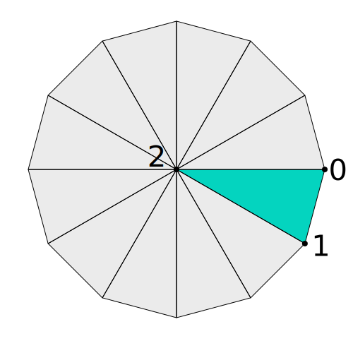
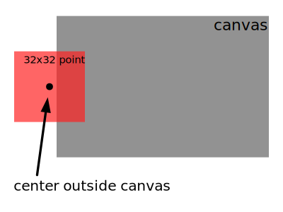

Title: WebGL Drawing Without Data
Description: Creative Coding - Drawing Without Data
TOC: Drawing Without Data

This article assumes you've read many of the other articles
starting with [the fundamentals](webgl-fundamentals.html).
If you have not read them please start there first.

In [the article on the smallest WebGL programs](webgl-smallest-programs.html)
we covered some examples of drawing with very little code.
In this article will go over drawing with no data.

Traditionally, WebGL apps put geometry data in buffers.
They then use attributes to pull vertex data from those buffers
into shaders and convert them to clip space.

The word **traditionally** is important. It's only a **tradition**
to do it this way. It is in no way a requirement. WebGL doesn't
care how we do it, it only cares that our vertex shaders
assign clip space coordinates to `gl_Position`.

So, let's provide only a count as an attribute instead of positions

```js
const numVerts = 20;
const vertexIds = new Float32Array(numVerts);
vertexIds.forEach((v, i) => {
  vertexIds[i] = i;
});

const idBuffer = gl.createBuffer();
gl.bindBuffer(gl.ARRAY_BUFFER, idBuffer);
gl.bufferData(gl.ARRAY_BUFFER, vertexIds, gl.STATIC_DRAW);
```

Now let's make a vertex shader to draw a circle of points based on that count.

```glsl
attribute float vertexId;
uniform float numVerts;

#define PI radians(180.0)

void main() {
  float u = vertexId / numVerts;      // goes from 0 to 1
  float angle = u * PI * 2.0;         // goes from 0 to 2PI
  float radius = 0.8;

  vec2 pos = vec2(cos(angle), sin(angle)) * radius;
  
  gl_Position = vec4(pos, 0, 1);
  gl_PointSize = 5.0;
}
```

The code above should be pretty straight forward.
`vertexId` is going to count from 0 to `numVerts`.
Based on that we generate positions for a circle.

If we stopped there the circle would be an ellipse
because clip space is normalized (goes from -1 to 1)
across and down the canvas. If we pass in the resolution
we can take into account that -1 to 1 across might not
represent the same space as -1 to 1 down the canvas.

```glsl
attribute float vertexId;
uniform float numVerts;
+uniform vec2 resolution;

#define PI radians(180.0)

void main() {
  float u = vertexId / numVerts;      // goes from 0 to 1
  float angle = u * PI * 2.0;         // goes from 0 to 2PI
  float radius = 0.8;

  vec2 pos = vec2(cos(angle), sin(angle)) * radius;
  
+  float aspect = resolution.y / resolution.x;
+  vec2 scale = vec2(aspect, 1);
  
+  gl_Position = vec4(pos * scale, 0, 1);
  gl_PointSize = 5.0;
}
```

And our fragment shader can just draw a solid color

```glsl
precision mediump float;

void main() {
  gl_FragColor = vec4(1, 0, 0, 1);
}
```

In our JavaScript at init time we'll compile the shader and look up the attributes and uniforms,

```js
// setup GLSL program
const program = webglUtils.createProgramFromSources(gl, [vs, fs]);
const vertexIdLoc = gl.getAttribLocation(program, 'vertexId');
const numVertsLoc = gl.getUniformLocation(program, 'numVerts');
const resolutionLoc = gl.getUniformLocation(program, 'resolution');
```

And to render we'll use the program, setup our one attribute with vertex ids,
set the `resolution` and `numVerts` uniforms, and finally draw the points.

```js
gl.useProgram(program);

{
  // Turn on the attribute
  gl.enableVertexAttribArray(vertexIdLoc);

  // Bind the id buffer.
  gl.bindBuffer(gl.ARRAY_BUFFER, idBuffer);

  // Tell the attribute how to get data out of idBuffer (ARRAY_BUFFER)
  const size = 1;          // 1 components per iteration
  const type = gl.FLOAT;   // the data is 32bit floats
  const normalize = false; // don't normalize the data
  const stride = 0;        // 0 = move forward size * sizeof(type) each iteration to get the next position
  const offset = 0;        // start at the beginning of the buffer
  gl.vertexAttribPointer(
      vertexIdLoc, size, type, normalize, stride, offset);
}

// tell the shader the number of verts
gl.uniform1f(numVertsLoc, numVerts);
// tell the shader the resolution
gl.uniform2f(resolutionLoc, gl.canvas.width, gl.canvas.height);

const offset = 0;
gl.drawArrays(gl.POINTS, offset, numVerts);
```

And we get a circle of points.

{{{example url="../webgl-no-data-point-circle.html"}}}

Is this technique useful? Well with some creative code
we could make a starfield or a simple rain effect with
almost no data and a single draw call.

Let's do the rain just to see it work. First we'll
change the vertex shader to

```glsl
attribute float vertexId;
uniform float numVerts;
uniform float time;

void main() {
  float u = vertexId / numVerts;          // goes from 0 to 1
  float x = u * 2.0 - 1.0;                // -1 to 1
  float y = fract(time + u) * -2.0 + 1.0; // 1.0 ->  -1.0

  gl_Position = vec4(x, y, 0, 1);
  gl_PointSize = 5.0;
}
```

For this situation we don't need the resolution.

We've added a `time` uniform which will be the time
in seconds since the page loaded.

For 'x' we're just going to go from -1 to 1

For 'y' we use `time + u` but `fract` returns
only the fractional portion so a value from 0.0 to 1.0.
By expanding that to 1.0 to -1.0 we get a y that repeats
over time but one that is offset differently for each
point.

Let's change the color to blue in the fragment shader.

```glsl
precision mediump float;

void main() {
-  gl_FragColor = vec4(1, 0, 0, 1);
+  gl_FragColor = vec4(0, 0, 1, 1);
}
```

Then in JavaScript we need to look up the time uniform

```js
// setup GLSL program
const program = webglUtils.createProgramFromSources(gl, [vs, fs]);
const vertexIdLoc = gl.getAttribLocation(program, 'vertexId');
const numVertsLoc = gl.getUniformLocation(program, 'numVerts');
-const resolutionLoc = gl.getUniformLocation(program, 'resolution');
+const timeLoc = gl.getUniformLocation(program, 'time');
```

And we need to convert to code to [animate](webgl-animation.html)
by creating a render loop and setting the `time` uniform.

```js
+function render(time) {
+  time *= 0.001;  // convert to seconds

+  webglUtils.resizeCanvasToDisplaySize(gl.canvas);
+  gl.viewport(0, 0, gl.canvas.width, gl.canvas.height);

  gl.useProgram(program);

  {
    // Turn on the attribute
    gl.enableVertexAttribArray(vertexIdLoc);

    // Bind the id buffer.
    gl.bindBuffer(gl.ARRAY_BUFFER, idBuffer);

    // Tell the attribute how to get data out of idBuffer (ARRAY_BUFFER)
    const size = 1;          // 1 components per iteration
    const type = gl.FLOAT;   // the data is 32bit floats
    const normalize = false; // don't normalize the data
    const stride = 0;        // 0 = move forward size * sizeof(type) each iteration to get the next position
    const offset = 0;        // start at the beginning of the buffer
    gl.vertexAttribPointer(
        vertexIdLoc, size, type, normalize, stride, offset);
  }

  // tell the shader the number of verts
  gl.uniform1f(numVertsLoc, numVerts);
+  // tell the shader the time
+  gl.uniform1f(timeLoc, time);

  const offset = 0;
  gl.drawArrays(gl.POINTS, offset, numVerts);

+  requestAnimationFrame(render);
+}
+requestAnimationFrame(render);
```

{{{example url="../webgl-no-data-point-rain-linear.html"}}}

This gives us POINTS going down the screen but they are all
in order. We need to add some randomness. There is no
random number generator in GLSL. Instead we can use a
function that generates something that appears random
enough.

Here's one

```glsl
// hash function from https://www.shadertoy.com/view/4djSRW
// given a value between 0 and 1
// returns a value between 0 and 1 that *appears* kind of random
float hash(float p) {
  vec2 p2 = fract(vec2(p * 5.3983, p * 5.4427));
  p2 += dot(p2.yx, p2.xy + vec2(21.5351, 14.3137));
  return fract(p2.x * p2.y * 95.4337);
}
```

and we can use that like this

```glsl
void main() {
  float u = vertexId / numVerts;          // goes from 0 to 1
-  float x = u * 2.0 - 1.0;                // -1 to 1
+  float x = hash(u) * 2.0 - 1.0;          // random position
  float y = fract(time + u) * -2.0 + 1.0; // 1.0 ->  -1.0

  gl_Position = vec4(x, y, 0, 1);
  gl_PointSize = 5.0;
}
```

We pass `hash` our previous 0 to 1 value and it gives us
back a pseudo random 0 to 1 value.

Let's also make the points smaller

```glsl
  gl_Position = vec4(x, y, 0, 1);
-  gl_PointSize = 5.0;
+  gl_PointSize = 2.0;
```

And bump up the number of points we're drawing

```js
-const numVerts = 20;
+const numVerts = 400;
```

And with that we get

{{{example url="../webgl-no-data-point-rain.html"}}}

If you look really closely you can see the rain is repeating.
Look for some clump of points and watch as they fall off
the bottom and pop back on the top.
If there was more going on in the background like if
this cheap rain effect was happening over a 3D game
it's possible no one would ever notice it's repeating.

We can fix the repetition by adding in a little more randomness.

```glsl
void main() {
  float u = vertexId / numVerts;          // goes from 0 to 1
+  float off = floor(time + u) / 1000.0;   // changes once per second per vertex
-  float x = hash(u) * 2.0 - 1.0;          // random position
+  float x = hash(u + off) * 2.0 - 1.0;    // random position
  float y = fract(time + u) * -2.0 + 1.0; // 1.0 ->  -1.0

  gl_Position = vec4(x, y, 0, 1);
  gl_PointSize = 2.0;
}
```

In the code above we added `off`. Since we're calling `floor`
the value of `floor(time + u)` will effectively give us
a second timer that only changes once per second for each vertex.
This offset is in sync with the code moving the point down the screen
so at the same instance the point jumps back to the top
of the screen some small amount is added to the value
`hash` is being passed which means this particular point
will get a new random number and therefore a new random horizontal position.

The result is a rain effect that doesn't appear to repeat

{{{example url="../webgl-no-data-point-rain-less-repeat.html"}}}

Can we do more than `gl.POINTS`? Of course! 

Let's make circles. To do this we need triangles around
a center like slices of pie. We can think of each triangle
as 2 points around the edge of the pie followed by 1 point in the center.
We then repeat for each slice of the pie.

<div class="webgl_center"></div>

So first we want some kind of counter that changes once per pie slice

```glsl
float sliceId = floor(vertexId / 3.0);
```

Then we need a count around the edge of the circle that goes

    0, 1, ?, 1, 2, ?, 2, 3, ?, ...

The ? value doesn't really matter because looking at the
diagram above the 3rd value is always in the center (0,0)
so we can just multiply by 0 regardless of value.

To get the pattern above this would work

```glsl
float triVertexId = mod(vertexId, 3.0);
float edge = triVertexId + sliceId;
```

For points on the edge vs points in the center we need
this pattern. 2 on the edge then 1 in the center, repeat.

    1, 1, 0, 1, 1, 0, 1, 1, 0, ...

We can get that pattern with

```glsl
float radius = step(1.5, triVertexId);
```

`step(a, b)` is 0 if a < b and 1 otherwise. You can think of it as

```js
function step(a, b) {
  return a < b ? 0 : 1;
}
```

`step(1.5, triVertexId)` will be 1 when 1.5 is less than `triVertexId`.
That's true for the first 2 vertices of each triangle and false
for the last one.

We can get triangle vertices for a circle like this

```glsl
float numSlices = 8.0;
float sliceId = floor(vertexId / 3.0);
float triVertexId = mod(vertexId, 3.0);
float edge = triVertexId + sliceId;
float angleU = edge / numSlices;  // 0.0 to 1.0
float angle = angleU * PI * 2.0;
float radius = step(triVertexId, 1.5);
vec2 pos = vec2(cos(angle), sin(angle)) * radius;
```

Putting all of this together let's just try to draw 1 circle.

```glsl
attribute float vertexId;
uniform float numVerts;
uniform vec2 resolution;

#define PI radians(180.0)

void main() {
  float numSlices = 8.0;
  float sliceId = floor(vertexId / 3.0);
  float triVertexId = mod(vertexId, 3.0);
  float edge = triVertexId + sliceId;
  float angleU = edge / numSlices;  // 0.0 to 1.0
  float angle = angleU * PI * 2.0;
  float radius = step(triVertexId, 1.5);
  vec2 pos = vec2(cos(angle), sin(angle)) * radius;

  float aspect = resolution.y / resolution.x;
  vec2 scale = vec2(aspect, 1);
  
  gl_Position = vec4(pos * scale, 0, 1);
}
```

Notice we put `resolution` back in so we don't get an ellipse.

For a 8 slice circle we need 8 * 3 vertices

```js
-const numVerts = 400;
+const numVerts = 8 * 3;
```

and we need to draw `TRIANGLES` not `POINTS`

```js
const offset = 0;
-gl.drawArrays(gl.POINTS, offset, numVerts);
+gl.drawArrays(gl.TRIANGLES, offset, numVerts);
```

{{{example url="../webgl-no-data-triangles-circle.html"}}}

And if what if we wanted to draw multiple circles?

All we need to do is come up with a `circleId` which we
can use to pick some position for each circle that is
the same for all vertices in the circle.

```glsl
float numVertsPerCircle = numSlices * 3.0;
float circleId = floor(vertexId / numVertsPerCircle);
```

For example let's draw a circle of circles.

First let's turn the code above into a function,

```glsl
vec2 computeCircleTriangleVertex(float vertexId) {
  float numSlices = 8.0;
  float sliceId = floor(vertexId / 3.0);
  float triVertexId = mod(vertexId, 3.0);
  float edge = triVertexId + sliceId;
  float angleU = edge / numSlices;  // 0.0 to 1.0
  float angle = angleU * PI * 2.0;
  float radius = step(triVertexId, 1.5);
  return vec2(cos(angle), sin(angle)) * radius;
}
```

Now here's the original code we used to draw
a circle of points at the top of this article.

```glsl
float u = vertexId / numVerts;      // goes from 0 to 1
float angle = u * PI * 2.0;         // goes from 0 to 2PI
float radius = 0.8;

vec2 pos = vec2(cos(angle), sin(angle)) * radius;

float aspect = resolution.y / resolution.x;
vec2 scale = vec2(aspect, 1);

gl_Position = vec4(pos * scale, 0, 1);
```

We just need to change it to use `circleId` instead
of `vertexId` and to divide by the number of circles
instead of the number of vertices.

```glsl
void main() {
+  float circleId = floor(vertexId / numVertsPerCircle);
+  float numCircles = numVerts / numVertsPerCircle;

-  float u = vertexId / numVerts;      // goes from 0 to 1
+  float u = circleId / numCircles;    // goes from 0 to 1
  float angle = u * PI * 2.0;         // goes from 0 to 2PI
  float radius = 0.8;

  vec2 pos = vec2(cos(angle), sin(angle)) * radius;

+  vec2 triPos = computeCircleTriangleVertex(vertexId) * 0.1;
  
  float aspect = resolution.y / resolution.x;
  vec2 scale = vec2(aspect, 1);
  
-  gl_Position = vec4(pos * scale, 0, 1);
+  gl_Position = vec4((pos + triPos) * scale, 0, 1);
}
```

Then we just need to increase the number of vertices

```js
-const numVerts = 8 * 3;
+const numVerts = 8 * 3 * 20;
```

And now we have a circle of 20 circles.

{{{example url="../webgl-no-data-triangles-circles.html"}}}

And of course we could apply the same things we did
above to make a rain of circles. That probably has no
point so I'm not going to go through it but it does show
making triangles in the vertex shader with no data.

The above technique could be used for making rectangles
or squares instead, then generating UV coordinates,
passing those the fragment shader and texture mapping
our generated geometry. This might be good for 
falling snowflakes or leaves that actually flip around in 3D
by applying the 3D techniques we used in the articles
on [3D perspective](webgl-3d-perspective.html).

I want to emphasize **these techniques** are not common.
Making a simple particle system might be semi common or
the rain effect above but making extremely complex calculations
will hurt performance. In general you if you want performance
you should ask your computer to do as little work as possible
so if there is a bunch of stuff you can pre-calculate at init
time and pass it into the shader in some form or another you
should do that.

For example here's an extreme vertex shader
that calculates a bunch of cubes (warning, has sound).

<iframe width="700" height="400" src="https://www.vertexshaderart.com/art/zd2E5vCZduc5JeoFz" frameborder="0" allowfullscreen></iframe>

As an intellectual curiosity of the puzzle "If I had no data
except a vertex id could I draw something interesting?" it's
kind of neat. In fact [that entire website](https://www.vertexshaderart.com) is about
the puzzle of if you only have a vertex id can you make something
interesting. But, for performance it would be much much faster to use
the more traditional techniques of passing in cube vertex data
in buffers and reading that data with attributes or other techniques
we'll go in other articles.

There is some balance to be struck. For the rain example above if you want that exact
effect then the code above is pretty efficient. Somewhere between
the two lies the boundary where one technique is more performant
than another. Usually the more traditional techniques are far more flexible
as well but you have to decide on a case by case basis when to use one
way or another.

The point of this article is mostly to introduce these ideas 
and to emphasize other ways of thinking about what WebGL
is actually doing. Again it only cares that you set `gl_Position`
and `gl_FragColor` in your shaders. It doesn't care how you do it.

Next up see how [Shadertoy shaders work](webgl-shadertoy.html).

<div class="webgl_bottombar" id="pointsissues">
<h3>A problem with <code>gl.POINTS</code></h3>
<p>
One thing a technique like this can be useful for is to simulate drawing
with <code>gl.POINTS</code>.
</p>

There are 2 problems with <code>gl.POINTS</code>

<ol>
<li>They have a maximum size<br/><br/>Most people using <code>gl.POINTS</code> use small sizes
but if that maximum size is smaller than you need you'll need to choose a different solution.
</li>
<li>How they get clipped when off the screen is inconsistent<br/><br/>
The issue here is imagine you set the center of a point to be 1 pixel off the left edge
of the canvas but you set <code>gl_PointSize</code> to 32.0.
<div class="webgl_center"></div>
According to the OpenGL ES 1.0
spec what is supposed to happen is that because 15 columns of those 32x32 pixels are still on the canvas
they are supposed to be drawn. Unfortunately OpenGL (not ES) says the exact opposite.
If the center of the point is off the canvas nothing is drawn. Even worse, OpenGL until
recently has been notoriously under tested and so some drivers do draw those pixels
and some don't 😭
</li>
</ol>
<p>
So, if either of those issues is a problem for your needs then as a solution you need to draw your own quads
with <code>gl.TRIANGLES</code> instead of using <code>gl.POINTS</code>.
 If you do that both problems are solved.
The maximum size problem goes away as does the inconsistent clipping problem. There are various
ways to draw lots of quads. One of then is using techniques like the ones in this article.</p>
</div>
