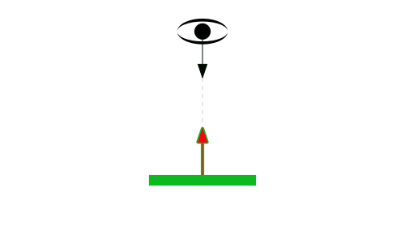
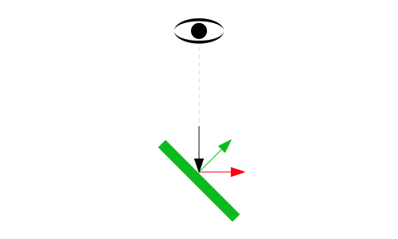

Title: WebGL Environment Maps (reflections)
Description: How to implement environment maps.
TOC: Environment maps

This article is part of a series of articles about WebGL.
[The first article starts with the fundamentals](webgl-fundamentals.html).
This article continues from [the article on cube maps](webgl-cube-maps.html).
This article also uses concepts covered in [the article on lighting](webgl-3d-lighting-directional.html).
If you have not read those articles already you might want to read them first.

An *environment map* represents the environment of the objects you're drawing.
If you're drawing an outdoor scene it would represent the outdoors. If
you're drawing people on a stage it would represent the venue. If you're drawing
an outer space scene it would be the stars. We can implement an environment map
with a cube map if we have 6 images that show the environment from a point in
space in the 6 directions of the cubemap.

Here's an environment map from the lobby of the Computer History Museum in Mountain View, California.

<div class="webgl_center">
  
  
  
</div>
<div class="webgl_center">
  
  
  
</div>

Based on [the code in the previous article](webgl-cube-maps.html) let's load those 6 images instead of the images we generated

```js
// Create a texture.
var texture = gl.createTexture();
gl.bindTexture(gl.TEXTURE_CUBE_MAP, texture);

const faceInfos = [
  {
    target: gl.TEXTURE_CUBE_MAP_POSITIVE_X, 
    url: 'resources/images/computer-history-museum/pos-x.jpg',
  },
  {
    target: gl.TEXTURE_CUBE_MAP_NEGATIVE_X, 
    url: 'resources/images/computer-history-museum/neg-x.jpg',
  },
  {
    target: gl.TEXTURE_CUBE_MAP_POSITIVE_Y, 
    url: 'resources/images/computer-history-museum/pos-y.jpg',
  },
  {
    target: gl.TEXTURE_CUBE_MAP_NEGATIVE_Y, 
    url: 'resources/images/computer-history-museum/neg-y.jpg',
  },
  {
    target: gl.TEXTURE_CUBE_MAP_POSITIVE_Z, 
    url: 'resources/images/computer-history-museum/pos-z.jpg',
  },
  {
    target: gl.TEXTURE_CUBE_MAP_NEGATIVE_Z, 
    url: 'resources/images/computer-history-museum/neg-z.jpg',
  },
];
faceInfos.forEach((faceInfo) => {
  const {target, url} = faceInfo;

  // Upload the canvas to the cubemap face.
  const level = 0;
  const internalFormat = gl.RGBA;
  const width = 512;
  const height = 512;
  const format = gl.RGBA;
  const type = gl.UNSIGNED_BYTE;
  
  // setup each face so it's immediately renderable
  gl.texImage2D(target, level, internalFormat, width, height, 0, format, type, null);

  // Asynchronously load an image
  const image = new Image();
  image.src = url;
  image.addEventListener('load', function() {
    // Now that the image has loaded upload it to the texture.
    gl.bindTexture(gl.TEXTURE_CUBE_MAP, texture);
    gl.texImage2D(target, level, internalFormat, format, type, image);
    gl.generateMipmap(gl.TEXTURE_CUBE_MAP);
  });
});
gl.generateMipmap(gl.TEXTURE_CUBE_MAP);
gl.texParameteri(gl.TEXTURE_CUBE_MAP, gl.TEXTURE_MIN_FILTER, gl.LINEAR_MIPMAP_LINEAR);
```

Note that for every face we initialize it with a 512x512 blank image by passing
`null` to `texImage2D`. Cubemaps must have all 6 faces, all 6 faces must be the
same size and be square. If they are not the texture will not render. But, we're
loading 6 images. We'd like to start rendering immediately so we allocate all 6
faces then start loading the images. As each image arrives we upload it to the
correct face then generate the mipmap again. This means we can start rendering
immediately and as the images are download the faces of the cubemap will get
filled in with the images one at a time and still be renderable even if all 6
have not arrived yet.

But, just loading the images is not enough. Like
[lighting](webgl-3d-lighting-point.html) we need a little math here.

In this case we want to know for each fragment to be drawn, given a vector from
the eye/camera to that position on the surface of the object, which direction
will it reflect off the that surface. We can then use that direction to get a
color from the cubemap.

The formula to reflect is

    reflectionDir = eyeToSurfaceDir – 
        2 ∗ dot(surfaceNormal, eyeToSurfaceDir) ∗ surfaceNormal

Thinking about what we can see it's true. Recall from the [lighting articles](webgl-3d-lighting-directional.html)
that a dot product of 2 vectors returns the cosine of the angle between the 2
vectors. Adding vectors gives us a new vector so let's take the example of an eye
looking directly perpendicular to a flat surface.

<div class="webgl_center"></div>

Let's visualize the formula above. First off recall the dot product of 2 vectors
pointing in exactly opposite directions is -1 so visually

<div class="webgl_center"></div>

Plugging in that dot product with the <span style="color:black; font-weight:bold;">eyeToSurfaceDir</span>
and <span style="color:green;">normal</span> in the reflection formula gives us this

<div class="webgl_center"></div>

Which multiplying -2 by -1 makes it positive 2.

<div class="webgl_center"></div>

So adding the vectors by connecting them up gives us the <span style="color: red">reflected vector</span>

<div class="webgl_center"></div>

We can see above given 2 normals, one completely cancels out the direction from
the eye and the second one points the reflection directly back towards the eye.
Which if we put back in the original diagram is exactly what we'd expect

<div class="webgl_center"></div>

Let's rotate the surface 45 degrees to the right.

<div class="webgl_center"></div>

The dot product of 2 vectors 135 degrees apart is -0.707

<div class="webgl_center"></div>

So plugging everything into the formula

<div class="webgl_center"></div>

Again multiplying 2 negatives gives us a positive but the <span style="color: green">vector</span> is now about 30% shorter.

<div class="webgl_center"></div>

Adding up the vectors gives us the <span style="color: red">reflected vector</span>

<div class="webgl_center"></div>

Which if we put back in the original diagram seems correct.

<div class="webgl_center"></div>

We use that  <span style="color: red">reflected direction</span> to look at the cubemap to color the surface of the object.

Here's a diagram where you can set the rotation of the surface and see the
various parts of the equation. You can also see the reflection vectors point to
the different faces of the cubemap and effect the color of the surface.

{{{diagram url="resources/environment-mapping.html" width="400" height="400" }}}
    
Now that we know how reflection works and that we can use it to look up values
from the cubemap let's change the shaders to do that.

First in the vertex shader we'll compute the world position and world oriented
normal of the vertices and pass those to the fragment shader as varyings. This
is similar to what we did in [the article on spotlights](webgl-3d-lighting-spot.html).

```glsl
attribute vec4 a_position;
attribute vec3 a_normal;

uniform mat4 u_projection;
uniform mat4 u_view;
uniform mat4 u_world;

varying vec3 v_worldPosition;
varying vec3 v_worldNormal;

void main() {
  // Multiply the position by the matrix.
  gl_Position = u_projection * u_view * u_world * a_position;

  // send the view position to the fragment shader
  v_worldPosition = (u_world * a_position).xyz;

  // orient the normals and pass to the fragment shader
  v_worldNormal = mat3(u_world) * a_normal;
}
```

Then in the fragment shader we normalize the `worldNormal` since it's being
interpolated across the surface between vertices. We pass in the world position
of the camera and by subtracting that from the world position of the surface we
get the `eyeToSurfaceDir`.

And finally we use `reflect` which is a built in GLSL function that implements
the formula we went over above. We use the result to get a color from the
cubemap.

```glsl
precision highp float;

// Passed in from the vertex shader.
varying vec3 v_worldPosition;
varying vec3 v_worldNormal;

// The texture.
uniform samplerCube u_texture;

// The position of the camera
uniform vec3 u_worldCameraPosition;

void main() {
  vec3 worldNormal = normalize(v_worldNormal);
  vec3 eyeToSurfaceDir = normalize(v_worldPosition - u_worldCameraPosition);
  vec3 direction = reflect(eyeToSurfaceDir,worldNormal);

  gl_FragColor = textureCube(u_texture, direction);
}
```

We also need real normals for this example. We need real normals so the faces of
the cube appear flat. In the previous example just to see the cubemap work we
repurposed the cube's positions but in this case we need actual normals for a
cube like we covered in [the article on lighting](webgl-3d-lighting-directional.html)

At init time

```js
// Create a buffer to put normals in
var normalBuffer = gl.createBuffer();
// Bind it to ARRAY_BUFFER (think of it as ARRAY_BUFFER = normalBuffer)
gl.bindBuffer(gl.ARRAY_BUFFER, normalBuffer);
// Put normals data into buffer
setNormals(gl);
```

and at render time 

```js
// Bind the normal buffer.
gl.bindBuffer(gl.ARRAY_BUFFER, normalBuffer);

// Tell the attribute how to get data out of normalBuffer (ARRAY_BUFFER)
var size = 3;          // 3 components per iteration
var type = gl.FLOAT;   // the data is 32bit floating point values
var normalize = false; // normalize the data (convert from 0-255 to 0-1)
var stride = 0;        // 0 = move forward size * sizeof(type) each iteration to get the next position
var offset = 0;        // start at the beginning of the buffer
gl.vertexAttribPointer(
    normalLocation, size, type, normalize, stride, offset)
```

And of course we need to look up the uniform locations at init time

```js
var projectionLocation = gl.getUniformLocation(program, "u_projection");
var viewLocation = gl.getUniformLocation(program, "u_view");
var worldLocation = gl.getUniformLocation(program, "u_world");
var textureLocation = gl.getUniformLocation(program, "u_texture");
var worldCameraPositionLocation = gl.getUniformLocation(program, "u_worldCameraPosition");
```

and set them at render time

```js
// Compute the projection matrix
var aspect = gl.canvas.clientWidth / gl.canvas.clientHeight;
var projectionMatrix =
    m4.perspective(fieldOfViewRadians, aspect, 1, 2000);
gl.uniformMatrix4fv(projectionLocation, false, projectionMatrix);

var cameraPosition = [0, 0, 2];
var target = [0, 0, 0];
var up = [0, 1, 0];
// Compute the camera's matrix using look at.
var cameraMatrix = m4.lookAt(cameraPosition, target, up);

// Make a view matrix from the camera matrix.
var viewMatrix = m4.inverse(cameraMatrix);

var worldMatrix = m4.xRotation(modelXRotationRadians);
worldMatrix = m4.yRotate(worldMatrix, modelYRotationRadians);

// Set the uniforms
gl.uniformMatrix4fv(projectionLocation, false, projectionMatrix);
gl.uniformMatrix4fv(viewLocation, false, viewMatrix);
gl.uniformMatrix4fv(worldLocation, false, worldMatrix);
gl.uniform3fv(worldCameraPositionLocation, cameraPosition);

// Tell the shader to use texture unit 0 for u_texture
gl.uniform1i(textureLocation, 0);
```

Basic reflections

{{{example url="../webgl-environment-map.html" }}}

Next let's show [how to use a cubemap for a skybox](webgl-skybox.html).


