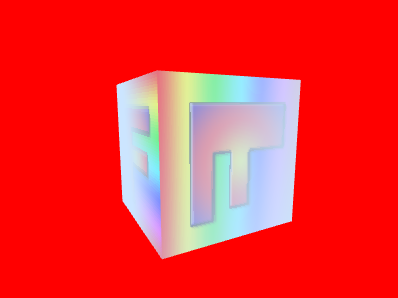
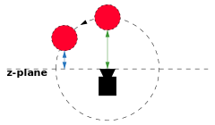
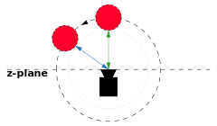

Title: WebGL Fog
Description: How to implement fog
TOC: Fog


This article is part of a series of articles about WebGL.
[The first article starts with the fundamentals](webgl-fundamentals.html).

Fog in WebGL is interesting to me because of how *fake* it seems when I think
about how it works. Basically what you do is use some kind of depth or distance
from the camera calculation in your shaders to make the color more or less the
fog color.

In other words you start with a basic equation like this

```glsl
gl_FragColor = mix(originalColor, fogColor, fogAmount);
```

Where `fogAmount` is a value from 0 to 1. The `mix` function mixes the first 2
values. When `fogAmount` is 0 `mix` returns `originalColor`. Then `fogAmount` is
1 `mix` returns `fogColor`. In between 0 and 1 you get a percentage of both
colors. You could implement `mix` yourself like this

```glsl
gl_FragColor = originalColor + (fogColor - originalColor) * fogAmount;
```

Let's make a shader that does this. We'll use a textured cube from [the article on textures](webgl-3d-textures.html).

Let's add the mixing to the fragment shader

```glsl
precision mediump float;

// Passed in from the vertex shader.
varying vec2 v_texcoord;

// The texture.
uniform sampler2D u_texture;

+uniform vec4 u_fogColor;
+uniform float u_fogAmount;

void main() {
+  vec4 color = texture2D(u_texture, v_texcoord);
+  gl_FragColor = mix(color, u_fogColor, u_fogAmount);  
}
```

Then at init time we need to look up the new uniform locations

```js
var fogColorLocation = gl.getUniformLocation(program, "u_fogColor");
var fogAmountLocation = gl.getUniformLocation(program, "u_fogAmount");
```

and at render time set them

```js
var fogColor = [0.8, 0.9, 1, 1];
var settings = {
  fogAmount: .5,
};

...

function drawScene(time) {
  ...

  // Clear the canvas AND the depth buffer.
  // Clear to the fog color
  gl.clearColor(...fogColor);
  gl.clear(gl.COLOR_BUFFER_BIT | gl.DEPTH_BUFFER_BIT);

  ...

  // set the fog color and amount
  gl.uniform4fv(fogColorLocation, fogColor);
  gl.uniform1f(fogAmountLocation, settings.fogAmount);

  ...
}
```

And here you'll see if you drag the slider you can change between the texture
and the fog color

{{{example url="../webgl-3d-fog-just-mix.html" }}}

So now all we really need to do is instead of passing in the fog amount we
compute it based on the something like the depth from the camera.

Recall from the article on [cameras](webgl-3d-camera.html) that after we apply
the view matrix all positions are relative to the camera. The camera looks down
the -z axis so if we just look at the z position after multiplying by the world
and view matrices we'll have a value that represents how far away something is
from the z plane of the camera.

Let's change the vertex shader to pass that data to the fragment shader so we
can use it compute a fog amount. To do that let's split `u_matrix` into 2 parts.
A projection matrix and a worldView matrix.

```glsl
attribute vec4 a_position;
attribute vec2 a_texcoord;

-uniform mat4 u_matrix;
+uniform mat4 u_worldView;
+uniform mat4 u_projection;

varying vec2 v_texcoord;
+varying float v_fogDepth;

void main() {
  // Multiply the position by the matrix.
-  gl_Position = u_matrix * a_position;
+  gl_Position = u_projection * u_worldView * a_position;

  // Pass the texcoord to the fragment shader.
  v_texcoord = a_texcoord;

+  // Pass just the negated z position relative to the camera.
+  // the camera is looking in the -z direction so normally stuff
+  // in front of the camera has a negative Z position
+  // but by negating he we get a positive depth.
+  v_fogDepth = -(u_worldView * a_position).z;
}
```

Now in the fragment shader we want it to work that if the depth is less than
some value, don't mix any fog (fogAmount = 0). If the depth is greater than some
value then 100% fog (fogAmount = 1). Between those 2 values mix the colors.

We could write code to do that but GLSL has a function, `smoothstep` that does
just that. You give it the min value, the max value, and the value to test. If
the test value is less than or equal to the min value it returns 0. If the test
value is greater than or equal to the max value it returns 1. If test is between
those 2 values it returns something between 0 and 1 in proportion to where the
test value is between min and max.

So, it should be pretty easy to use that in our fragment shader to compute a fog
amount

```glsl
precision mediump float;

// Passed in from the vertex shader.
varying vec2 v_texcoord;
varying float v_fogDepth;

// The texture.
uniform sampler2D u_texture;
uniform vec4 u_fogColor;
-uniform float u_fogAmount;
+uniform float u_fogNear;
+uniform float u_fogFar;

void main() {
  vec4 color = texture2D(u_texture, v_texcoord);

+  float fogAmount = smoothstep(u_fogNear, u_fogFar, v_fogDepth);

-  gl_FragColor = mix(color, u_fogColor, u_fogAmount);  
+ gl_FragColor = mix(color, u_fogColor, fogAmount);  
}
```

and of course we need to look up all these uniforms at init time

```js
// lookup uniforms
+var projectionLocation = gl.getUniformLocation(program, "u_projection");
+var worldViewLocation = gl.getUniformLocation(program, "u_worldView");
var textureLocation = gl.getUniformLocation(program, "u_texture");
var fogColorLocation = gl.getUniformLocation(program, "u_fogColor");
+var fogNearLocation = gl.getUniformLocation(program, "u_fogNear");
+var fogFarLocation = gl.getUniformLocation(program, "u_fogFar");
```

and set them at render time 

```js
var fogColor = [0.8, 0.9, 1, 1];
var settings = {
-  fogAmount: .5,
+  fogNear: 1.1,
+  fogFar: 2.0,
};

// Draw the scene.
function drawScene(time) {
  ...

  // Compute the projection matrix
  var aspect = gl.canvas.clientWidth / gl.canvas.clientHeight;
  var projectionMatrix =
      m4.perspective(fieldOfViewRadians, aspect, 1, 2000);

  var cameraPosition = [0, 0, 2];
  var up = [0, 1, 0];
  var target = [0, 0, 0];

  // Compute the camera's matrix using look at.
  var cameraMatrix = m4.lookAt(cameraPosition, target, up);

  // Make a view matrix from the camera matrix.
  var viewMatrix = m4.inverse(cameraMatrix);

-  var viewProjectionMatrix = m4.multiply(projectionMatrix, viewMatrix);
-
-  var matrix = m4.xRotate(viewProjectionMatrix, modelXRotationRadians);
-  matrix = m4.yRotate(matrix, modelYRotationRadians);

+  var worldViewMatrix = m4.xRotate(viewMatrix, modelXRotationRadians);
+  worldViewMatrix = m4.yRotate(worldViewMatrix, modelYRotationRadians);

  // Set the matrices.
-  gl.uniformMatrix4fv(matrixLocation, false, matrix);
+  gl.uniformMatrix4fv(projectionLocation, false, projectionMatrix);
+  gl.uniformMatrix4fv(worldViewLocation, false, worldViewMatrix);

  // Tell the shader to use texture unit 0 for u_texture
  gl.uniform1i(textureLocation, 0);

  // set the fog color and near, far settings
  gl.uniform4fv(fogColorLocation, fogColor);
+  gl.uniform1f(fogNearLocation, settings.fogNear);
+  gl.uniform1f(fogFarLocation, settings.fogFar);
-  gl.uniform1f(fogAmountLocation, settings.fogAmount);
```

While we're at it lets draw 40 cubes into the distance to make it easier to see the fog.

```js
var settings = {
  fogNear: 1.1,
  fogFar: 2.0,
+  xOff: 1.1,
+  zOff: 1.4,
};

...

const numCubes = 40;
for (let i = 0; i <= numCubes; ++i) {
  var worldViewMatrix = m4.translate(viewMatrix, -2 + i * settings.xOff, 0, -i * settings.zOff);
  worldViewMatrix = m4.xRotate(worldViewMatrix, modelXRotationRadians + i * 0.1);
  worldViewMatrix = m4.yRotate(worldViewMatrix, modelYRotationRadians + i * 0.1);

  gl.uniformMatrix4fv(worldViewLocation, false, worldViewMatrix);

  // Draw the geometry.
  gl.drawArrays(gl.TRIANGLES, 0, 6 * 6);
}
```

And now we get depth based fog

{{{example url="../webgl-3d-fog-depth-based.html" }}}

Note: We didn't add any code to make sure `fogNear` is less then or equal to
`fogFar` which are arguably invalid settings so be sure to set both
appropriately.

As I mentioned above it's feels like a trick to me. It works because the fog
color we're fading to matches the background color. Change the background color
and the illusion disappears.

```js
-gl.clearColor(...fogColor);
+gl.clearColor(1, 0, 0, 1);  // red
```

gets us

<div class="webgl_center"></div>

so just remember to you need to set the background color to match the fog color.

Using the depth works and it's cheap but there's a problem. Let's say you have a
circle of objects around the camera. We're computing a fog amount based on the
distance from the camera's z plane. That means as you turn the camera objects
will appear to come into and out of the fog slightly as their view space Z value
gets closer to 0

<div class="webgl_center"></div>

You can see the problem in this example

{{{example url="../webgl-3d-fog-depth-based-issue.html" }}}

Above there is a ring of 8 cubes directly around the camera. The camera in
spinning in place. That means the cubes are always the same distance from the
camera but a different distance from the Z plane and so our fog amount
calculation results in the cubes near the edge coming out of the fog.
 
The fix is to instead compute the distance from the camera which will be the
same for all cubes

<div class="webgl_center"></div>

To do this we just need to pass the vertex position in view space from the
vertex shader to the fragment shader

```glsl
attribute vec4 a_position;
attribute vec2 a_texcoord;

uniform mat4 u_worldView;
uniform mat4 u_projection;

varying vec2 v_texcoord;
-varying float v_fogDepth;
+varying vec3 v_position;

void main() {
  // Multiply the position by the matrix.
  gl_Position = u_projection * u_worldView * a_position;

  // Pass the texcoord to the fragment shader.
  v_texcoord = a_texcoord;

-  // Pass just the negated z position relative to the camera.
-  // the camera is looking in the -z direction so normally stuff
-  // in front of the camera has a negative Z position
-  // but by negating he we get a positive depth.
-  v_fogDepth = -(u_worldView * a_position).z;
+  // Pass the view position to the fragment shader
+  v_position = (u_worldView * a_position).xyz;
}
```

and then in the fragment shader we can use the position to compute the distance

```
precision mediump float;

// Passed in from the vertex shader.
varying vec2 v_texcoord;
-varying float v_fogDepth;
+varying vec3 v_position;

// The texture.
uniform sampler2D u_texture;
uniform vec4 u_fogColor;
uniform float u_fogNear;
uniform float u_fogFar;

void main() {
  vec4 color = texture2D(u_texture, v_texcoord);

-  float fogAmount = smoothstep(u_fogNear, u_fogFar, v_fogDepth);
+  float fogDistance = length(v_position);
+  float fogAmount = smoothstep(u_fogNear, u_fogFar, fogDistance);

  gl_FragColor = mix(color, u_fogColor, fogAmount);  
}
```

And now the cubes no longer come out of the fog as the camera turns

{{{example url="../webgl-3d-fog-distance-based.html" }}}

So far all of our fog has used a linear calculation. In other words the fog
color gets applied linearly between near and far. Like many things in the real
world fog apparently works exponentially. It gets thicker with the square of the
distance from the viewer. A common equation for exponential fog is

```glsl
#define LOG2 1.442695

fogAmount = 1. - exp2(-fogDensity * fogDensity * fogDistance * fogDistance * LOG2));
fogAmount = clamp(fogAmount, 0., 1.);
```

To use this we'd change the fragment shader to something like

```
precision mediump float;

// Passed in from the vertex shader.
varying vec2 v_texcoord;
varying vec3 v_position;

// The texture.
uniform sampler2D u_texture;
uniform vec4 u_fogColor;
-uniform float u_fogNear;
-uniform float u_fogFar;
+uniform float u_fogDensity;

void main() {
  vec4 color = texture2D(u_texture, v_texcoord);

  #define LOG2 1.442695

  float fogDistance = length(v_position);
-  float fogAmount = smoothstep(u_fogNear, u_fogFar, fogDistance);
+  float fogAmount = 1. - exp2(-u_fogDensity * u_fogDensity * fogDistance * fogDistance * LOG2);
  fogAmount = clamp(fogAmount, 0., 1.);

  gl_FragColor = mix(color, u_fogColor, fogAmount);  
}
```

And we get distance *exp2* density based fog

{{{example url="../webgl-3d-fog-distance-exp2.html" }}}

One thing to notice about density based fog is there are no near and far settings. It might be more realistic but it also might not fit your aesthetic needs. Which one you prefer is an artistic decision.

There are many other ways to compute fog. On a low powered GPU you might just use `gl_FragCoord.z`. `gl_FragCoord` is a global variable that WebGL sets. The `x` and `y` components are the coordinate of the pixel being drawn. The `z` coordinate is the depth of that pixel from 0 to 1. While not directly translatable into distance you can still get something that looks like fog by picking some values between 0 and 1 for near and far. Nothing has to be passed from the vertex shader to the fragment shader and no distance calculations are needed so this is one way to make a cheap fog effect on a low powered GPU.

{{{example url="../webgl-3d-fog-depth-based-gl_FragCoord.html" }}}

