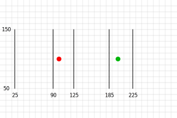

Title: WebGL GPGPU
Description: How to do general computing with WebGL
TOC: GPGPU

GPGPU is "General Purpose" GPU and means using the GPU for something
other than drawing pixels.

The basic realization to understanding GPGPU in WebGL is that a texture
is not an image, it's a 2D array of values. In [the article on textures](webgl-3d-textures.html)
we covered reading from a texture. In [the article on rendering to a texture](webgl-render-to-texture.html)
we covered writing to a texture. So, if realizing a texture is a 2D array of values
we can say that we have really described a way to read from and write to 2D arrays.
That is the essence of GPGPU in WebGL.

In JavaScript there is the [`Array.prototype.map`](https://developer.mozilla.org/en-US/docs/Web/JavaScript/Reference/Global_Objects/Map) function which given an array calls a function on each element 

```js
function multBy2(v) {
  return v * 2;
}

const src = [1, 2, 3, 4, 5, 6];
const dst = src.map(multBy2);

// dst is now [2, 4, 6, 8, 10, 12];
```

You can consider `multBy2` a shader and `map` similar to calling `gl.drawArrays` or `gl.drawElements`.
Some differences.

## Shaders don't generate a new array, you have to provide one

We can simulate that by making our own map function

```js
function multBy2(v) {
  return v * 2;
}

+function mapSrcToDst(src, fn, dst) {
+  for (let i = 0; i < src.length; ++i) {
+    dst[i] = fn(src[i]);
+  }
+}

const src = [1, 2, 3, 4, 5, 6];
-const dst = src.map(multBy2);
+const dst = new Array(6);    // to simulate that in WebGL we have to allocate a texture
+mapSrcToDst(src, multBy2, dst);

// dst is now [2, 4, 6, 8, 10, 12];
```

## Shader's don't return a value they set `gl_FragColor`

That's pretty easy to simulate

```js
+let gl_FragColor;

function multBy2(v) {
-  return v * 2;
+  gl_FragColor = v * 2;
}

function mapSrcToDst(src, fn, dst) {
  for (let i = 0; i < src.length; ++i) {
-    dst[i] = fn(src[i]);
+    fn(src[i]);
+    dst[i] = gl_FragColor;
  }
}

const src = [1, 2, 3, 4, 5, 6];
const dst = new Array(6);    // to simulate that in WebGL we have to allocate a texture
mapSrcToDst(src, multBy2, dst);

// dst is now [2, 4, 6, 8, 10, 12];
```

## Shaders are destination based, not source based.

In other words, they loop over the destination and ask "what value should I put here"

```js
let gl_FragColor;

function multBy2(src) {
-  gl_FragColor = v * 2;
+  return function(i) {
+    gl_FragColor = src[i] * 2;
+  }
}

-function mapSrcToDst(src, fn, dst) {
-  for (let i = 0; i < src.length; ++i) {
-    fn(src[i]);
+function mapDst(dst, fn) {
+  for (let i = 0; i < dst.length; ++i) {    
+    fn(i);
    dst[i] = gl_FragColor;
  }
}

const src = [1, 2, 3, 4, 5, 6];
const dst = new Array(6);    // to simulate that in WebGL we have to allocate a texture
mapDst(dst, multBy2(src));

// dst is now [2, 4, 6, 8, 10, 12];
```

## In WebGL the index or ID of the pixel who's value you're being asked to provide is called `gl_FragCoord`

```js
let gl_FragColor;
+let gl_FragCoord;

function multBy2(src) {
-  return function(i) {
-    gl_FragColor = src[i] * 2;
+  return function() {
+    gl_FragColor = src[gl_FragCoord] * 2;
  }
}

function mapDst(dst, fn) {
  for (let i = 0; i < dst.length; ++i) {    
-    fn(i);
+    gl_FragCoord = i;
+    fn();
    dst[i] = gl_FragColor;
  }
}

const src = [1, 2, 3, 4, 5, 6];
const dst = new Array(6);    // to simulate that in WebGL we have to allocate a texture
mapDst(dst, multBy2(src));

// dst is now [2, 4, 6, 8, 10, 12];
```

## In WebGL textures are 2D arrays.

Let's assume our `dst` array represents a 3x2 texture

```js
let gl_FragColor;
let gl_FragCoord;

function multBy2(src, across) {
  return function() {
-    gl_FragColor = src[gl_FragCoord] * 2;
+    gl_FragColor = src[gl_FragCoord.y * across + gl_FragCoord.x] * 2;
  }
}

-function mapDst(dst, fn) {
-  for (let i = 0; i < dst.length; ++i) {    
-    gl_FragCoord = i;
-    fn();
-    dst[i] = gl_FragColor;
-  }
-}
function mapDst(dst, across, up, fn) {
  for (let y = 0; y < up; ++y) {
    for (let x = 0; x < across; ++x) {
      gl_FragCoord = {x, y};
      fn();
      dst[y * across + x] = gl_FragColor;
    }
  }
}

const src = [1, 2, 3, 4, 5, 6];
const dst = new Array(6);    // to simulate that in WebGL we have to allocate a texture
mapDst(dst, 3, 2, multBy2(src, 3));

// dst is now [2, 4, 6, 8, 10, 12];
```

And we could keep going. I'm hoping the examples above helps you see that GPGPU in WebGL
is pretty simple conceptually. Let's actually do the above in WebGL.

To understand the following code you will, at a minimum, need to have read
"[the article on fundamentals](webgl-fundamentals.html)", probably the article on 
"[How It Works](webgl-how-it-works.html)", and "[the article on textures](webgl-3d-textures.html).

```js
const vs = `
attribute vec4 position;
void main() {
  gl_Position = position;
}
`;

const fs = `
precision highp float;

uniform sampler2D srcTex;
uniform vec2 srcDimensions;

void main() {
  vec2 texcoord = gl_FragCoord.xy / srcDimensions;
  vec4 value = texture2D(srcTex, texcoord);
  gl_FragColor = value * 2.0;
}
`;

const dstWidth = 3;
const dstHeight = 2;

// make a 3x2 canvas for 6 results
const canvas = document.createElement('canvas');
canvas.width = dstWidth;
canvas.height = dstHeight;

const gl = canvas.getContext('webgl');

const program = webglUtils.createProgramFromSources(gl, [vs, fs]);
const positionLoc = gl.getAttribLocation(program, 'position');
const srcTexLoc = gl.getUniformLocation(program, 'srcTex');
const srcDimensionsLoc = gl.getUniformLocation(program, 'srcDimensions');

// setup a full canvas clip space quad
const buffer = gl.createBuffer();
gl.bindBuffer(gl.ARRAY_BUFFER, buffer);
gl.bufferData(gl.ARRAY_BUFFER, new Float32Array([
  -1, -1,
   1, -1,
  -1,  1,
  -1,  1,
   1, -1,
   1,  1,
]), gl.STATIC_DRAW);

// setup our attributes to tell WebGL how to pull
// the data from the buffer above to the position attribute
gl.enableVertexAttribArray(positionLoc);
gl.vertexAttribPointer(
    positionLoc,
    2,         // size (num components)
    gl.FLOAT,  // type of data in buffer
    false,     // normalize
    0,         // stride (0 = auto)
    0,         // offset
);

// create our source texture
const srcWidth = 3;
const srcHeight = 2;
const tex = gl.createTexture();
gl.bindTexture(gl.TEXTURE_2D, tex);
gl.pixelStorei(gl.UNPACK_ALIGNMENT, 1); // see https://webglfundamentals.org/webgl/lessons/webgl-data-textures.html
gl.texImage2D(
    gl.TEXTURE_2D,
    0,                // mip level
    gl.LUMINANCE,     // internal format
    srcWidth,
    srcHeight,
    0,                // border
    gl.LUMINANCE,     // format
    gl.UNSIGNED_BYTE, // type
    new Uint8Array([
      1, 2, 3,
      4, 5, 6,
    ]));
gl.texParameteri(gl.TEXTURE_2D, gl.TEXTURE_MIN_FILTER, gl.NEAREST);
gl.texParameteri(gl.TEXTURE_2D, gl.TEXTURE_MAG_FILTER, gl.NEAREST);
gl.texParameteri(gl.TEXTURE_2D, gl.TEXTURE_WRAP_S, gl.CLAMP_TO_EDGE);
gl.texParameteri(gl.TEXTURE_2D, gl.TEXTURE_WRAP_T, gl.CLAMP_TO_EDGE);

gl.useProgram(program);
gl.uniform1i(srcTexLoc, 0);  // tell the shader the src texture is on texture unit 0
gl.uniform2f(srcDimensionsLoc, srcWidth, srcHeight);

gl.drawArrays(gl.TRIANGLES, 0, 6);  // draw 2 triangles (6 vertices)

// get the result
const results = new Uint8Array(dstWidth * dstHeight * 4);
gl.readPixels(0, 0, dstWidth, dstHeight, gl.RGBA, gl.UNSIGNED_BYTE, results);

// print the results
for (let i = 0; i < dstWidth * dstHeight; ++i) {
  log(results[i * 4]);
}
```

and here it is running

{{{example url="../webgl-gpgpu-mult-by-2.html"}}}

Some notes about the code above.

* We draw a clip space -1 to +1 quad.

  We create vertices for a -1 to +1 quad from 2 triangles. This means, assuming the viewport
  is set correctly, we'll draw all the pixels in the destination. In other words we'll ask
  our shader to generate a value for every element in the result array. That array in
  this case is the canvas itself.

* `gl_FragCoord` is a pixel coordinate but textures are referenced by texture coordinates.

  This means to look up a value in `srcTex` we need to translate from pixels to texture coordinates.
  That is this line.

  ```glsl
  vec2 texcoord = gl_FragCoord.xy / srcDimensions;
  ```

* Shaders output 4 values per pixel

  In this particular case this affects how we read the output. We ask for `RGBA/UNSIGNED_BYTE`
  from `readPixels` [because other format/type combinations are not supported](webgl-readpixels.html).
  So we have to look at every 4th value for our answer.

  Note: It would be smart to try to take advantage of the fact that WebGL does 4 values at a time
  to go even faster.

* Both our input data and output data are `UNSIGNED_BYTE` values

  The means we can only pass in and get back integer values between 0 and 255.
  We could use different formats for input by supplying a texture of a different format.
  We could also try rendering to a texture of a different format for more range of values.

In the example above src and dst are the same size. Let's change it so we add every 2 values
from src to make dst. In other words, given `[1, 2, 3, 4, 5, 6]` as input we want
`[3, 7, 11]` as output. And further, let's keep the source as 3x2 data

To get an arbitrary value from a texture we need to generate texture coordinates.
The basic formula to get a value from a 2D array as though it was a 1D array is

```js
y = floor(indexInto1DArray / width);
x = indexInto1DArray % width;
```

For textures we'd then need to translate that value into a texture coordinate which is

```glsl
vec2 texcoord = (vec2(x, y) + 0.5) / dimensionsOfTexture;
```

See [this](webgl-skinning.html#texel-coords)) for more info on why the + 0.5

Given that, our shader needs to change to this to add every 2 values.

```glsl
precision highp float;

uniform sampler2D srcTex;
uniform vec2 srcDimensions;
uniform vec2 dstDimensions;

vec4 getValueFrom2DTextureAs1DArray(sampler2D tex, vec2 dimensions, float index) {
  float y = floor(index / dimensions.x);
  float x = mod(index, dimensions.x);
  vec2 texcoord = (vec2(x, y) + 0.5) / dimensions;
  return texture2D(tex, texcoord);
}

void main() {
  // compute a 1D index into dst
  vec2 dstPixel = floor(gl_FragCoord.xy);  // see https://webglfundamentals.org/webgl/lessons/webgl-shadertoy.html#pixel-coords
  float dstIndex = dstPixel.y * dstDimensions.x + dstPixel.x;

  vec4 v1 = getValueFrom2DTextureAs1DArray(srcTex, srcDimensions, dstIndex * 2.0);
  vec4 v2 = getValueFrom2DTextureAs1DArray(srcTex, srcDimensions, dstIndex * 2.0 + 1.0);

  gl_FragColor = v1 + v2;
}
```

The function `getValueFrom2DTextureAs1DArray` is basically our array accessor
function. That means these 2 lines

```glsl
  vec4 v1 = getValueFrom2DTextureAs1DArray(srcTex, srcDimensions, dstIndex * 2.0);
  vec4 v2 = getValueFrom2DTextureAs1DArray(srcTex, srcDimensions, dstIndex * 2.0 + 1.0);
```

Effectively mean this

```glsl
  vec4 v1 = srcTexAs1DArray[dstIndex * 2.0];
  vec4 v2 = setTexAs1DArray[dstIndex * 2.0 + 1.0];
```

In our JavaScript we need to lookup the location of `dstDimensions`

```js
const program = webglUtils.createProgramFromSources(gl, [vs, fs]);
const positionLoc = gl.getAttribLocation(program, 'position');
const srcTexLoc = gl.getUniformLocation(program, 'srcTex');
const srcDimensionsLoc = gl.getUniformLocation(program, 'srcDimensions');
+const dstDimensionsLoc = gl.getUniformLocation(program, 'dstDimensions');
```

and set it

```js
gl.useProgram(program);
gl.uniform1i(srcTexLoc, 0);  // tell the shader the src texture is on texture unit 0
gl.uniform2f(srcDimensionsLoc, srcWidth, srcHeight);
+gl.uniform2f(dstDimensionsLoc, dstWidth, dstHeight);
```

and we need to change the size of the destination (the canvas)

```js
const dstWidth = 3;
-const dstHeight = 2;
+const dstHeight = 1;
```

and with that we have now have the result array able to do math
with random access into the source array

{{{example url="../webgl-gpgpu-add-2-elements.html"}}}

If you wanted to use more arrays as input just add more textures

## First example: particles

Let's say you have a very simple particle system.
Every particle just has a position and a velocity and
if it goes off one edge of the screen it wraps around to
the other side.

Given most of the other articles on this site you'd
update the positions of the particles in JavaScript

```js
for (const particle of particles) {
  particle.pos.x = (particle.pos.x + particle.velocity.x) % canvas.width;
  particle.pos.y = (particle.pos.y + particle.velocity.y) % canvas.height;
}
```

and then draw the particles either one at a time

```
useProgram (particleShader)
setup particle attributes
for each particle
  set uniforms
  draw particle
```

Or you might upload all the new particle positions

```
bindBuffer(..., particlePositionBuffer)
bufferData(..., latestParticlePositions, ...)
useProgram (particleShader)
setup particle attributes
set uniforms
draw particles
```

In [the article on pulling vertices](webgl-pulling-vertices.html)
we covered storing positions in textures. If we store both the
positions and velocities in textures then we can use the GPGPU techniques
above to update the particle positions in a shader

Before we get started, to make it easy, we want to use floating point
textures. Those are an optional feature of WebGL. Most devices can
read floating point textures. Desktops can render
to floating point textures but most smartphones can not.

Also in order to support pulling vertices we need to check vertex shaders can use
textures which is also an optional feature. We should probably check exactly
how many are supported. In this case we will only need to use one texture
in the vertex shader so we just check that a least 1 is supported.

```js
// Get A WebGL context
/** @type {HTMLCanvasElement} */
const canvas = document.querySelector("#canvas");
const gl = canvas.getContext("webgl");
if (!gl) {
  return;
}
+// check we can use floating point textures
+const ext1 = gl.getExtension('OES_texture_float');
+if (!ext1) {
+  alert('Need OES_texture_float');
+  return;
+}
+// check we can render to floating point textures
+const ext2 = gl.getExtension('WEBGL_color_buffer_float');
+if (!ext2) {
+  alert('Need WEBGL_color_buffer_float');
+  return;
+}
+// check we can use textures in a vertex shader
+if (gl.getParameter(gl.MAX_VERTEX_TEXTURE_IMAGE_UNITS) < 1) {
+  alert('Can not use textures in vertex shaders');
+  return;
+}
```

Here's the fragment shader to update the particle positions

```glsl
precision highp float;

uniform sampler2D positionTex;
uniform sampler2D velocityTex;
uniform vec2 texDimensions;
uniform vec2 canvasDimensions;
uniform float deltaTime;

vec2 euclideanModulo(vec2 n, vec2 m) {
	return mod(mod(n, m) + m, m);
}

void main() {
  // compute texcoord from gl_FragCoord;
  vec2 texcoord = gl_FragCoord.xy / texDimensions;
  
  vec2 position = texture2D(positionTex, texcoord).xy;
  vec2 velocity = texture2D(velocityTex, texcoord).xy;
  vec2 newPosition = euclideanModulo(position + velocity * deltaTime, canvasDimensions);

  gl_FragColor = vec4(newPosition, 0, 1);
}
```

There will be one velocity per position so the velocity texture and position texture
are the same size. Further, we're generating new positions into a texture
so we know our destination texture is also the same size
as our source which means we can use `texDimensions` for all 3 textures.

In the shader below we use a vertex id, something we covered in
[the article on drawing without data](webgl-drawing-without-data.html).
Using that id we pull positions out of the textures (our arrays) 
similar to the article on [pulling-vertices](webgl-pulling-vertices.html).

```glsl
attribute float id;
uniform sampler2D positionTex;
uniform vec2 texDimensions;
uniform mat4 matrix;

vec4 getValueFrom2DTextureAs1DArray(sampler2D tex, vec2 dimensions, float index) {
  float y = floor(index / dimensions.x);
  float x = mod(index, dimensions.x);
  vec2 texcoord = (vec2(x, y) + 0.5) / dimensions;
  return texture2D(tex, texcoord);
}

void main() {
  // pull the position from the texture
  vec4 position = getValueFrom2DTextureAs1DArray(positionTex, texDimensions, id);

  // do the common matrix math
  gl_Position = matrix * vec4(position.xy, 0, 1);
  gl_PointSize = 10.0;
}
```

So then we need 3 textures, one for velocities, 2 for positions. Why 2 for positions?
Because you can not write to the same texture you're reading from. So, we'll
effectively do

    newPositions = oldPositions + velocities

Then we'll swap `newPositions` and `oldPositions` each frame.

Here's the code to make the position and velocity textures.

```js
// create random positions and velocities.
const rand = (min, max) => {
  if (max === undefined) {
    max = min;
    min = 0;
  }
  return Math.random() * (max - min) + min;
};
const positions = new Float32Array(
    ids.map(_ => [rand(canvas.width), rand(canvas.height), 0, 0]).flat());
const velocities = new Float32Array(
    ids.map(_ => [rand(-300, 300), rand(-300, 300), 0, 0]).flat());

function createTexture(gl, data, width, height) {
  const tex = gl.createTexture();
  gl.bindTexture(gl.TEXTURE_2D, tex);
  gl.texImage2D(
      gl.TEXTURE_2D,
      0,        // mip level
      gl.RGBA,  // internal format
      width,
      height,
      0,        // border
      gl.RGBA,  // format
      gl.FLOAT, // type
      data,
  );
  gl.texParameteri(gl.TEXTURE_2D, gl.TEXTURE_MIN_FILTER, gl.NEAREST);
  gl.texParameteri(gl.TEXTURE_2D, gl.TEXTURE_MAG_FILTER, gl.NEAREST);
  gl.texParameteri(gl.TEXTURE_2D, gl.TEXTURE_WRAP_S, gl.CLAMP_TO_EDGE);
  gl.texParameteri(gl.TEXTURE_2D, gl.TEXTURE_WRAP_T, gl.CLAMP_TO_EDGE);
  return tex;
}

// create a texture for the velocity and 2 textures for the positions.
const velocityTex = createTexture(gl, velocities, particleTexWidth, particleTexHeight);
const positionTex1 = createTexture(gl, positions, particleTexWidth, particleTexHeight);
const positionTex2 = createTexture(gl, null, particleTexWidth, particleTexHeight);
```

We also need framebuffers like we covered in [the article on rendering to a texture](webgl-render-to-texture.html). We'll make 2. One that allows us to write to
one position texture and another for the other position texture.

```js
function createFramebuffer(gl, tex) {
  const fb = gl.createFramebuffer();
  gl.bindFramebuffer(gl.FRAMEBUFFER, fb);
  gl.framebufferTexture2D(gl.FRAMEBUFFER, gl.COLOR_ATTACHMENT0, gl.TEXTURE_2D, tex, 0);
  return fb;
}

// create 2 framebuffers. One that renders to positionTex1 one
// and another that renders to positionTex2

const positionsFB1 = createFramebuffer(gl, positionTex1);
const positionsFB2 = createFramebuffer(gl, positionTex2);

let oldPositionsInfo = {
  fb: positionsFB1,
  tex: positionTex1,
};
let newPositionsInfo = {
  fb: positionsFB2,
  tex: positionTex2,
};
```

we also need to setup a buffer of vertex ids for our vertex pulling particle
drawing shader.

```js
// setup an id buffer
const particleTexWidth = 20;
const particleTexHeight = 10;
const numParticles = particleTexWidth * particleTexHeight;
const ids = new Array(numParticles).fill(0).map((_, i) => i);
const idBuffer = gl.createBuffer();
gl.bindBuffer(gl.ARRAY_BUFFER, idBuffer);
gl.bufferData(gl.ARRAY_BUFFER, new Float32Array(ids), gl.STATIC_DRAW);
```

And we need to compile both sets of shaders and look up all the locations

```js
const updatePositionProgram = webglUtils.createProgramFromSources(
    gl, [updatePositionVS, updatePositionFS]);
const drawParticlesProgram = webglUtils.createProgramFromSources(
    gl, [drawParticlesVS, drawParticlesFS]);

const updatePositionPrgLocs = {
  position: gl.getAttribLocation(updatePositionProgram, 'position'),
  positionTex: gl.getUniformLocation(updatePositionProgram, 'positionTex'),
  velocityTex: gl.getUniformLocation(updatePositionProgram, 'velocityTex'),
  texDimensions: gl.getUniformLocation(updatePositionProgram, 'texDimensions'),
  canvasDimensions: gl.getUniformLocation(updatePositionProgram, 'canvasDimensions'),
  deltaTime: gl.getUniformLocation(updatePositionProgram, 'deltaTime'),
};

const drawParticlesProgLocs = {
  id: gl.getAttribLocation(drawParticlesProgram, 'id'),
  positionTex: gl.getUniformLocation(drawParticlesProgram, 'positionTex'),
  texDimensions: gl.getUniformLocation(drawParticlesProgram, 'texDimensions'),
  matrix: gl.getUniformLocation(drawParticlesProgram, 'matrix'),
};
```

And then at render time, first we run the position updating shader to generate
new positions.

```js
let then = 0;
function render(time) {
  // convert to seconds
  time *= 0.001;
  // Subtract the previous time from the current time
  const deltaTime = time - then;
  // Remember the current time for the next frame.
  then = time;

  webglUtils.resizeCanvasToDisplaySize(gl.canvas);

  // render to the new positions
  gl.bindFramebuffer(gl.FRAMEBUFFER, newPositionsInfo.fb);
  gl.viewport(0, 0, particleTexWidth, particleTexHeight);

  // setup our attributes to tell WebGL how to pull
  // the data from the buffer above to the position attribute
  // this buffer just contains a -1 to +1 quad for rendering
  // to every pixel
  gl.bindBuffer(gl.ARRAY_BUFFER, updatePositionBuffer);
  gl.enableVertexAttribArray(updatePositionPrgLocs.position);
  gl.vertexAttribPointer(
      updatePositionPrgLocs.position,
      2,         // size (num components)
      gl.FLOAT,  // type of data in buffer
      false,     // normalize
      0,         // stride (0 = auto)
      0,         // offset
  );

  gl.activeTexture(gl.TEXTURE0);
  gl.bindTexture(gl.TEXTURE_2D, oldPositionsInfo.tex);
  gl.activeTexture(gl.TEXTURE0 + 1);
  gl.bindTexture(gl.TEXTURE_2D, velocityTex);

  gl.useProgram(updatePositionProgram);
  gl.uniform1i(updatePositionPrgLocs.positionTex, 0);  // tell the shader the position texture is on texture unit 0
  gl.uniform1i(updatePositionPrgLocs.velocityTex, 1);  // tell the shader the position texture is on texture unit 1
  gl.uniform2f(updatePositionPrgLocs.texDimensions, particleTexWidth, particleTexHeight);
  gl.uniform2f(updatePositionPrgLocs.canvasDimensions, gl.canvas.width, gl.canvas.height);
  gl.uniform1f(updatePositionPrgLocs.deltaTime, deltaTime);

  gl.drawArrays(gl.TRIANGLES, 0, 6);  // draw 2 triangles (6 vertices)
```

Then we use those new positions to draw points for the particles

```js
  gl.bindFramebuffer(gl.FRAMEBUFFER, null);
  gl.viewport(0, 0, gl.canvas.width, gl.canvas.height);

  // setup our attributes to tell WebGL how to pull
  // the data from the buffer above to the id attribute
  gl.bindBuffer(gl.ARRAY_BUFFER, idBuffer);
  gl.enableVertexAttribArray(drawParticlesProgLocs.id);
  gl.vertexAttribPointer(
      drawParticlesProgLocs.id,
      1,         // size (num components)
      gl.FLOAT,  // type of data in buffer
      false,     // normalize
      0,         // stride (0 = auto)
      0,         // offset
  );

  gl.activeTexture(gl.TEXTURE0);
  gl.bindTexture(gl.TEXTURE_2D, newPositionsInfo.tex);

  gl.useProgram(drawParticlesProgram);
  gl.uniform2f(drawParticlesProgLocs.texDimensions, particleTexWidth, particleTexWidth);
  gl.uniform1i(drawParticlesProgLocs.positionTex, 0);  // tell the shader the position texture is on texture unit 0
  gl.uniformMatrix4fv(
      drawParticlesProgLocs.matrix,
      false,
      m4.orthographic(0, gl.canvas.width, 0, gl.canvas.height, -1, 1));

  gl.drawArrays(gl.POINTS, 0, numParticles);
```

Finally we swap the variables tracking the old and new positions
so our new positions this frame will be the old positions next frame.

```js
  // swap which texture we will read from
  // and which one we will write to
  {
    const temp = oldPositionsInfo;
    oldPositionsInfo = newPositionsInfo;
    newPositionsInfo = temp;
  }
```

And with the we get GPGPU based particles. JavaScript is doing almost no
work except calling `gl.drawArrays` twice. Once to update the positions,
and once to draw the particles

{{{example url="../webgl-gpgpu-particles.html"}}}

We're drawing 200 particles by having position and velocity textures 20x10 pixels big. What if we wanted to draw 199 particles? Since WebGL only works with textures
and textures are 2D arrays we can't make a 2D array that is 199 pixels. Instead
though we could compute 200 but only draw 199. You'll need to find similar
solutions for problems that don't neatly fit into a 2D array.

## Next Example: Finding the closest line segment to a point

I'm not sure this is a good example but it's the one I wrote. I say it might
not be good because I suspect there are better algorithms for finding
the closest line to a point than brute force, checking every line with the point. For example various space partitioning algorithms might let you easily discard 95%
of the points and so be faster. Still, this example probably does show
some techniques of GPGPU at least.

The problem: We have 500 points and 1000 line segments. For each point
find which line segment it is closest to. The brute force method is

```
for each point
  minDistanceSoFar = MAX_VALUE
  for each line segment
    compute distance from point to line segment
    if distance is < minDistanceSoFar
       minDistanceSoFar = distance
       closestLine = line segment
```

For 500 points each checking 1000 lines that's 500,000 checks.
Modern GPUs have 100s or 1000s of cores so if we could do this on
the GPU we could potentially run hundreds or thousands of times faster.

Again we'll put our data in textures. One texture for the points,
One texture for the both the starting point and ending point of each line segment.
And, one texture to write the ID of the closest line for each point.

Here's the fragment shader that finds the closest line for a single point.
It's exactly the brute force algorithm as above

```js
  function closestLineFS(numLineSegments) {
    return `
precision highp float;

uniform sampler2D pointsTex;
uniform vec2 pointsTexDimensions;
uniform sampler2D linesTex;
uniform vec2 linesTexDimensions;

vec4 getAs1D(sampler2D tex, vec2 dimensions, float index) {
  float y = floor(index / dimensions.x);
  float x = mod(index, dimensions.x);
  vec2 texcoord = (vec2(x, y) + 0.5) / dimensions;
  return texture2D(tex, texcoord);
}

// from https://stackoverflow.com/a/6853926/128511
// a is the point, b,c is the line segment
float distanceFromPointToLine(in vec3 a, in vec3 b, in vec3 c) {
  vec3 ba = a - b;
  vec3 bc = c - b;
  float d = dot(ba, bc);
  float len = length(bc);
  float param = 0.0;
  if (len != 0.0) {
    param = clamp(d / (len * len), 0.0, 1.0);
  }
  vec3 r = b + bc * param;
  return distance(a, r);
}

void main() {
  // gl_FragCoord is the coordinate of the pixel that is being set by the fragment shader.
  // It is the center of the pixel so the bottom left corner pixel will be (0.5, 0.5).
  // the pixel to the left of that is (1.5, 0.5), The pixel above that is (0.5, 1.5), etc...
  // so we can compute back into a linear index 
  float ndx = floor(gl_FragCoord.y) * pointsTexDimensions.x + floor(gl_FragCoord.x); 
  
  // find the closest line segment
  float minDist = 10000000.0; 
  float minIndex = -1.0;
  vec3 point = getAs1D(pointsTex, pointsTexDimensions, ndx).xyz;
  for (int i = 0; i < ${numLineSegments}; ++i) {
    vec3 lineStart = getAs1D(linesTex, linesTexDimensions, float(i * 2)).xyz;
    vec3 lineEnd = getAsID(linesTex, linesTexDimensions, float(i * 2 + 1)).xyz;
    float dist = distanceFromPointToLine(point, lineStart, lineEnd);
    if (dist < minDist) {
      minDist = dist;
      minIndex = float(i);
    }
  }
  
  // convert to 8bit color. The canvas defaults to RGBA 8bits per channel
  // so take our integer index (minIndex) and convert to float values that
  // will end up as the same 32bit index when read via readPixels as
  // 32bit values.
  gl_FragColor = vec4(
    mod(minIndex, 256.0),
    mod(floor(minIndex / 256.0), 256.0),
    mod(floor(minIndex / (256.0 * 256.0)), 256.0) ,
    floor(minIndex / (256.0 * 256.0 * 256.0))) / 255.0;
}
`;
  }
```

I renamed `getValueFrom2DTextureAs1DArray` to `getAs1D` just to make
some of the lines shorter and more readable.

The first thing to notice is we need to generate the shader. Shaders in WebGL1
have to have constant integer expression loops so we can't pass in the number
of line segments, we have to hard code it into the shader.

Otherwise it's a pretty straight forward implemenation of the brute force algorithm
we wrote above.

`pointsTex` contains the points. `linesTex` contains the points for the
line segment in pairs, first point, followed by second point.

To use let's switch to using the helpers from
[less code more fun](webgl-less-code-more-fun.html) otherwise things are
going to get too verbose.

First let's make some test data. Here's 2 points and 5 lines. They are
padded with 0, 0 because each one will stored in an RGBA texture.

```js
const points = [
  100, 100, 0, 0,
  200, 100, 0, 0,
];
const lines = [
   25,  50,   0, 0,
   25, 150,   0, 0,
   90,  50,   0, 0,
   90, 150,   0, 0,
  125,  50,   0, 0,
  125, 150,   0, 0,
  185,  50,   0, 0,
  185, 150,   0, 0,
  225,  50,   0, 0,
  225, 150,   0, 0,
];
const numPoints = points.length / 4;
const numLineSegments = lines.length / 4 / 2;
```

If we plot those out they look like this



The lines are numbered 0 to 4 from left to right,
so if our code works the first point (<span style="color: red;">red</span>)
should get a value of 1 as the closest line, the second point
(<span style="color: green;">green</span>), should get a value of 3.

Let's put that data into textures.

```js
const {tex: pointsTex, dimensions: pointsTexDimensions} =
    createDataTexture(gl, points, gl.FLOAT);
const {tex: linesTex, dimensions: linesTexDimensions} =
    createDataTexture(gl, lines, gl.FLOAT);

function createDataTexture(gl, data, type) {
  const numElements = data.length / 4;

  // compute a size that will hold all of our data
  const width = Math.ceil(Math.sqrt(numElements));
  const height = Math.ceil(numElements / width);

  const bin = type === gl.FLOAT
      ? new Float32Array(width * height * 4)
      : new Uint8Array(width * height * 4);
  bin.set(data);

  const tex = gl.createTexture();
  gl.bindTexture(gl.TEXTURE_2D, tex);
  gl.texImage2D(
      gl.TEXTURE_2D,
      0,        // mip level
      gl.RGBA,  // internal format
      width,
      height,
      0,        // border
      gl.RGBA,  // format
      type,     // type
      bin,
  );
  gl.texParameteri(gl.TEXTURE_2D, gl.TEXTURE_MIN_FILTER, gl.NEAREST);
  gl.texParameteri(gl.TEXTURE_2D, gl.TEXTURE_MAG_FILTER, gl.NEAREST);
  gl.texParameteri(gl.TEXTURE_2D, gl.TEXTURE_WRAP_S, gl.CLAMP_TO_EDGE);
  gl.texParameteri(gl.TEXTURE_2D, gl.TEXTURE_WRAP_T, gl.CLAMP_TO_EDGE);
  return {tex, dimensions: [width, height]};
}
```

In this case we're letting the code choose the dimensions of the texture
and letting it pad the texture out. For example if we gave it an array
with 7 entries it would stick that in a 3x3 texture. It returns
both the texture and the dimensions it chose. Why do we let it choose
the dimension? Because textures have a maximum dimension.

Ideally we'd just like to look at our data as a 1 dimensional array
of positions, 1 dimensional array of line points etc. So we could just
declare a texture to be Nx1. Unfortunately GPUs have a maximum
dimension and that can be as lowe as 1024 or 2048. If the limit
was 1024 and we needed 1025 values in our array we'd have to put the data
in a texture like say 513x2. By putting the data in a square we won't
hit the limit until we hit the maximum texture dimension squared.
For a dimension limit of 1024 that would allow arrays of over 1 million values.

In any case now that we know how many line segments there are we can generate
the appropriate shader

```js
const closestLinePrgInfo = webglUtils.createProgramInfo(
    gl, [closestLineVS, closestLineFS(numLineSegments)]);
```

We also need a texture for the result and a framebuffer to attach it to. This
time since we only need an integer result for each point, the id of the closest
line segment, we can use an RGBA/UNSIGNED_BYTE texture. You can see at the end
of the shader we encode the id of the closest line segment into an 8bit RGBA
color

```js
// create a texture for the results
const {tex: closestLinesTex, dimensions: closestLinesTexDimensions} =
    createDataTexture(gl, new Array(numPoints * 4), gl.UNSIGNED_BYTE);

function createFramebuffer(gl, tex) {
  const fb = gl.createFramebuffer();
  gl.bindFramebuffer(gl.FRAMEBUFFER, fb);
  gl.framebufferTexture2D(gl.FRAMEBUFFER, gl.COLOR_ATTACHMENT0, gl.TEXTURE_2D, tex, 0);
  return fb;
}

// create a framebuffer so we can write to the closestLinesTex
const closestLineFB = createFramebuffer(gl, closestLinesTex);
```

We still need a -1 to +1 quad to tell WebGL to render all the pixels
in the result

```js
// setup a full canvas clip space quad
const quadBufferInfo = webglUtils.createBufferInfoFromArrays(gl, {
  position: {
    numComponents: 2,
    data: [
      -1, -1,
       1, -1,
      -1,  1,
      -1,  1,
       1, -1,
       1,  1,
    ],
  },
});
```

Then we can render

```js
// compute the closest lines
gl.bindFramebuffer(gl.FRAMEBUFFER, closestLineFB);
gl.viewport(0, 0, ...closestLinesTexDimensions);

// setup our attributes to tell WebGL how to pull
// the data from the buffer above to the position attribute
// this buffer just contains a -1 to +1 quad for rendering
// to every pixel
webglUtils.setBuffersAndAttributes(gl, closestLinePrgInfo, quadBufferInfo);
gl.useProgram(closestLinePrgInfo.program);
webglUtils.setUniforms(closestLinePrgInfo, {
  pointsTex,
  pointsTexDimensions,
  linesTex,
  linesTexDimensions,
});
gl.drawArrays(gl.TRIANGLES, 0, 6);  // draw the clip space quad so we get one result for each pixel
```

and finally read the result

```js
{
  const [width, height] = closestLinesTexDimensions;
  const pixels = new Uint8Array(width * height * 4);
  gl.readPixels(0, 0, width, height, gl.RGBA, gl.UNSIGNED_BYTE, pixels);

  // get a view of the pixels as 32bit unsigned integers
  const results = new Uint32Array(pixels.buffer);
  console.log(results);
}
```

If we run it

{{{example url="../webgl-gpgpu-closest-line-results.html"}}}

We should get the expected result of `[1, 3]`

Reading data back from the GPU is slow. Let's say we wanted to
visualize the results. It would be pretty easy to read those results
and draw them using canvas2D but how about with WebGL? Let's use
the data as is and draw the results?

First, drawing the points is relatively easy. Like in the particle example
above we pass in an id for each point to the vertex shader
and use that to get points. Let's draw each point in a different
color so we can highlight the closest line in the same color.

```js
const drawPointsVS = `
attribute float a_id;
uniform float numPoints;
uniform sampler2D pointsTex;
uniform vec2 pointsTexDimensions;
uniform mat4 matrix;

varying vec4 v_color;

vec4 getAs1D(sampler2D tex, vec2 dimensions, float index) {
  float y = floor(index / dimensions.x);
  float x = mod(index, dimensions.x);
  vec2 texcoord = (vec2(x, y) + 0.5) / dimensions;
  return texture2D(tex, texcoord);
}

// converts hue, saturation, and value each in the 0 to 1 range
// to rgb.  c = color, c.x = hue, c.y = saturation, c.z = value
vec3 hsv2rgb(vec3 c) {
  c = vec3(c.x, clamp(c.yz, 0.0, 1.0));
  vec4 K = vec4(1.0, 2.0 / 3.0, 1.0 / 3.0, 3.0);
  vec3 p = abs(fract(c.xxx + K.xyz) * 6.0 - K.www);
  return c.z * mix(K.xxx, clamp(p - K.xxx, 0.0, 1.0), c.y);
}

void main() {
  // pull the position from the texture
  vec4 position = getAs1D(pointsTex, pointsTexDimensions, a_id);

  // do the common matrix math
  gl_Position = matrix * vec4(position.xy, 0, 1);
  gl_PointSize = 5.0;

  float hue = a_id / numPoints;
  v_color = vec4(hsv2rgb(vec3(hue, 1, 1)), 1);
}
`;
```

Rather than passing in colors we generate them using `hsv2rgb` and passing it
a hue from to 0 to 1. For 500 points there would
be no easy way to tell lines apart but for around 10 points we should be
able to distinguish them.

We pass the generated color to a simple fragment shader

```js
const drawClosestPointsLinesFS = `
precision highp float;
varying vec4 v_color;
void main() {
  gl_FragColor = v_color;
}
`;
```

To draw all the lines, even the ones that are not close to any points is
almost the same except we don't generate a color. In this case we're just
using a hardcoded color in the fragment shader

```js
const drawLinesVS = `
attribute float a_id;
uniform sampler2D linesTex;
uniform vec2 linesTexDimensions;
uniform mat4 matrix;

vec4 getAs1D(sampler2D tex, vec2 dimensions, float index) {
  float y = floor(index / dimensions.x);
  float x = mod(index, dimensions.x);
  vec2 texcoord = (vec2(x, y) + 0.5) / dimensions;
  return texture2D(tex, texcoord);
}

void main() {
  // pull the position from the texture
  vec4 position = getAs1D(linesTex, linesTexDimensions, a_id);

  // do the common matrix math
  gl_Position = matrix * vec4(position.xy, 0, 1);
}
`;

const drawLinesFS = `
precision highp float;
void main() {
  gl_FragColor = vec4(vec3(0.8), 1);
}
`;
```

Finally drawing closest lines works like this

```js
const drawClosestLinesVS = `
attribute float a_id;
uniform float numPoints;
uniform sampler2D closestLinesTex;
uniform vec2 closestLinesTexDimensions;
uniform sampler2D linesTex;
uniform vec2 linesTexDimensions;
uniform mat4 matrix;

varying vec4 v_color;

vec4 getAs1D(sampler2D tex, vec2 dimensions, float index) {
  float y = floor(index / dimensions.x);
  float x = mod(index, dimensions.x);
  vec2 texcoord = (vec2(x, y) + 0.5) / dimensions;
  return texture2D(tex, texcoord);
}

// converts hue, saturation, and value each in the 0 to 1 range
// to rgb.  c = color, c.x = hue, c.y = saturation, c.z = value
vec3 hsv2rgb(vec3 c) {
  c = vec3(c.x, clamp(c.yz, 0.0, 1.0));
  vec4 K = vec4(1.0, 2.0 / 3.0, 1.0 / 3.0, 3.0);
  vec3 p = abs(fract(c.xxx + K.xyz) * 6.0 - K.www);
  return c.z * mix(K.xxx, clamp(p - K.xxx, 0.0, 1.0), c.y);
}

void main() {
  // pull the position from the texture
  float pointId = floor(a_id / 2.0);
  vec4 lineCode = getAs1D(closestLinesTex, closestLinesTexDimensions, pointId);
  float lineId = dot(lineCode, vec4(255, 256 * 255, 256 * 256 * 255, 256 * 256 * 256 * 255));
  float linePointId = lineId * 2.0 + mod(a_id, 2.0);
  vec4 position = getAs1D(linesTex, linesTexDimensions, linePointId);

  // do the common matrix math
  gl_Position = matrix * vec4(position.xy, 0, 1);
  gl_PointSize = 5.0;

  float hue = pointId / numPoints;
  v_color = vec4(hsv2rgb(vec3(hue, 1, 1)), 1);
}
`;
```

You can see it's not *that* much different from the one for points
but we need to draw 2 points per line. The starting point and the ending
point. Our id (called `a_id`) above counts 0, 1, 2, 3, 4, 5, 6.... etc
so dividing by 2 gives us a `pointId`.

```glsl
  float pointId = floor(a_id / 2.0);
```

We can use that to pull out the result for the corresponding point. 

```glsl
  vec4 lineCode = getAs1D(closestLinesTex, closestLinesTexDimensions, pointId);
```

We then convert the color from the result texture back into a `lineId` and use that to get either the line start or end position. 

```glsl
float lineId = dot(lineCode, vec4(255, 256 * 255, 256 * 256 * 255, 256 * 256 * 256 * 255));
float linePointId = lineId * 2.0 + mod(a_id, 2.0);
```

Since the start and end points for a line are consecutive in our data we multiply
`lineId` by 2 and then adding in `mod(a_id, 2.0)` will give us either to starting
point or ending point.

Finally we compute a color using the same method we used when drawing points
so they'll match their points.

We need to compile all of these new shader programs

```js
const closestLinePrgInfo = webglUtils.createProgramInfo(
    gl, [closestLineVS, closestLineFS(numLineSegments)]);
+const drawLinesPrgInfo = webglUtils.createProgramInfo(
+    gl, [drawLinesVS, drawLinesFS]);
+const drawPointsPrgInfo = webglUtils.createProgramInfo(
+    gl, [drawPointsVS, drawClosestPointsLinesFS]);
+const drawClosestLinesPrgInfo = webglUtils.createProgramInfo(
+    gl, [drawClosestLinesVS, drawClosestPointsLinesFS]);
```

We also need to make a buffer of ids. We need enough ids to cover
which ever is bigger, either the number of points used for drawing points
or the number of points used for drawing lines. That way we can re-use
the same ids buffer for all programs.

```js
// setup an id buffer
const numIds = Math.max(numPoints, numLineSegments * 2);
const ids = new Array(numIds).fill(0).map((_, i) => i);
const idBufferInfo = webglUtils.createBufferInfoFromArrays(gl, {
  id: {
    numComponents: 1,
    data: ids,
  },
});
```

So, at render time we compute the results like we did before but
we don't look up the results with `readPixels`. Instead we just
pass them as a texture to the appropriate shaders.

First we draw all the lines in gray

```js
// draw all the lines in gray
gl.bindFramebuffer(gl.FRAMEBUFFER, null);
gl.viewport(0, 0, gl.canvas.width, gl.canvas.height);

const matrix = m4.orthographic(0, gl.canvas.width, 0, gl.canvas.height, -1, 1);

webglUtils.setBuffersAndAttributes(gl, drawLinesPrgInfo, idBufferInfo);
gl.useProgram(drawLinesPrgInfo.program);
webglUtils.setUniforms(drawLinesPrgInfo, {
  linesTex,
  linesTexDimensions,
  matrix,
});

gl.drawArrays(gl.LINES, 0, numLineSegments * 2);
```

Then we draw all the closest lines

```js
webglUtils.setBuffersAndAttributes(gl, drawClosestLinesPrgInfo, idBufferInfo);
gl.useProgram(drawClosestLinesPrgInfo.program);
webglUtils.setUniforms(drawClosestLinesPrgInfo, {
  numPoints,
  closestLinesTex,
  closestLinesTexDimensions,
  linesTex,
  linesTexDimensions,
  matrix,
});

// there is one closest line for each point, 2 vertices per line
gl.drawArrays(gl.LINES, 0, numPoints * 2);
```

and finally we draw each point

```
// draw the points
webglUtils.setBuffersAndAttributes(gl, drawPointsPrgInfo, idBufferInfo);
gl.useProgram(drawPointsPrgInfo.program);
webglUtils.setUniforms(drawPointsPrgInfo, {
  numPoints,
  pointsTex,
  pointsTexDimensions,
  matrix,
});
gl.drawArrays(gl.POINTS, 0, numPoints);
```

Before we run it lets do one more thing. Let's add more points and lines

```js
-const points = [
-  100, 100, 0, 0,
-  200, 100, 0, 0,
-];
-const lines = [
-   25,  50,   0, 0,
-   25, 150,   0, 0,
-   90,  50,   0, 0,
-   90, 150,   0, 0,
-  125,  50,   0, 0,
-  125, 150,   0, 0,
-  185,  50,   0, 0,
-  185, 150,   0, 0,
-  225,  50,   0, 0,
-  225, 150,   0, 0,
-];

+function createPoints(numPoints) {
+  const points = [];
+  for (let i = 0; i < numPoints; ++i) {
+    points.push(r(gl.canvas.width), r(gl.canvas.height), 0, 0);  // RGBA
+  }
+  return points;
+}
+
+const r = max => Math.random() * max;
+
+const points = createPoints(8);
+const lines = createPoints(125 * 2);

const numPoints = points.length / 4;
const numLineSegments = lines.length / 4 / 2;
```

and if we run that

{{{example url="../webgl-gpgpu-closest-line.html"}}}

You can bump up the number of points and lines
but at some point you won't be able to tell which
points go with which lines but with a smaller number
you can at least visually verify it's working.

Just for fun, lets combine the particle example and this
example. We'll use the techniques we used to update
the positions of particles to update the points and
line segment positions.

To do that we copy in the `updatePositionFS` fragment shader
from the particle example and compile it. For the vertex shader
we can use the same one `closestLineVS` is using as it's just
copying `a_position` to `gl_Position`

```js
const closestLinePrgInfo = webglUtils.createProgramInfo(
    gl, [closestLineVS, closestLineFS(numLineSegments)]);
const drawLinesPrgInfo = webglUtils.createProgramInfo(
    gl, [drawLinesVS, drawLinesFS]);
const drawPointsPrgInfo = webglUtils.createProgramInfo(
    gl, [drawPointsVS, drawClosestPointsLinesFS]);
const drawClosestLinesPrgInfo = webglUtils.createProgramInfo(
    gl, [drawClosestLinesVS, drawClosestPointsLinesFS]);
+const updatePositionPrgInfo = webglUtils.createProgramInfo(
+    gl, [closestLineVS, updatePositionFS]);
```

We need to generate velocities for both the points and lines

```js
-function createPoints(numPoints) {
+function createPoints(numPoints, ranges) {
  const points = [];
  for (let i = 0; i < numPoints; ++i) {
-    points.push(r(gl.canvas.width), r(gl.canvas.height), 0, 0);  // RGBA
+    points.push(...ranges.map(range => r(...range)), 0, 0);  // RGBA
  }
  return points;
}

-const r = max => Math.random() * max;
+const r = (min, max) => min + Math.random() * (max - min);

-const points = createPoints(8);
-const lines = createPoints(125 * 2);
+const points = createPoints(8, [[0, gl.canvas.width], [0, gl.canvas.height]]);
+const lines = createPoints(125 * 2, [[0, gl.canvas.width], [0, gl.canvas.height]]);
const numPoints = points.length / 4;
const numLineSegments = lines.length / 4 / 2;

+const pointVelocities = createPoints(numPoints, [[-20, 20], [-20, 20]]);
+const lineVelocities = createPoints(numLineSegments * 2, [[-20, 20], [-20, 20]]);
```

We need to make copies of the points and lines textures
so we have old and new versions of each so we can read from the old
and render to the new.

```js
-const {tex: pointsTex, dimensions: pointsTexDimensions} =
-    createDataTexture(gl, points, gl.FLOAT);
-const {tex: linesTex, dimensions: linesTexDimensions} =
-    createDataTexture(gl, lines, gl.FLOAT);
+const {tex: pointsTex1, dimensions: pointsTexDimensions1} =
+    createDataTexture(gl, points, gl.FLOAT);
+const {tex: linesTex1, dimensions: linesTexDimensions1} =
+    createDataTexture(gl, lines, gl.FLOAT);
+const {tex: pointsTex2, dimensions: pointsTexDimensions2} =
+    createDataTexture(gl, points, gl.FLOAT);
+const {tex: linesTex2, dimensions: linesTexDimensions2} =
+    createDataTexture(gl, lines, gl.FLOAT);
```

and we need textures for the velocities

```js
const {tex: pointVelocityTex, dimensions: pointVelocityTexDimensions} =
    createDataTexture(gl, pointVelocities, gl.FLOAT);
const {tex: lineVelocityTex, dimensions: lineVelocityTexDimensions} =
    createDataTexture(gl, lineVelocities, gl.FLOAT);
```

We need to make framebuffers for both sets of points and lines

```js
const pointsFB1 = createFramebuffer(gl, pointsTex1);
const pointsFB2 = createFramebuffer(gl, pointsTex2);
const linesFB1 = createFramebuffer(gl, linesTex1);
const linesFB2 = createFramebuffer(gl, linesTex2);
```

And we need to setup some object to track old and new

```js
let oldPointsLines = {
  pointsFB: pointsFB1,
  linesFB: linesFB1,
  pointsTex: pointsTex1,
  linesTex: linesTex1,
};
let newPointsLines = {
  pointsFB: pointsFB2,
  linesFB: linesFB2,
  pointsTex: pointsTex2,
  linesTex: linesTex2,
};
```

Then we need a render loop

```js
const pointsTexDimensions = pointsTexDimensions1;
const linesTexDimensions = linesTexDimensions1;

let then = 0;
function render(time) {
  // convert to seconds
  time *= 0.001;
  // Subtract the previous time from the current time
  const deltaTime = time - then;
  // Remember the current time for the next frame.
  then = time;

  webglUtils.resizeCanvasToDisplaySize(gl.canvas);
```

The first thing we do in the render loop is render
the new positions from the old positions and velocities

```js
  // update the point positions
  gl.bindFramebuffer(gl.FRAMEBUFFER, newPointsLines.pointsFB);
  gl.viewport(0, 0, ...pointsTexDimensions);
  webglUtils.setBuffersAndAttributes(gl, updatePositionPrgInfo, quadBufferInfo);
  gl.useProgram(updatePositionPrgInfo.program);
  webglUtils.setUniforms(updatePositionPrgInfo, {
    positionTex: oldPointsLines.pointsTex,
    texDimensions: pointsTexDimensions,
    velocityTex: pointVelocityTex,
    canvasDimensions: [gl.canvas.width, gl.canvas.height],
    deltaTime,
  });
  gl.drawArrays(gl.TRIANGLES, 0, 6);  // draw the clip space quad so we get one result for each pixel
```

and do the same for the line positions

```js
  // update the line positions
  gl.bindFramebuffer(gl.FRAMEBUFFER, newPointsLines.linesFB);
  gl.viewport(0, 0, ...linesTexDimensions);
  webglUtils.setBuffersAndAttributes(gl, updatePositionPrgInfo, quadBufferInfo);
  gl.useProgram(updatePositionPrgInfo.program);
  webglUtils.setUniforms(updatePositionPrgInfo, {
    positionTex: oldPointsLines.linesTex,
    texDimensions: linesTexDimensions,
    velocityTex: lineVelocityTex,
    canvasDimensions: [gl.canvas.width, gl.canvas.height],
    deltaTime,
  });
  gl.drawArrays(gl.TRIANGLES, 0, 6);  // draw the clip space quad so we get one result for each pixel
```

With that done we can pull out which textures to use to compute closest lines
and the rest of the rendering code stays the same

```js
+  const {linesTex, pointsTex} = newPointsLines;

  ... rendering code from previous example ...
```

and finally like our particle example we swap old and new 

```js
  // swap old and new for next frame
  {
    const temp = oldPointsLines;
    oldPointsLines = newPointsLines;
    newPointsLines = temp;
  }
  requestAnimationFrame(render);
}
requestAnimationFrame(render);
```

And with that we can see it working dynamically and all the computation
is happening on the GPU

{{{example url="../webgl-gpgpu-closest-line-dynamic.html"}}}

## Some Caveats about GPGPU

* GPGPU in WebGL1 is mostly limited to using 2D arrays
  as output though you can output to more than one 2D array
  at the same time using the `WEBGL_draw_buffers` extension
  if it exists.
  
  WebGL2 adds the ability to just process a 1D array of arbitrary size.
  WebGPU (AFAIK) lets you have random access writing, ie (compute shaders).

* GPUs don't have the same precision as CPUs.

  Check your results and make sure they are acceptable.

* There is overhead to GPGPU.

  In the first two examples above we computed some
  data using WebGL and then read the results. Setting up buffers, textures
  setting attributes and uniforms takes time. Enough time that for anything
  under a certain size it would be better to just do it in JavaScript.
  The actual examples multiplying 6 numbers or adding 3 pairs of numbers
  are much too small for GPGPU to be useful. Where that trade off is
  is undefined. Experiment but just a guess that if you're not doing at least
  1000 or more things keep it in JavaScript

* `readPixels` is slow

  reading the results from WebGL is slow so it's important to avoid it
  as much as possible. As an example nether the particle system above nor
  the dynamic closest lines example ever
  read the results back to JavaScript. Where you can, keep the results
  on the GPU for as long as possible. In other words, you could do something
  like

  * compute stuff on GPU
  * read result
  * prep result for next step
  * upload prepped result to gpu
  * compute stuff on GPU
  * read result
  * prep result for next step
  * upload prepped result to gpu
  * compute stuff on GPU
  * read result

  where as via creative solutions it would be much faster if you could

  * compute stuff on GPU
  * prep result for next step using GPU
  * compute stuff on GPU
  * prep result for next step using GPU
  * compute stuff on GPU
  * read result

  Our dynamic closest lines example did this. The results never leave
  the GPU.

  As another example I once wrote a histogram computing shader. I then read
  the results back into JavaScript, figured out the min and max values
  Then drew the image back to the canvas using those min and max values
  as uniforms to auto-level the image.

  But, it turned instead of reading the histogram back into JavaScript
  I could instead run a shader on the histogram itself that generated
  a 2 pixel texture with the min and max values in the texture.

  I could then pass that 2 pixel texture into the 3rd shader which it
  could read for the min and max values. No need to read them out of the
  GPU for setting uniforms.

  Similarly to display the histogram itself I first read the histogram
  data from the GPU but later I instead wrote a shader that could
  visualize the histogram data directly removing the need to read it
  back to JavaScript.

  By doing that the entire process stayed on the GPU and was likely much
  faster.

* GPUs can do many things in parallel but most can't multi-task the same way
  a CPU can. GPUs usually can't do "[preemptive multitasking](https://www.google.com/search?q=preemptive+multitasking)".
  That means if you give them a very complex shader that say takes 5 minutes to
  run they'll potentially freeze your entire machine for 5 minutes.
  Most well made OSes deal with this by having the CPU check how long it's been
  since the last command they gave to the GPU. If it's been to long (5-6 second)
  and the GPU has not responded then their only option is to reset the GPU.
  
  This is one reason why WebGL can lose the context and you get an "Aw, rats!"
  or similar message.

  It's easy to give the GPU too much to do but in graphics it's not *that*
  common to take it to the 5-6 second level. It's usually more like the 0.1
  second level which is still bad but usually you want graphics to run fast
  and so the programmer will hopefully optimize or find a different technique
  to keep the their app responsive.

  GPGPU on the other hand you might truly want to give the GPU a heavy task
  to run. There is no easy solution here. A mobile phone has a much less powerful
  GPU than a top end PC. Other than doing your own timing there is no way to
  know for sure how much work you can give a GPU before its "too slow"

  I don't have a solution to offer. Only a warning that depending on what you're
  trying to do you may run into that issue.

* Mobile devices don't generally support rendering to floating point textures

  There are no easy solutions here. One solution is you can try to
  encode floating point values into RGBA/UNSIGNED_BYTE values. In the shader
  when you read a value from the texture you need to convert back to
  floating point and when you output a color you need to re-encode it
  back into RGBA/UNSIGNED_BYTE. See [this](https://stackoverflow.com/a/63830492/128511)

  But, for example, if we were to use this in the particle or closest line
  examples above they would require significant changes. The code above
  is able to pull out a position (3 values, x, y, z) with just one lookup
  but now we'd need to do 3 lookups. The code above is also able to write
  a new 3 value position `gl_FragColor = newPosition` but now we'd only be 
  able to write 1 value. We'd either have to try to use `WEBGL_draw_buffers`
  to let us write out 3 values to 3 different textures (yet more work)
  or we'd have to adjust the shader to run 3 times, once for each of X, Y, and Z

  One other solution is some mobile devices support rendering to half floats.
  The problem with half floats are they have very little precision so while
  they are useful for some problems they aren't nearly as generally useful
  as normal 32bit floating point values.

I hope these examples helped you understand the key idea of GPGPU in WebGL
is just the fact that WebGL reads from and writes to 2D textures which are
really 2D arrays of **DATA**, not just pixels for images.

They work similar to `map` functions in that the function being called
for each value doesn't get to decide where its value will be stored.
Rather that is decided from the outside the function. In WebGL's case
that's decided by how you setup what you're drawing. Once you call `gl.drawXXX`
the shader will be called for each needed value being asked "what value should
I make this?"

And that's really it.

The examples above mostly used 2D textures as 1D arrays but of course
you can use them as 2D arrays (for example multiplying 2 large matrices
for machine learning), or similarly to how we did math to treat 2D arrays
as 1D arrays we could also write math to treat 2D arrays as 3D arrays
and use that for things like fluid simulations.

---

Since we made some particles via GPGPU there is [this wonderful video](https://www.youtube.com/watch?v=X-iSQQgOd1A) which in its second half
uses compute shaders to do a "slime" simulation.

Using the techniques above <a href="https://jsgist.org/?src=c4e91cff94b0543a7c4287f18c06a78b">here it is translated into WebGL</a>.

