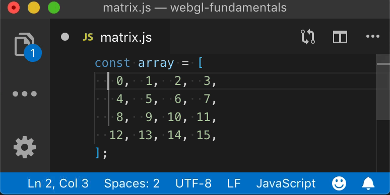

Title: WebGL Matrices vs Math Matrices
Description: The difference between WebGL conventions and Math conventions.
TOC: WebGL Matrices vs Math Matrices


This is article is an aside from the various articles that talk about
matrices in particular [the article that introduces matrices](webgl-2d-matrices.html) but also
[the article that introduces 3D](webgl-3d-orthographic.html), [the article on perspective projection](webgl-3d-perspective.html),
and [the article on cameras](webgl-3d-camera.html).

In programming generally a row goes from left to right, a column goes up and down.

> ## col·umn
> /ˈkäləm/
>
> *noun*
> 1. an upright pillar, typically cylindrical and made of stone or
 concrete, supporting an entablature, arch, or other structure or standing alone as a monument.
>
>    *synonyms*:	pillar, post, pole, upright, vertical, ...
>
> 2. a vertical division of a page or text.

> ## row
> /rō/
>
> *noun*
> * a horizontal line of entries in a table.

We can see examples in our software. For example my text editors
shows Lines and columns, lines being another word for row in this case since column is already taken

<div class="webgl_center"></div>

Notice in the bottom left area the status bar shows the line and column.

In spreadsheet software we see rows go across

<div class="webgl_center"></div>

And columns go down.

<div class="webgl_center"></div>

So, when we make a 3x3 or 4x4 matrix in JavaScript for WebGL we make them like this

```js
const m3x3 = [
  0, 1, 2,  // row 0
  3, 4, 5,  // row 1
  6, 7, 8,  // row 2
];

const m4x4 = [
   0,  1,  2,  3,  // row 0 
   4,  5,  6,  7,  // row 1
   8,  9, 10, 11,  // row 2
  12, 13, 14, 15,  // row 3
];
```

Clearly following the conventions above the first row of `m3x3` is `0, 1, 2` and the last row of `m4x4` is `12, 13, 14, 15`

As we see in [the first article on matrices](webgl-2d-matrices.html) to make a fairly standard WebGL 3x3 2D translation matrix the translation values `tx` and `ty` go in locations 6 and 7

```js
const some3x3TranslationMatrix = [
   1,  0,  0,
   0,  1,  0,
  tx, ty,  1,
];
```

or for a 4x4 matrix which is introduced in [the first article on 3D](webgl-3d-orthographic.html) the translation goes in locations 12, 13, 14 as in

```js
const some4x4TranslationMatrix = [
   1,  0,  0,  0,
   0,  1,  0,  0,
   0,  0,  1,  0,
  tx, ty, tz,  1,
];
```

But, there's an issue. Math conventions for matrix math generally do things in columns. A mathematician would write out a 3x3 translation matrix like this

<div class="webgl_center"></div>

and a 4x4 translation matrix like this

<div class="webgl_center"></div>

That leaves us with a problem. If we want our matrices to look like
math matrices we might decide to write a 4x4 matrix like this

```js
const some4x4TranslationMatrix = [
   1,  0,  0,  tx,
   0,  1,  0,  ty,
   0,  0,  1,  tx,
   0,  0,  0,  1,
];
```

Unfortunately doing it like that has issues. As mentioned in [the article on cameras](webgl-3d-camera.html) each of the columns of a 4x4 matrix often has a meaning

The first, second, and third columns are often considered the x, y, and z axis respectively and the last column is the position or translation.

One issue is in code it would be no fun to try to get those parts
separately. Want the Z axis? You'd have to do this

```js
const zAxis = [
  some4x4Matrix[2],
  some4x4Matrix[6],
  some4x4Matrix[10],
];
```

Ugh!

So, the way WebGL, and OpenGL ES on which WebGL is based, gets around this is it calls rows "columns".

```js
const some4x4TranslationMatrix = [
   1,  0,  0,  0,   // this is column 0
   0,  1,  0,  0,   // this is column 1
   0,  0,  1,  0,   // this is column 2
  tx, ty, tz,  1,   // this is column 3
];
```

Now it matches the math definition. Comparing to the example above, if we want the Z axis all we need to do is

```js
const zAxis = some4x4Matrix.slice(8, 11);
```

For those familiar with C++, OpenGL itself requires the 16 values of a 4x4
matrix to be consecutive in memory so in C++ we could create a `Vec4` struct or
class

```c++
// C++
struct Vec4 {
  float x;
  float y;
  float z;
  float w;
};
```

and we could create a matrix 4x4 from 4 of them

```c++
// C++
struct Mat4x4 {
  Vec4 x_axis;
  Vec4 y_axis;
  Vec4 z_axis;
  Vec4 translation;
}
```

or just

```c++
// C++
struct Mat4x4 {
  Vec4 column[4];
}
```

And it would just appear to work. 

Unfortunately it looks nothing like the math version when you actually declare one statically in code.

```C++
// C++
Mat4x4 someTranslationMatrix = {
  {  1,  0,  0,  0, },
  {  0,  1,  0,  0, },
  {  0,  0,  1,  0, },
  { tx, ty, tz,  1, },
};
```

Or back to JavaScript where we don't generally have something like C++ structs.

```js
const someTranslationMatrix = [
   1,  0,  0,  0,
   0,  1,  0,  0,
   0,  0,  1,  0,
  tx, ty, tz,  1,
];
```

So, with this convention of calling rows "columns" some things are simpler but others can be more confusing if you're a math person.

I bring all of this up because these articles are written from the POV of a programmer, not a math person. That means like every other single dimensional array that is treated as a 2 dimensional array, rows go across.

```js
const someTranslationMatrix = [
   1,  0,  0,  0,  // row 0
   0,  1,  0,  0,  // row 1
   0,  0,  1,  0,  // row 2
  tx, ty, tz,  1,  // row 3
];
```

just like

```js
// happy face image
const dataFor7x8OneChannelImage = [
    0, 255, 255, 255, 255, 255,   0,  // row 0
  255,   0,   0,   0,   0,   0, 255,  // row 1
  255,   0, 255,   0, 255,   0, 255,  // row 2
  255,   0,   0,   0,   0,   0, 255,  // row 3
  255,   0, 255,   0, 255,   0, 255,  // row 4
  255,   0, 255, 255, 255,   0, 255,  // row 5
  255,   0,   0,   0,   0,   0, 255,  // row 6
    0, 255, 255, 255, 255, 255,   0,  // row 7
]
```

and so these articles will refer to them as rows.

If you're a math person you might find it confusing. I'm sorry I
don't have a solution. I could call what is clearly row 3 a column
but that would also be confusing since it matches no other programming.

In any case, hopefully this helps clarify why none of the explanations look like something from a math book. Instead they look like code and use the conventions of code. I hope this helps explain what's going on
and it's not too confusing for those who are used to math conventions.
