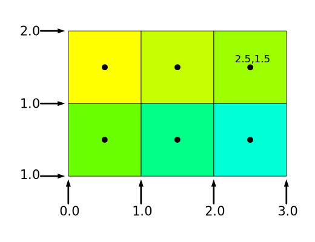

Title: WebGL Multiple Views, Multiple Canvases
Description: Drawing multiple views
TOC: Multiple Views, Multiple Canvases

This article assumes you've read the article on
[less code more fun](webgl-less-code-more-fun.html)
as it uses the library mentioned there so as to
unclutter the example. If you don't understand
when a function named `webglUtils.setBuffersAndAttributes`
what it means to set the buffers and attributes, or when
a function named `webglUtils.setUniforms` what it means
to set uniforms, etc... then you should probably to go further back and
[read the fundamentals](webgl-fundamentals.html).

Let's say you wanted to draw multiple views of the
same scene, how could we do this? One way would
be to [render to textures](webgl-render-to-texture.html)
and then draw those textures to the canvas. That is
certainly a valid way to do it and there are times it
might be the right thing to do. But, it requires that
we allocate textures, render stuff to them, then render
those textures on the canvas. That means we're effectively
double rendering. That might be appropriate, for example
in a racing game when we want to render the view in a rear
view mirror we'd render what's behind the car to a texture
then use that texture to draw the rear view mirror.

Another way is to set the viewport and turn on the scissor test.
This is great for situation where our views don't overlap. Even
better there is no double rendering like the solution above.

In the [very first article](webgl-fundamentals.html) it's mentioned
that we set how WebGL converts from clip space to pixel space by calling

```js
gl.viewport(left, bottom, width, height);
```

The most common thing is to set to those to `0`, `0`, `gl.canvas.width`, and `gl.canvas.height`
respectively to cover the entire canvas.

Instead we can set them to a portion of the canvas and they'll make it
so we only draw to that portion of the canvas. 
WebGL clips vertices in clip space.
As we mentioned before we set `gl_Position` in our vertex shader to values that go from -1 to +1 in x, y, z.
WebGL clips the triangles and lines we pass to that range. After the clipping happens then
the `gl.viewport` settings are applied so for example if we used

```js
gl.viewport(
   10,   // left
   20,   // bottom
   30,   // width
   40,   // height
);
```

Then a clip space value of x = -1 corresponds to pixel x = 10 and a clip space
value of +1 corresponds to a pixel x = 40 (a left of 10 plus a width of 30)
(Actually that's a slight over simplification, [see below](#pixel-coords))

So, after clipping if we draw a triangle it would appear to fit inside the viewport.

Let's draw our 'F' from [previous articles](webgl-3d-perspective.html).

The vertex and fragment shaders are the same as the ones used in the articles on
[orthographic](webgl-3d-orthographic.html) and [perspective](webgl-3d-perspective.html)
projection.

```glsl
// vertex shader
attribute vec4 a_position;
attribute vec4 a_color;

uniform mat4 u_matrix;

varying vec4 v_color;

void main() {
  // Multiply the position by the matrix.
  gl_Position = u_matrix * a_position;

  // Pass the vertex color to the fragment shader.
  v_color = a_color;
}
```

```glsl
// fragment shader
precision mediump float;

// Passed in from the vertex shader.
varying vec4 v_color;

void main() {
  gl_FragColor = v_color;
}
```

Then at init time we need to create the program and
the buffers for the 'F'

```js
// setup GLSL programs
// compiles shaders, links program, looks up locations
const programInfo = webglUtils.createProgramInfo(gl, ["vertex-shader-3d", "fragment-shader-3d"]);

// create buffers and fill with data for a 3D 'F'
const bufferInfo = primitives.create3DFBufferInfo(gl);
```

And to draw let's make a function we can pass a projection matrix,
a camera matrix, and a world matrix

```js
function drawScene(projectionMatrix, cameraMatrix, worldMatrix) {
  // Make a view matrix from the camera matrix.
  const viewMatrix = m4.inverse(cameraMatrix);
 
  // multiply them together to make a worldViewProjection matrix.
  let mat = m4.multiply(projectionMatrix, viewMatrix);
  mat = m4.multiply(mat, worldMatrix);
 
  gl.useProgram(programInfo.program);
 
  // ------ Draw the F --------
 
  // Setup all the needed attributes.
  webglUtils.setBuffersAndAttributes(gl, programInfo, bufferInfo);
 
  // Set the uniforms
  webglUtils.setUniforms(programInfo, {
    u_matrix: mat,
  });
 
  // calls gl.drawArrays or gl.drawElements
  webglUtils.drawBufferInfo(gl, bufferInfo);
}
```

and then let's call that function to draw the F.

```js
function degToRad(d) {
  return d * Math.PI / 180;
}

const settings = {
  rotation: 150,  // in degrees
};
const fieldOfViewRadians = degToRad(120);

function render() {
  webglUtils.resizeCanvasToDisplaySize(gl.canvas);

  gl.viewport(0, 0, gl.canvas.width, gl.canvas.height);

  gl.enable(gl.CULL_FACE);
  gl.enable(gl.DEPTH_TEST);

  const aspect = gl.canvas.clientWidth / gl.canvas.clientHeight;
  const near = 1;
  const far = 2000;

  // Compute a perspective projection matrix
  const perspectiveProjectionMatrix =
      m4.perspective(fieldOfViewRadians, aspect, near, far);

  // Compute the camera's matrix using look at.
  const cameraPosition = [0, 0, -75];
  const target = [0, 0, 0];
  const up = [0, 1, 0];
  const cameraMatrix = m4.lookAt(cameraPosition, target, up);

  // rotate the F in world space
  let worldMatrix = m4.yRotation(degToRad(settings.rotation));
  worldMatrix = m4.xRotate(worldMatrix, degToRad(settings.rotation));
  // center the 'F' around its origin
  worldMatrix = m4.translate(worldMatrix, -35, -75, -5);

  drawScene(perspectiveProjectionMatrix, cameraMatrix, worldMatrix);
}
render();
```

This is basically the same as the final example from 
[the article on perspective](webgl-3d-perspective.html)
except we're using [our library](webgl-less-code-more-fun.html) to keep the code simpler.

{{{example url="../webgl-multiple-views-one-view.html"}}}

Now let's make it draw 2 views of the 'F' side by side
by using `gl.viewport`

```js
function render() {
  webglUtils.resizeCanvasToDisplaySize(gl.canvas);

-  gl.viewport(0, 0, gl.canvas.width, gl.canvas.height);

  gl.enable(gl.CULL_FACE);
  gl.enable(gl.DEPTH_TEST);

  // we're going to split the view in 2
-  const aspect = gl.canvas.clientWidth / gl.canvas.clientHeight;
+  const effectiveWidth = gl.canvas.clientWidth / 2;
+  const aspect = effectiveWidth / gl.canvas.clientHeight;
  const near = 1;
  const far = 2000;

  // Compute a perspective projection matrix
  const perspectiveProjectionMatrix =
      m4.perspective(fieldOfViewRadians, aspect, near, far);

+  // Compute an orthographic projection matrix
+  const halfHeightUnits = 120;
+  const orthographicProjectionMatrix = m4.orthographic(
+      -halfHeightUnits * aspect,  // left
+       halfHeightUnits * aspect,  // right
+      -halfHeightUnits,           // bottom
+       halfHeightUnits,           // top
+       -75,                       // near
+       2000);                     // far

  // Compute the camera's matrix using look at.
  const cameraPosition = [0, 0, -75];
  const target = [0, 0, 0];
  const up = [0, 1, 0];
  const cameraMatrix = m4.lookAt(cameraPosition, target, up);

  let worldMatrix = m4.yRotation(degToRad(settings.rotation));
  worldMatrix = m4.xRotate(worldMatrix, degToRad(settings.rotation));
  // center the 'F' around its origin
  worldMatrix = m4.translate(worldMatrix, -35, -75, -5);

+  const {width, height} = gl.canvas;
+  const leftWidth = width / 2 | 0;
+
+  // draw on the left with orthographic camera
+  gl.viewport(0, 0, leftWidth, height);
+
+  drawScene(orthographicProjectionMatrix, cameraMatrix, worldMatrix);

+  // draw on the right with perspective camera
+  const rightWidth = width - leftWidth;
+  gl.viewport(leftWidth, 0, rightWidth, height);

  drawScene(perspectiveProjectionMatrix, cameraMatrix, worldMatrix);
}
```

You can see above first we set the viewport to cover the left
half of the canvas, draw, then we set it to cover the right half and
draw. Otherwise we're drawing the same thing on both sides except
we change the projection matrix.

{{{example url="../webgl-multiple-views.html"}}}

Let's clear both sides to different colors

First, in `drawScene` lets call `gl.clear`

```js
  function drawScene(projectionMatrix, cameraMatrix, worldMatrix) {
+    // Clear the canvas AND the depth buffer.
+    gl.clear(gl.COLOR_BUFFER_BIT | gl.DEPTH_BUFFER_BIT);

    ...
```

Then let's set clear colors before calling `drawScene`

```js
  const {width, height} = gl.canvas;
  const leftWidth = width / 2 | 0;

  // draw on left with orthographic camera
  gl.viewport(0, 0, leftWidth, height);
+  gl.clearColor(1, 0, 0, 1);  // red

  drawScene(orthographicProjectionMatrix, cameraMatrix, worldMatrix);

  // draw on left with orthographic camera
  const rightWidth = width - leftWidth;
  gl.viewport(leftWidth, 0, rightWidth, height);
  gl.clearColor(0, 0, 1, 1);  // blue

+  drawScene(perspectiveProjectionMatrix, cameraMatrix, worldMatrix);
```

{{{example url="../webgl-multiple-views-clear-issue.html"}}}

Oops, what happened? Why is there nothing on the left?

It turns out `gl.clear` does not look at the `viewport`
settings. To fix this we can use the *scissor test*.
The scissor test lets use define a rectangle. Anything
outside that rectangle will not be affected if the scissor
test is enabled.

The scissor test is off by default. We can enable it
by calling 

```
gl.enable(gl.SCISSOR_TEST);
```

Like the viewport it defaults to the initial size of the canvas
but we can set with same parameters as the viewport by calling
`gl.scissor` as in

```js
gl.scissor(
   10,   // left
   20,   // bottom
   30,   // width
   40,   // height
);
```

So let's add those in

```js
function render() {
  webglUtils.resizeCanvasToDisplaySize(gl.canvas);

  gl.enable(gl.CULL_FACE);
  gl.enable(gl.DEPTH_TEST);
+  gl.enable(gl.SCISSOR_TEST);

  ...

  const {width, height} = gl.canvas;
  const leftWidth = width / 2 | 0;

  // draw on left with orthographic camera
  gl.viewport(0, 0, leftWidth, height);
+  gl.scissor(0, 0, leftWidth, height);
  gl.clearColor(1, 0, 0, 1);  // red

  drawScene(orthographicProjectionMatrix, cameraMatrix, worldMatrix);

  // draw on left with orthographic camera
  const rightWidth = width - leftWidth;
  gl.viewport(leftWidth, 0, rightWidth, height);
+  gl.scissor(leftWidth, 0, rightWidth, height);
  gl.clearColor(0, 0, 1, 1);  // blue

  drawScene(perspectiveProjectionMatrix, cameraMatrix, worldMatrix);
}
```

and now it should work.

{{{example url="../webgl-multiple-views-clear-fixed.html"}}}

Of course you're not limited to drawing the same scene
You can draw whatever you want in each view.

## Drawing Multiple Canvases

This is a good solution for simulating multiple canvases.
Let's say you wanted to make character selection screen
for a game an you want to show 3D models of each head in a list so the
user can select one.
Or let's say you wanted to make an e-commerce site and show
3d models of each product down the page at the same time.

The most obvious way to do this would be to put a `<canvas>`
each place you want to show an item. Unfortunately you'd run into a
bunch of issues.

First, Each canvas would require a different WebGL context
WebGL contexts can not share resources so you'd have
to compile shaders for each canvas, load textures for
each canvas, upload geometry for each canvas.

Another issue is most browsers have a limit on how many simultaneous canvases
they support. For many it's as low as 8. That means as soon
as you create a webgl context on the 9th canvas the first
canvas will lose its context.

We can work around these issues by making just 1 large canvas
that covers the entire window. We'll then put a placeholder
`<div>` each place we want to draw an item. We can use
[`element.getBoundingClientRect`](https://developer.mozilla.org/en-US/docs/Web/API/Element/getBoundingClientRect)
to find out where to set the viewport and scissor to
draw in that area.

This will solve both problems mentioned above. We'll only
have one webgl context so we can share resources and we won't
run into the context limit.

Let's make an example.

First let's make a canvas that goes in the background with some content
that goes in front. First the HTML

```html
<body>
  <canvas id="canvas"></canvas>
  <div id="content"></div>
</body>
```

Then the CSS

```css
body {
  margin: 0;
}
#content {
  margin: 10px;
}
#canvas {
  position: absolute;
  top: 0;
  width: 100%;
  height: 100vh;
  z-index: -1;
  display: block;
}
```

Now let's make a few things to draw. [Remember](webgl-less-code-more-fun.html) 
that a `BufferInfo` is just a list of buffers by name and the settings need to set their attributes

```js
// create buffers and fill with data for various things.
const bufferInfos = [
  primitives.createCubeBufferInfo(
      gl,
      1,  // width
      1,  // height
      1,  // depth
  ),
  primitives.createSphereBufferInfo(
      gl,
      0.5,  // radius
      8,    // subdivisions around
      6,    // subdivisions down
  ),
  primitives.createTruncatedConeBufferInfo(
      gl,
      0.5,  // bottom radius
      0,    // top radius
      1,    // height
      6,    // subdivisions around
      1,    // subdivisions down
  ),
];
```

Now let's make 100 html items. For each one we'll create a container div
and inside will be a view and a label. The view is just an empty div
where we want to draw the item.

```js
function createElem(type, parent, className) {
  const elem = document.createElement(type);
  parent.appendChild(elem);
  if (className) {
    elem.className = className;
  }
  return elem;
}

function randArrayElement(array) {
  return array[Math.random() * array.length | 0];
}

function rand(min, max) {
  if (max === undefined) {
    max = min;
    min = 0;
  }
  return Math.random() * (max - min) + min;
}

const contentElem = document.querySelector('#content');
const items = [];
const numItems = 100;
for (let i = 0; i < numItems; ++i) {
  const outerElem = createElem('div', contentElem, 'item');
  const viewElem = createElem('div', outerElem, 'view');
  const labelElem = createElem('div', outerElem, 'label');
  labelElem.textContent = `Item ${i + 1}`;
  const bufferInfo = randArrayElement(bufferInfos);
  const color = [rand(1), rand(1), rand(1), 1];
  items.push({
    bufferInfo,
    color,
    element: viewElem,
  });
}
```

Let's style these items as follows

```css
.item {
  display: inline-block;
  margin: 1em;
  padding: 1em;
}
.label {
  margin-top: 0.5em;
}
.view {
  width: 250px;
  height: 250px;
  border: 1px solid black;
}
```

The `items` array has a `bufferInfo`, a `color` and an `element`
for each item. We loop over all the items one at a time and call
[`element.getBoundingClientRect`](https://developer.mozilla.org/en-US/docs/Web/API/Element/getBoundingClientRect)
and use the rectangle returned to see if that element intersects
with the canvas. If it does we set the viewport and scissor to
match and then draw that object.

```js
function render(time) {
  time *= 0.001;  // convert to seconds

  webglUtils.resizeCanvasToDisplaySize(gl.canvas);

  gl.enable(gl.CULL_FACE);
  gl.enable(gl.DEPTH_TEST);
  gl.enable(gl.SCISSOR_TEST);

  // move the canvas to top of the current scroll position
  gl.canvas.style.transform = `translateY(${window.scrollY}px)`;

  for (const {bufferInfo, element, color} of items) {
    const rect = element.getBoundingClientRect();
    if (rect.bottom < 0 || rect.top  > gl.canvas.clientHeight ||
        rect.right  < 0 || rect.left > gl.canvas.clientWidth) {
      continue;  // it's off screen
    }

    const width  = rect.right - rect.left;
    const height = rect.bottom - rect.top;
    const left   = rect.left;
    const bottom = gl.canvas.clientHeight - rect.bottom;

    gl.viewport(left, bottom, width, height);
    gl.scissor(left, bottom, width, height);
    gl.clearColor(...color);

    const aspect = width / height;
    const near = 1;
    const far = 2000;

    // Compute a perspective projection matrix
    const perspectiveProjectionMatrix =
        m4.perspective(fieldOfViewRadians, aspect, near, far);

    // Compute the camera's matrix using look at.
    const cameraPosition = [0, 0, -2];
    const target = [0, 0, 0];
    const up = [0, 1, 0];
    const cameraMatrix = m4.lookAt(cameraPosition, target, up);

    // rotate the item
    const rTime = time * 0.2;
    const worldMatrix = m4.xRotate(m4.yRotation(rTime), rTime);

    drawScene(perspectiveProjectionMatrix, cameraMatrix, worldMatrix, bufferInfo);
  }
  requestAnimationFrame(render);
}
requestAnimationFrame(render);
```

I made the code above use a [requestAnimationFrame loop](webgl-animation.html)
so I could animate the objects. I also passed which bufferInfo to draw
to `drawScene`. The shader is just using the normals as colors to keep
the shaders simple. If I added [lighting](webgl-3d-lighting-spot.html)
the code would get much more complicated.

{{{example url="../webgl-multiple-views-items.html"}}}

Of course you could draw whole 3D scenes or whatever for each item.
As long as you set the viewport and scissor correctly and then set up
your projection matrix to match the aspect of the area it should work.

One other notable thing about the code is we're moving the canvas
with this line

```js
gl.canvas.style.transform = `translateY(${window.scrollY}px)`;
```

Why? We could instead set the canvas to `position: fixed;` in which case
it would not scroll with the page. The difference would be subtle.
The browser tries to scroll the page as smooth as possible. That might be
faster than we can draw our objects. Because of this we have 2 options.

1. Use a fixed position canvas

   In this case if we can't update fast enough the HTML in front of the canvas will scroll but the canvas itself
   won't so for a few moments they will be out of sync

   

2. Move the canvas under the content

   In this case if we can't update fast enough the canvas will scroll in sync
   with the HTML but new areas where we want stuff drawn will be blank until we get
   a chance to draw.

   

   This is the solution used above

If you want to handle horizontal scrolling just change this line

```js
gl.canvas.style.transform = `translateY(${window.scrollY}px)`;
```

to this

```js
gl.canvas.style.transform = `translateX(${window.scrollX}px) translateY(${window.scrollY}px)`;
```

{{{example url="../webgl-multiple-views-items-horizontal-scrolling.html"}}}

Hopefully this article gave you some ideas how to draw multiple views.
We'll use these techniques in a few future articles where
being able to see multiple views is useful for understanding.

<div class="webgl_bottombar" id="pixel-coords">
<h3>Pixel Coordinates</h3>
<p>Pixel coordinates in WebGL
are referenced by their edges. So for example if we had
a canvas that was 3x2 pixels big and we set the viewport
as</p>
<pre class="prettyprint"><code>
gl.viewport(
  0, // left
  0, // bottom
  3, // width
  2, // height
);
</code></pre>
<p>Then we're really defining this rectangle that surrounds 3x2 pixels</p>
<div class="webgl_center"></div>
<p>That means a clip space value of X = -1.0 corresponds to the left edge of this rectangle
and a clip space value of X = 1.0 corresponds to the right. Above I said X = -1.0 corresponds to the left most pixel
but really to corresponds to the left edge</p>
</div>
