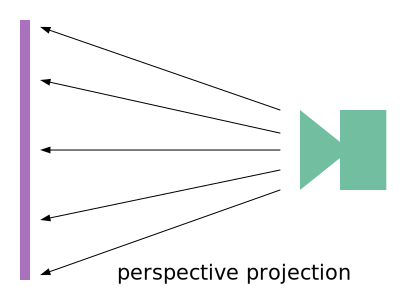
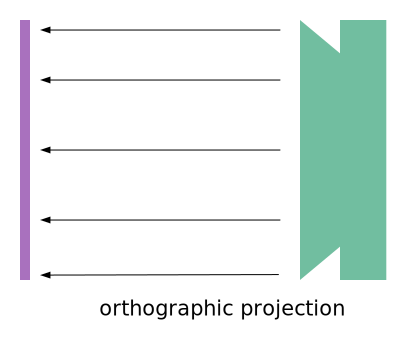

Title: WebGL Planar and Perspective Projection Mapping
Description: Projecting a texture as a plane
TOC: Planar and Perspective Projection Mapping

This article assumes you've read the article on
[less code more fun](webgl-less-code-more-fun.html)
as it uses the library mentioned there so as to
unclutter the example. If you don't understand
when a function named `webglUtils.setBuffersAndAttributes`
what it means to set the buffers and attributes, or when
a function named `webglUtils.setUniforms` what it means
to set uniforms, etc... then you should probably to go further back and
[read the fundamentals](webgl-fundamentals.html).

It also assumes you've read [the articles on perspective](webgl-3d-perspective.html),
[the article on cameras](webgl-3d-camera.html), [the article on textures](webgl-3d-textures.html),
and [the article visualizing the camera](webgl-visualizing-the-camera.html) so if
you haven't read those you should probably start there first.

Projection mapping is the process of "projecting" an image in the same sense
of pointing a movie projector at a screen and projecting a movie on it.
A movie projector projects a perspective plane. As the screen gets further
from the projector the image gets bigger. If you angle the screen so
it's non-perpendicular to the movie projector the result would be
a trapezoid or some arbitrary quadrilateral.

<div class="webgl_center"></div>

Of course projection mapping doesn't have to be flat. There are things like 
cylindrical projection mapping, spherical projection mapping, and more etc... 

Let's cover planar projection mapping first. In this case
you'd have to imagine the movie projector is as large as the screen
so that instead of movie getting larger as the screen gets further
from the movie projector it stays the same size.

<div class="webgl_center"></div>

First let's make a simple scene that draws a plane and a sphere.
We'll texture both with a simple 8x8 checkerboard texture.

The shaders are similar to the ones from [the article on textures](webgl-3d-textures.html)
except the various matrices are separated out so we don't need to multiply them together
in JavaScript. 

```glsl
// vertex shader
attribute vec4 a_position;
attribute vec2 a_texcoord;

uniform mat4 u_projection;
uniform mat4 u_view;
uniform mat4 u_world;

varying vec2 v_texcoord;

void main() {
  gl_Position = u_projection * u_view * u_world * a_position;

  // Pass the texture coord to the fragment shader.
  v_texcoord = a_texcoord;
}
```

Also I added a uniform `u_colorMult` to multiply the texture color
by. By making a monochrome texture we can change its color this way.

```glsl
// fragment shader
precision mediump float;

// Passed in from the vertex shader.
varying vec2 v_texcoord;

uniform vec4 u_colorMult;
uniform sampler2D u_texture;

void main() {
  gl_FragColor = texture2D(u_texture, v_texcoord) * u_colorMult;
}
```

Here's the code to setup the program, sphere buffers, and plane buffers

```js
// setup GLSL program
// compiles shader, links program, look up locations
const textureProgramInfo = webglUtils.createProgramInfo(gl, ['vertex-shader-3d', 'fragment-shader-3d']);

const sphereBufferInfo = primitives.createSphereBufferInfo(
    gl,
    1,  // radius
    12, // subdivisions around
    6,  // subdivisions down
);
const planeBufferInfo = primitives.createPlaneBufferInfo(
    gl,
    20,  // width
    20,  // height
    1,   // subdivisions across
    1,   // subdivisions down
);
```

And the code to make an 8x8 pixel checkerboard texture
using techniques we covered in [the article on data textures](webgl-data-textures.html).

```js
// make a 8x8 checkerboard texture
const checkerboardTexture = gl.createTexture();
gl.bindTexture(gl.TEXTURE_2D, checkerboardTexture);
gl.texImage2D(
    gl.TEXTURE_2D,
    0,                // mip level
    gl.LUMINANCE,     // internal format
    8,                // width
    8,                // height
    0,                // border
    gl.LUMINANCE,     // format
    gl.UNSIGNED_BYTE, // type
    new Uint8Array([  // data
      0xFF, 0xCC, 0xFF, 0xCC, 0xFF, 0xCC, 0xFF, 0xCC,
      0xCC, 0xFF, 0xCC, 0xFF, 0xCC, 0xFF, 0xCC, 0xFF,
      0xFF, 0xCC, 0xFF, 0xCC, 0xFF, 0xCC, 0xFF, 0xCC,
      0xCC, 0xFF, 0xCC, 0xFF, 0xCC, 0xFF, 0xCC, 0xFF,
      0xFF, 0xCC, 0xFF, 0xCC, 0xFF, 0xCC, 0xFF, 0xCC,
      0xCC, 0xFF, 0xCC, 0xFF, 0xCC, 0xFF, 0xCC, 0xFF,
      0xFF, 0xCC, 0xFF, 0xCC, 0xFF, 0xCC, 0xFF, 0xCC,
      0xCC, 0xFF, 0xCC, 0xFF, 0xCC, 0xFF, 0xCC, 0xFF,
    ]));
gl.generateMipmap(gl.TEXTURE_2D);
gl.texParameteri(gl.TEXTURE_2D, gl.TEXTURE_MAG_FILTER, gl.NEAREST);
```

To draw we'll make a function that takes a projection matrix
and a camera matrix, computes the view matrix from the camera
matrix and then draws the sphere and the cube

```js
// Uniforms for each object.
const planeUniforms = {
  u_colorMult: [0.5, 0.5, 1, 1],  // lightblue
  u_texture: checkerboardTexture,
  u_world: m4.translation(0, 0, 0),
};
const sphereUniforms = {
  u_colorMult: [1, 0.5, 0.5, 1],  // pink
  u_texture: checkerboardTexture,
  u_world: m4.translation(2, 3, 4),
};

function drawScene(projectionMatrix, cameraMatrix) {
  // Make a view matrix from the camera matrix.
  const viewMatrix = m4.inverse(cameraMatrix);

  gl.useProgram(textureProgramInfo.program);

  // Set the uniform that both the sphere and the plane share
  webglUtils.setUniforms(textureProgramInfo, {
    u_view: viewMatrix,
    u_projection: projectionMatrix,
  });

  // ------ Draw the sphere --------

  // Setup all the needed attributes.
  webglUtils.setBuffersAndAttributes(gl, textureProgramInfo, sphereBufferInfo);

  // Set the uniforms unique to the sphere
  webglUtils.setUniforms(textureProgramInfo, sphereUniforms);

  // calls gl.drawArrays or gl.drawElements
  webglUtils.drawBufferInfo(gl, sphereBufferInfo);

  // ------ Draw the plane --------

  // Setup all the needed attributes.
  webglUtils.setBuffersAndAttributes(gl, textureProgramInfo, planeBufferInfo);

  // Set the uniforms unique to the plane
  webglUtils.setUniforms(textureProgramInfo, planeUniforms);

  // calls gl.drawArrays or gl.drawElements
  webglUtils.drawBufferInfo(gl, planeBufferInfo);
}
```

We can use this code from a `render` function like this

```js
const settings = {
  cameraX: 2.75,
  cameraY: 5,
};
const fieldOfViewRadians = degToRad(60);

function render() {
  webglUtils.resizeCanvasToDisplaySize(gl.canvas);

  // Tell WebGL how to convert from clip space to pixels
  gl.viewport(0, 0, gl.canvas.width, gl.canvas.height);

  gl.enable(gl.CULL_FACE);
  gl.enable(gl.DEPTH_TEST);

  // Clear the canvas AND the depth buffer.
  gl.clear(gl.COLOR_BUFFER_BIT | gl.DEPTH_BUFFER_BIT);

  // Compute the projection matrix
  const aspect = gl.canvas.clientWidth / gl.canvas.clientHeight;
  const projectionMatrix =
      m4.perspective(fieldOfViewRadians, aspect, 1, 2000);

  // Compute the camera's matrix using look at.
  const cameraPosition = [settings.cameraX, settings.cameraY, 7];
  const target = [0, 0, 0];
  const up = [0, 1, 0];
  const cameraMatrix = m4.lookAt(cameraPosition, target, up);

  drawScene(projectionMatrix, cameraMatrix);
}
render();
```

So now we have a simple scene with a plane and a sphere.
I added a couple of sliders to let you change the camera position
to help understand the scene.

{{{example url="../webgl-planar-projection-setup.html"}}}

Now let's planar project a texture on to those the sphere
and the plane.

The first thing to do, let's [load a texture](webgl-3d-textures.html).

```js
function loadImageTexture(url) {
  // Create a texture.
  const texture = gl.createTexture();
  gl.bindTexture(gl.TEXTURE_2D, texture);
  // Fill the texture with a 1x1 blue pixel.
  gl.texImage2D(gl.TEXTURE_2D, 0, gl.RGBA, 1, 1, 0, gl.RGBA, gl.UNSIGNED_BYTE,
                new Uint8Array([0, 0, 255, 255]));
  // Asynchronously load an image
  const image = new Image();
  image.src = url;
  image.addEventListener('load', function() {
    // Now that the image has loaded make copy it to the texture.
    gl.bindTexture(gl.TEXTURE_2D, texture);
    gl.texImage2D(gl.TEXTURE_2D, 0, gl.RGBA, gl.RGBA,gl.UNSIGNED_BYTE, image);
    // assumes this texture is a power of 2
    gl.generateMipmap(gl.TEXTURE_2D);
    render();
  });
  return texture;
}

const imageTexture = loadImageTexture('resources/f-texture.png');
```

Recall from [the article on visualizing the camera](webgl-visualizing-the-camera.html)
We created a -1 to +1 cube and drew it to represent the frustum of the camera.
Our matrices made it so the space inside that frustum represents some frustum shaped
area inside the world space that is being converted from that world space into
-1 to +1 clip space. We can do a similar thing here.

Let's try it. First in our fragment shader we'll draw the projected texture
anywhere its texture coordinates are between 0.0 and 1.0.
Outside that range we'll use the checkerboard texture

```glsl
precision mediump float;

// Passed in from the vertex shader.
varying vec2 v_texcoord;
+varying vec4 v_projectedTexcoord;

uniform vec4 u_colorMult;
uniform sampler2D u_texture;
+uniform sampler2D u_projectedTexture;

void main() {
-  gl_FragColor = texture2D(u_texture, v_texcoord) * u_colorMult;
+  // divide by w to get the correct value. See article on perspective
+  vec3 projectedTexcoord = v_projectedTexcoord.xyz / v_projectedTexcoord.w;
+
+  bool inRange = 
+      projectedTexcoord.x >= 0.0 &&
+      projectedTexcoord.x <= 1.0 &&
+      projectedTexcoord.y >= 0.0 &&
+      projectedTexcoord.y <= 1.0;
+
+  vec4 projectedTexColor = texture2D(u_projectedTexture, projectedTexcoord.xy);
+  vec4 texColor = texture2D(u_texture, v_texcoord) * u_colorMult;
+
+  float projectedAmount = inRange ? 1.0 : 0.0;
+  gl_FragColor = mix(texColor, projectedTexColor, projectedAmount);
}
```

To compute the projected texture coordinates we'll make
a matrix that represents a 3D space oriented and positioned
in a certain direction just like the camera from [the article on visualizing the camera](webgl-visualizing-the-camera.html). 
We'll then project the world positions
of the sphere and plane vertices through that space. Where
they are between 0 and 1 the code we just wrote will show the
texture.

Let's add code to the vertex shader to project the world positions of the
sphere and plane through this *space*

```glsl
attribute vec4 a_position;
attribute vec2 a_texcoord;

uniform mat4 u_projection;
uniform mat4 u_view;
uniform mat4 u_world;
+uniform mat4 u_textureMatrix;

varying vec2 v_texcoord;
+varying vec4 v_projectedTexcoord;

void main() {
+  vec4 worldPosition = u_world * a_position;

-  gl_Position = u_projection * u_view * u_world * a_position;
+  gl_Position = u_projection * u_view * worldPosition;

  // Pass the texture coord to the fragment shader.
  v_texcoord = a_texcoord;

+  v_projectedTexcoord = u_textureMatrix * worldPosition;
}
```

So now all that's left is to actually compute the matrix that
defines this oriented space. All we have to do is compute a
world matrix like we would for any other object, then take
its inverse. This will give as a matrix that lets us orient
the world positions of other objects relative to this space.
This is exactly the same thing the view matrix does from
[the article on cameras](webgl-3d-camera.html).

We'll use our `lookAt` function we made in that [same article](webgl-3d-camera.html)

```js
const settings = {
  cameraX: 2.75,
  cameraY: 5,
+  posX: 3.5,
+  posY: 4.4,
+  posZ: 4.7,
+  targetX: 0.8,
+  targetY: 0,
+  targetZ: 4.7,
};

function drawScene(projectionMatrix, cameraMatrix) {
  // Make a view matrix from the camera matrix.
  const viewMatrix = m4.inverse(cameraMatrix);

  let textureWorldMatrix = m4.lookAt(
      [settings.posX, settings.posY, settings.posZ],          // position
      [settings.targetX, settings.targetY, settings.targetZ], // target
      [0, 1, 0],                                              // up
  );

  // use the inverse of this world matrix to make
  // a matrix that will transform other positions
  // to be relative this world space.
  const textureMatrix = m4.inverse(textureWorldMatrix);

  // set uniforms that are the same for both the sphere and plane
  webglUtils.setUniforms(textureProgramInfo, {
    u_view: viewMatrix,
    u_projection: projectionMatrix,
+    u_textureMatrix: textureMatrix,
+    u_projectedTexture: imageTexture,
  });

  ...
}
```

Of course you don't have to use `lookAt`. You can make
a world matrix anyway you choose, for example using
a [scene graph](webgl-scene-graph.html) or [matrix stack](webgl-2d-matrix-stack.html).

Before we run it let's add some kind of scale

```js
const settings = {
  cameraX: 2.75,
  cameraY: 5,
  posX: 3.5,
  posY: 4.4,
  posZ: 4.7,
  targetX: 0.8,
  targetY: 0,
  targetZ: 4.7,
+  projWidth: 2,
+  projHeight: 2,
};

function drawScene(projectionMatrix, cameraMatrix) {
  // Make a view matrix from the camera matrix.
  const viewMatrix = m4.inverse(cameraMatrix);

  let textureWorldMatrix = m4.lookAt(
      [settings.posX, settings.posY, settings.posZ],          // position
      [settings.targetX, settings.targetY, settings.targetZ], // target
      [0, 1, 0],                                              // up
  );
+  textureWorldMatrix = m4.scale(
+      textureWorldMatrix,
+      settings.projWidth, settings.projHeight, 1,
+  );

  // use the inverse of this world matrix to make
  // a matrix that will transform other positions
  // to be relative this world space.
  const textureMatrix = m4.inverse(textureWorldMatrix);

  ...
}
```

And with that we get a projected texture.

{{{example url="../webgl-planar-projection.html"}}}

I think it might be hard to see the space the texture is in.
Let's add a wireframe cube to help visualize

First we need a separate set of shaders. These shaders
can just draw a solid color, no textures.

```html
<script id="color-vertex-shader" type="x-shader/x-vertex">
attribute vec4 a_position;

uniform mat4 u_projection;
uniform mat4 u_view;
uniform mat4 u_world;

void main() {
  // Multiply the position by the matrices.
  gl_Position = u_projection * u_view * u_world * a_position;
}
</script>
```

```html
<script id="color-fragment-shader" type="x-shader/x-fragment">
precision mediump float;

uniform vec4 u_color;
void main() {
  gl_FragColor = u_color;
}
</script>
```

Then we need to compile and link these shaders as well

```js
// setup GLSL programs
const textureProgramInfo = webglUtils.createProgramInfo(gl, ['vertex-shader-3d', 'fragment-shader-3d']);
+const colorProgramInfo = webglUtils.createProgramInfo(gl, ['color-vertex-shader', 'color-fragment-shader']);
```

And we need some data to draw a cube made from lines

```js
const sphereBufferInfo = primitives.createSphereBufferInfo(
    gl,
    1,  // radius
    12, // subdivisions around
    6,  // subdivisions down
);
const planeBufferInfo = primitives.createPlaneBufferInfo(
    gl,
    20,  // width
    20,  // height
    1,   // subdivisions across
    1,   // subdivisions down
);
+const cubeLinesBufferInfo = webglUtils.createBufferInfoFromArrays(gl, {
+  position: [
+     0,  0, -1,
+     1,  0, -1,
+     0,  1, -1,
+     1,  1, -1,
+     0,  0,  1,
+     1,  0,  1,
+     0,  1,  1,
+     1,  1,  1,
+  ],
+  indices: [
+    0, 1,
+    1, 3,
+    3, 2,
+    2, 0,
+
+    4, 5,
+    5, 7,
+    7, 6,
+    6, 4,
+
+    0, 4,
+    1, 5,
+    3, 7,
+    2, 6,
+  ],
+});
```

Notice this cube goes from 0 to 1 in X and Y to match the
texture coords. In Z it goes from -1 to 1. This is so we
can scale it to stretch it in both directions.

Now to use it we can just use the `textureWorldMatrix`
from before since all we want to do is draw the cube where
that space exists.

```js
function drawScene(projectionMatrix, cameraMatrix) {

  ...
+  // ------ Draw the cube ------
+
+  gl.useProgram(colorProgramInfo.program);
+
+  // Setup all the needed attributes.
+  webglUtils.setBuffersAndAttributes(gl, colorProgramInfo, cubeLinesBufferInfo);
+
+  // scale the cube in Z so it's really long
+  // to represent the texture is being projected to
+  // infinity
+  const mat = m4.scale(textureWorldMatrix, 1, 1, 1000);
+
+  // Set the uniforms we just computed
+  webglUtils.setUniforms(colorProgramInfo, {
+    u_color: [0, 0, 0, 1],
+    u_view: viewMatrix,
+    u_projection: projectionMatrix,
+    u_world: mat,
+  });
+
+  // calls gl.drawArrays or gl.drawElements
+  webglUtils.drawBufferInfo(gl, cubeLinesBufferInfo, gl.LINES);
}
```

And with that now we can see more easily see where the projection
is.

{{{example url="../webgl-planar-projection-with-lines.html"}}}

I think it's important to note that we're not really *projecting*
the texture. Rather we're doing the opposite. For each pixel
of an object being rendered we're seeing what part of the texture
would be projected there and then looking up the color at that part
of the texture.

Since we mentioned movie projectors above how would we simulate
a movie projector? Basically we can just multiply in a projection matrix

```js
const settings = {
  cameraX: 2.75,
  cameraY: 5,
  posX: 2.5,
  posY: 4.8,
  posZ: 4.3,
  targetX: 2.5,
  targetY: 0,
  targetZ: 3.5,
  projWidth: 1,
  projHeight: 1,
+  perspective: true,
+  fieldOfView: 45,
};

...

function drawScene(projectionMatrix, cameraMatrix) {
  // Make a view matrix from the camera matrix.
  const viewMatrix = m4.inverse(cameraMatrix);

  const textureWorldMatrix = m4.lookAt(
      [settings.posX, settings.posY, settings.posZ],          // position
      [settings.targetX, settings.targetY, settings.targetZ], // target
      [0, 1, 0],                                              // up
  );
-  textureWorldMatrix = m4.scale(
-      textureWorldMatrix,
-      settings.projWidth, settings.projHeight, 1,
-  );
  
+  const textureProjectionMatrix = settings.perspective
+      ? m4.perspective(
+          degToRad(settings.fieldOfView),
+          settings.projWidth / settings.projHeight,
+          0.1,  // near
+          200)  // far
+      : m4.orthographic(
+          -settings.projWidth / 2,   // left
+           settings.projWidth / 2,   // right
+          -settings.projHeight / 2,  // bottom
+           settings.projHeight / 2,  // top
+           0.1,                      // near
+           200);                     // far

  // use the inverse of this world matrix to make
  // a matrix that will transform other positions
  // to be relative this world space.
-  const textureMatrix = m4.inverse(textureWorldMatrix);
+  const textureMatrix = m4.multiply(
+      textureProjectionMatrix,
+      m4.inverse(textureWorldMatrix));
```

Note there is both an option to use a perspective or and orthographic projection matrix.

We also need to use that projection matrix when
drawing the lines

```js
// ------ Draw the cube ------

...

-// scale the cube in Z so it's really long
-// to represent the texture is being projected to
-// infinity
-const mat = m4.scale(textureWorldMatrix, 1, 1, 1000);

+// orient the cube to match the projection.
+const mat = m4.multiply(
+    textureWorldMatrix, m4.inverse(textureProjectionMatrix));
```

And with that we get

{{{example url="../webgl-planar-projection-with-projection-matrix-0-to-1.html"}}}

It kind of works but both our projection and our cube lines
are using the 0 to 1 space so it's only using a 1/4th of the
projection frustum.

To fix first let's make our cube be -1 to +1 cube in all directions

```js
const cubeLinesBufferInfo = webglUtils.createBufferInfoFromArrays(gl, {
  position: [
-     0,  0, -1,
-     1,  0, -1,
-     0,  1, -1,
-     1,  1, -1,
-     0,  0,  1,
-     1,  0,  1,
-     0,  1,  1,
-     1,  1,  1,
+    -1, -1, -1,
+     1, -1, -1,
+    -1,  1, -1,
+     1,  1, -1,
+    -1, -1,  1,
+     1, -1,  1,
+    -1,  1,  1,
+     1,  1,  1,
  ],
  indices: [
    0, 1,
    1, 3,
    3, 2,
    2, 0,

    4, 5,
    5, 7,
    7, 6,
    6, 4,

    0, 4,
    1, 5,
    3, 7,
    2, 6,
  ],
});
```

Then we need make the space inside the frustum go from 0 to 1
when used for our texture matrix which we can do by offsetting the space by 0.5
and scaling it by 0.5

```js
const textureWorldMatrix = m4.lookAt(
    [settings.posX, settings.posY, settings.posZ],          // position
    [settings.targetX, settings.targetY, settings.targetZ], // target
    [0, 1, 0],                                              // up
);
const textureProjectionMatrix = settings.perspective
    ? m4.perspective(
        degToRad(settings.fieldOfView),
        settings.projWidth / settings.projHeight,
        0.1,  // near
        200)  // far
    : m4.orthographic(
        -settings.projWidth / 2,   // left
         settings.projWidth / 2,   // right
        -settings.projHeight / 2,  // bottom
         settings.projHeight / 2,  // top
         0.1,                      // near
         200);                     // far

-// use the inverse of this world matrix to make
-// a matrix that will transform other positions
-// to be relative this world space.
-const textureMatrix = m4.multiply(
-    textureProjectionMatrix,
-    m4.inverse(textureWorldMatrix));

+let textureMatrix = m4.identity();
+textureMatrix = m4.translate(textureMatrix, 0.5, 0.5, 0.5);
+textureMatrix = m4.scale(textureMatrix, 0.5, 0.5, 0.5);
+textureMatrix = m4.multiply(textureMatrix, textureProjectionMatrix);
+// use the inverse of this world matrix to make
+// a matrix that will transform other positions
+// to be relative this world space.
+textureMatrix = m4.multiply(
+    textureMatrix,
+    m4.inverse(textureWorldMatrix));
```

And now it seems to work

{{{example url="../webgl-planar-projection-with-projection-matrix.html"}}}

So what good is planar projecting a texture?

One is just because you want to, haha. Most 3D modeling packages
offer a way to do planar projection with a texture.

Another is decals. Decals are the way you put paint splats or explosion marks on
a surface. Decals generally do not work via shaders like above. Instead, you
write some function that goes over the geometry of the models you want to apply
the decal. For each triangle you check if it's inside the area the decal would
apply, the same as in `inRange` check in the shader example in JavaScript. For
each triangle that is in range you add it to some new geometry with the
projected texture coordinates. You then add that decal to the list of things you
need to draw.

Generating geometry is right thing to do otherwise you'd
need different shaders for 2 decals, 3 decals, 4 decals, etc...
and your shaders would quickly get too complicated and hit your GPUs
shader texture limit.

Yet another is simulating real world [projection mapping](https://en.wikipedia.org/wiki/Projection_mapping).
You build a 3D model of the thing you're going to project video on and then
do the projection using code like above except with video as your texture.
You can then perfect and edit the video to match the model without
having to be at the actual site with a real projector.

One other thing this type of projection is useful for is
[computing shadows with shadow mapping](webgl-shadows.html).

<div class="webgl_bottombar">
<h3>Conditional Texture References</h3>
<p>In the fragment shader above we get read both textures
in all cases.</p>
<pre class="prettyprint"><code>
  vec4 projectedTexColor = texture2D(u_projectedTexture, projectedTexcoord.xy);
  vec4 texColor = texture2D(u_texture, v_texcoord) * u_colorMult;

  float projectedAmount = inRange ? 1.0 : 0.0;
  gl_FragColor = mix(texColor, projectedTexColor, projectedAmount);
</code></pre>
<p> Why didn't we do something like this?</p>
<pre class="prettyprint"><code>
  if (inRange) {
    gl_FragColor = texture2D(u_projectedTexture, projectedTexcoord.xy);
  } else {
    gl_FragColor = texture2D(u_texture, v_texcoord) * u_colorMult;
  }
</code></pre>
<p>From the <a href="https://www.khronos.org/files/opengles_shading_language.pdf">GLSL ES 1.0 spec Appendix A, Section 6</a></p>
<blockquote>
<h4>Texture Accesses</h4>
<p>Accessing mip-mapped textures within the body of a non-uniform conditional block gives an undefined
value. A non-uniform conditional block is a block whose execution cannot be determined at compile
time.<p>
</blockquote>
<p>In other words, if we are going to use mip-mapped textures we must always access them. We can use the results
conditionally. For example would could have written this:</p>
<pre class="prettyprint"><code>
  vec4 projectedTexColor = texture2D(u_projectedTexture, projectedTexcoord.xy);
  vec4 texColor = texture2D(u_texture, v_texcoord) * u_colorMult;

  if (inRange) {
    gl_FragColor = projectedTexColor;
  } else {
    gl_FragColor = texColor;
  }
</code></pre>
<p>or this</p>
<pre class="prettyprint"><code>
  vec4 projectedTexColor = texture2D(u_projectedTexture, projectedTexcoord.xy);
  vec4 texColor = texture2D(u_texture, v_texcoord) * u_colorMult;

  gl_FragColor = inRange ? projectedTexColor : texColor;
</code></pre>
<p>But we can't access the mip-mapped textures themselves conditionally. It might work on your GPU but it won't
work on all GPUs. Note that it says nothing about non-mipmapped textures so if you know your textures aren't mipmapped you're fine.</p>
<p>In any case it's important to know.</p>
<p>As for why I used <code>mix</code> instead of
just branching based on <code>inRange</code> that's just a personal preference. <code>mix</code>
is more flexible so I usually write that.</p>
</div>
