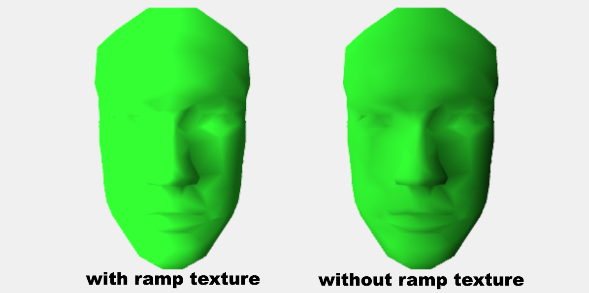
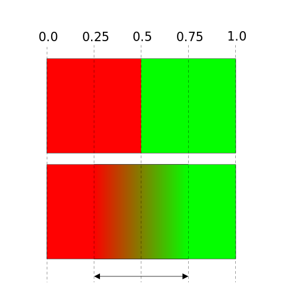

Title: WebGL Ramp Textures
Description: Using ramp textures
TOC: Ramp Textures (Toon Shading)

An important realization in WebGL is that textures are not just things applied
directly to triangles as we covered in [the article on textures](webgl-3d-textures.html).
Textures are arrays of random access data, usually 2D arrays of data. So, any solution where we
could use a random access array of data is a place we can probably use a texture.

In [the article on directional lights](webgl-3d-lighting-directional.html)
we covered how we can use the *dot product* to compute the angle between
2 vectors. In that one we computed the *dot product* of the direction
of the light to the normal of the surface of our model. This provided
the cosine of the angle between the 2 vectors. The cosine is a value from -1 to +1
and we used it as a direct multiplier to our color.

```glsl
float light = dot(normal, u_reverseLightDirection);

gl_FragColor = u_color;
gl_FragColor.rgb *= light;
```

This darkens the color to more it faces away from the light.

What if instead of using that dot product directly we
used it to look up a value from a 1 dimensional texture?

```glsl
precision mediump float;

// Passed in from the vertex shader.
varying vec3 v_normal;

uniform vec3 u_reverseLightDirection;
uniform vec4 u_color;
+uniform sampler2D u_ramp;

void main() {
  // because v_normal is a varying it's interpolated
  // so it will not be a unit vector. Normalizing it
  // will make it a unit vector again
  vec3 normal = normalize(v_normal);

-  float light = dot(normal, u_reverseLightDirection);
+  float cosAngle = dot(normal, u_reverseLightDirection);
+
+  // convert from -1 <-> 1 to 0 <-> 1
+  float u = cosAngle * 0.5 + 0.5;
+
+  // make a texture coordinate
+  vec2 uv = vec2(u, 0.5);
+
+  // lookup a value from a 1d texture
+  vec4 rampColor = texture2D(u_ramp, uv);
+
  gl_FragColor = u_color;
-  gl_FragColor.rgb *= light;
+  gl_FragColor *= rampColor;
}
```

We need to make a texture. Let's start with a 2x1 texture. We'll use the `LUMINANCE`
format which gives us a monochrome texture using only 1 byte per texel.

```js
var tex = gl.createTexture();
gl.bindTexture(gl.TEXTURE_2D, tex);
gl.texImage2D(
    gl.TEXTURE_2D,     // target
    0,                 // mip level
    gl.LUMINANCE,      // internal format
    2,                 // width
    1,                 // height
    0,                 // border
    gl.LUMINANCE,      // format
    gl.UNSIGNED_BYTE,  // type
    new Uint8Array([90, 255]));
gl.texParameteri(gl.TEXTURE_2D, gl.TEXTURE_WRAP_S, gl.CLAMP_TO_EDGE);
gl.texParameteri(gl.TEXTURE_2D, gl.TEXTURE_WRAP_T, gl.CLAMP_TO_EDGE);
gl.texParameteri(gl.TEXTURE_2D, gl.TEXTURE_MIN_FILTER, gl.NEAREST);
gl.texParameteri(gl.TEXTURE_2D, gl.TEXTURE_MAG_FILTER, gl.NEAREST);
```

The colors of the 2 pixels above are dark gray (90) and white (255).
We also set the texture parameters so there will be no filtering.

Modifying the sample for the new texture we need to lookup the `u_ramp`
uniform

```js
var worldViewProjectionLocation = gl.getUniformLocation(program, "u_worldViewProjection");
var worldInverseTransposeLocation = gl.getUniformLocation(program, "u_worldInverseTranspose");
var colorLocation = gl.getUniformLocation(program, "u_color");
+var rampLocation = gl.getUniformLocation(program, "u_ramp");
var reverseLightDirectionLocation =
    gl.getUniformLocation(program, "u_reverseLightDirection");
```

and we need to set up the texture when rendering

```js
// bind the texture to active texture unit 0
gl.activeTexture(gl.TEXTURE0 + 0);
gl.bindTexture(gl.TEXTURE_2D, tex);
// tell the shader that u_ramp should use the texture on texture unit 0
gl.uniform1i(rampLocation, 0);
```

I swapped out the data for a 3D `F` from the light sample with data
for a low-polygon head. Running it we get this

{{{example url="../webgl-ramp-texture.html"}}}

If you rotate the model you'll see it looks similar to [toon shading](https://en.wikipedia.org/wiki/Cel_shading)

In the example above we set the texture filtering to `NEAREST` which means
we just pick the nearest texel from the texture for our color. There are only
2 texels so if the surface is facing away from the light we get the first color
(dark gray) and if the surface is facing the toward the light we get the second
color (white). That color is multiplied with `gl_FragColor` just like `light` used
to be.

Thinking about it if we switch to `LINEAR` filtering we *should* get the same
result as before using the texture. Let's try it.

```js
-gl.texParameteri(gl.TEXTURE_2D, gl.TEXTURE_MIN_FILTER, gl.NEAREST);
-gl.texParameteri(gl.TEXTURE_2D, gl.TEXTURE_MAG_FILTER, gl.NEAREST);
+gl.texParameteri(gl.TEXTURE_2D, gl.TEXTURE_MIN_FILTER, gl.LINEAR);
+gl.texParameteri(gl.TEXTURE_2D, gl.TEXTURE_MAG_FILTER, gl.LINEAR);
```

{{{example url="../webgl-ramp-texture-linear.html"}}}

That looks similar but if we actually compare them side by side...

<div class="webgl_center"></div>

We can see they are not the same. What's up?

`LINEAR` filtering blends between pixels. If we zoom in on a 2 pixel texture
with linear filtering we'll see the issue

<div class="webgl_center"></div>
<div class="webgl_center">texture coordinate range for ramp</div>

There's a half a pixel on each side with no interpolation. Imagine if the texture had
set `TEXTURE_WRAP_S` to `REPEAT`. We'd then expect the left most half of a red pixel to
linearly blend toward green as though the green repeated to the left. But what's on
the left is more red since we are using `CLAMP_TO_EDGE`.

To really get a ramp we just want to choose values from that center range. We can
do that with a little math in our shader

```glsl
precision mediump float;

// Passed in from the vertex shader.
varying vec3 v_normal;

uniform vec3 u_reverseLightDirection;
uniform vec4 u_color;
uniform sampler2D u_ramp;
+uniform vec2 u_rampSize;

void main() {
  // because v_normal is a varying it's interpolated
  // so it will not be a unit vector. Normalizing it
  // will make it a unit vector again
  vec3 normal = normalize(v_normal);

  float cosAngle = dot(normal, u_reverseLightDirection);

  // convert from -1 <-> 1 to 0 <-> 1
  float u = cosAngle * 0.5 + 0.5;

  // make a texture coordinate.
  vec2 uv = vec2(u, 0.5);

+  // scale to size of ramp
+  vec2 texelRange = uv * (u_rampSize - 1.0);
+
+  // offset by half a texel and convert to texture coordinate
+  vec2 rampUV = (texelRange + 0.5) / u_rampSize;

-  vec4 rampColor = texture2D(u_ramp, uv);
+  vec4 rampColor = texture2D(u_ramp, rampUV);

  gl_FragColor = u_color;
  gl_FragColor *= rampColor;
}
```

Above we're basically scaling our uv coordinate so it goes from 0 to 1 over
1 less than the width of the texture. Then adding half a pixel and converting
back to normalized texture coordinates.

We need to lookup the location of `u_rampSize`

```js
var colorLocation = gl.getUniformLocation(program, "u_color");
var rampLocation = gl.getUniformLocation(program, "u_ramp");
+var rampSizeLocation = gl.getUniformLocation(program, "u_rampSize");
```

And we need to set it at render time

```js
// bind the texture to active texture unit 0
gl.activeTexture(gl.TEXTURE0 + 0);
gl.bindTexture(gl.TEXTURE_2D, tex);
// tell the shader that u_ramp should use the texture on texture unit 0
gl.uniform1i(rampLocation, 0);
+gl.uniform2fv(rampSizeLocation, [2, 1]);
```

Before we run it let's add a flag so we can compare with and without the
ramp texture

```glsl
precision mediump float;

// Passed in from the vertex shader.
varying vec3 v_normal;

uniform vec3 u_reverseLightDirection;
uniform vec4 u_color;
uniform sampler2D u_ramp;
uniform vec2 u_rampSize;
+uniform bool u_useRampTexture;

void main() {
  // because v_normal is a varying it's interpolated
  // so it will not be a unit vector. Normalizing it
  // will make it a unit vector again
  vec3 normal = normalize(v_normal);

  float cosAngle = dot(normal, u_reverseLightDirection);

  // convert from -1 <-> 1 to 0 <-> 1
  float u = cosAngle * 0.5 + 0.5;

  // make a texture coordinate.
  vec2 uv = vec2(u, 0.5);

  // scale to size of ramp
  vec2 texelRange = uv * (u_rampSize - 1.0);

  // offset by half a texel and convert to texture coordinate
  vec2 rampUV = (texelRange + 0.5) / u_rampSize;

  vec4 rampColor = texture2D(u_ramp, rampUV);

+  if (!u_useRampTexture) {
+    rampColor = vec4(u, u, u, 1);
+  }

  gl_FragColor = u_color;
  gl_FragColor *= rampColor;
}
```

We'll look up the location of that uniform too.

```js
var rampLocation = gl.getUniformLocation(program, "u_ramp");
var rampSizeLocation = gl.getUniformLocation(program, "u_rampSize");
+var useRampTextureLocation = gl.getUniformLocation(program, "u_useRampTexture");
```

and set it

```js
var data = {
  useRampTexture: true,
};

...

// bind the texture to active texture unit 0
gl.activeTexture(gl.TEXTURE0 + 0);
gl.bindTexture(gl.TEXTURE_2D, tex);
// tell the shader that u_ramp should use the texture on texture unit 0
gl.uniform1i(rampLocation, 0);
gl.uniform2fv(rampSizeLocation, [2, 1]);

+gl.uniform1i(useRampTextureLocation, data.useRampTexture);
```

And with that we can see the old lighting way and the new ramp texture way match

{{{example url="../webgl-ramp-texture-issue-confirm.html"}}}

Clicking the "useRampTexture" checkbox we see no change as the two techniques
now match.

> note: I don't normally recommend using a conditional like `u_useRampTexture`
> in a shader. Instead I recommend making 2 shader programs, one that uses normal lighting
> and one that uses the ramp texture. Unfortunately since the code is not using
> something like [out helper library](webgl-less-code-more-fun.html) it would
> fairly large change to support 2 shader programs. Each program needs its own
> set of locations. Making that big of a change would have distracted from
> the point of this article so in this case I decided to use a conditional.
> In general though I try avoid conditionals to select features in shaders and
> instead create different shaders for different features.

Note: This math is only important if we're using `LINEAR` filtering. If we're using `NEAREST`
filtering we want the original math.

Now that we know the ramp math is correct let's make a bunch of different ramp
textures.

```js
+// make a 256 array where elements 0 to 127
+// go from 64 to 191 and elements 128 to 255
+// are all 255.
+const smoothSolid = new Array(256).fill(255);
+for (let i = 0; i < 128; ++i) {
+  smoothSolid[i] = 64 + i;
+}
+
+const ramps = [
+  { name: 'dark-white',          color: [0.2, 1, 0.2, 1], format: gl.LUMINANCE, filter: false,
+    data: [80, 255] },
+  { name: 'dark-white-skewed',   color: [0.2, 1, 0.2, 1], format: gl.LUMINANCE, filter: false,
+    data: [80, 80, 80, 255, 255] },
+  { name: 'normal',              color: [0.2, 1, 0.2, 1], format: gl.LUMINANCE, filter: true,
+    data: [0, 255] },
+  { name: '3-step',              color: [0.2, 1, 0.2, 1], format: gl.LUMINANCE, filter: false,
+    data: [80, 160, 255] },
+  { name: '4-step',              color: [0.2, 1, 0.2, 1], format: gl.LUMINANCE, filter: false,
+    data: [80, 140, 200, 255] },
+  { name: '4-step skewed',       color: [0.2, 1, 0.2, 1], format: gl.LUMINANCE, filter: false,
+    data: [80, 80, 80, 80, 140, 200, 255] },
+  { name: 'black-white-black',   color: [0.2, 1, 0.2, 1], format: gl.LUMINANCE, filter: false,
+    data: [80, 255, 80] },
+  { name: 'stripes',             color: [0.2, 1, 0.2, 1], format: gl.LUMINANCE, filter: false,
+    data: [80, 255, 80, 255, 80, 255, 80, 255, 80, 255, 80, 255, 80, 255, 80, 255, 80, 255, 80, 255, 80, 255, 80, 255, 80, 255, 80, 255, 80, 255, 80, 255] },
+  { name: 'stripe',              color: [0.2, 1, 0.2, 1], format: gl.LUMINANCE, filter: false,
+    data: [80, 80, 80, 80, 80, 80, 80, 80, 80, 80, 80, 80, 0, 0, 255, 255, 255, 255, 255, 255, 255, 255, 255, 255, 255, 255, 255, 255] },
+  { name: 'smooth-solid',        color: [0.2, 1, 0.2, 1], format: gl.LUMINANCE, filter: false,
+    data: smoothSolid },
+  { name: 'rgb',                 color: [  1, 1,   1, 1], format: gl.RGB,       filter: true,
+    data: [255, 0, 0, 0, 255, 0, 0, 0, 255] },
+];
+
+var elementsForFormat = {};
+elementsForFormat[gl.LUMINANCE] = 1;
+elementsForFormat[gl.RGB      ] = 3;
+
+ramps.forEach((ramp) => {
+  const {name, format, filter, data} = ramp;
  var tex = gl.createTexture();
  gl.bindTexture(gl.TEXTURE_2D, tex);
+  gl.pixelStorei(gl.UNPACK_ALIGNMENT, 1);
+  const width = data.length / elementsForFormat[format];
  gl.texImage2D(
      gl.TEXTURE_2D,     // target
      0,                 // mip level
*      format,            // internal format
*      width,
      1,                 // height
      0,                 // border
*     format,            // format
      gl.UNSIGNED_BYTE,  // type
*      new Uint8Array(data));
  gl.texParameteri(gl.TEXTURE_2D, gl.TEXTURE_WRAP_S, gl.CLAMP_TO_EDGE);
  gl.texParameteri(gl.TEXTURE_2D, gl.TEXTURE_WRAP_T, gl.CLAMP_TO_EDGE);
*  gl.texParameteri(gl.TEXTURE_2D, gl.TEXTURE_MIN_FILTER, filter ? gl.LINEAR : gl.NEAREST);
*  gl.texParameteri(gl.TEXTURE_2D, gl.TEXTURE_MAG_FILTER, filter ? gl.LINEAR : gl.NEAREST);
+  ramp.texture = tex;
+  ramp.size = [width, 1];
+});
```

and let's make the shader so we can handle both `NEAREST` and `LINEAR`. Like I mentioned
above I don't generally use boolean if statements in shaders but if the difference is
simple and I can do it without an conditional then I'll consider using one shader.
To do that here we can add a float uniform `u_linearAdjust` that we'll set to 0.0 or 1.0

```glsl
precision mediump float;

// Passed in from the vertex shader.
varying vec3 v_normal;

uniform vec3 u_reverseLightDirection;
uniform vec4 u_color;
uniform sampler2D u_ramp;
uniform vec2 u_rampSize;
-uniform bool u_useRampTexture;
-uniform float u_linearAdjust;  // 1.0 if linear, 0.0 if nearest

void main() {
  // because v_normal is a varying it's interpolated
  // so it will not be a unit vector. Normalizing it
  // will make it a unit vector again
  vec3 normal = normalize(v_normal);

  float cosAngle = dot(normal, u_reverseLightDirection);

  // convert from -1 <-> 1 to 0 <-> 1
  float u = cosAngle * 0.5 + 0.5;

  // make a texture coordinate.
  vec2 uv = vec2(u, 0.5);

  // scale to size of ramp
-  vec2 texelRange = uv * (u_rampSize - 1.0);
+  vec2 texelRange = uv * (u_rampSize - u_linearAdjust);

-  // offset by half a texel and convert to texture coordinate
-  vec2 rampUV = (texelRange + 0.5) / u_rampSize;
+  // offset by half a texel if linear and convert to texture coordinate
+  vec2 rampUV = (texelRange + 0.5 * u_linearAdjust) / u_rampSize;

  vec4 rampColor = texture2D(u_ramp, rampUV);

-  if (!u_useRampTexture) {
-    rampColor = vec4(u, u, u, 1);
-  }

  gl_FragColor = u_color;
  gl_FragColor *= rampColor;
}
```

at init time look up the location

```js
var colorLocation = gl.getUniformLocation(program, "u_color");
var rampLocation = gl.getUniformLocation(program, "u_ramp");
var rampSizeLocation = gl.getUniformLocation(program, "u_rampSize");
+var linearAdjustLocation = gl.getUniformLocation(program, "u_linearAdjust");
```

and at render time pick one of the textures

```js
var data = {
  ramp: 0,
};

...
+const {texture, color, size, filter} = ramps[data.ramp];

// Set the color to use
-gl.uniform4fv(colorLocation, [0.2, 1, 0.2, 1]);
+gl.uniform4fv(colorLocation, color);

// set the light direction.
gl.uniform3fv(reverseLightDirectionLocation, m4.normalize([-1.75, 0.7, 1]));

// bind the texture to active texture unit 0
gl.activeTexture(gl.TEXTURE0 + 0);
-gl.bindTexture(gl.TEXTURE_2D, tex);
+gl.bindTexture(gl.TEXTURE_2D, texture);
// tell the shader that u_ramp should use the texture on texture unit 0
gl.uniform1i(rampLocation, 0);
-gl.uniform2fv(rampSizeLocation, [2, 1]);
+gl.uniform2fv(rampSizeLocation, size);

+// adjust if linear
+gl.uniform1f(linearAdjustLocation, filter ? 1 : 0);
```

{{{example url="../webgl-ramp-textures.html"}}}

Try the different ramp textures and you'll see lots of strange effects.
This is one way make a generic adjusting shader. You could make a shader
that does 2 color toon shading by setting 2 colors and a threshold like this.

```js
uniform vec4 color1;
uniform vec4 color2;
uniform float threshold;

...

  float cosAngle = dot(normal, u_reverseLightDirection);

  // convert from -1 <-> 1 to 0 <-> 1
  float u = cosAngle * 0.5 + 0.5;

  gl_FragColor = mix(color1, color2, step(cosAngle, threshold));
```

And it would work. But, then if you wanted a 3 step or a 4 step version
you'd need to write another shader. With a ramp texture you can just
provide a different texture. Further, notice above, even if you want a 2 step
toon shader you can still adjust where the step happens just by putting more or less
data in your texture. For example a texture with

```
[dark, light]
```

Gives you a 2 step texture where it splits in the middle between facing toward or away
the light. But a texture like

```
[dark, dark, dark, light, light]
```

Would give move the split to the 60% mark between facing away and facing toward the
light all without having to change the shader.

This specific example of using a ramp texture for toon shading or strange effects
may or may not be that useful to you but the more important takeaway is just
the basic concept of using some value to look up data in a texture.
Using textures like this is not just for converting
the light calculation. You could use ramp textures for [post processing](webgl-post-processing.html)
to achieve the same affect as [the gradient map in photoshop](https://www.photoshopessentials.com/photo-effects/gradient-map/)

You can also use ramp textures for GPU based animation. You store your key values
in the texture and use "time" as your value to move over the texture. There are
many uses for this technique.
