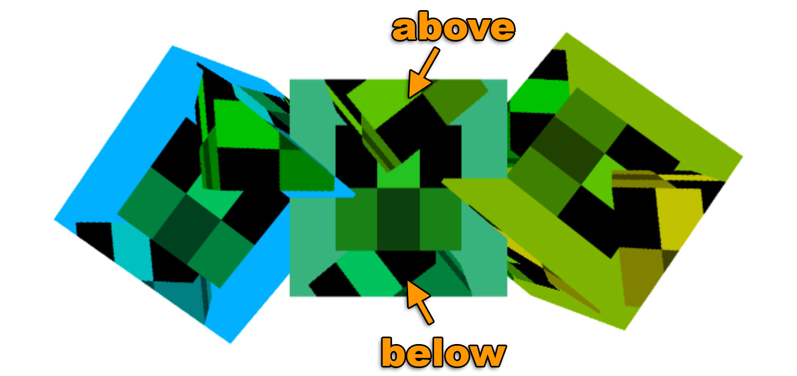
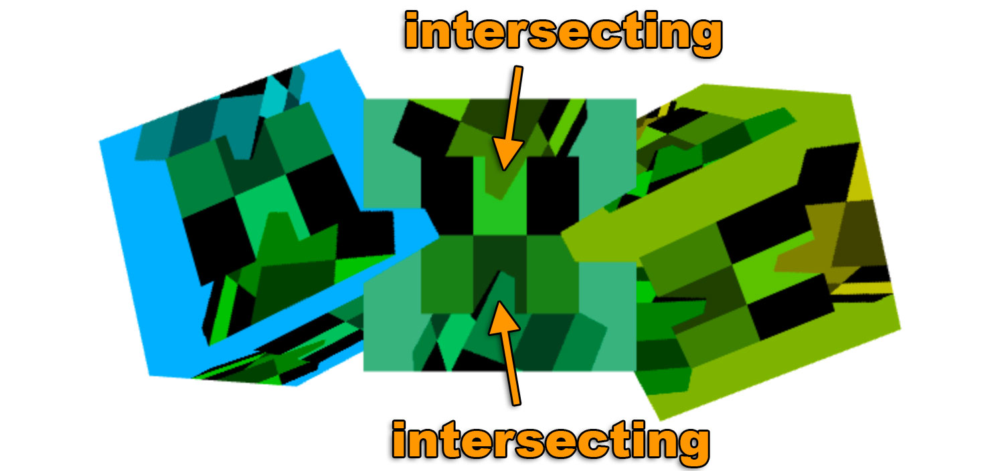

Title: WebGL Rendering to a Texture
Description: How to render to a texture.
TOC: Render to Texture


This post is a continuation of a series of posts about WebGL.
The first [started with fundamentals](webgl-fundamentals.html) and
the previous was about [supplying data to textures](webgl-data-textures.html).
If you haven't read those please view them first.

In the last post we went over how to supply data from JavaScript to textures.
In this article we'll render to textures using WebGL. Note this topic
was covered tersely under [image processing](webgl-image-processing-continued.html) but
let's cover it in more detail.

Rendering to a texture is pretty simple. We create a texture of a certain size

    // create to render to
    const targetTextureWidth = 256;
    const targetTextureHeight = 256;
    const targetTexture = gl.createTexture();
    gl.bindTexture(gl.TEXTURE_2D, targetTexture);

    {
      // define size and format of level 0
      const level = 0;
      const internalFormat = gl.RGBA;
      const border = 0;
      const format = gl.RGBA;
      const type = gl.UNSIGNED_BYTE;
      const data = null;
      gl.texImage2D(gl.TEXTURE_2D, level, internalFormat,
                    targetTextureWidth, targetTextureHeight, border,
                    format, type, data);

      // set the filtering so we don't need mips
      gl.texParameteri(gl.TEXTURE_2D, gl.TEXTURE_MIN_FILTER, gl.LINEAR);
      gl.texParameteri(gl.TEXTURE_2D, gl.TEXTURE_WRAP_S, gl.CLAMP_TO_EDGE);
      gl.texParameteri(gl.TEXTURE_2D, gl.TEXTURE_WRAP_T, gl.CLAMP_TO_EDGE);
    }

Notice how `data` is `null`. We don't need to supply any data. We just need WebGL to
allocate the texture.

Next we create a framebuffer. [A framebuffer is just a collection of attachments](webgl-framebuffers.html). 
Attachments are either textures or renderbuffers. We've gone over textures before. Renderbuffers are very similar
to textures but they support formats and options that textures don't support. Also, unlike a texture
you can't directly use a renderbuffer as input to a shader.

Let's create a framebuffer and attach our texture

    // Create and bind the framebuffer
    const fb = gl.createFramebuffer();
    gl.bindFramebuffer(gl.FRAMEBUFFER, fb);

    // attach the texture as the first color attachment
    const attachmentPoint = gl.COLOR_ATTACHMENT0;
    gl.framebufferTexture2D(
        gl.FRAMEBUFFER, attachmentPoint, gl.TEXTURE_2D, targetTexture, level);

Just like textures and buffers, after we create the framebuffer we need to
bind it to the `FRAMEBUFFER` bind point. After that all functions related to
framebuffers reference whatever framebuffer is bound there.

With our framebuffer bound, anytime we call `gl.clear`, `gl.drawArrays`, or `gl.drawElements` WebGL
would render to our texture instead of the canvas.

Let's take our previous rendering code and make it a function so we can call it twice.
Once to render to the texture and again to render to the canvas.

```
function drawCube(aspect) {
  // Tell it to use our program (pair of shaders)
  gl.useProgram(program);

  // Turn on the position attribute
  gl.enableVertexAttribArray(positionLocation);

  // Bind the position buffer.
  gl.bindBuffer(gl.ARRAY_BUFFER, positionBuffer);

  // Tell the position attribute how to get data out of positionBuffer (ARRAY_BUFFER)
  var size = 3;          // 3 components per iteration
  var type = gl.FLOAT;   // the data is 32bit floats
  var normalize = false; // don't normalize the data
  var stride = 0;        // 0 = move forward size * sizeof(type) each iteration to get the next position
  var offset = 0;        // start at the beginning of the buffer
  gl.vertexAttribPointer(
      positionLocation, size, type, normalize, stride, offset)

  // Turn on the texcoord attribute
  gl.enableVertexAttribArray(texcoordLocation);

  // bind the texcoord buffer.
  gl.bindBuffer(gl.ARRAY_BUFFER, texcoordBuffer);

  // Tell the texcoord attribute how to get data out of texcoordBuffer (ARRAY_BUFFER)
  var size = 2;          // 2 components per iteration
  var type = gl.FLOAT;   // the data is 32bit floats
  var normalize = false; // don't normalize the data
  var stride = 0;        // 0 = move forward size * sizeof(type) each iteration to get the next position
  var offset = 0;        // start at the beginning of the buffer
  gl.vertexAttribPointer(
      texcoordLocation, size, type, normalize, stride, offset)

  // Compute the projection matrix

-  var aspect = gl.canvas.clientWidth / gl.canvas.clientHeight;
  var projectionMatrix =
      m4.perspective(fieldOfViewRadians, aspect, 1, 2000);

  var cameraPosition = [0, 0, 2];
  var up = [0, 1, 0];
  var target = [0, 0, 0];

  // Compute the camera's matrix using look at.
  var cameraMatrix = m4.lookAt(cameraPosition, target, up);

  // Make a view matrix from the camera matrix.
  var viewMatrix = m4.inverse(cameraMatrix);

  var viewProjectionMatrix = m4.multiply(projectionMatrix, viewMatrix);

  var matrix = m4.xRotate(viewProjectionMatrix, modelXRotationRadians);
  matrix = m4.yRotate(matrix, modelYRotationRadians);

  // Set the matrix.
  gl.uniformMatrix4fv(matrixLocation, false, matrix);

  // Tell the shader to use texture unit 0 for u_texture
  gl.uniform1i(textureLocation, 0);

  // Draw the geometry.
  gl.drawArrays(gl.TRIANGLES, 0, 6 * 6);
}
```

Note that we need to pass in the `aspect` for computing our projection matrix
because our target texture has a different aspect than the canvas.

Here's how we call it

```
// Draw the scene.
function drawScene(time) {

  ...

  {
    // render to our targetTexture by binding the framebuffer
    gl.bindFramebuffer(gl.FRAMEBUFFER, fb);

    // render cube with our 3x2 texture
    gl.bindTexture(gl.TEXTURE_2D, texture);

    // Tell WebGL how to convert from clip space to pixels
    gl.viewport(0, 0, targetTextureWidth, targetTextureHeight);

    // Clear the attachment(s).
    gl.clearColor(0, 0, 1, 1);   // clear to blue
    gl.clear(gl.COLOR_BUFFER_BIT| gl.DEPTH_BUFFER_BIT);

    const aspect = targetTextureWidth / targetTextureHeight;
    drawCube(aspect)
  }

  {
    // render to the canvas
    gl.bindFramebuffer(gl.FRAMEBUFFER, null);

    // render the cube with the texture we just rendered to
    gl.bindTexture(gl.TEXTURE_2D, targetTexture);

    // Tell WebGL how to convert from clip space to pixels
    gl.viewport(0, 0, gl.canvas.width, gl.canvas.height);

    // Clear the canvas AND the depth buffer.
    gl.clearColor(1, 1, 1, 1);   // clear to white
    gl.clear(gl.COLOR_BUFFER_BIT | gl.DEPTH_BUFFER_BIT);

    const aspect = gl.canvas.clientWidth / gl.canvas.clientHeight;
    drawCube(aspect)
  }

  requestAnimationFrame(drawScene);
}
```

And here's the result

{{{example url="../webgl-render-to-texture.html" }}}

It's **EXTREMELY IMPORTANT** to remember to call `gl.viewport` and set it to
the size of the thing your rendering to. In this case the first time we're
rendering to the texture so we set the viewport to cover the texture. The 2nd
time we're rendering to the canvas so we set the viewport to cover the canvas.

Similarly when we compute a projection matrix
we need to use the correct aspect for thing we're rendering to. I have lost countless
hours of debugging wondering why something is rendering funny or not rendering
at all only to finally discover that I forgot one or both calling `gl.viewport`
and computing the correct aspect. It's so easy to forget that I now try to never call
`gl.bindFramebuffer` in my own code directly. Instead I make a function that does both
something like

    function bindFramebufferAndSetViewport(fb, width, height) {
       gl.bindFramebuffer(gl.FRAMEBUFFER, fb);
       gl.viewport(0, 0, width, height);
    }

And then I only use that function to change what I'm rendering to. That way I won't forget.

One thing to notice is we don't have a depth buffer on our framebuffer. We only have a texture.
This means there is no depth testing and 3D won't work. If we draw 3 cubes we can see this.

{{{example url="../webgl-render-to-texture-3-cubes-no-depth-buffer.html" }}}

If you look at the center cube you'll see the 3 vertical cubes draw on it one is in back, one is in the middle
and another is in front but we're drawing all 3 at the same depth. Looking that the 3 horizontal cubes
draw on the canvas you'll notice they correctly intersect each other. That's because our framebuffer
has no depth buffer but our canvas does.



To add a depth buffer we need to create a one and attach it to our framebuffer.

```
// create a depth renderbuffer
const depthBuffer = gl.createRenderbuffer();
gl.bindRenderbuffer(gl.RENDERBUFFER, depthBuffer);

// make a depth buffer and the same size as the targetTexture
gl.renderbufferStorage(gl.RENDERBUFFER, gl.DEPTH_COMPONENT16, targetTextureWidth, targetTextureHeight);
gl.framebufferRenderbuffer(gl.FRAMEBUFFER, gl.DEPTH_ATTACHMENT, gl.RENDERBUFFER, depthBuffer);
```

And with that this is the result.

{{{example url="../webgl-render-to-texture-3-cubes-with-depth-buffer.html" }}}

Now that we have a depth buffer attached to our framebuffer the inner cubes correctly intersect.



It's important to note WebGL only promises 3 combinations of attachments work.
[According to the spec](https://www.khronos.org/registry/webgl/specs/latest/1.0/#FBO_ATTACHMENTS)
the only guaranteed combinations of attachments are:

* `COLOR_ATTACHMENT0` = `RGBA/UNSIGNED_BYTE` texture
* `COLOR_ATTACHMENT0` = `RGBA/UNSIGNED_BYTE` texture + `DEPTH_ATTACHMENT` = `DEPTH_COMPONENT16` renderbuffer
* `COLOR_ATTACHMENT0` = `RGBA/UNSIGNED_BYTE` texture + `DEPTH_STENCIL_ATTACHMENT` = `DEPTH_STENCIL` renderbuffer

For any other combinations you must check if the user's system/gpu/driver/browser supports that combination.
To check you make your framebuffer, create and attach the attachments, then call

    var status = gl.checkFramebufferStatus(gl.FRAMEBUFFER);

If the status is `FRAMEBUFFER_COMPLETE` then that combination of attachments works for that user.
Otherwise it does not work and you'll have to do something else like tell the user they are out of luck
or fallback to some other method.

If you haven't yet check out [simplifying WebGL with less code more fun](webgl-less-code-more-fun.html).

<div class="webgl_bottombar">
<h3>The Canvas itself is actually a texture</h3>
<p>
This is just trivia but browsers use the techniques above to implement the canvas itself.
Behind the scenes they create a color texture, a depth buffer, a framebuffer and then they
bind it as the current framebuffer. You do your rendering which draws into that texture.
They then use that texture to render your canvas into the web page.
</p>
</div>


