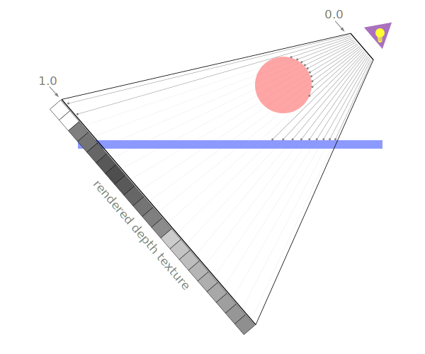

Title: WebGL Shadows
Description: How to compute shadows
TOC: Shadows

Lets draw some shadows!

## Prerequisites

Computing basic shadows is not *that* hard but it does require
a lot of background knowledge. To understand this article
you need to already understand the following topics.

* [Orthographic Projection](webgl-3d-orthographic.html)
* [Perspective Projection](webgl-3d-perspective.html)
* [Spot Lighting](webgl-3d-lighting-spot.html)
* [Textures](webgl-3d-textures.html)
* [Render to Texture](webgl-render-to-texture.html)
* [Projecting textures](webgl-planar-projection-mapping.html)
* [Visualizing the Camera](webgl-visualizing-the-camera.html)

So if you haven't read those please go read them first.

On top of that this article assumes you've read the article on
[less code more fun](webgl-less-code-more-fun.html)
as it uses the library mentioned there so as to
unclutter the example. If you don't understand
when a function named `webglUtils.setBuffersAndAttributes`
what it means to set the buffers and attributes, or when
a function named `webglUtils.setUniforms` what it means
to set uniforms, etc... then you should probably to go further back and
[read the fundamentals](webgl-fundamentals.html).

So first off there is more than one way to draw shadows.
Every way has it's tradeoffs. The most common way to draw
shadows is to use shadow maps

Shadow maps work by combining the techniques from all the prerequisite
articles above.

In [the article on planar projection mapping](webgl-planar-projection-mapping.html)
we saw how to project an image on to objects

{{{example url="../webgl-planar-projection-with-projection-matrix.html"}}}

Recall that we didn't draw that image on top of the objects in the scene,
rather, as the objects were rendered, for each pixel we checked if the
projected texture was in range, if so we sampled the appropriate color from
the projected texture, if not we sampled a color from a different texture
who's color was looked up using texture coordinates that mapped a texture
to the object.

What if the projected texture instead contained depth data from the point
of view of a light. In other words assume there was a light at the tip of
the frustum shown in that example above and the projected texture had depth
info from the light's point of view. The sphere would have depth values closer
to the light, the plane would have depth values further
from the light. 

<div class="webgl_center"></div>

If we had that data then when choosing a color to render
we could get a depth value from the projected texture and check if the
depth of the pixel we're about to draw is closer or further from the light.
If it's further from the light that
means something was else was closer to the light. In other words,
something is blocking the light, therefore this pixel is in a shadow.

<div class="webgl_center"></div>

Here the depth texture is projected through light space inside the frustum from the point of view of the light.
When we are drawing the pixels of the floor we compute that pixel's depth from the point of view 
of the light (0.3 in the diagram above). We then look at the corresponding depth in
the projected depth map texture. From the point of view of the light the depth value
in the texture will be 0.1 because it hit the sphere. Seeing that 0.1 &lt; 0.3 we
know the floor at that position must be in shadow.

First let's draw the shadow map. We'll take the last example from
[the article on planar projection mapping](webgl-planar-projection-mapping.html)
but instead of loading a texture we'll [render to a texture](webgl-render-to-texture.html).
In [that article](webgl-render-to-texture.html)
 we used a depth renderbuffer. That gave us a depth buffer for helping
to sort pixels but we can't use a depth renderbuffer as a texture. Fortunately there
is an optional WebGL extension called `WEBGL_depth_texture` we can try to enable
that will give us depth textures. With a depth texture we can attach it to a framebuffer
and then later use the texture as input to a shader. The code to check for 
and enable the extension is:

```js
function main() {
  // Get A WebGL context
  /** @type {HTMLCanvasElement} */
  const canvas = document.querySelector('#canvas');
  const gl = canvas.getContext('webgl');
  if (!gl) {
    return;
  }

+  const ext = gl.getExtension('WEBGL_depth_texture');
+  if (!ext) {
+    return alert('need WEBGL_depth_texture');
+  }
```

Now, similarly to the 
[article on rendering to a texture](webgl-render-to-texture.html)
we create a texture then a framebuffer and a attach the texture to the framebuffer
as a `DEPTH_ATTACHMENT`. 

```js
const depthTexture = gl.createTexture();
const depthTextureSize = 512;
gl.bindTexture(gl.TEXTURE_2D, depthTexture);
gl.texImage2D(
    gl.TEXTURE_2D,      // target
    0,                  // mip level
    gl.DEPTH_COMPONENT, // internal format
    depthTextureSize,   // width
    depthTextureSize,   // height
    0,                  // border
    gl.DEPTH_COMPONENT, // format
    gl.UNSIGNED_INT,    // type
    null);              // data
gl.texParameteri(gl.TEXTURE_2D, gl.TEXTURE_MAG_FILTER, gl.NEAREST);
gl.texParameteri(gl.TEXTURE_2D, gl.TEXTURE_MIN_FILTER, gl.NEAREST);
gl.texParameteri(gl.TEXTURE_2D, gl.TEXTURE_WRAP_S, gl.CLAMP_TO_EDGE);
gl.texParameteri(gl.TEXTURE_2D, gl.TEXTURE_WRAP_T, gl.CLAMP_TO_EDGE);

const depthFramebuffer = gl.createFramebuffer();
gl.bindFramebuffer(gl.FRAMEBUFFER, depthFramebuffer);
gl.framebufferTexture2D(
    gl.FRAMEBUFFER,       // target
    gl.DEPTH_ATTACHMENT,  // attachment point
    gl.TEXTURE_2D,        // texture target
    depthTexture,         // texture
    0);                   // mip level
```

[For a bunch of reasons](#attachment-combinations) we also need to create
a color texture and attach it as a color attachment even though we won't
actually use it.

```js
// create a color texture of the same size as the depth texture
const unusedTexture = gl.createTexture();
gl.bindTexture(gl.TEXTURE_2D, unusedTexture);
gl.texImage2D(
    gl.TEXTURE_2D,
    0,
    gl.RGBA,
    depthTextureSize,
    depthTextureSize,
    0,
    gl.RGBA,
    gl.UNSIGNED_BYTE,
    null,
);
gl.texParameteri(gl.TEXTURE_2D, gl.TEXTURE_MAG_FILTER, gl.NEAREST);
gl.texParameteri(gl.TEXTURE_2D, gl.TEXTURE_MIN_FILTER, gl.NEAREST);
gl.texParameteri(gl.TEXTURE_2D, gl.TEXTURE_WRAP_S, gl.CLAMP_TO_EDGE);
gl.texParameteri(gl.TEXTURE_2D, gl.TEXTURE_WRAP_T, gl.CLAMP_TO_EDGE);

// attach it to the framebuffer
gl.framebufferTexture2D(
    gl.FRAMEBUFFER,        // target
    gl.COLOR_ATTACHMENT0,  // attachment point
    gl.TEXTURE_2D,         // texture target
    unusedTexture,         // texture
    0);                    // mip level
```

To use the depth texture we need to able to render the scene more than once with different
shaders. Once with a simple shader just to render to the depth texture and
then again with our current shader that projects a texture.

So first let's change `drawScene` so we can pass it the program we want
to render with

```js
-function drawScene(projectionMatrix, cameraMatrix, textureMatrix) {
+function drawScene(projectionMatrix, cameraMatrix, textureMatrix, programInfo) {
  // Make a view matrix from the camera matrix.
  const viewMatrix = m4.inverse(cameraMatrix);

-  gl.useProgram(textureProgramInfo.program);
+  gl.useProgram(programInfo.program);

  // set uniforms that are the same for both the sphere and plane
  // note: any values with no corresponding uniform in the shader
  // are ignored.
-  webglUtils.setUniforms(textureProgramInfo, {
+  webglUtils.setUniforms(programInfo, {
    u_view: viewMatrix,
    u_projection: projectionMatrix,
*    u_textureMatrix: textureMatrix,
-    u_projectedTexture: imageTexture,
+    u_projectedTexture: depthTexture,
  });

  // ------ Draw the sphere --------

  // Setup all the needed attributes.
-  webglUtils.setBuffersAndAttributes(gl, textureProgramInfo, sphereBufferInfo);
+  webglUtils.setBuffersAndAttributes(gl, programInfo, sphereBufferInfo);

  // Set the uniforms unique to the sphere
-  webglUtils.setUniforms(textureProgramInfo, sphereUniforms);
+  webglUtils.setUniforms(programInfo, sphereUniforms);

  // calls gl.drawArrays or gl.drawElements
  webglUtils.drawBufferInfo(gl, sphereBufferInfo);

  // ------ Draw the plane --------

  // Setup all the needed attributes.
-  webglUtils.setBuffersAndAttributes(gl, textureProgramInfo, planeBufferInfo);
+  webglUtils.setBuffersAndAttributes(gl, programInfo, planeBufferInfo);

  // Set the uniforms we just computed
-  webglUtils.setUniforms(textureProgramInfo, planeUniforms);
+  webglUtils.setUniforms(programInfo, planeUniforms);

  // calls gl.drawArrays or gl.drawElements
  webglUtils.drawBufferInfo(gl, planeBufferInfo);
}
```

Now let's use it to draw the scene from the point of view of the light
and then again with the depth texture

```js
function render() {
  webglUtils.resizeCanvasToDisplaySize(gl.canvas);

  gl.enable(gl.CULL_FACE);
  gl.enable(gl.DEPTH_TEST);

  // first draw from the POV of the light
-  const textureWorldMatrix = m4.lookAt(
+  const lightWorldMatrix = m4.lookAt(
      [settings.posX, settings.posY, settings.posZ],          // position
      [settings.targetX, settings.targetY, settings.targetZ], // target
      [0, 1, 0],                                              // up
  );
-  const textureProjectionMatrix = settings.perspective
+  const lightProjectionMatrix = settings.perspective
      ? m4.perspective(
          degToRad(settings.fieldOfView),
          settings.projWidth / settings.projHeight,
          0.5,  // near
          10)   // far
      : m4.orthographic(
          -settings.projWidth / 2,   // left
           settings.projWidth / 2,   // right
          -settings.projHeight / 2,  // bottom
           settings.projHeight / 2,  // top
           0.5,                      // near
           10);                      // far

+  // draw to the depth texture
+  gl.bindFramebuffer(gl.FRAMEBUFFER, depthFramebuffer);
+  gl.viewport(0, 0, depthTextureSize, depthTextureSize);
+  gl.clear(gl.COLOR_BUFFER_BIT | gl.DEPTH_BUFFER_BIT);

-  drawScene(textureProjectionMatrix, textureWorldMatrix, m4.identity());
+  drawScene(lightProjectionMatrix, lightWorldMatrix, m4.identity(), colorProgramInfo);

+  // now draw scene to the canvas projecting the depth texture into the scene
+  gl.bindFramebuffer(gl.FRAMEBUFFER, null);
+  gl.viewport(0, 0, gl.canvas.width, gl.canvas.height);
+  gl.clear(gl.COLOR_BUFFER_BIT | gl.DEPTH_BUFFER_BIT);

  let textureMatrix = m4.identity();
  textureMatrix = m4.translate(textureMatrix, 0.5, 0.5, 0.5);
  textureMatrix = m4.scale(textureMatrix, 0.5, 0.5, 0.5);
-  textureMatrix = m4.multiply(textureMatrix, textureProjectionMatrix);
+  textureMatrix = m4.multiply(textureMatrix, lightProjectionMatrix);
  // use the inverse of this world matrix to make
  // a matrix that will transform other positions
  // to be relative this world space.
  textureMatrix = m4.multiply(
      textureMatrix,
-      m4.inverse(textureWorldMatrix));
+      m4.inverse(lightWorldMatrix));

  // Compute the projection matrix
  const aspect = gl.canvas.clientWidth / gl.canvas.clientHeight;
  const projectionMatrix =
      m4.perspective(fieldOfViewRadians, aspect, 1, 2000);

  // Compute the camera's matrix using look at.
  const cameraPosition = [settings.cameraX, settings.cameraY, 7];
  const target = [0, 0, 0];
  const up = [0, 1, 0];
  const cameraMatrix = m4.lookAt(cameraPosition, target, up);

-  drawScene(projectionMatrix, cameraMatrix, textureMatrix); 
+  drawScene(projectionMatrix, cameraMatrix, textureMatrix, textureProgramInfo); 
}
```

Note I renamed `textureWorldMatrix` to `lightWorldMatrix` and
`textureProjectionMatrix` to `lightProjectionMatrix`. They are really the
same thing but before we were projecting a texture through arbitrary space.
Now we're trying to project a shadow map from a light. The math is the same
but it seemed appropriate to rename the variables.

Above we first render the sphere and the plane to the depth texture
using the color shader we made to draw the frustum lines. That shader
just draws a solid color and does nothing else special which is all
we need when rendering to the depth texture.

After that, we render the scene again to the canvas just as we did before,
projecting the texture into the scene. 
When we reference the depth texture in a shader only the red
value is valid so we'll just repeat it for red, green, and blue.

```glsl
void main() {
  vec3 projectedTexcoord = v_projectedTexcoord.xyz / v_projectedTexcoord.w;
  bool inRange = 
      projectedTexcoord.x >= 0.0 &&
      projectedTexcoord.x <= 1.0 &&
      projectedTexcoord.y >= 0.0 &&
      projectedTexcoord.y <= 1.0;

-  vec4 projectedTexColor = texture2D(u_projectedTexture, projectedTexcoord.xy);
+  // the 'r' channel has the depth values
+  vec4 projectedTexColor = vec4(texture2D(u_projectedTexture, projectedTexcoord.xy).rrr, 1);
  vec4 texColor = texture2D(u_texture, v_texcoord) * u_colorMult;
  float projectedAmount = inRange ? 1.0 : 0.0;
  gl_FragColor = mix(texColor, projectedTexColor, projectedAmount);
}
```

While we're at it let's add a cube to the scene

```js
+const cubeBufferInfo = primitives.createCubeBufferInfo(
+    gl,
+    2,  // size
+);

...

+const cubeUniforms = {
+  u_colorMult: [0.5, 1, 0.5, 1],  // light green
+  u_color: [0, 0, 1, 1],
+  u_texture: checkerboardTexture,
+  u_world: m4.translation(3, 1, 0),
+};

...

function drawScene(projectionMatrix, cameraMatrix, textureMatrix, programInfo) {

    ...

+    // ------ Draw the cube --------
+
+    // Setup all the needed attributes.
+    webglUtils.setBuffersAndAttributes(gl, programInfo, cubeBufferInfo);
+
+    // Set the uniforms we just computed
+    webglUtils.setUniforms(programInfo, cubeUniforms);
+
+    // calls gl.drawArrays or gl.drawElements
+    webglUtils.drawBufferInfo(gl, cubeBufferInfo);

...
```

and let's tweak the settings. We'll move the camera
and widen the field of view for the texture projection to cover more of the scene

```js
const settings = {
-  cameraX: 2.5,
+  cameraX: 6,
  cameraY: 5,
  posX: 2.5,
  posY: 4.8,
  posZ: 4.3,
  targetX: 2.5,
  targetY: 0,
  targetZ: 3.5,
  projWidth: 1,
  projHeight: 1,
  perspective: true,
-  fieldOfView: 45,
+  fieldOfView: 120,
};
```

note: I moved the code that draws the line cube that shows the
frustum outside of the `drawScene` function.

{{{example url="../webgl-shadows-depth-texture.html"}}}

This is exactly the same as the top example except instead
of loading an image we're generating a depth texture by
rendering the scene to it. If you want to verify adjust `cameraX`
back to 2.5 and `fieldOfView` to 45 and it should look the same
as above except with our new depth texture being projected
instead of a loaded image.

Depth values go from 0.0 to 1.0 representing their position
through the frustum so 0.0 (dark) is close to the tip
of the frustum and 1.0 (light) is at the far open end.

So all that's left to do is instead of choosing between our projected
texture color and our texture mapped color we can use the depth from
the depth texture to check if the Z position from the depth texture
is closer or further from the light then the depth of the pixel we're
being asked to draw. If the depth from the depth texture is closer than something
was blocking the light and this pixel is in a shadow.

```glsl
void main() {
  vec3 projectedTexcoord = v_projectedTexcoord.xyz / v_projectedTexcoord.w;
+  float currentDepth = projectedTexcoord.z;

  bool inRange = 
      projectedTexcoord.x >= 0.0 &&
      projectedTexcoord.x <= 1.0 &&
      projectedTexcoord.y >= 0.0 &&
      projectedTexcoord.y <= 1.0;

-  vec4 projectedTexColor = vec4(texture2D(u_projectedTexture, projectedTexcoord.xy).rrr, 1);
+  float projectedDepth = texture2D(u_projectedTexture, projectedTexcoord.xy).r;
+  float shadowLight = (inRange && projectedDepth <= currentDepth) ? 0.0 : 1.0;  

  vec4 texColor = texture2D(u_texture, v_texcoord) * u_colorMult;
-  gl_FragColor = mix(texColor, projectedTexColor, projectedAmount);
+  gl_FragColor = vec4(texColor.rgb * shadowLight, texColor.a);
}
```

Above if the `projectedDepth` is less than the `currentDepth` then
the from the point of view of the light something was closer to
the light so this pixel we're about to draw is in shadow.

If we run this we'll get a shadow

{{{example url="../webgl-shadows-basic.html" }}}

It's kind of working, we can see the shadow of the sphere on
the ground but what's with all these funky patterns where there
is supposed to be no shadow? These patterns
are called *shadow acne*. They come from the fact that the
depth data stored in the depth texture has been quantized both
in that it's a texture, a grid of pixels, it was projected from the
point of view of the light but we're comparing it to values from the point of view of the camera. That means the grid of values in the
depth map is not aligned with our camera and
so when we compute `currentDepth` there are times when one value
will be slightly more or slightly less than `projectedDepth`.

Let's add a bias. 

```glsl
...

+uniform float u_bias;

void main() {
  vec3 projectedTexcoord = v_projectedTexcoord.xyz / v_projectedTexcoord.w;
-  float currentDepth = projectedTexcoord.z;
+  float currentDepth = projectedTexcoord.z + u_bias;

  bool inRange = 
      projectedTexcoord.x >= 0.0 &&
      projectedTexcoord.x <= 1.0 &&
      projectedTexcoord.y >= 0.0 &&
      projectedTexcoord.y <= 1.0;

  float projectedDepth = texture2D(u_projectedTexture, projectedTexcoord.xy).r;
  float shadowLight = (inRange && projectedDepth <= currentDepth) ? 0.0 : 1.0;  

  vec4 texColor = texture2D(u_texture, v_texcoord) * u_colorMult;
  gl_FragColor = vec4(texColor.rgb * shadowLight, texColor.a);
}
```

And we need to set it

```js
const settings = {
  cameraX: 2.75,
  cameraY: 5,
  posX: 2.5,
  posY: 4.8,
  posZ: 4.3,
  targetX: 2.5,
  targetY: 0,
  targetZ: 3.5,
  projWidth: 1,
  projHeight: 1,
  perspective: true,
  fieldOfView: 120,
+  bias: -0.006,
};

...

function drawScene(projectionMatrix, cameraMatrix, textureMatrix, programInfo, /**/u_lightWorldMatrix) {
  // Make a view matrix from the camera matrix.
  const viewMatrix = m4.inverse(cameraMatrix);

  gl.useProgram(programInfo.program);

  // set uniforms that are the same for both the sphere and plane
  // note: any values with no corresponding uniform in the shader
  // are ignored.
  webglUtils.setUniforms(programInfo, {
    u_view: viewMatrix,
    u_projection: projectionMatrix,
+    u_bias: settings.bias,
    u_textureMatrix: textureMatrix,
    u_projectedTexture: depthTexture,
  });

  ...
```

{{{example url="../webgl-shadows-basic-w-bias.html"}}}

slide the bias value and you can how it affects when and where
the patterns appear.

To get closer to completion this let's actually add in a spot light calculation
from [the article on spot lights](webgl-3d-lighting-spot.html).

First let's paste in the needed parts to the vertex shader directly
from [that article](webgl-3d-lighting-spot.html).

```glsl
attribute vec4 a_position;
attribute vec2 a_texcoord;
+attribute vec3 a_normal;

+uniform vec3 u_lightWorldPosition;
+uniform vec3 u_viewWorldPosition;

uniform mat4 u_projection;
uniform mat4 u_view;
uniform mat4 u_world;
uniform mat4 u_textureMatrix;

varying vec2 v_texcoord;
varying vec4 v_projectedTexcoord;
+varying vec3 v_normal;

+varying vec3 v_surfaceToLight;
+varying vec3 v_surfaceToView;

void main() {
  // Multiply the position by the matrix.
  vec4 worldPosition = u_world * a_position;

  gl_Position = u_projection * u_view * worldPosition;

  // Pass the texture coord to the fragment shader.
  v_texcoord = a_texcoord;

  v_projectedTexcoord = u_textureMatrix * worldPosition;

+  // orient the normals and pass to the fragment shader
+  v_normal = mat3(u_world) * a_normal;
+
+  // compute the world position of the surface
+  vec3 surfaceWorldPosition = (u_world * a_position).xyz;
+
+  // compute the vector of the surface to the light
+  // and pass it to the fragment shader
+  v_surfaceToLight = u_lightWorldPosition - surfaceWorldPosition;
+
+  // compute the vector of the surface to the view/camera
+  // and pass it to the fragment shader
+  v_surfaceToView = u_viewWorldPosition - surfaceWorldPosition;
}
```

Then the fragment shader

```glsl
precision mediump float;

// Passed in from the vertex shader.
varying vec2 v_texcoord;
varying vec4 v_projectedTexcoord;
+varying vec3 v_normal;
+varying vec3 v_surfaceToLight;
+varying vec3 v_surfaceToView;

uniform vec4 u_colorMult;
uniform sampler2D u_texture;
uniform sampler2D u_projectedTexture;
uniform float u_bias;
+uniform float u_shininess;
+uniform vec3 u_lightDirection;
+uniform float u_innerLimit;          // in dot space
+uniform float u_outerLimit;          // in dot space

void main() {
+  // because v_normal is a varying it's interpolated
+  // so it will not be a unit vector. Normalizing it
+  // will make it a unit vector again
+  vec3 normal = normalize(v_normal);
+
+  vec3 surfaceToLightDirection = normalize(v_surfaceToLight);
+  vec3 surfaceToViewDirection = normalize(v_surfaceToView);
+  vec3 halfVector = normalize(surfaceToLightDirection + surfaceToViewDirection);
+
+  float dotFromDirection = dot(surfaceToLightDirection,
+                               -u_lightDirection);
+  float limitRange = u_innerLimit - u_outerLimit;
+  float inLight = clamp((dotFromDirection - u_outerLimit) / limitRange, 0.0, 1.0);
+  float light = inLight * dot(normal, surfaceToLightDirection);
+  float specular = inLight * pow(dot(normal, halfVector), u_shininess);

  vec3 projectedTexcoord = v_projectedTexcoord.xyz / v_projectedTexcoord.w;
  float currentDepth = projectedTexcoord.z + u_bias;

  bool inRange =
      projectedTexcoord.x >= 0.0 &&
      projectedTexcoord.x <= 1.0 &&
      projectedTexcoord.y >= 0.0 &&
      projectedTexcoord.y <= 1.0;

  // the 'r' channel has the depth values
  float projectedDepth = texture2D(u_projectedTexture, projectedTexcoord.xy).r;
  float shadowLight = (inRange && projectedDepth <= currentDepth) ? 0.0 : 1.0;

  vec4 texColor = texture2D(u_texture, v_texcoord) * u_colorMult;
-  gl_FragColor = vec4(texColor.rgb * shadowLight, texColor.a);
+  gl_FragColor = vec4(
+      texColor.rgb * light * shadowLight +
+      specular * shadowLight,
+      texColor.a);
}
```

Notice we just use `shadowLight` to adjust the affect of the `light` and
`specular`. If an object is in shadow than there is no light.

We just need to set the uniforms 

```js
-function drawScene(projectionMatrix, cameraMatrix, textureMatrix, programInfo) {
+function drawScene(
+    projectionMatrix,
+    cameraMatrix,
+    textureMatrix,
+    lightWorldMatrix,
+    programInfo) {
  // Make a view matrix from the camera matrix.
  const viewMatrix = m4.inverse(cameraMatrix);

  gl.useProgram(programInfo.program);

  // set uniforms that are the same for both the sphere and plane
  // note: any values with no corresponding uniform in the shader
  // are ignored.
  webglUtils.setUniforms(programInfo, {
    u_view: viewMatrix,
    u_projection: projectionMatrix,
    u_bias: settings.bias,
    u_textureMatrix: textureMatrix,
    u_projectedTexture: depthTexture,
+    u_shininess: 150,
+    u_innerLimit: Math.cos(degToRad(settings.fieldOfView / 2 - 10)),
+    u_outerLimit: Math.cos(degToRad(settings.fieldOfView / 2)),
+    u_lightDirection: lightWorldMatrix.slice(8, 11).map(v => -v),
+    u_lightWorldPosition: lightWorldMatrix.slice(12, 15),
+    u_viewWorldPosition: cameraMatrix.slice(12, 15),
  });

...

function render() {
  ...

-  drawScene(lightProjectionMatrix, lightWorldMatrix, m4.identity(), colorProgramInfo);
+  drawScene(
+      lightProjectionMatrix,
+      lightWorldMatrix,
+      m4.identity(),
+      lightWorldMatrix,
+      colorProgramInfo);

  ...

-  drawScene(projectionMatrix, cameraMatrix, textureMatrix, textureProgramInfo);
+  drawScene(
+      projectionMatrix,
+      cameraMatrix,
+      textureMatrix,
+      lightWorldMatrix,
+      textureProgramInfo);

  ...
}
```

To go over a few of those uniform settings. Recall from the [spot light article](webgl-3d-lighting-spot.html)
the innerLimit and outerLimit settings are in dot space (cosine space) and that
we only need half the field of view since they extend around the direction of the light.
Also recall from [the camera article](webgl-3d-camera.html) the 3rd row of 4x4 matrix
is the Z axis so pulling out the first 3 values of the 3rd row from the `lightWorldMatrix`
gives us the -Z direction of the light. We want the positive direction so we flip it.
Similarly the same article tells us the 4th row is the world position so we can get
the lightWorldPosition and viewWorldPosition (also known as the camera world position)
by pulling them out of the their respective matrices. Of course we could have also
got them by exposing more settings or passing more variables.

Let's also clear the background to black and set the frustum lines to white

```js
function render() {

  ...

  // now draw scene to the canvas projecting the depth texture into the scene
  gl.bindFramebuffer(gl.FRAMEBUFFER, null);
  gl.viewport(0, 0, gl.canvas.width, gl.canvas.height);
+  gl.clearColor(0, 0, 0, 1);
  gl.clear(gl.COLOR_BUFFER_BIT | gl.DEPTH_BUFFER_BIT);

  ...

  // ------ Draw the frustum ------
  {

    ...

          // Set the uniforms we just computed
    webglUtils.setUniforms(colorProgramInfo, {
-      u_color: [0, 0, 0, 1],
+      u_color: [1, 1, 1, 1],
      u_view: viewMatrix,
      u_projection: projectionMatrix,
      u_world: mat,
    });
```

And now we have a spot light with shadows.

{{{example url="../webgl-shadows-w-spot-light.html" }}}

For a directional light we'd copy the shader code from
[the article on directional lights](webgl-3d-lighting-directional.html)
and change our projection from perspective to orthographic.

First the vertex shader

```glsl
attribute vec4 a_position;
attribute vec2 a_texcoord;
+attribute vec3 a_normal;

-uniform vec3 u_lightWorldPosition;
-uniform vec3 u_viewWorldPosition;

uniform mat4 u_projection;
uniform mat4 u_view;
uniform mat4 u_world;
uniform mat4 u_textureMatrix;

varying vec2 v_texcoord;
varying vec4 v_projectedTexcoord;
varying vec3 v_normal;

-varying vec3 v_surfaceToLight;
-varying vec3 v_surfaceToView;

void main() {
  // Multiply the position by the matrix.
  vec4 worldPosition = u_world * a_position;

  gl_Position = u_projection * u_view * worldPosition;

  // Pass the texture coord to the fragment shader.
  v_texcoord = a_texcoord;

  v_projectedTexcoord = u_textureMatrix * worldPosition;

  // orient the normals and pass to the fragment shader
  v_normal = mat3(u_world) * a_normal;

-  // compute the world position of the surface
-  vec3 surfaceWorldPosition = (u_world * a_position).xyz;
-
-  // compute the vector of the surface to the light
-  // and pass it to the fragment shader
-  v_surfaceToLight = u_lightWorldPosition - surfaceWorldPosition;
-
-  // compute the vector of the surface to the view/camera
-  // and pass it to the fragment shader
-  v_surfaceToView = u_viewWorldPosition - surfaceWorldPosition;
}
```

Then the fragment shader

```glsl
precision mediump float;

// Passed in from the vertex shader.
varying vec2 v_texcoord;
varying vec4 v_projectedTexcoord;
varying vec3 v_normal;
-varying vec3 v_surfaceToLight;
-varying vec3 v_surfaceToView;

uniform vec4 u_colorMult;
uniform sampler2D u_texture;
uniform sampler2D u_projectedTexture;
uniform float u_bias;
-uniform float u_shininess;
-uniform vec3 u_lightDirection;
-uniform float u_innerLimit;          // in dot space
-uniform float u_outerLimit;          // in dot space
+uniform vec3 u_reverseLightDirection;

void main() {
  // because v_normal is a varying it's interpolated
  // so it will not be a unit vector. Normalizing it
  // will make it a unit vector again
  vec3 normal = normalize(v_normal);

+  float light = dot(normal, u_reverseLightDirection);

-  vec3 surfaceToLightDirection = normalize(v_surfaceToLight);
-  vec3 surfaceToViewDirection = normalize(v_surfaceToView);
-  vec3 halfVector = normalize(surfaceToLightDirection + surfaceToViewDirection);
-
-  float dotFromDirection = dot(surfaceToLightDirection,
-                               -u_lightDirection);
-  float limitRange = u_innerLimit - u_outerLimit;
-  float inLight = clamp((dotFromDirection - u_outerLimit) / limitRange, 0.0, 1.0);
-  float light = inLight * dot(normal, surfaceToLightDirection);
-  float specular = inLight * pow(dot(normal, halfVector), u_shininess);

  vec3 projectedTexcoord = v_projectedTexcoord.xyz / v_projectedTexcoord.w;
  float currentDepth = projectedTexcoord.z + u_bias;

  bool inRange =
      projectedTexcoord.x >= 0.0 &&
      projectedTexcoord.x <= 1.0 &&
      projectedTexcoord.y >= 0.0 &&
      projectedTexcoord.y <= 1.0;

  // the 'r' channel has the depth values
  float projectedDepth = texture2D(u_projectedTexture, projectedTexcoord.xy).r;
  float shadowLight = (inRange && projectedDepth <= currentDepth) ? 0.0 : 1.0;

  vec4 texColor = texture2D(u_texture, v_texcoord) * u_colorMult;
  gl_FragColor = vec4(
-      texColor.rgb * light * shadowLight +
-      specular * shadowLight,
+      texColor.rgb * light * shadowLight,
      texColor.a);
}
```

and the uniforms

```js
  // set uniforms that are the same for both the sphere and plane
  // note: any values with no corresponding uniform in the shader
  // are ignored.
  webglUtils.setUniforms(programInfo, {
    u_view: viewMatrix,
    u_projection: projectionMatrix,
    u_bias: settings.bias,
    u_textureMatrix: textureMatrix,
    u_projectedTexture: depthTexture,
-    u_shininess: 150,
-    u_innerLimit: Math.cos(degToRad(settings.fieldOfView / 2 - 10)),
-    u_outerLimit: Math.cos(degToRad(settings.fieldOfView / 2)),
-    u_lightDirection: lightWorldMatrix.slice(8, 11).map(v => -v),
-    u_lightWorldPosition: lightWorldMatrix.slice(12, 15),
-    u_viewWorldPosition: cameraMatrix.slice(12, 15),
+    u_reverseLightDirection: lightWorldMatrix.slice(8, 11),
  });
```

I adjusted the camera to see more of the scene.

{{{example url="../webgl-shadows-w-directional-light.html"}}}

This points out something that should be obvious from the code above but our
shadow map is only so big so even though a directional light calculations
only have a direction, there is no position for the light itself, we still
have to choose a position in order to decide the area to compute and apply
the shadow map.

This article is getting long and there are still many things to cover related
to shadows so we'll leave the rest to [the next article](webgl-shadows-continued.html).

<div class="webgl_bottombar">
<a id="attachment-combinations"></a>
<h3>Why did we need to create an unused color texture?</h3>
<p>Here we get buried in the minutia of the WebGL spec.</p>
<p>WebGL is based on OpenGL ES 2.0 and the <a href="https://www.khronos.org/registry/webgl/specs/latest/1.0/">WebGL spec</a>
basically says WebGL follows the OpenGL ES 2.0 spec except for any exceptions
listed in the WebGL spec.</p>
<p>When you make a framebuffer you add attachments. You can add all kinds of
attachments. Above we added an RGBA/UNSIGNED_BYTE texture color attachment
and a depth texture attachment. In the article on rendering to textures we
attached a similar color attachment but we attached a depth renderbuffer,
not a depth texture. We could also attach an RGB texture, a LUMINANCE texture,
and many other types of textures and renderbuffers.</p>
<p>The <a href="">OpenGL ES 2.0 spec</a> gives a bunch of rules on whether
or not a certain combination of attachments will work together. One rule
is that there must be at least one attachment. Another rule is
that they all have to be the same size. The final rule is</p>
<blockquote>
<h4>4.4.5 Framebuffer Completeness</h4>
<p>
The combination of internal formats of the attached images does not violate an <b>implementation-dependent</b> set of restrictions.
</p>
</blockquote>
<p>
That unfortunate wording means <b>no combinations of attachments are required to work!</b>
</p>
<p>
The WebGL committee saw that and decided to require that WebGL implementations support
at least 3 common combinations. From <a href="https://www.khronos.org/registry/webgl/specs/latest/1.0/#6.8">Section 6.8 of the WebGL spec</a> they are:
<blockquote>
<ul>
  <li><code>COLOR_ATTACHMENT0</code> = <code>RGBA</code>/<code>UNSIGNED_BYTE</code> texture</li>
  <li><code>COLOR_ATTACHMENT0</code> = <code>RGBA</code>/<code>UNSIGNED_BYTE</code> texture + <code>DEPTH_ATTACHMENT</code> = <code>DEPTH_COMPONENT16</code> renderbuffer</li>
  <li><code>COLOR_ATTACHMENT0</code> = <code>RGBA</code>/<code>UNSIGNED_BYTE</code> texture + <code>DEPTH_STENCIL_ATTACHMENT</code> = <code>DEPTH_STENCIL</code> renderbuffer</li>
</blockquote>
<p>
Later the <a href="https://www.khronos.org/registry/webgl/extensions/WEBGL_depth_texture/">WEBGL_depth_texture</a> extensions was created.
All it really says is
that you can create depth textures and you can attach them to framebuffers
but it does not say anything more about required combinations. So, given
the OpenGL ES 2.0 spec rule that says what combinations are allowed to work
is up to the implementation, and given that the WebGL spec only lists 3
combinations required to work and that none of those combinations include
depth textures, only depth renderbuffers, that means there is no guarantee
that using a depth texture will ever work, at least according to the spec.
</p>
<p>In practice it appears that most drivers themselves work with just a depth
texture attached and no other attachments. Unfortunately Safari pre version 15 does not allow that combination to work. It requires there be a
color attachment as well, most likely it requires an <code>RGBA</code>/<code>UNSIGNED_BYTE</code>
color attachment. The fact that it fails without it is within the specs above.
</p>
<p>All that is the long way of saying we need the unused color texture to work
in old Safari. It also sadly means there's still no guarantee that things will work
across all drivers/gpus/browsers. Fortunately it appears that combination does
work everywhere. Also fortunately OpenGL ES 3.0 on which <a href="https://webgl2fundamentals.org">WebGL2</a>
is based changed the spec and requires many more combinations to just work.
So, in WebGL1, we need to add the unused color texture and then cross our fingers. 😭
</p>
</div>