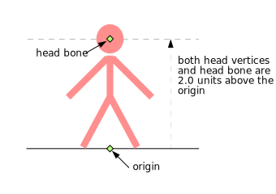
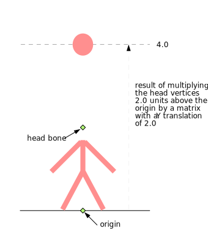
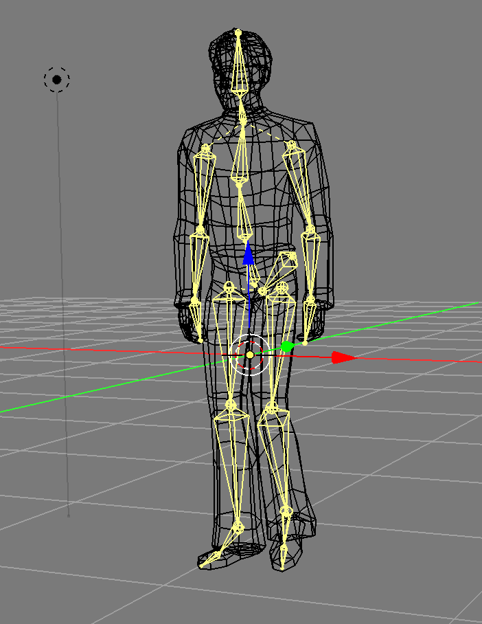
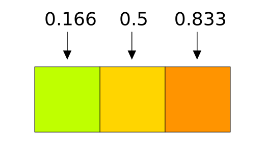
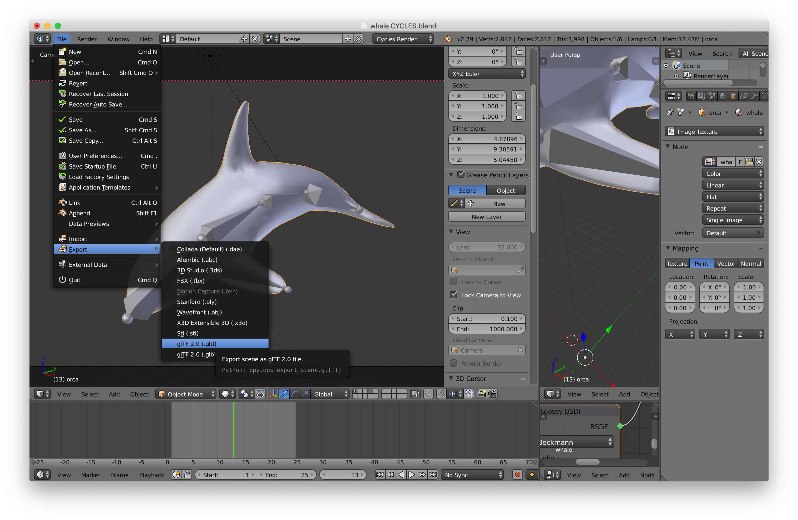
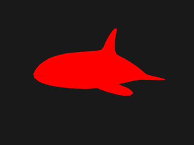
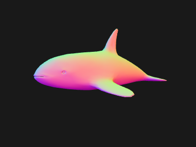
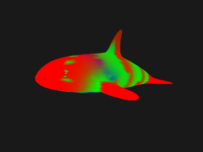

Title: WebGL Skinning
Description: How to skin a mesh in WebGL
TOC: Skinning


Skinning in graphics is the name given to moving a set of vertices based
on the weighted influence of multiple matrices. That's pretty abstract.

It's called *skinning* because it's typically used to make 3D characters
have a "skeleton" made from "bones" where "bone" is another name for matrix
and then **per vertex** setting the influence of each bone to that vertex.

So for example the hand bone would have nearly 100% influence on the vertices
near the hand of a character where as the foot bone would have zero influence
on those same vertices. The vertices in around the wrist would have some influence form the hand bone and also some from the arm bone.

The basic part is that you need bones (which is just a fancy way of saying
a matrix hierarchy) and weights. Weights are per vertex values that go
from 0 to 1 to say how much a particular bone-matrix affects the position
of that vertex. Weights are kind of like vertex colors as far as data.
One set of weights per vertex. In other words the weights are put in a
buffer and provided through attributes.

Typically you limit the number of weights per vertex partly because
otherwise it would be way too much data.  A character can have anywhere
from 15 bones (Virtua Fighter 1) to 150-300 bones (some modern games).
If you had 300 bones you'd need 300 weights PER vertex PER bone.  If your
character had 10000 vertices that would be 3 million weights needed.

So, instead most real time skinning systems limit it ~4 weights per vertex.
Usually this is accomplished in an exporter/converter that takes data from
a 3D packages like blender/maya/3dsmax and for each vertex finds the 4
bones with the highest weights and then normalizes those weights

To give an pseudo example a non-skinned vertex is typically computed like this

    gl_Position = projection * view * model * position;

A skinned vertex is effectively computed like this

    gl_Position = projection * view *
                  (bone1Matrix * position * weight1 +
                   bone2Matrix * position * weight2 +
                   bone3Matrix * position * weight3 +
                   bone4Matrix * position * weight4);

As you can see it's like were computing 4 different positions for each vertex and then blending them back into one by applying the weights.

Assuming you stored the bones matrices in a uniform array, and you
passed in the weights and which bone each weight applies to as
attributes you might do something like

    attribute vec4 a_position;
    attribute vec4 a_weights;         // 4 weights per vertex
    attribute vec4 a_boneNdx;         // 4 bone indices per vertex
    uniform mat4 bones[MAX_BONES];    // 1 matrix per bone

    gl_Position = projection * view *
                  (bones[int(a_boneNdx[0])] * a_position * a_weight[0] +
                   bones[int(a_boneNdx[1])] * a_position * a_weight[1] +
                   bones[int(a_boneNdx[2])] * a_position * a_weight[2] +
                   boneS[int(a_boneNdx[3])] * a_position * a_weight[3]);


There's one more issue. Let's say you have a model of a person with
the origin (0,0,0) on the floor just between their feet.

<div class="webgl_center"></div>

Now imagine you put a matrix/bone/joint at their head and you want to use
that for bone for skinning.  To keep it simple imagine you just set the
weights so the vertices of the head have a weight of 1.0 for the head
bone and no other joints influence those vertices.

<div class="webgl_center"></div>

There's a problem.
The head vertices are 2 units above the origin.  The head bone is also 2
units above the origin.  If you actually multiplied those head vertices by
the head bone matrix you'd get vertices 4 units above the origin.  The
original 2 units of the vertices + the 2 units of the head bone matrix.

<div class="webgl_center"></div>

A solution is to store a "bind pose" which is an extra matrix per joint of
where each matrix was before you used it to influence the vertices.  In that
case the bind pose of the head matrix would be 2 units above the origin.
So now you can use the inverse of that matrix to subtract out the extra 2
units.

In other words the bone matrices passed to the shader have each been
multiplied by their inverse bind pose so as to make their influence only
how much they changed from their original positions relative to the origin
of the mesh.

Let's make a small example. We'll animate in 2d a grid like this

<div class="webgl_center"></div>

* Where `b0`, `b1`, and `b2` are the bone matrices.
* `b1` is a child of `b0` and `b2` is a child of `b1`
* Verts `0,1` will get a weight of 1.0 from bone b0
* Verts `2,3` will get a weight of 0.5 from bones b0 and b1
* Verts `4,5` will get a weight of 1.0 from bone b1
* Verts `6,7` will get a weight of 0.5 from bones b1 and b2
* Verts `8,9` will get a weight of 1.0 from bone b2

We'll use the utils described in [less code more fun](webgl-less-code-more-fun.html).

First we need the vertices and for each vertex the index
of each bone that influences it and a number from 0 to 1
of how much influence that bone has.

```
var arrays = {
  position: {
    numComponents: 2,
    data: [
     0,  1,  // 0
     0, -1,  // 1
     2,  1,  // 2
     2, -1,  // 3
     4,  1,  // 4
     4, -1,  // 5
     6,  1,  // 6
     6, -1,  // 7
     8,  1,  // 8
     8, -1,  // 9
    ],
  },
  boneNdx: {
    numComponents: 4,
    data: [
      0, 0, 0, 0,  // 0
      0, 0, 0, 0,  // 1
      0, 1, 0, 0,  // 2
      0, 1, 0, 0,  // 3
      1, 0, 0, 0,  // 4
      1, 0, 0, 0,  // 5
      1, 2, 0, 0,  // 6
      1, 2, 0, 0,  // 7
      2, 0, 0, 0,  // 8
      2, 0, 0, 0,  // 9
    ],
  },
  weight: {
    numComponents: 4,
    data: [
     1, 0, 0, 0,  // 0
     1, 0, 0, 0,  // 1
    .5,.5, 0, 0,  // 2
    .5,.5, 0, 0,  // 3
     1, 0, 0, 0,  // 4
     1, 0, 0, 0,  // 5
    .5,.5, 0, 0,  // 6
    .5,.5, 0, 0,  // 7
     1, 0, 0, 0,  // 8
     1, 0, 0, 0,  // 9
    ],
  },

  indices: {
    numComponents: 2,
    data: [
      0, 1,
      0, 2,
      1, 3,
      2, 3, //
      2, 4,
      3, 5,
      4, 5,
      4, 6,
      5, 7, //
      6, 7,
      6, 8,
      7, 9,
      8, 9,
    ],
  },
};
// calls gl.createBuffer, gl.bindBuffer, gl.bufferData
var bufferInfo = webglUtils.createBufferInfoFromArrays(gl, arrays);
```

We can define our uniform values including a matrix for each bone

```
// 4 matrices, one for each bone
var numBones = 4;
var boneArray = new Float32Array(numBones * 16);

var uniforms = {
  projection: m4.orthographic(-20, 20, -10, 10, -1, 1),
  view: m4.translation(-6, 0, 0),
  bones: boneArray,
  color: [1, 0, 0, 1],
};
```

We can make views into the boneArray, one for each matrix

```
// make views for each bone. This lets all the bones
// exist in 1 array for uploading but as separate
// arrays for using with the math functions
var boneMatrices = [];  // the uniform data
var bones = [];         // the value before multiplying by inverse bind matrix
var bindPose = [];      // the bind matrix
for (var i = 0; i < numBones; ++i) {
  boneMatrices.push(new Float32Array(boneArray.buffer, i * 4 * 16, 16));
  bindPose.push(m4.identity());  // just allocate storage
  bones.push(m4.identity());     // just allocate storage
}
```

And then some code to manipulate the bone matrices. We'll just rotate
them in a hierarchy like the bones of a finger.

```
// rotate each bone by angle and simulate a hierarchy
function computeBoneMatrices(bones, angle) {
  var m = m4.identity();
  m4.zRotate(m, angle, bones[0]);
  m4.translate(bones[0], 4, 0, 0, m);
  m4.zRotate(m, angle, bones[1]);
  m4.translate(bones[1], 4, 0, 0, m);
  m4.zRotate(m, angle, bones[2]);
  // bones[3] is not used
}
```

Now call it once to generate their initial positions and use the result
to compute the inverse bind pose matrices.

```
// compute the initial positions of each matrix
computeBoneMatrices(bindPose, 0);

// compute their inverses
var bindPoseInv = bindPose.map(function(m) {
  return m4.inverse(m);
});
```

Now we're ready to render

First we animate the bones, computing a new world matrix for each

```
var t = time * 0.001;
var angle = Math.sin(t) * 0.8;
computeBoneMatrices(bones, angle);
```

Then we multiply the result of each by the inverse bind pose to deal with
the issue mentioned above

```
// multiply each by its bindPoseInverse
bones.forEach(function(bone, ndx) {
  m4.multiply(bone, bindPoseInv[ndx], boneMatrices[ndx]);
});
```

Then all the normal stuff, setting up the attributes, setting the uniforms, and drawing.

```
gl.useProgram(programInfo.program);
// calls gl.bindBuffer, gl.enableVertexAttribArray, gl.vertexAttribPointer
webglUtils.setBuffersAndAttributes(gl, programInfo, bufferInfo);

// calls gl.uniformXXX, gl.activeTexture, gl.bindTexture
webglUtils.setUniforms(programInfo, uniforms);

// calls gl.drawArrays or gl.drawIndices
webglUtils.drawBufferInfo(gl, bufferInfo, gl.LINES);
```

And here's the result

{{{example url="../webgl-skinning.html" }}}

The red lines are the *skinned* mesh.  The green and blue lines represent
the x-axis and y-axis of each bone or "joint". You can see how the vertices
that are influenced by multiple bones move between the bones that influence
them. We didn't cover how the bones are drawn as it's not important to
explaining how skinning works. See the code if you're curious.

NOTE: bones vs joints is confusing. There's only 1 thing, *matrices*.
But, in a 3d modelling package they usually draw a gizmo (a ui widget)
between each matrix. That looks ends up looking like a bone. The joints
are where matrices are and they draw a line or cone from each joint
to the next to make it kind of look like a skeleton.

<div class="webgl_center">
  
  <div class="caption"><a href="https://www.blendswap.com/blends/view/66412">LowPoly Man</a> by <a href="https://www.blendswap.com/user/TiZeta">TiZeta</a></div>
</div>

Another minor thing to note, the example above is using floats for the weights
and the bone indices but you could easily use `UNSIGNED_BYTE` to save a
bunch of space.

Unfortunately there's a limit to the number of uniforms you can use in a shader.
The lower limit on WebGL is 64 vec4s which is only 8 mat4s and you probably
need some of those uniforms for other things like for example we have `color`
in the fragment shader and we have `projection` and `view` which means if
we were on a device with a limit of 64 vec4s we could only have 5 bones! Checking
[WebGLStats](https://webglstats.com/webgl/parameter/MAX_VERTEX_UNIFORM_VECTORS)
most devices support 128 vec4s and 70% of them support 256 vec4s but with
are sample above that's still only 13 bones and 29 bones respectively. 13 is
not even enough for a early 90s Virtua Fighter 1 style character and 29 is not
close to the number used in most modern games.

A couple ways around that. One is to pre-process the models offline and break them
into multiple parts each one using no more than N bones. That's pretty complicated
and brings it's own set of issues.

Another is to store the bone matrices in a texture. This is an important reminder
that textures are not just images, they are effectively 2D arrays of random access
data that you can pass to a shader and you can use them for all kinds of things
that are not just reading images for texturing.

Let's pass our matrices in a texture to bypass the uniform limit. To make this
easy we're going to use floating point textures. Floating point textures are
an optional feature of WebGL but fortunately they are supported by most devices.

Here's the code to get the extension. If it fails we'd probably want to either tell
the user they are out of luck or choose some other solution.

```
var ext = gl.getExtension('OES_texture_float');
if (!ext) {
  return;  // the extension doesn't exist on this device
}
```

Let's update the shader to get the matrices out of a texture.
We'll make the texture have one matrix per row. Each texel of the texture
has R, G, B, and A, that's 4 values so we only need 4 pixels per matrix,
one pixel for each row of the matrix.
Textures can usually be at least 2048 pixels in certain dimension so
this will give us room for at least 2048 bone matrices which is plenty.

```
attribute vec4 a_position;
attribute vec4 a_weight;
attribute vec4 a_boneNdx;

uniform mat4 projection;
uniform mat4 view;
*uniform sampler2D boneMatrixTexture;
*uniform float numBones;

+// these offsets assume the texture is 4 pixels across
+#define ROW0_U ((0.5 + 0.0) / 4.)
+#define ROW1_U ((0.5 + 1.0) / 4.)
+#define ROW2_U ((0.5 + 2.0) / 4.)
+#define ROW3_U ((0.5 + 3.0) / 4.)
+
+mat4 getBoneMatrix(float boneNdx) {
+  float v = (boneNdx + 0.5) / numBones;
+  return mat4(
+    texture2D(boneMatrixTexture, vec2(ROW0_U, v)),
+    texture2D(boneMatrixTexture, vec2(ROW1_U, v)),
+    texture2D(boneMatrixTexture, vec2(ROW2_U, v)),
+    texture2D(boneMatrixTexture, vec2(ROW3_U, v)));
+}

void main() {

  gl_Position = projection * view *
*                (getBoneMatrix(a_boneNdx[0]) * a_position * a_weight[0] +
*                 getBoneMatrix(a_boneNdx[1]) * a_position * a_weight[1] +
*                 getBoneMatrix(a_boneNdx[2]) * a_position * a_weight[2] +
*                 getBoneMatrix(a_boneNdx[3]) * a_position * a_weight[3]);

}
```

<a id="texel-coords"></a>One thing to note is the texture coordinates for the pixels in a texture or texels are
computed from their edges. As we went over in [the article on textures](webgl-3d-textures.html)
texture coordinates go from 0 to 1 across the texture. It turns out 0 is the left edge of the left most
pixel and 1 is the right edge of the right most pixel. If you had a 3 pixel wide texture then
it would be like this.

<div class="webgl_center"></div>

If you want to look up a specific pixel then the formula is

     (x + .5) / width

Above you'll see for each pixel that's

     (0 + .5) / 3  = 0.166
     (1 + .5) / 3 =  0.5
     (2 + .5) / 3 =  0.833

or

<div class="webgl_center"></div>

Now we'll setup a texture we can put the bone matrices in

```
// prepare the texture for bone matrices
var boneMatrixTexture = gl.createTexture();
gl.bindTexture(gl.TEXTURE_2D, boneMatrixTexture);
// since we want to use the texture for pure data we turn
// off filtering
gl.texParameteri(gl.TEXTURE_2D, gl.TEXTURE_MIN_FILTER, gl.NEAREST);
gl.texParameteri(gl.TEXTURE_2D, gl.TEXTURE_MAG_FILTER, gl.NEAREST);
// also turn off wrapping since the texture might not be a power of 2
gl.texParameteri(gl.TEXTURE_2D, gl.TEXTURE_WRAP_S, gl.CLAMP_TO_EDGE);
gl.texParameteri(gl.TEXTURE_2D, gl.TEXTURE_WRAP_T, gl.CLAMP_TO_EDGE);
```

And we'll pass that texture and number of bones in as uniforms

```
var uniforms = {
  projection: m4.orthographic(-20, 20, -10, 10, -1, 1),
  view: m4.translation(-6, 0, 0),
*  boneMatrixTexture,
*  numBones,
  color: [1, 0, 0, 1],
};
```

Then the only thing we need to change is to update the texture with the
latest bone matrices when rendering

```
// update the texture with the current matrices
gl.bindTexture(gl.TEXTURE_2D, boneMatrixTexture);
gl.texImage2D(
    gl.TEXTURE_2D,
    0,         // level
    gl.RGBA,   // internal format
    4,         // width 4 pixels, each pixel has RGBA so 4 pixels is 16 values
    numBones,  // one row per bone
    0,         // border
    gl.RGBA,   // format
    gl.FLOAT,  // type
    boneArray);
```

The result it the same but we've solved the issue that there aren't
enough uniforms to pass in the matrices via uniforms.

{{{example url="../webgl-skinning-bone-matrices-in-texture.html" }}}

So that's the basics of skinning. It's not so hard to write the code to display
a skinned mesh. The harder part is actually getting data. You generally need
some 3D software like blender/maya/3d studio max, and then to either write
your own exporter or find a an exporter and format that will provide all the data needed. You'll see as we go over it that there is 10x more code in loading a skin than there is in displaying it and that doesn't include the probably 20-30x more code in the exporter to get the data out of the 3D modeling program. As an aside this is one of the things people writing their own 3D engine often miss. The engine is the easy part 😜

There's going to be a lot of code so let's first try to just get the un-skinned model to display.

Let's try loading a glTF file. [glTF](https://www.khronos.org/gltf/) as it's
kind of designed for WebGL. Searching the net I found
[this killer whale blender file](https://www.blendswap.com/blends/view/65255) by
[Junskie Pastilan](https://www.blendswap.com/user/pasilan)

<div class="webgl_center"></div>

There are 2 top level formats for glTF. The `.gltf` format is a JSON file that
generally references a `.bin` file which is a binary file that contains usually
just the geometry and possibly animation data. The other format is `.glb` which
is a binary format. It's basically just the JSON and any other files
concatenated into one binary file with a short header and a size/type section
between each concatenated piece. For JavaScript I think the `.gltf` format is
slightly easier to get started with so let's try to load that.

First [I downloaded the .blend file](https://www.blendswap.com/blends/view/65255), installed
[blender](https://blender.org), installed 
[the gltf exporter](https://github.com/KhronosGroup/glTF-Blender-IO), loaded the file into
blender and exported.

<div class="webgl_center"></div>

> A quick note: 3D software like Blender, Maya, 3DSMax is extremely complex
> software with 1000s of options. When I first learned 3DSMax in 1996 I spent
> 2-3 hrs a day reading through the 1000+ page manual and working though the
> tutorials for about 3 weeks. I did something similar when I learned Maya a few
> years later. Blender is just as complicated and further it has a very
> different interface from pretty much all other software. This is just a short
> way of saying that you should expect to spend some significant time learning
> whatever 3D package you decide to use.

After exporting it I loaded the .gltf file into my text editor and took a look
around. I used [this cheat sheet](https://www.khronos.org/files/gltf20-reference-guide.pdf)
to figure out the format.

I want to make it clear the code below is not a perfect glTF loader. It's just
enough code to get the whale to display. I suspect that if we tried different
files we'd run into areas that need to be changed.

The first thing we need to do is load the file. To make it simpler let's use
JavaScript's [async/await](https://javascript.info/async-await). First let's
write some code to load the `.gltf` file and any files it references.

```
async function loadGLTF(url) {
  const gltf = await loadJSON(url);

  // load all the referenced files relative to the gltf file
  const baseURL = new URL(url, location.href);
  gltf.buffers = await Promise.all(gltf.buffers.map((buffer) => {
    const url = new URL(buffer.uri, baseURL.href);
    return loadBinary(url.href);
  }));

  ...

async function loadFile(url, typeFunc) {
  const response = await fetch(url);
  if (!response.ok) {
    throw new Error(`could not load: ${url}`);
  }
  return await response[typeFunc]();
}

async function loadBinary(url) {
  return loadFile(url, 'arrayBuffer');
}

async function loadJSON(url) {
  return loadFile(url, 'json');
}
```

Now we need to walk through the data and connect things up.

First let's handle what glTF considers a mesh. A mesh is collection of
primitives. A primitive is effectively the buffers and attributes needed to
render something. Let's use our webgl utilities we covered in [less code more
fun](webgl-less-code-more-fun.html). We'll walk the meshes and for each one
build a `BufferInfo` we can pass to `webglUtils.setBuffersAndAttributes`. Recall
a `BufferInfo` is effectively just the attribute information, the indices if
there are any, and the number of elements to pass to `gl.drawXXX`. For example a
cube with just positions and normals might have a BufferInfo with this structure

```
const cubeBufferInfo = {
  attribs: {
    'a_POSITION': { buffer: WebGLBuffer, type: gl.FLOAT, numComponents: 3, },
    'a_NORMAL': { buffer: WebGLBuffer, type: gl.FLOAT, numComponents: 3, },
  },
  numElements: 24,
  indices: WebGLBuffer,
  elementType: gl.UNSIGNED_SHORT,
}
```

So we will walk each primitive and generate a BufferInfo like that.

Primitives have an array of attributes, each attribute references an accessor. An accessor says what kind of data is there, for example `VEC3`/`gl.FLOAT` and references a bufferView. Given an accessor index we can write some code that returns a WebGLBuffer with the data loaded, the accessor, and the stride specified for the bufferView.

```
// Given an accessor index return an accessor, WebGLBuffer and a stride
function getAccessorAndWebGLBuffer(gl, gltf, accessorIndex) {
  const accessor = gltf.accessors[accessorIndex];
  const bufferView = gltf.bufferViews[accessor.bufferView];
  if (!bufferView.webglBuffer) {
    const buffer = gl.createBuffer();
    const target = bufferView.target || gl.ARRAY_BUFFER;
    const arrayBuffer = gltf.buffers[bufferView.buffer];
    const data = new Uint8Array(arrayBuffer, bufferView.byteOffset, bufferView.byteLength);
    gl.bindBuffer(target, buffer);
    gl.bufferData(target, data, gl.STATIC_DRAW);
    bufferView.webglBuffer = buffer;
  }
  return {
    accessor,
    buffer: bufferView.webglBuffer,
    stride: bufferView.stride || 0,
  };
}
```

We also need a way to convert from an glTF accessor type to a number of components

```
function throwNoKey(key) {
  throw new Error(`no key: ${key}`);
}

const accessorTypeToNumComponentsMap = {
  'SCALAR': 1,
  'VEC2': 2,
  'VEC3': 3,
  'VEC4': 4,
  'MAT2': 4,
  'MAT3': 9,
  'MAT4': 16,
};

function accessorTypeToNumComponents(type) {
  return accessorTypeToNumComponentsMap[type] || throwNoKey(type);
}
```

Now that we've made these functions we can use them to setup our meshes

Note: glTF files can supposedly define materials but the exporter didn't put any materials in the file even though export materials was checked. I can only guess the exporter doesn't handle every kind of material in blender which is unfortunate. We'll use a default material if there is no material in the file. Since there are no materials in this file there's no code here to use glTF materials.

```
const defaultMaterial = {
  uniforms: {
    u_diffuse: [.5, .8, 1, 1],
  },
};

// setup meshes
gltf.meshes.forEach((mesh) => {
  mesh.primitives.forEach((primitive) => {
    const attribs = {};
    let numElements;
    for (const [attribName, index] of Object.entries(primitive.attributes)) {
      const {accessor, buffer, stride} = getAccessorAndWebGLBuffer(gl, gltf, index);
      numElements = accessor.count;
      attribs[`a_${attribName}`] = {
        buffer,
        type: accessor.componentType,
        numComponents: accessorTypeToNumComponents(accessor.type),
        stride,
        offset: accessor.byteOffset | 0,
      };
    }

    const bufferInfo = {
      attribs,
      numElements,
    };

    if (primitive.indices !== undefined) {
      const {accessor, buffer} = getAccessorAndWebGLBuffer(gl, gltf, primitive.indices);
      bufferInfo.numElements = accessor.count;
      bufferInfo.indices = buffer;
      bufferInfo.elementType = accessor.componentType;
    }

    primitive.bufferInfo = bufferInfo;

    // save the material info for this primitive
    primitive.material = gltf.materials && gltf.materials[primitive.material] || defaultMaterial;
  });
});
```

Now each primitive will have a `bufferInfo` and a `material` property.

For skinning we almost always need some kind of scene graph. We created a scene graph in [the article about scene graphs](webgl-scene-graph.html) so let's use that one.

```
class TRS {
  constructor(position = [0, 0, 0], rotation = [0, 0, 0, 1], scale = [1, 1, 1]) {
    this.position = position;
    this.rotation = rotation;
    this.scale = scale;
  }
  getMatrix(dst) {
    dst = dst || new Float32Array(16);
    m4.compose(this.position, this.rotation, this.scale, dst);
    return dst;
  }
}

class Node {
  constructor(source, name) {
    this.name = name;
    this.source = source;
    this.parent = null;
    this.children = [];
    this.localMatrix = m4.identity();
    this.worldMatrix = m4.identity();
    this.drawables = [];
  }
  setParent(parent) {
    if (this.parent) {
      this.parent._removeChild(this);
      this.parent = null;
    }
    if (parent) {
      parent._addChild(this);
      this.parent = parent;
    }
  }
  updateWorldMatrix(parentWorldMatrix) {
    const source = this.source;
    if (source) {
      source.getMatrix(this.localMatrix);
    }

    if (parentWorldMatrix) {
      // a matrix was passed in so do the math
      m4.multiply(parentWorldMatrix, this.localMatrix, this.worldMatrix);
    } else {
      // no matrix was passed in so just copy local to world
      m4.copy(this.localMatrix, this.worldMatrix);
    }

    // now process all the children
    const worldMatrix = this.worldMatrix;
    for (const child of this.children) {
      child.updateWorldMatrix(worldMatrix);
    }
  }
  traverse(fn) {
    fn(this);
    for (const child of this.children) {
      child.traverse(fn);
    }
  }
  _addChild(child) {
    this.children.push(child);
  }
  _removeChild(child) {
    const ndx = this.children.indexOf(child);
    this.children.splice(ndx, 1);
  }
}
```

There are a couple of notable changes from the code in [the scene graph article](webgl-scene-graph.html).

* This code is using the `class` feature of ES6.

  It's much nicer to use the `class` syntax than the old style of defining a class.

* We added an array of drawables to `Node`

  This will list the things to draw from this Node. We'll put
  instances of a class on this list that are responsible for doing
  the actual drawing. This way we can generically draw different things
  by using different classes.

  Note: It's not clear to me that putting an array of drawables on Node
  is the best decision. I feel like the scene graph itself should
  maybe not contain drawables at all. Things that need to be drawn could instead
  just reference the node in the graph where to get their data.
  This way with drawables in the graph is common though so lets start with that.

* We added a `traverse` method.

  It calls a function passing it the current node and then recursively doing the
  same for all child nodes.

* The `TRS` class is using a quaternion for rotation

  We have not covered quaternions and to be honest I don't think I understand
  them well enough to explain them. Fortunately we don't need to know how they
  work to use them. We just take the data out of the gltf file and call
  a function that builds a matrix from that data and use the matrix.

The nodes in the glTF file are stored as a flat array.
We'll convert node data in the glTF to `Node` instances. We save off the old array
of node data as `origNodes` as we'll need it later.

```
const origNodes = gltf.nodes;
gltf.nodes = gltf.nodes.map((n) => {
  const {name, skin, mesh, translation, rotation, scale} = n;
  const trs = new TRS(translation, rotation, scale);
  const node = new Node(trs, name);
  const realMesh =　gltf.meshes[mesh];
  if (realMesh) {
    node.drawables.push(new MeshRenderer(realMesh));
  }
  return node;
});
```

Above we created a `TRS` instance for each node, a `Node` instance for each
node, and, if there was a `mesh` property we looked up the mesh data we setup
before and created a `MeshRenderer` to draw it.

Let's make the `MeshRenderer`. It's just an encapsulation of the code we used in
[less code more fun](webgl-less-code-more-fun.html) to render a single model.
All it does is hold a reference to a mesh and then for each primitive sets up
the program, attributes, and uniforms and finally calls `gl.drawArrays` or
`gl.drawElements` via `webglUtils.drawBufferInfo`;

```
class MeshRenderer {
  constructor(mesh) {
    this.mesh = mesh;
  }
  render(node, projection, view, sharedUniforms) {
    const {mesh} = this;
    gl.useProgram(meshProgramInfo.program);
    for (const primitive of mesh.primitives) {
      webglUtils.setBuffersAndAttributes(gl, meshProgramInfo, primitive.bufferInfo);
      webglUtils.setUniforms(meshProgramInfo, {
        u_projection: projection,
        u_view: view,
        u_world: node.worldMatrix,
      });
      webglUtils.setUniforms(meshProgramInfo, primitive.material.uniforms);
      webglUtils.setUniforms(meshProgramInfo, sharedUniforms);
      webglUtils.drawBufferInfo(gl, primitive.bufferInfo);
    }
  }
}
```

We've created the nodes, now we need to actually arrange them into a scene graph. This is done at 2 levels in glTF.
First, each node has an optional array of children that are also indices into the array of nodes so we can walk all
the nodes and parent their children

```
function addChildren(nodes, node, childIndices) {
  childIndices.forEach((childNdx) => {
    const child = nodes[childNdx];
    child.setParent(node);
  });
}

// arrange nodes into graph
gltf.nodes.forEach((node, ndx) => {
  const children = origNodes[ndx].children;
  if (children) {
    addChildren(gltf.nodes, node, children);
  }
});
```

Then there is an array of scenes. A scene references an
array of nodes by index into the nodes array that are at the bottom of the scene. It's not clear to me why they didn't just start with a single root node but whatever, it's what's in the glTF file so we create a root node and parent all the scene's children to that node

```
  // setup scenes
  for (const scene of gltf.scenes) {
    scene.root = new Node(new TRS(), scene.name);
    addChildren(gltf.nodes, scene.root, scene.nodes);
  }

  return gltf;
}
```

and we're done with loading, at least just the meshes. Let's
mark the main function as `async` so we can use the `await`
keyword.

```
async function main() {
```

and we can load the gltf file like this

```
const gltf = await loadGLTF('resources/models/killer_whale/whale.CYCLES.gltf');
```

To render we need a shader that matches the data in the gltf file. Let's look at the data in the gltf file for the primitive that's in it

```
{
    "name" : "orca",
    "primitives" : [
        {
            "attributes" : {
                "JOINTS_0" : 5,
                "NORMAL" : 2,
                "POSITION" : 1,
                "TANGENT" : 3,
                "TEXCOORD_0" : 4,
                "WEIGHTS_0" : 6
            },
            "indices" : 0
        }
    ]
}
```

Looking at that, to render let's just use `NORMAL` and `POSITION`. We prepended
`a_` to the front of each attribute so a vertex shader like this should work

```
attribute vec4 a_POSITION;
attribute vec3 a_NORMAL;

uniform mat4 u_projection;
uniform mat4 u_view;
uniform mat4 u_world;

varying vec3 v_normal;

void main() {
  gl_Position = u_projection * u_view * u_world * a_POSITION;
  v_normal = mat3(u_world) * a_NORMAL;
}
```

and for the fragment shader let's use a simple directional light

```
precision mediump float;

varying vec3 v_normal;

uniform vec4 u_diffuse;
uniform vec3 u_lightDirection;

void main () {
  vec3 normal = normalize(v_normal);
  float light = dot(u_lightDirection, normal) * .5 + .5;
  gl_FragColor = vec4(u_diffuse.rgb * light, u_diffuse.a);
}
```

Notice we take the dot product like we covered in [the article on directional lights](webgl-3d-lighting-directional.html)
but unlike that one, here the dot product is multiplied by .5 and we add .5. 
With normal directional lighting the surface is lit 100% when directly facing
the light and trails off to 0% when the surface is perpendicular to the light.
That means the entire 1/2 of the model facing away from the light is black.
By multiplying by .5 and adding .5 we take the dot product from -1 &lt;-&gt; 1 to 0 &lt;-&gt; 
1 which means it will only be black when facing the complete opposite direction.
This gives a cheap but pleasing lighting for simple tests.

So, we need to compile and link the shaders.

```
// compiles and links the shaders, looks up attribute and uniform locations
const meshProgramInfo = webglUtils.createProgramInfo(gl, ["meshVS", "fs"]);
```

and then to render all that's different from before is this

```
const sharedUniforms = {
  u_lightDirection: m4.normalize([-1, 3, 5]),
};

function renderDrawables(node) {
  for(const drawable of node.drawables) {
      drawable.render(node, projection, view, sharedUniforms);
  }
}

for (const scene of gltf.scenes) {
  // update all world matrices in the scene.
  scene.root.updateWorldMatrix();
  // walk the scene and render all renderables
  scene.root.traverse(renderDrawables);
}
```

Left over from before (not shown above) is our code for computing a projection matrix, camera matrix, and view matrix. We then just walk each scene, call `scene.root.updateWorldMatrix` which will update the world
matrix of all the nodes in that graph. Then we call `scene.root.traverse` with `renderDrawables`.

`renderDrawables` calls the render method of all the drawables on that node passing in the projection, view, and lighting info via `sharedUniforms`.

{{{example url="../webgl-skinning-3d-gltf.html" }}}

Now that that's working let's handle the skins.

First let's make a class to represent a skin. It will manage the list of joints, which is another word for nodes in the scene graph that apply to the skin. It will also have the inverse bind matrices and it will manage the texture we put the joint matrices in.

```
class Skin {
  constructor(joints, inverseBindMatrixData) {
    this.joints = joints;
    this.inverseBindMatrices = [];
    this.jointMatrices = [];
    // allocate enough space for one matrix per joint
    this.jointData = new Float32Array(joints.length * 16);
    // create views for each joint and inverseBindMatrix
    for (let i = 0; i < joints.length; ++i) {
      this.inverseBindMatrices.push(new Float32Array(
          inverseBindMatrixData.buffer,
          inverseBindMatrixData.byteOffset + Float32Array.BYTES_PER_ELEMENT * 16 * i,
          16));
      this.jointMatrices.push(new Float32Array(
          this.jointData.buffer,
          Float32Array.BYTES_PER_ELEMENT * 16 * i,
          16));
    }
    // create a texture to hold the joint matrices
    this.jointTexture = gl.createTexture();
    gl.bindTexture(gl.TEXTURE_2D, this.jointTexture);
    gl.texParameteri(gl.TEXTURE_2D, gl.TEXTURE_MIN_FILTER, gl.NEAREST);
    gl.texParameteri(gl.TEXTURE_2D, gl.TEXTURE_MAG_FILTER, gl.NEAREST);
    gl.texParameteri(gl.TEXTURE_2D, gl.TEXTURE_WRAP_S, gl.CLAMP_TO_EDGE);
    gl.texParameteri(gl.TEXTURE_2D, gl.TEXTURE_WRAP_T, gl.CLAMP_TO_EDGE);
  }
  update(node) {
    const globalWorldInverse = m4.inverse(node.worldMatrix);
    // go through each joint and get its current worldMatrix
    // apply the inverse bind matrices and store the
    // entire result in the texture
    for (let j = 0; j < this.joints.length; ++j) {
      const joint = this.joints[j];
      const dst = this.jointMatrices[j];
      m4.multiply(globalWorldInverse, joint.worldMatrix, dst);
      m4.multiply(dst, this.inverseBindMatrices[j], dst);
    }
    gl.bindTexture(gl.TEXTURE_2D, this.jointTexture);
    gl.texImage2D(gl.TEXTURE_2D, 0, gl.RGBA, 4, this.joints.length, 0,
                  gl.RGBA, gl.FLOAT, this.jointData);
  }
}
```

And like we had a `MeshRenderer` let's make a `SkinRenderer` that uses the `Skin` to render a skinned mesh.

```
class SkinRenderer {
  constructor(mesh, skin) {
    this.mesh = mesh;
    this.skin = skin;
  }
  render(node, projection, view, sharedUniforms) {
    const {skin, mesh} = this;
    skin.update(node);
    gl.useProgram(skinProgramInfo.program);
    for (const primitive of mesh.primitives) {
      webglUtils.setBuffersAndAttributes(gl, skinProgramInfo, primitive.bufferInfo);
      webglUtils.setUniforms(skinProgramInfo, {
        u_projection: projection,
        u_view: view,
        u_world: node.worldMatrix,
        u_jointTexture: skin.jointTexture,
        u_numJoints: skin.joints.length,
      });
      webglUtils.setUniforms(skinProgramInfo, primitive.material.uniforms);
      webglUtils.setUniforms(skinProgramInfo, sharedUniforms);
      webglUtils.drawBufferInfo(gl, primitive.bufferInfo);
    }
  }
}
```

You can see it's very similar to the `MeshRenderer`. It has a reference to a `Skin` which it uses to update all the matrices needed to render. Then it follows the standard pattern for rendering, using the program, setting up the attributes, setting all the uniforms using `webglUtils.setUniforms` which also binds textures, and then rendering.

We also need a vertex shader that supports skinning

```
<script id="skinVS" type="notjs">
attribute vec4 a_POSITION;
attribute vec3 a_NORMAL;
attribute vec4 a_WEIGHTS_0;
attribute vec4 a_JOINTS_0;

uniform mat4 u_projection;
uniform mat4 u_view;
uniform mat4 u_world;
uniform sampler2D u_jointTexture;
uniform float u_numJoints;

varying vec3 v_normal;

// these offsets assume the texture is 4 pixels across
#define ROW0_U ((0.5 + 0.0) / 4.)
#define ROW1_U ((0.5 + 1.0) / 4.)
#define ROW2_U ((0.5 + 2.0) / 4.)
#define ROW3_U ((0.5 + 3.0) / 4.)

mat4 getBoneMatrix(float jointNdx) {
  float v = (jointNdx + 0.5) / u_numJoints;
  return mat4(
    texture2D(u_jointTexture, vec2(ROW0_U, v)),
    texture2D(u_jointTexture, vec2(ROW1_U, v)),
    texture2D(u_jointTexture, vec2(ROW2_U, v)),
    texture2D(u_jointTexture, vec2(ROW3_U, v)));
}

void main() {
  mat4 skinMatrix = getBoneMatrix(a_JOINTS_0[0]) * a_WEIGHTS_0[0] +
                    getBoneMatrix(a_JOINTS_0[1]) * a_WEIGHTS_0[1] +
                    getBoneMatrix(a_JOINTS_0[2]) * a_WEIGHTS_0[2] +
                    getBoneMatrix(a_JOINTS_0[3]) * a_WEIGHTS_0[3];
  mat4 world = u_world * skinMatrix;
  gl_Position = u_projection * u_view * world * a_POSITION;
  v_normal = mat3(world) * a_NORMAL;
}
</script>
```

This is pretty much the same as our skinning shader above. We renamed the
attributes to match what's in the gltf file. The biggest change it making a
`skinMatrix`. In our previous skinning shader we multiplied the position by each
individual joint/bone matrix and multiplied those by the weight of influence for
each joint. In this case we instead add up the matrices multiplied by the
weights and just multiply by position once. This produces same result but we can
use the `skinMatrix` to multiply the normal as well which we need to do
otherwise the normals won't match the skin.

Also notice we multiply in the `u_world` matrix here. We subtracted it out in `Skin.update` with these lines

```
*const globalWorldInverse = m4.inverse(node.worldMatrix);
// go through each joint and get its current worldMatrix
// apply the inverse bind matrices and store the
// entire result in the texture
for (let j = 0; j < this.joints.length; ++j) {
  const joint = this.joints[j];
  const dst = this.jointMatrices[j];
*  m4.multiply(globalWorldInverse, joint.worldMatrix, dst);
```

Whether you do that or not is up to you. The reason to do it is it lets you
instance the skin. In other words you can render the skinned mesh in the exact
same pose at more than one place in the same frame. The idea being that if there
are lots of joints then doing all the matrix math for a skinned mesh is slow so
you do that math once and then you can display that skinned mesh in different
places just by re-rendering with a different world matrix.

That's maybe useful for displaying a crowd of characters. Unfortunately all the
characters will be in the exact same pose so it's unclear to me if it's really
that useful or not. How often does that situation actually come up? You can
remove multiplying by the inverse world matrix of the node in `Skin` and remove
multiplying by `u_world` in the shader and the result will look the same, you
just can't *instance* that skinned mesh. Of course you can render the same
skinned mesh as many times as you want in different poses. You'll need a
different `Skin` object pointing to different nodes that are in some other
orientation.

Back in our loading code, when we're making `Node` instances, if there's a
`skin` property we'll remember it so we can make a `Skin` for it.

```
+const skinNodes = [];
const origNodes = gltf.nodes;
gltf.nodes = gltf.nodes.map((n) => {
  const {name, skin, mesh, translation, rotation, scale} = n;
  const trs = new TRS(translation, rotation, scale);
  const node = new Node(trs, name);
  const realMesh =　gltf.meshes[mesh];
+  if (skin !== undefined) {
+    skinNodes.push({node, mesh: realMesh, skinNdx: skin});
+  } else if (realMesh) {
    node.drawables.push(new MeshRenderer(realMesh));
  }
  return node;
});
```

After making `Node`s we need to make `Skin`s. Skins reference nodes via a
`joints` array which is a list of indices of nodes that supply the matrices for
the joints. A skin also references an accessor that references the inverse bind
pose matrices saved in the file.

```
// setup skins
gltf.skins = gltf.skins.map((skin) => {
  const joints = skin.joints.map(ndx => gltf.nodes[ndx]);
  const {stride, array} = getAccessorTypedArrayAndStride(gl, gltf, skin.inverseBindMatrices);
  return new Skin(joints, array);
});
```

The code above called `getAccessorTypedArrayAndStride` given an accessor index.
We need supply that code. For a given accessor we'll return a
[TypedArray](https://developer.mozilla.org/en-US/docs/Web/JavaScript/Reference/Global_Objects/TypedArray)
view of the correct type to get access to the data in the buffer.

```
const glTypeToTypedArrayMap = {
  '5120': Int8Array,    // gl.BYTE
  '5121': Uint8Array,   // gl.UNSIGNED_BYTE
  '5122': Int16Array,   // gl.SHORT
  '5123': Uint16Array,  // gl.UNSIGNED_SHORT
  '5124': Int32Array,   // gl.INT
  '5125': Uint32Array,  // gl.UNSIGNED_INT
  '5126': Float32Array, // gl.FLOAT
}

// Given a GL type return the TypedArray needed
function glTypeToTypedArray(type) {
  return glTypeToTypedArrayMap[type] || throwNoKey(type);
}

// given an accessor index return both the accessor and
// a TypedArray for the correct portion of the buffer
function getAccessorTypedArrayAndStride(gl, gltf, accessorIndex) {
  const accessor = gltf.accessors[accessorIndex];
  const bufferView = gltf.bufferViews[accessor.bufferView];
  const TypedArray = glTypeToTypedArray(accessor.componentType);
  const buffer = gltf.buffers[bufferView.buffer];
  return {
    accessor,
    array: new TypedArray(
        buffer,
        bufferView.byteOffset + (accessor.byteOffset || 0),
        accessor.count * accessorTypeToNumComponents(accessor.type)),
    stride: bufferView.byteStride || 0,
  };
}
```

Something to note about the code above is we've made a table with hard coded
WebGL constants. This is the first time we've done this. The constants won't
change so this is safe to do.

Now what we have the skins we can go back and add them to the nodes that referenced them.

```
// Add SkinRenderers to nodes with skins
for (const {node, mesh, skinNdx} of skinNodes) {
  node.drawables.push(new SkinRenderer(mesh, gltf.skins[skinNdx]));
}
```

If we rendered like this we might not see any difference. We need to animate
some of the nodes. Let's just go through each node in the `Skin`, in other words
each joint, and rotate it plus a minus a little on the local X access.

To do this we'll save off the original local matrix for each joint. We'll then
rotate that original matrix some amount each frame, and using a special
function, `m4.decompose`, will will convert the matrix back into position,
rotation, scale into the joint.

```
const origMatrix = new Map();
function animSkin(skin, a) {
  for(let i = 0; i < skin.joints.length; ++i) {
    const joint = skin.joints[i];
    // if there is no matrix saved for this joint
    if (!origMatrix.has(joint)) {
      // save a matrix for joint
      origMatrix.set(joint, joint.source.getMatrix());
    }
    // get the original matrix
    const origMatrix = origRotations.get(joint);
    // rotate it
    const m = m4.xRotate(origMatrix, a);
    // decompose it back into position, rotation, scale
    // into the joint
    m4.decompose(m, joint.source.position, joint.source.rotation, joint.source.scale);
  }
}
```

and then just before rendering we'll call that

```
animSkin(gltf.skins[0], Math.sin(time) * .5);
```

Note `animSkin` is mostly a hack. Ideally we'd load an animation some artist
created OR we'd know the names of specific joints we want to manipulate in code
in some way. In this case we just to see if our skinning is working and this
seemed like the easiest way to do it.

{{{example url="../webgl-skinning-3d-gltf-skinned.html" }}}

A few more notes before we move on

When I first tried to get this working, as with most programs things didn't appear on the screen.

So, the first thing did was go to the end of the skinning shader and add this line

```
  gl_Position = u_projection * u_view *  a_POSITION;
```

In the fragment shader I changed it to just draw a solid color by adding this at the end

```
gl_FragColor = vec4(1, 0, 0, 1);
```

This removes all the skinning and just draws the mesh at the origin. I adjusted the camera position until I had a good view.

```
const cameraPosition = [5, 0, 5];
const target = [0, 0, 0];
```

This showed a silhouette of the killer whale so I knew at least some of the data was working.

<div class="webgl_center"></div>

Next I made the fragment shader show the normals

```
gl_FragColor = vec4(normalize(v_normal) * .5 + .5, 1);
```

Normals go from -1 to 1 so the `* .5 + .5` adjusts them to 0 to 1 for viewing as colors.

Back in the vertex shader I just passed the normal through

```
v_normal = a_NORMAL;
```

Which gave me a view like this

<div class="webgl_center"></div>

I didn't expect the normals to be bad but it was good to start with something I expected to work and confirm that it does indeed work.

Next I thought I'd check the weights. All I needed to do was
pass the weights as normals from the vertex shader

```
v_normal = a_WEIGHTS_0.xyz * 2. - 1.;
```

Weights go from 0 to 1 but since the fragment shader is expecting normals I just made the weights go from -1 to 1

This originally produced a kind of mess of colors. Once I figured out the bug, I got an image like this

<div class="webgl_center"></div>

It's not entirely obvious it's correct but does make some sense. You'd expect
the vertices nearest each bone to have a strong color and you'd expect to see
rings of that color in the vertices around the bone since the weights in that
area are likely 1.0 or at least all similar.

Since the original image was so messy I also tried displaying the joint indices with

```
v_normal = a_JOINTS_0.xyz / (u_numJoints - 1.) * 2. - 1.;
```

The indices go from 0 to numJoints - 1 so the code above would give values from -1 to 1.

Once things were working I got an image like this

<div class="webgl_center"></div>

Again it was originally a mess of colors. The image above is what it looked like
after it was fixed. That's pretty much what you'd expect to see for weights for
the killer whale. Rings of color around each bone.

The bug had to do with how `webglUtils.createBufferInfoFromArrays` was figuring out
the number of components. There were cases where it ignored the one specified,
tried to guess, and guessed wrong. Once the bug was fixed then I removed those
changes to the shaders. Note that I left them in the code above commented out if
you want to play with them.

I want to make it clear the code above is meant to help explain skinning. It is
not meant to be a production ready skinning engine. I think if we were to try to
make a production quality engine we'd run into many things we'd probably want to
change but I hope going through this example helps slight demystify skinning.
