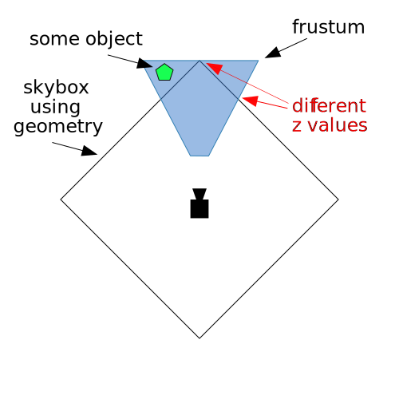

Title: WebGL SkyBox
Description: Show the sky with a skybox!
TOC: Skyboxes


This article is part of a series of articles about WebGL.
[The first article starts with the fundamentals](webgl-fundamentals.html).
This article continues from [the article on environment maps](webgl-environment-maps.html).

An *skybox* is a box with textures on it to look like the sky in all directions
or rather to look like what is very far away including the horizon. Imagine
you're standing in a room and on each wall is a full size poster of some view,
add in a poster to cover the ceiling showing the sky and one for the floor
showing the ground and that's a skybox.

Lots of 3D games do this by just making a cube, making it really large, putting
a texture on it of the sky.

This works but it has issues. One issue is that you have a cube that you need to
view in multiple directions, Whatever direction the camera is facing. You want
everything to draw far away but you don't want the corners of the cube to go out
of the clipping plane. Complicating that issue, for performance reasons you want
to draw close things before far things because the GPU, using [the depth buffer
test](webgl-3d-orthographic.html), can skip drawing pixels it knows will fail
the test. So ideally you should draw the skybox last with the depth test on but
if you actually use a box, as the camera looks in different directions, the
corners of the box will be further away than the sides causing issues.

<div class="webgl_center"></div>

You can see above we need to make sure the furthest point of the cube is inside
the frustum but because of that some edges of the cube might end up covering up
objects that we don't want covered up.

The typical solution is to turn off the depth test and draw the skybox first but
the we don't benefit from the depth buffer test not drawing pixels that we'll
later cover with stuff in our scene.

Instead of using a cube lets just draw quad that covers the entire canvas and
use [a cubemap](webgl-cube-maps.html). Normally we use a view projection matrix
to project a quad in 3D space. In this case we'll do the opposite. We'll use the
inverse of the view projection matrix to work backward and get the direction the
camera is looking for each pixel on the quad. This will give us directions to
look into the cubemap.

Starting with the [environment map example](webgl-environment-maps.html) I
removed all the code related to normals as we're not using them here. Then we
need a quad.

```js
// Fill the buffer with the values that define a quad.
function setGeometry(gl) {
  var positions = new Float32Array(
    [
      -1, -1, 
       1, -1, 
      -1,  1, 
      -1,  1,
       1, -1,
       1,  1,
    ]);
  gl.bufferData(gl.ARRAY_BUFFER, positions, gl.STATIC_DRAW);
}
```

This quad will fill the canvas since it's already in clip space. Since there are
only 2 values per vertex we need to change the code that sets the attribute.

```js
// Tell the position attribute how to get data out of positionBuffer (ARRAY_BUFFER)
-var size = 3;          // 3 components per iteration
+var size = 2;          // 2 components per iteration
var type = gl.FLOAT;   // the data is 32bit floats
var normalize = false; // don't normalize the data
var stride = 0;        // 0 = move forward size * sizeof(type) each iteration to get the next position
var offset = 0;        // start at the beginning of the buffer
gl.vertexAttribPointer(
    positionLocation, size, type, normalize, stride, offset)
```

Next for the vertex shader we just set `gl_Position` to quad vertices directly.
No need for any matrix math since the positions are already in clip space, setup
to cover the entire canvas. We set `gl_Position.z` to 1 to guarantee the pixels
have the furthest depth. And, we pass the position on to the fragment shader.

```glsl
attribute vec4 a_position;
varying vec4 v_position;
void main() {
  v_position = a_position;
  gl_Position = a_position;
  gl_Position.z = 1;
}
```

In the fragment shader we multiply the position by
the inverse view projection matrix and divide by w to go from 4D space to 3D space.

```glsl
precision mediump float;

uniform samplerCube u_skybox;
uniform mat4 u_viewDirectionProjectionInverse;

varying vec4 v_position;
void main() {
  vec4 t = u_viewDirectionProjectionInverse * v_position;
  gl_FragColor = textureCube(u_skybox, normalize(t.xyz / t.w));
}
```

Finally we need to lookup the uniform locations

```js
var skyboxLocation = gl.getUniformLocation(program, "u_skybox");
var viewDirectionProjectionInverseLocation = 
    gl.getUniformLocation(program, "u_viewDirectionProjectionInverse");
```

and set them

```js
// Compute the projection matrix
var aspect = gl.canvas.clientWidth / gl.canvas.clientHeight;
var projectionMatrix =
    m4.perspective(fieldOfViewRadians, aspect, 1, 2000);

// camera going in circle 2 units from origin looking at origin
var cameraPosition = [Math.cos(time * .1), 0, Math.sin(time * .1)];
var target = [0, 0, 0];
var up = [0, 1, 0];
// Compute the camera's matrix using look at.
var cameraMatrix = m4.lookAt(cameraPosition, target, up);

// Make a view matrix from the camera matrix.
var viewMatrix = m4.inverse(cameraMatrix);

// We only care about direction so remove the translation
viewMatrix[12] = 0;
viewMatrix[13] = 0;
viewMatrix[14] = 0;

var viewDirectionProjectionMatrix = 
    m4.multiply(projectionMatrix, viewMatrix);
var viewDirectionProjectionInverseMatrix = 
    m4.inverse(viewDirectionProjectionMatrix);

// Set the uniforms
gl.uniformMatrix4fv(
    viewDirectionProjectionInverseLocation, false, 
    viewDirectionProjectionInverseMatrix);

// Tell the shader to use texture unit 0 for u_skybox
gl.uniform1i(skyboxLocation, 0);
```

Notice above we're spinning the camera around the origin where we compute
`cameraPosition`. Then, after converting the `cameraMatrix` to a `viewMatrix` we
zero out the translation since we only care which way the camera is facing, not
where it is.

From that we multiply with the projection matrix, take the inverse, and then set the matrix.

{{{example url="../webgl-skybox.html" }}}

Let's combine the environment mapped cube back into this sample. We'll use the
utils mentioned in [less code more fun](webgl-less-code-more-fun.html).

We need to put both sets of shaders in

```html
<script id="skybox-vertex-shader" type="x-shader/x-vertex">
...
<script id="skybox-fragment-shader" type="x-shader/x-fragment">
...
<script id="envmap-vertex-shader" type="x-shader/x-vertex">
...
<script id="envmap-fragment-shader" type="x-shader/x-fragment">
...
```

Then compile the shaders and look up all the attribute and uniform locations

```js
// setup GLSL programs and lookup locations
const envmapProgramInfo = webglUtils.createProgramInfo(
    gl, ["envmap-vertex-shader", "envmap-fragment-shader"]);
const skyboxProgramInfo = webglUtils.createProgramInfo(
    gl, ["skybox-vertex-shader", "skybox-fragment-shader"]);
```

Set up our buffers with vertex data. The `primitives` library already has functions to supply this data so we can use those.

```js
// create buffers and fill with vertex data
const cubeBufferInfo = primitives.createCubeBufferInfo(gl, 1);
const quadBufferInfo = primitives.createXYQuadBufferInfo(gl);
```

At render time we compute all the matrices

```js
// camera going in circle 2 units from origin looking at origin
var cameraPosition = [Math.cos(time * .1) * 2, 0, Math.sin(time * .1) * 2];
var target = [0, 0, 0];
var up = [0, 1, 0];
// Compute the camera's matrix using look at.
var cameraMatrix = m4.lookAt(cameraPosition, target, up);

// Make a view matrix from the camera matrix.
var viewMatrix = m4.inverse(cameraMatrix);

// Rotate the cube around the x axis
var worldMatrix = m4.xRotation(time * 0.11);

// We only care about direction so remove the translation
var viewDirectionMatrix = m4.copy(viewMatrix);
viewDirectionMatrix[12] = 0;
viewDirectionMatrix[13] = 0;
viewDirectionMatrix[14] = 0;

var viewDirectionProjectionMatrix = m4.multiply(
    projectionMatrix, viewDirectionMatrix);
var viewDirectionProjectionInverseMatrix = 
    m4.inverse(viewDirectionProjectionMatrix);
```

Then first draw the cube

```js
// draw the cube
gl.depthFunc(gl.LESS);  // use the default depth test
gl.useProgram(envmapProgramInfo.program);
webglUtils.setBuffersAndAttributes(gl, envmapProgramInfo, cubeBufferInfo);
webglUtils.setUniforms(envmapProgramInfo, {
  u_world: worldMatrix,
  u_view: viewMatrix,
  u_projection: projectionMatrix,
  u_texture: texture,
  u_worldCameraPosition: cameraPosition,
});
webglUtils.drawBufferInfo(gl, cubeBufferInfo);
```

followed by the skybox

```js
// draw the skybox

// let our quad pass the depth test at 1.0
gl.depthFunc(gl.LEQUAL);

gl.useProgram(skyboxProgramInfo.program);
webglUtils.setBuffersAndAttributes(gl, skyboxProgramInfo, quadBufferInfo);
webglUtils.setUniforms(skyboxProgramInfo, {
  u_viewDirectionProjectionInverse: viewDirectionProjectionInverseMatrix,
  u_skybox: texture,
});
webglUtils.drawBufferInfo(gl, quadBufferInfo);
```

and

{{{example url="../webgl-skybox-plus-environment-map.html" }}}

I hope these last 3 articles have given you some idea of how to use a cubemap.
It's common for example to take the code [from computing lighting](webgl-3d-lighting-spot.html)
and combine that result with results from
an environment map to make materials like the hood of a car or polished floor.
There's also a technique to compute lighting using cubemaps. It's the same as the
environment map except instead of using the value you get from the environment
map as a color you use it as input to your lighting equations.

