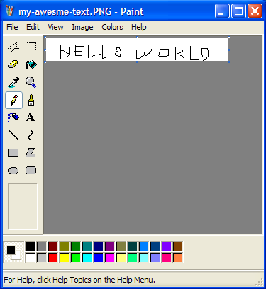
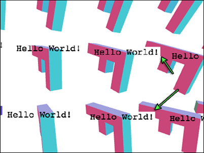

Title: WebGL Text - Textures
Description: Display Text in WebGL using Textures

This post is a continuation of many articles about WebGL.  The last one
was about [using Canvas 2D for rendering text over a WebGL
canvas](webgl-text-canvas2d.html).  If you haven't read it you might want
to check that out before continuing.

In the last article we went over [how to use a 2D canvas to draw text over
your WebGL scene](webgl-text-canvas2d.html).  That technique works and is
easy to do but it has a limitation that the text can not be obscured by
other 3d objects.  To do that we actually need to draw the text in WebGL.

The simplest way to do that is to make textures with text in them.  You
could for example go into Photoshop or some other paint program and draw
an image with some text in it.

Then make some plane geometry and display it.  This is actually how some
games I've worked on did all their text.  For example Locoroco only had
about 270 strings.  It was localized into 17 languages.  We had an Excel
sheet with all the languages and a script that would launch Photoshop and
generate a texture, one for each message in each language.

Of course you can also generate the textures at runtime.  Since WebGL is
in the browser again we can rely on the Canvas 2D API to help generate our
textures.

Starting with the examples from the [previous
article](webgl-text-canvas2d.html) let's add a function to fill a 2D
canvas with some text

    var textCtx = document.createElement("canvas").getContext("2d");

    // Puts text in center of canvas.
    function makeTextCanvas(text, width, height) {
      textCtx.canvas.width  = width;
      textCtx.canvas.height = height;
      textCtx.font = "20px monospace";
      textCtx.textAlign = "center";
      textCtx.textBaseline = "middle";
      textCtx.fillStyle = "black";
      textCtx.clearRect(0, 0, textCtx.canvas.width, textCtx.canvas.height);
      textCtx.fillText(text, width / 2, height / 2);
      return textCtx.canvas;
    }

Now that we need to draw 2 different things in WebGL, the 'F' and our
text, I'm going to switch over to [using some helper functions as
described in a previous article](webgl-drawing-multiple-things.html).  If
it's not clear what `programInfo`, `bufferInfo`, etc are see that article.

So, let's create the 'F' and a unit quad.

    // Create data for 'F'
    var fBufferInfo = primitives.create3DFBufferInfo(gl);
    // Create a unit quad for the 'text'
    var textBufferInfo = primitives.createPlaneBufferInfo(gl, 1, 1, 1, 1, m4.xRotation(Math.PI / 2));

A unit quad is a quad (square) that's 1 unit big.  This one is centered
over the origin.  `createPlaneBufferInfo` creates a plane in the xz plane.
We pass in a matrix to rotate it and give us an xy plane unit quad.

Next create 2 shaders

    // setup GLSL programs
    var fProgramInfo = createProgramInfo(gl, ["3d-vertex-shader", "3d-fragment-shader"]);
    var textProgramInfo = createProgramInfo(gl, ["text-vertex-shader", "text-fragment-shader"]);

And create our text texture

    // create text texture.
    var textCanvas = makeTextCanvas("Hello!", 100, 26);
    var textWidth  = textCanvas.width;
    var textHeight = textCanvas.height;
    var textTex = gl.createTexture();
    gl.bindTexture(gl.TEXTURE_2D, textTex);
    gl.texImage2D(gl.TEXTURE_2D, 0, gl.RGBA, gl.RGBA, gl.UNSIGNED_BYTE, textCanvas);
    // make sure we can render it even if it's not a power of 2
    gl.texParameteri(gl.TEXTURE_2D, gl.TEXTURE_MIN_FILTER, gl.LINEAR);
    gl.texParameteri(gl.TEXTURE_2D, gl.TEXTURE_WRAP_S, gl.CLAMP_TO_EDGE);
    gl.texParameteri(gl.TEXTURE_2D, gl.TEXTURE_WRAP_T, gl.CLAMP_TO_EDGE);

Setup uniforms for both the 'F' and text

    var fUniforms = {
      u_matrix: m4.identity(),
    };

    var textUniforms = {
      u_matrix: m4.identity(),
      u_texture: textTex,
    };

Now when we compute the matrices for the F we save off the F's view matrix

    var fViewMatrix = m4.translate(viewMatrix,
        translation[0] + xx * spread, translation[1] + yy * spread, translation[2]);
    fViewMatrix = m4.xRotate(fViewMatrix, rotation[0]);
    fViewMatrix = m4.yRotate(fViewMatrix, rotation[1] + yy * xx * 0.2);
    fViewMatrix = m4.zRotate(fViewMatrix, rotation[2] + now + (yy * 3 + xx) * 0.1);
    fViewMatrix = m4.scale(fViewMatrix, scale[0], scale[1], scale[2]);
    fViewMatrix = m4.translate(fViewMatrix, -50, -75, 0);

Drawing the F looks like this

    gl.useProgram(fProgramInfo.program);

    webglUtils.setBuffersAndAttributes(gl, fProgramInfo, fBufferInfo);

    fUniforms.u_matrix = m4.multiply(projectionMatrix, fViewMatrix);

    webglUtils.setUniforms(fProgramInfo, fUniforms);

    // Draw the geometry.
    gl.drawElements(gl.TRIANGLES, fBufferInfo.numElements, gl.UNSIGNED_SHORT, 0);

For the text we just need the position of the origin of the F.  We also
need to scale our unit quad to match the dimensions of the texture.
Finally we need to multiply by the projection matrix.

    // use just the view position of the 'F' for the text
    var textMatrix = m4.translate(projectionMatrix,
        fViewMatrix[12], fViewMatrix[13], fViewMatrix[14]);
    // scale the quad to the size we need it.
    textMatrix = m4.scale(textMatrix, textWidth, textHeight, 1);

And then render the text

    // setup to draw the text.
    gl.useProgram(textProgramInfo.program);

    webglUtils.setBuffersAndAttributes(gl, textProgramInfo, textBufferInfo);

    m4.copy(textMatrix, textUniforms.u_matrix);
    webglUtils.setUniforms(textProgramInfo, textUniforms);

    // Draw the text.
    gl.drawElements(gl.TRIANGLES, textBufferInfo.numElements, gl.UNSIGNED_SHORT, 0);

So here it is

{{{example url="../webgl-text-texture.html" }}}

You'll notice that sometimes parts of our text cover up parts of our Fs.
That's because we're drawing a quad.  The default color of the canvas is
transparent black (0,0,0,0) and we're drawing that color in the quad.  We
could instead blend our pixels.

    gl.enable(gl.BLEND);
    gl.blendFunc(gl.SRC_ALPHA, gl.ONE_MINUS_SRC_ALPHA);

This makes it take the source pixel (the color from our fragment shader)
and combine it with the dest pixel (the color in the canvas) according to
the blend function.  We've set the blend function to `SRC_ALPHA` for
source and `ONE_MINUS_SRC_ALPHA` for dest.

    result = dest * (1 - src_alpha) + src * src_alpha

so for example if the dest is green `0,1,0,1` and the source is red
`1,0,0,1` we'd have

    src = [1, 0, 0, 1]
    dst = [0, 1, 0, 1]
    src_alpha = src[3]  // this is 1
    result = dst * (1 - src_alpha) + src * src_alpha

    // which is the same as
    result = dst * 0 + src * 1

    // which is the same as
    result = src

For the parts of the texture with transparent black `0,0,0,0`

    src = [0, 0, 0, 0]
    dst = [0, 1, 0, 1]
    src_alpha = src[3]  // this is 0
    result = dst * (1 - src_alpha) + src * src_alpha

    // which is the same as
    result = dst * 1 + src * 0

    // which is the same as
    result = dst

Here's the result with blending enabled.

{{{example url="../webgl-text-texture-enable-blend.html" }}}

You can see it's better but it's still not perfect. If you look
close you'll sometimes see this issue

What's happening?  We're currently drawing an F then its text, then the
next F then its text repeated.  We still have a [depth
buffer](webgl-3d-orthographic.html) so when we draw the text for an F,
even though blending made some pixels stay the background color the depth
buffer was still updated.  When we draw the next F if parts of that F are
behind those pixels from some previously drawn text they won't be drawn.

We've just run into one of the most difficult issues of rendering 3D on a
GPU.  **Transparency has issues**.

The most common solution for pretty much all transparent rendering is to
draw all the opaque stuff first, then after, draw all the transparent
stuff sorted by z distance with the depth buffer testing on but depth
buffer updating off.

Let's first separate drawing of the opaque stuff (the Fs) from the
transparent stuff (the text).  First we'll declare something to remember
the text positions.

    var textPositions = [];

And in the loop for rendering the Fs we'll remember those positions

    var fViewMatrix = m4.translate(viewMatrix,
        translation[0] + xx * spread, translation[1] + yy * spread, translation[2]);
    fViewMatrix = m4.xRotate(fViewMatrix, rotation[0]);
    fViewMatrix = m4.yRotate(fViewMatrix, rotation[1] + yy * xx * 0.2);
    fViewMatrix = m4.zRotate(fViewMatrix, rotation[2] + now + (yy * 3 + xx) * 0.1);
    fViewMatrix = m4.scale(fViewMatrix, scale[0], scale[1], scale[2]);
    fViewMatrix = m4.translate(fViewMatrix, -50, -75, 0);
    +// Save the f's view position
    +textPositions.push([fViewMatrix[12], fViewMatrix[13], fViewMatrix[14]]);

Before we draw the 'F's we'll disable blending and turn on writing to the depth buffer

    gl.disable(gl.BLEND);
    gl.depthMask(true);

For drawing the text we'll turn on blending and turn off writing to the depth buffer.

    gl.enable(gl.BLEND);
    gl.blendFunc(gl.SRC_ALPHA, gl.ONE_MINUS_SRC_ALPHA);
    gl.depthMask(false);

And then draw text at all the positions we saved

    +// setup to draw the text.
    +gl.useProgram(textProgramInfo.program);
    +
    +webglUtils.setBuffersAndAttributes(gl, textProgramInfo, textBufferInfo);

    +textPositions.forEach(function(pos) {
      // draw the text

      // use just the view position of the 'F' for the text
    *  var textMatrix = m4.translate(projectionMatrix, pos[0], pos[1], pos[2]);
      // scale the F to the size we need it.
      textMatrix = m4.scale(textMatrix, textWidth, textHeight, 1);

      m4.copy(textMatrix, textUniforms.u_matrix);
      webglUtils.setUniforms(textProgramInfo, textUniforms);

      // Draw the text.
      gl.drawElements(gl.TRIANGLES, textBufferInfo.numElements, gl.UNSIGNED_SHORT, 0);
    +});

Note we moved setting the current program and the attributes outside the
loop since we're drawing the same thing multiple times there's no reason
to set those for each iteration.

And now it mostly works

{{{example url="../webgl-text-texture-separate-opaque-from-transparent.html" }}}

Notice we didn't sort like I mentioned above.  In this case since we're
drawing mostly opaque text there's probably going to be no noticable
difference if we sort so I'll save that for some other article.

Another issue is the text is intersecting its own 'F'.  There really isn't
a specific solution for that.  If you were making an MMO and wanted the
text of each player to always appear you might try to make the text appear
above the head.  Just translate it +Y some number of units, enough to make
sure it was always above the player.

You can also move it forward toward the cameara.  Let's do that here just
for the hell of it.  Because 'pos' is in view space that means it's
relative to the eye (which is at 0,0,0 in view space).  So if we normalize
it we get a unit vector pointing from the eye to that point which we can
then multiply by some amount to move the text a specific number of units
toward or away from the eye.

    +// because pos is in view space that means it's a vector from the eye to
    +// some position. So translate along that vector back toward the eye some distance
    +var fromEye = m4.normalize(pos);
    +var amountToMoveTowardEye = 150;  // because the F is 150 units long
    +var viewX = pos[0] - fromEye[0] * amountToMoveTowardEye;
    +var viewY = pos[1] - fromEye[1] * amountToMoveTowardEye;
    +var viewZ = pos[2] - fromEye[2] * amountToMoveTowardEye;
    +var textMatrix = m4.translate(projectionMatrix, viewX, viewY, viewZ);

    *var textMatrix = m4.translate(projectionMatrix, viewX, viewY, viewZ);
    // scale the F to the size we need it.
    textMatrix = m4.scale(textMatrix, textWidth, textHeight, 1);

Here's that.

{{{example url="../webgl-text-texture-moved-toward-view.html" }}}

You still might notice an issue with the edges of the letters.

The issue here is the Canvas 2D API produces only premultiplied alpha
values.  When we upload the contents of the canvas to a texture WebGL
tries to unpremultiply the values but it can't do this perfectly because
premultiplied alpha is lossy.

To fix that let's tell WebGL not to unpremultiply

    gl.pixelStorei(gl.UNPACK_PREMULTIPLY_ALPHA_WEBGL, true);

This tells WebGL to supply premultiplied alpha values to `gl.texImage2D`
and `gl.texSubImage2D`.  If the data passed to `gl.texImage2D` is already
premultiplied as it is for Canvas 2D data then WebGL can just pass it
through.

We also need to change the blending function

    -gl.blendFunc(gl.SRC_ALPHA, gl.ONE_MINUS_SRC_ALPHA);
    +gl.blendFunc(gl.ONE, gl.ONE_MINUS_SRC_ALPHA);

The old one multiplied the src color by its alpha.  That's what
`SRC_ALPHA` means.  But now our texture's data has already been multiplied
by its alpha.  That's what premultiplied means.  So we don't need the GPU
to do the multiplication.  Setting it to `ONE` means multiply by 1.

{{{example url="../webgl-text-texture-premultiplied-alpha.html" }}}

The edges are gone now.

What if you want to keep the text a fixed size but still sort correctly?
Well, if you remember from [the perspective
article](webgl-3d-perspective.html) our perspective matrix is going to
scale our object by `1 / -Z` to make it get smaller in the distance.  So, we
can just scale by `-Z` times some desired-scale to compensate.

    ...
    // because pos is in view space that means it's a vector from the eye to
    // some position. So translate along that vector back toward the eye some distance
    var fromEye = normalize(pos);
    var amountToMoveTowardEye = 150;  // because the F is 150 units long
    var viewX = pos[0] - fromEye[0] * amountToMoveTowardEye;
    var viewY = pos[1] - fromEye[1] * amountToMoveTowardEye;
    var viewZ = pos[2] - fromEye[2] * amountToMoveTowardEye;
    +var desiredTextScale = -1 / gl.canvas.height;  // 1x1 pixels
    +var scale = viewZ * desiredTextScale;

    var textMatrix = m4.translate(projectionMatrix, viewX, viewY, viewZ);
    // scale the F to the size we need it.
    *textMatrix = m4.scale(textMatrix, textWidth * scale, textHeight * scale, 1);
    ...

{{{example url="../webgl-text-texture-consistent-scale.html" }}}

If you want to draw different text at each F you should make a new texture
for each F and just update the text uniforms for that F.

    // create text textures, one for each F
    var textTextures = [
      "anna",   // 0
      "colin",  // 1
      "james",  // 2
      "danny",  // 3
      "kalin",  // 4
      "hiro",   // 5
      "eddie",  // 6
      "shu",    // 7
      "brian",  // 8
      "tami",   // 9
      "rick",   // 10
      "gene",   // 11
      "natalie",// 12,
      "evan",   // 13,
      "sakura", // 14,
      "kai",    // 15,
    ].map(function(name) {
      var textCanvas = makeTextCanvas(name, 100, 26);
      var textWidth  = textCanvas.width;
      var textHeight = textCanvas.height;
      var textTex = gl.createTexture();
      gl.bindTexture(gl.TEXTURE_2D, textTex);
      gl.texImage2D(gl.TEXTURE_2D, 0, gl.RGBA, gl.RGBA, gl.UNSIGNED_BYTE, textCanvas);
      // make sure we can render it even if it's not a power of 2
      gl.texParameteri(gl.TEXTURE_2D, gl.TEXTURE_MIN_FILTER, gl.LINEAR);
      gl.texParameteri(gl.TEXTURE_2D, gl.TEXTURE_WRAP_S, gl.CLAMP_TO_EDGE);
      gl.texParameteri(gl.TEXTURE_2D, gl.TEXTURE_WRAP_T, gl.CLAMP_TO_EDGE);
      return {
        texture: textTex,
        width: textWidth,
        height: textHeight,
      };
    });

Then at render time select a texture

    *textPositions.forEach(function(pos, ndx) {

      +// select a texture
      +var tex = textTextures[ndx];

      // scale the F to the size we need it.
      var textMatrix = m4.translate(projectionMatrix, viewX, viewY, viewZ);
      // scale the F to the size we need it.
      *textMatrix = m4.scale(textMatrix, tex.width * scale, tex.height * scale, 1);

and set the uniform for the texture before drawing

      *textUniforms.u_texture = tex.texture;

{{{example url="../webgl-text-texture-different-text.html" }}}

We've been using black to draw the text into the canvas.  It would be more
useful if we rendered the text in white.  Then we could multiply the text
by a color and make it any color we want.

First we'll change the text shader to multiply by a color

    varying vec2 v_texcoord;

    uniform sampler2D u_texture;
    +uniform vec4 u_color;

    void main() {
    *   gl_FragColor = texture2D(u_texture, v_texcoord) * u_color;
    }

And when we draw the text into the canvas use white

    textCtx.fillStyle = "white";

Then we'll make some colors

    // colors, 1 for each F
    var colors = [
      [0.0, 0.0, 0.0, 1], // 0
      [1.0, 0.0, 0.0, 1], // 1
      [0.0, 1.0, 0.0, 1], // 2
      [1.0, 1.0, 0.0, 1], // 3
      [0.0, 0.0, 1.0, 1], // 4
      [1.0, 0.0, 1.0, 1], // 5
      [0.0, 1.0, 1.0, 1], // 6
      [0.5, 0.5, 0.5, 1], // 7
      [0.5, 0.0, 0.0, 1], // 8
      [0.0, 0.0, 0.0, 1], // 9
      [0.5, 5.0, 0.0, 1], // 10
      [0.0, 5.0, 0.0, 1], // 11
      [0.5, 0.0, 5.0, 1], // 12,
      [0.0, 0.0, 5.0, 1], // 13,
      [0.5, 5.0, 5.0, 1], // 14,
      [0.0, 5.0, 5.0, 1], // 15,
    ];

At draw time we select a color

    // set color uniform
    textUniforms.u_color = colors[ndx];

Colors

{{{example url="../webgl-text-texture-different-colors.html" }}}

This technique is actually the technique most browsers use when they are
GPU accelerated.  They generate textures with your HTML content and all
the various styles you've applied and as long as that content doesn't
change they can just render the texture again when you scroll etc..  Of
course if you're updating things all the time then this techinque might
get a little bit slow because re-generating the textures and re-uploading
them to the GPU is a relatively slow operation.

In [the next article we'll go over a techinque that is probably better for
cases where things update often](webgl-text-glyphs.html).

<h3>Scaling Text without pixelation</h3>

You might notice in the examples before we started using a consistent size the
text gets very pixelated as it gets close to the camera. How do we fix that?

Well, honestly it's not very common to scale 2D text in 3D. Look at most games
or 3D editors and you'll see the text is almost always one consistent size
regardless of how far or close to the camera it is. In fact often that text
might be drawn in 2D instead of 3D so that even if someone or something is
behind something else like a teammate behind a wall you can still read the text.

If you do happen to want to scale 2D text in 3D I don't know of any easy options.
A few off the top of my head

<ul>
<li>Make different sizes of textures with fonts at different resolutions. You then
use the higher resolution textures as the text gets larger. This is called
LODing (using different Levels of Detail).</li>
<li>Another would be to render the textures with the exact correct size of
text every frame. That would likely be really slow.</li>
<li>Yet another would be to make 2D text out of geometry. In other words instead
of drawing text into a texture make text from lots and lots of triangles. That
works but it has other issues in that small text will not render well and large
text you'll start to see the triangles.</li>
<li>One more is to <a href="http://research.microsoft.com/en-us/um/people/cloop/loopblinn05.pdf">use very special shaders that render curves</a>. That's very cool
but way beyond what I can explain here.</li>

